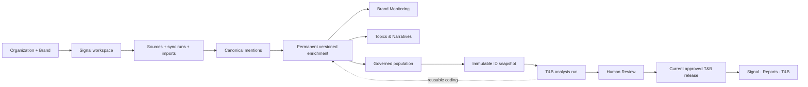

# ADR 014: Signal Workspace Owns the Canonical Data Plane

## Status

Accepted as product and architecture direction on 2026-08-02. Implementation is
pending and must be additive, shadow-validated and reversible. This ADR does not
authorize destructive migration, client activation or changes to an approved strategic
release.

## Context

Signal now presents one stable workspace per brand, but the inherited ingestion model
still makes `study_corpora` the owner of imports and mentions. The workspace resolves
one corpus as `operational` for Brand Monitoring and Topics & Narratives and separate
corpora as `strategic` for methodology runs.

That transition architecture has three material problems:

1. a brand cannot receive governed mentions before a study exists;
2. data contributed by a strategic study can remain isolated from the operational
   workspace;
3. one canonical mention cannot be cleanly reused by multiple methodologies because
   ownership and study membership are represented by the same `study_corpus_id`.

The Signal North Star already requires canonical ingestion to belong to the
workspace/subject and methodologies to consume governed views over that data. This ADR
makes that target an explicit implementation decision.

## Decision

### Canonical ownership

- A brand creation creates or resolves its single Signal workspace.
- Sources, sync runs, imports and canonical mentions belong to the workspace/brand data
  plane, not to a methodology.
- A mention is stored once. Another methodology consuming it creates a membership or
  reference; it does not copy the mention.
- Every accepted mention remains queryable from the workspace. Client metrics include
  only mentions allowed by the active quality and scope policy.

### Permanent enrichment

- Reusable enrichment is persisted against the canonical mention with version,
  confidence, provenance and review state.
- Topics, narratives, sentiment, normalized platform, entity attribution and other
  operational dimensions are not trapped inside an LLM response or a published JSON.
- Methodology-specific coding may also persist, but it remains scoped to its governed
  profile or analysis version and cannot silently rewrite an approved release.

### Governed populations

- An operational module or analysis consumes a governed population: a reproducible SQL
  definition and, when required, explicit relational membership.
- Population rules declare workspace, subject scope, inclusion state, quality policy,
  time window and any methodology-specific filters.
- `primary_brand`, `competitor`, `category`, `reference` and `unattributed` are explicit
  scopes. They cannot be mixed silently in a primary-brand denominator.
- A study may contribute a source or import. That data enters the workspace first and
  then becomes eligible for the study population.

### Snapshots and releases

- A strategic run freezes the exact governed population it analyzed as a snapshot.
- A snapshot records mention/record IDs, population definition version, watermarks and
  provenance. It does not duplicate mention text or become a large frontend payload.
- Approved T&B findings, evidence and actions form an immutable release. New workspace
  data does not modify that release.
- A later run may carry forward, strengthen, revise, merge or retire findings through
  Review and then promote a new release as current.
- The client has one T&B report surface per workspace. Runs and releases are history of
  that report, not new navigation items.

### Serving boundary

- The frontend never receives a complete population or snapshot.
- Serving APIs return compact overview, metrics, series, detail and cursor-paginated
  evidence responses.
- SQL/materializations compute numbers. Claude may create versioned interpretations but
  is never the database, calculator or serving layer.
- `published_outputs.payload` remains compatibility/export only.

## Target Flow



## Data Shape Rule

```text
canonical mention
  -> versioned enrichment
  -> governed population definition/membership
  -> immutable snapshot of IDs
  -> deterministic materializations and approved artifacts
  -> small, filterable and paginated serving APIs
  -> frontend
```

The snapshot is an audit boundary, not a denormalized document and not a JavaScript
object used to hydrate the UI.

## Consequences

- `study_corpora` may remain temporarily as a compatibility execution boundary, but it
  stops being the canonical owner of mentions.
- Brand creation, source management and recurring ingestion become first-class Admin
  flows independent of “New study”.
- Study creation becomes “run analysis/update report” over a governed workspace
  population.
- Existing lineage, import batches, snapshots, T&B analysis, artifacts and releases must
  be preserved through additive backfill and dual-read/shadow reconciliation.
- The current single-row `signal_workspace_current_releases` model must gain report
  identity before multiple report methodologies can coexist.
- Operational enrichment can update continuously; strategic releases remain frozen.

## Superseded Detail

This ADR narrows one part of ADR 011 and
`docs/product/37_SIGNAL_WORKSPACE_INFORMATION_ARCHITECTURE.md`: a T&B
`study_corpus` no longer becomes a client-visible named page. The workspace has one T&B
report; study runs and releases remain internal/history identities.

## Rejected Alternatives

### Keep the operational corpus as the workspace data owner

Rejected because it preserves study-first ingestion and strands data contributed by
other studies.

### Copy mentions into every study corpus

Rejected because it creates inconsistent enrichment, expensive deduplication and broken
lineage.

### Rebuild the workspace as a published JSON

Rejected because it recreates the data blender that Data OS exists to eliminate.

### Mutate the latest T&B release when new mentions arrive

Rejected because reviewed strategic truth must remain reproducible. New evidence informs
the next reviewed release.

## Implementation Gate

The decision is not complete until a real workspace proves that:

- a brand can ingest mentions without first creating a study;
- accepted mentions reach operational serving without being copied;
- primary-brand metrics exclude other scopes unless explicitly requested;
- a T&B run consumes a frozen governed population;
- reusable enrichment persists on canonical records;
- an approved release is invariant after later ingestion;
- overview, detail and evidence reconcile against SQL;
- old corpus/output routes remain safe during dual-read migration.
