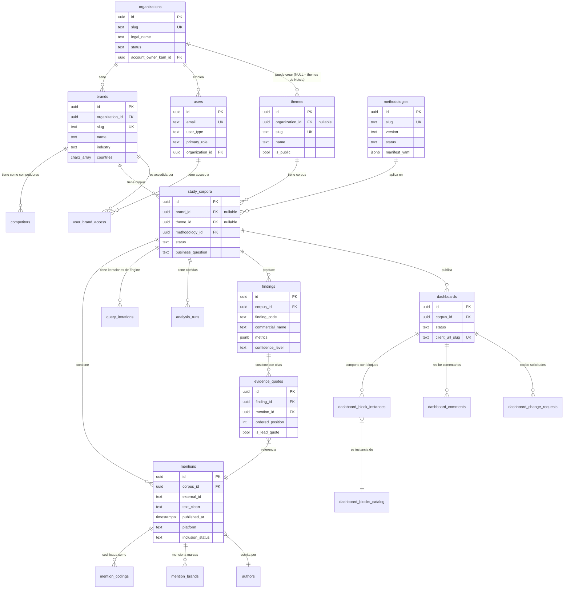
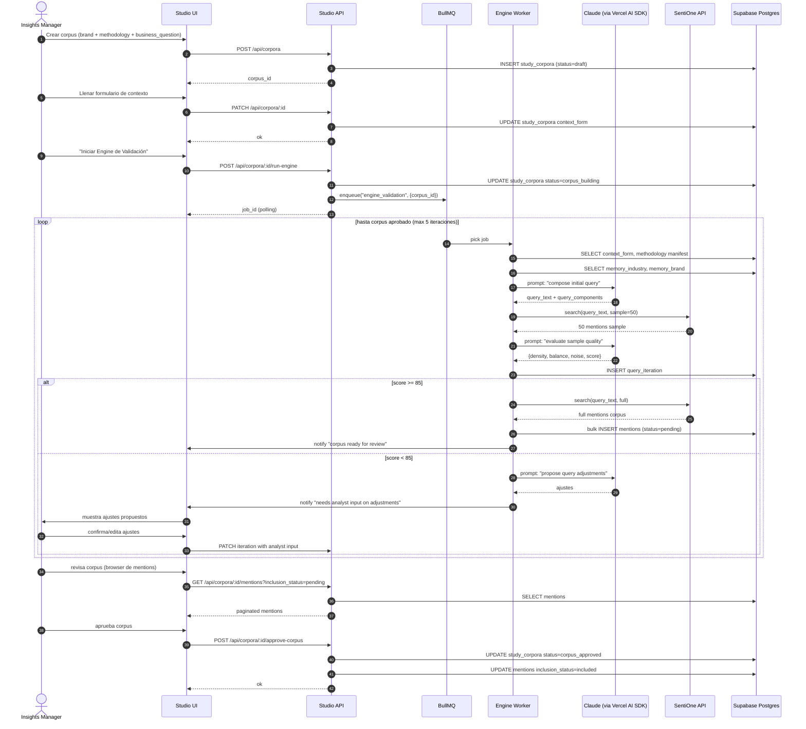
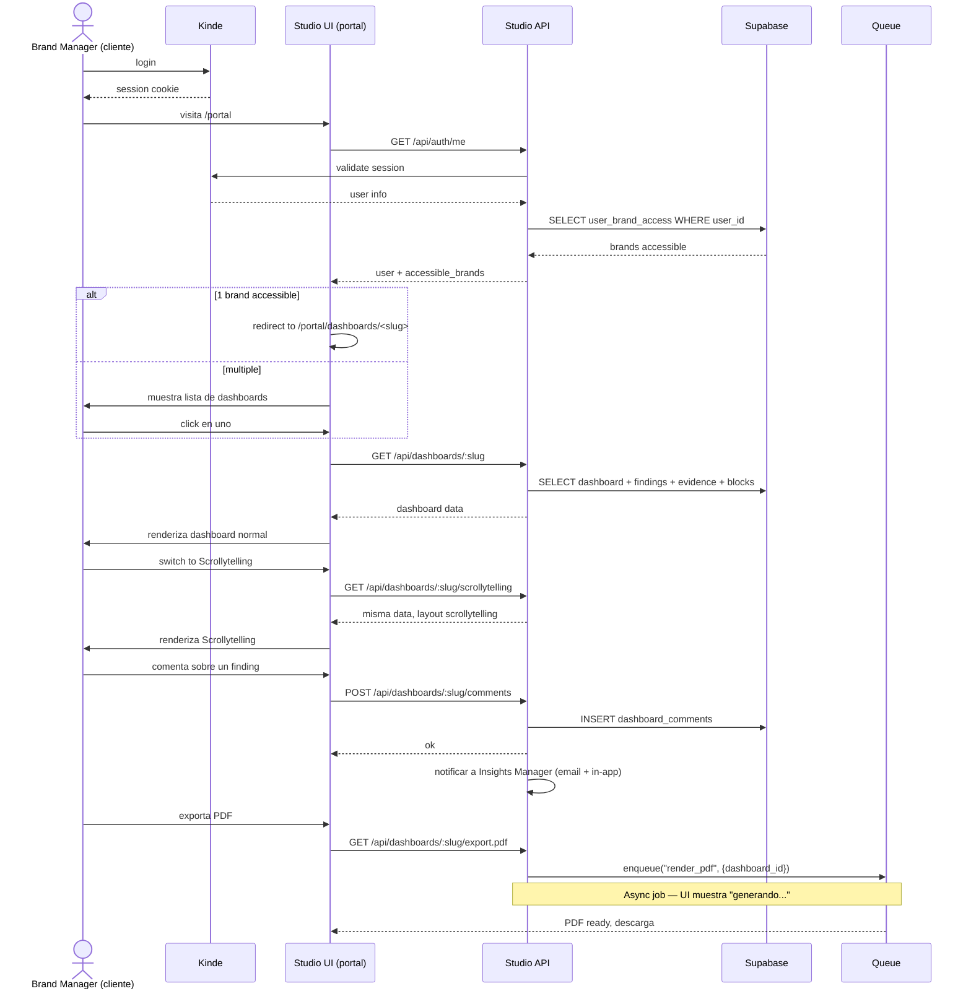
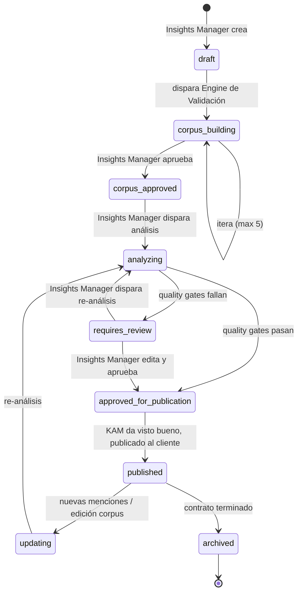
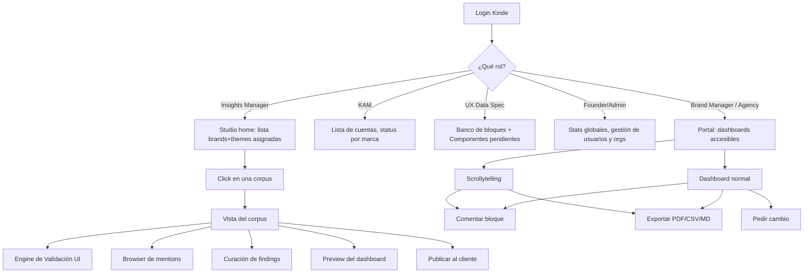

# Noisia Studio — Diagramas (Mermaid)

> Diagramas visuales en Mermaid. Renderizan nativos en GitHub y en VS Code con extensión. Copy-paste en cualquier .md y se ven.

---

## 1. ER Diagram — entidades principales



---

## 2. Sequence Diagram — Engine de Validación de Queries

Flujo end-to-end de cómo el Insights Manager + IA construyen un corpus.



---

## 3. Sequence Diagram — Análisis Triggers & Barriers end-to-end

```mermaid
sequenceDiagram
  autonumber
  actor IM as Insights Manager
  participant UI as Studio UI
  participant API as Studio API
  participant Queue as BullMQ
  participant Worker as Analysis Worker
  participant LLM as Claude
  participant Hum as Humanizer
  participant DB as Supabase Postgres

  IM->>UI: "Correr análisis"
  UI->>API: POST /api/corpora/:id/run-analysis
  API->>DB: INSERT analysis_runs (status=queued)
  API->>Queue: enqueue("run_analysis_tb", {corpus_id, run_id})
  API-->>UI: job_id

  Queue->>Worker: pick job
  Worker->>DB: SELECT methodology manifest, corpus mentions

  Note over Worker,LLM: Paso 0 — Pre-flight check (5 puntos)
  Worker->>LLM: prompt: pre_flight_check
  LLM-->>Worker: {decision, blockers}

  alt blockers != []
    Worker->>DB: UPDATE run status=failed, save blockers
    Worker->>UI: notify "pre-flight failed"
  else PROCEDER
    Note over Worker,LLM: Paso 1 — Pase abierto (tags emergentes)
    Worker->>LLM: prompt: tb_paso1 con muestra de 200 mentions
    LLM-->>Worker: tagged_mentions + unique_tags
    Worker->>DB: UPDATE mentions con emergent_tags

    alt < 40 tags emergentes
      Worker->>LLM: retry con prompt refinado
    end

    Note over Worker,LLM: Paso 2 — Codificación 4 layers
    Worker->>LLM: prompt: tb_paso2 con tagged_mentions
    LLM-->>Worker: coded_mentions con polarity + layer
    Worker->>DB: INSERT mention_codings

    Note over Worker,LLM: Paso 3 — Jerarquización 3D
    Worker->>LLM: prompt: tb_paso3 (freq + intensidad + predictiva)
    LLM-->>Worker: jerarquia per (polarity x layer)
    Worker->>DB: INSERT findings con metrics

    Note over Worker,LLM: Paso 4 — Marcar movilidad
    Worker->>LLM: prompt: tb_paso4
    LLM-->>Worker: movilidad + razon per finding
    Worker->>DB: UPDATE findings

    Note over Worker,LLM: Paso 5 — Comparativo (opcional)
    alt has_competitive_corpus
      loop por competidor
        Worker->>LLM: ejecuta pasos 1-4 sobre competitor corpus
      end
      Worker->>DB: INSERT comparative_analysis
    end

    Note over Worker,LLM,Hum: Paso 6 — Síntesis + Humanizer
    Worker->>LLM: prompt: tb_paso6 (narrativos)
    LLM-->>Worker: activation_playbook + friction_removal + comparative_brief
    Worker->>Hum: humanize(all narrative outputs)
    Hum-->>Worker: copy humanizado
    Worker->>DB: UPDATE findings con narrative + cultural_reading

    Note over Worker: Quality gates automatizados
    Worker->>Worker: run 7 quality gates
    alt todos pasan
      Worker->>DB: UPDATE analysis_runs status=approved_for_review
    else algún gate falla
      Worker->>DB: UPDATE analysis_runs status=requires_review
    end

    Worker->>UI: notify "analysis ready for curation"
  end

  IM->>UI: revisa output completo
  UI->>API: GET /api/corpora/:id/findings
  API->>DB: SELECT findings + evidence_quotes
  API-->>UI: paginated

  IM->>UI: edita findings, agrega/quita evidence quotes
  UI->>API: PATCH /api/findings/:id, POST /api/findings/:id/evidence-quotes
  API->>DB: UPDATE/INSERT

  IM->>UI: aprueba output
  UI->>API: POST /api/corpora/:id/approve-output
  API->>DB: UPDATE findings status=published
  API->>DB: UPDATE dashboards status=published, generate client_url_slug
  API-->>UI: ok + client_url

  IM->>UI: presenta al cliente (con KAM)
```

---

## 4. Sequence Diagram — Cliente accede al dashboard



---

## 5. State Diagram — lifecycle de un study_corpora



---

## 6. Flow Diagram — qué se ve en cada vista del Studio



---

## 7. Component Diagram — packages del monorepo

```mermaid
flowchart LR
  subgraph Apps
    Website[apps/website]
    Studio[apps/studio]
  end

  subgraph Services
    Workers[services/workers]
  end

  subgraph Packages
    Types[@noisia/types]
    UI[@noisia/ui]
    Blocks[@noisia/blocks]
    Humanizer[@noisia/humanizer]
    Methodologies[@noisia/methodologies]
    QueryEngine[@noisia/query-engine]
    KB[@noisia/kb]
    DB[@noisia/db]
  end

  subgraph External
    Supabase[(Supabase)]
    Kinde[(Kinde)]
    Anthropic[(Claude API)]
    Redis[(Upstash Redis)]
    SentiOne[(SentiOne API)]
  end

  Website --> UI
  Website --> KB
  Studio --> UI
  Studio --> Blocks
  Studio --> Types
  Studio --> DB
  Studio --> Humanizer
  Studio --> Methodologies
  Studio --> Kinde

  Workers --> DB
  Workers --> Types
  Workers --> QueryEngine
  Workers --> Methodologies
  Workers --> Humanizer
  Workers --> Anthropic
  Workers --> SentiOne
  Workers --> Redis

  Blocks --> UI
  QueryEngine --> Types
  QueryEngine --> Methodologies
  Methodologies --> Types
  DB --> Supabase
```

---

## 8. Cómo usar estos diagramas

**En GitHub:** se renderizan automáticamente en `.md` files.

**En VS Code:** instalar extensión "Markdown Preview Mermaid Support".

**Para presentaciones / Figma:** exportar como SVG desde https://mermaid.live/ (pegar el código, descargar SVG).

**Para iterar:** editar el código Mermaid de este archivo. Es mantenible como código, no como imagen estática.

---

## 9. Diagramas pendientes (post-MVP)

```typescript
// TODO mejora-futura: agregar diagramas para:
// - Sequence: WhatsApp notification flow (cuando se implemente)
// - Sequence: Integration UI flow (cuando un Insights Manager configura Apify)
// - State: lifecycle de un comment del cliente (open → addressed → wont_address)
// - Class diagram: jerarquía de Block components en packages/blocks
// - Deployment diagram: cómo se distribuyen apps + workers + DB en Railway
```
