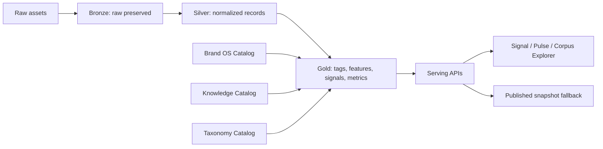

# 22 · Noisia Data OS Cut 1

> Estado: spec productivo para rama `codex/noisia-data-os-prod`.
> Base: partir de `codex/signal-pulse`, no de `main`.
> Principio: el reporte publicado no es la base de datos.

## 0. Decisión Ejecutiva

Noisia debe construir un **Customer Intelligence Lakehouse con features de CDP**, no un
CDP completo en Cut 1.

Un CDP puro intenta resolver identidad de personas/clientes y activar audiencias en otros
sistemas. Noisia todavía no necesita prometer eso. Lo que sí necesita ya es un sistema
vivo por cliente que conecte conversación, performance, knowledge, Brand OS, campañas,
señales, taxonomías, tags, métricas y reportes.

Cut 1 convierte Signal Pulse en el primer consumidor de esa base viva. Triggers &
Barriers y las demás metodologías deben poder migrar después al mismo modelo.

### Corte productivo del Corpus Engine

La rama productiva no expone el Panel Técnico, Narrative Ownership ni el mapa de corpus
por lente. Las 16 lentes multimétodo siguen pausadas. El Corpus Engine visible opera con
el contrato productivo Triggers & Barriers, y Signal Pulse conserva su pipeline propio.
Las superficies beta sólo pueden habilitarse en desarrollo con flag explícita. El runtime
ignora esa flag bajo `NODE_ENV=production`, por lo que no forman parte del release cliente.

## 1. Problema A Resolver

El flujo actual todavía tiene demasiadas rutas tipo:


Ese flujo crea cuatro problemas:

- el output muere como JSON y no enriquece al corpus;
- Brand OS y Knowledge Base viven como contexto aislado, no como datos consultables;
- performance, social listening, briefs y campañas no conviven en un modelo común;
- el dashboard renderiza una foto, no una base con filtros, lineage y métricas vivas.

La dirección correcta:



El contrato operativo se observa como una sola cadena:


Reglas:

- `Ready` significa las cinco etapas listas, no sólo que los archivos fueron parseados.
- T&B consulta agregados de `data_observations` en preflight, coding, hierarchy,
  mobility, comparative y synthesis; registra el consumo en
  `tb_analyses.meta_json.data_os_context`.
- Signal no consulta una serie porque "parece disponible": exige un
  `dashboard_data_ref` gobernado y overlap mensual real.
- La comparación temporal no autoriza afirmaciones causales.
- Los archivos históricos se reconcilian con `pnpm data-os:reconcile-sources`; el
  comando rehace perfil, contrato, quality result y observaciones sin volver a ejecutar
  el resumen LLM.

## 2. Lo Que Ya Existe En `codex/signal-pulse`

Estas piezas se reutilizan; no se reinventan:

| Pieza | Tabla/flujo | Uso en Data OS |
|---|---|---|
| Señales persistentes | `canonical_signals` | Memoria de señales por metodología, marca/tema/corpus |
| Observaciones | `signal_observations` | Medición de una señal en una ventana |
| Evidencia | `signal_observation_evidence` | Citas/fuentes que sostienen observaciones |
| Fuentes | `data_sources` | Inventario mínimo de fuentes |
| Sync runs | `source_sync_runs` | Resultado de imports/syncs |
| Performance | `performance_records` | Social/performance como datos estructurados |
| Periodos | `report_periods` | Buckets mensuales/semanales |
| Métricas por señal | `signal_period_metrics` | Momentum/lifecycle/impact por periodo |
| Agregados visuales | `chart_aggregates` | Data refs para charts |
| Outputs | `published_outputs.kind` | Snapshot publicable, no source of truth |
| Knowledge actual | `brand_knowledge_sources` | Punto de partida del Knowledge Catalog |
| Seeds actuales | `brand_seeds` | Punto de partida del Brand/Entity Catalog |

## 3. Catálogos Cut 1

### 3.1 Data Catalog

Registra qué datos existen, de dónde vienen, qué contrato tienen, qué calidad tienen y
qué pipelines los tocaron.

Tablas nuevas mínimas:

- `data_assets`
- `data_asset_fields`
- `data_contracts`
- `data_quality_rules`
- `data_quality_results`
- `lineage_edges`

Relación con tablas existentes:

- `data_sources` describe la fuente operacional.
- `source_sync_runs` describe cada intento de ingest/sync.
- `data_assets` describe el dataset lógico o físico que esa fuente produce.
- `data_asset_fields` describe campos críticos, tipo, semantic type, nulabilidad y
  ejemplos por asset.
- `lineage_edges` debe conectar fuentes reales (`data_source`, `source_sync_run`,
  `import_batch`, `brand_knowledge_source`) con assets, assets con materializaciones y
  `dashboard_data_refs` con `published_outputs`.

### 3.2 Brand OS Catalog

Brand OS deja de ser texto de contexto y se vuelve catálogo estructurado:

- objetivos;
- audiencias;
- productos/servicios;
- claims;
- campañas;
- territorios;
- competidores;
- constraints/no-go;
- fechas/eventos;
- seed sets.

Tablas nuevas mínimas:

- `brand_os_profiles`
- `brand_os_objectives`
- `brand_os_briefs`
- `brand_os_audiences`
- `brand_os_products`
- `brand_os_claims`
- `brand_os_campaigns`
- `brand_os_competitors`
- `brand_os_events`
- `brand_os_seed_sets`
- `brand_os_seed_terms`
- `brand_os_links`

Regla: un objetivo puede estar ligado a briefs, seeds, campañas, audiencias, knowledge
assets, fuentes, metodologías y runs. Nada importante debe vivir solo en `analysis_plan`.
El backfill de Cut 1 debe escribir `brand_os_briefs` desde el intake del estudio y desde
knowledge sources tipo brief, además de `brand_os_links` desde objetivos a corpus,
briefs, audiencias y seed sets, y desde knowledge sources/assertions hacia el Brand OS.
Si esos links no existen, el release gate no debe pasar.

### 3.3 Knowledge Catalog

La Knowledge Base ya existe parcialmente en `brand_knowledge_sources`, pero Cut 1 debe
separar documento, chunk, assertion y uso.

Tablas nuevas mínimas:

- `knowledge_chunks`
- `knowledge_assertions`
- `knowledge_assertion_links`
- `knowledge_assertion_review_events`
- `knowledge_usage_events`

Regla: una assertion debe tener fuente, vigencia, confidence, owner/reviewer opcional y
links a Brand OS, taxonomías o entidades. Ejemplo: "La campaña X empuja el claim Y desde
marzo" no debe quedar perdido dentro de un prompt.
Cut 1 también debe registrar `knowledge_usage_events` para catalogación, chunking y
linking de assertions. Esto permite auditar qué knowledge alimentó objetivos, seeds y
outputs, sin perder tracking después del resumen LLM.

### 3.4 Taxonomy Catalog

No se agregan columnas físicas infinitas a `mentions`. Se crea vocabulario controlado.

Taxonomías iniciales:

- `trigger`
- `barrier`
- `journey_stage`
- `value_perception`
- `audience`
- `demographic`
- `emotion`
- `sentiment_polarity`
- `signal_lifecycle`
- `marketing_move`
- `source_type`
- `content_format`
- `competitor_role`

Tablas nuevas mínimas:

- `taxonomies`
- `taxonomy_terms`
- `taxonomy_term_edges`
- `methodology_taxonomy_bindings`
- `tagging_rule_sets`
- `tagging_model_versions`

### 3.5 Entity Graph

Noisia necesita resolver entidades de marketing e inteligencia, no identidad de usuarios
finales en Cut 1.

Entidades iniciales:

- brand;
- competitor;
- campaign;
- creative;
- claim;
- product;
- audience;
- channel/account;
- source author cuando sea legal/útil;
- location/geography;
- theme/category.

Tablas nuevas mínimas:

- `intelligence_entities`
- `entity_aliases`
- `entity_links`
- `record_entity_links`

### 3.6 Feature/Tag Store

Toda mención, performance row, knowledge chunk, señal u observación puede tener tags y
features versionados.

Tablas nuevas mínimas:

- `record_tags`
- `record_feature_values`
- `signal_tags`
- `tag_review_events`

Regla: cada tag debe guardar:

- `subject_type`;
- `subject_id`;
- `taxonomy_term_id`;
- `value`;
- `score`;
- `confidence`;
- `evidence`;
- `source`;
- `model_version_id`;

Regla de salida a cliente: los tags y assertions no son utiles si no son revisables.
Todo evidence pack de staging debe incluir `review_queue` con
`ready_for_human_review: true`, `required_before_client_visible: true`,
`record_tags_with_evidence`, `record_tag_taxonomies` y
`knowledge_assertions_with_evidence`. El gate `tag_assertion_review_queue` debe fallar
si las etiquetas no tienen evidencia, si la muestra no cubre al menos cinco taxonomias
o si las assertions candidatas no conservan evidencia. Para avanzar a producción o
cliente-visible, el evidence pack debe incluir además `tag_review_events >= 1` y
`knowledge_assertion_review_events >= 1`. La CLI `data-os:review-sample` existe sólo
para registrar esa muestra humana ya inspeccionada; exige IDs explícitos,
`NOISIA_DATA_OS_REVIEW_SAMPLE_APPROVED=true` y el guard remoto
`NOISIA_DATA_OS_REVIEW_ALLOW_REMOTE=true`.
- `review_status`;
- `created_at`.

Cut 1 arranca con **tagging determinístico auditable**, no con enriquecimiento LLM
automático. El backfill etiqueta menciones con vocabulario controlado para
`trigger`, `barrier`, `journey_stage`, `value_perception`, `audience`, `emotion`,
`sentiment_polarity`, `source_type` y `content_format`, guardando keywords/evidencia y
dejando `review_status = unreviewed`. Además escribe `record_feature_values` con
contexto operacional por mención para que el dashboard pueda filtrar sin depender del
payload publicado.

### 3.7 Semantic/Metric Layer

El dashboard no debe inventar métricas. Debe leer definiciones gobernadas.

Tablas nuevas mínimas:

- `metric_definitions`
- `semantic_models`
- `metric_materializations`
- `dashboard_data_refs`

Cut 1 no necesita adoptar dbt formalmente. Sí debe copiar el principio: métricas y
dimensiones se definen una vez y se consumen en APIs/reportes.

## 4. Schema Cut 1

### 4.1 `data_assets`

```sql
CREATE TABLE data_assets (
  id uuid PRIMARY KEY DEFAULT gen_random_uuid(),
  organization_id uuid REFERENCES organizations(id),
  brand_id uuid REFERENCES brands(id),
  theme_id uuid REFERENCES themes(id),
  study_corpus_id uuid REFERENCES study_corpora(id),
  data_source_id uuid REFERENCES data_sources(id),
  asset_kind text NOT NULL,
  layer text NOT NULL,
  name text NOT NULL,
  description text,
  owner_team text,
  sensitivity text DEFAULT 'internal',
  status text NOT NULL DEFAULT 'active',
  storage_ref text,
  row_count bigint,
  metadata jsonb NOT NULL DEFAULT '{}',
  created_at timestamptz NOT NULL DEFAULT now(),
  updated_at timestamptz NOT NULL DEFAULT now()
);
```

### 4.2 `data_asset_fields`

```sql
CREATE TABLE data_asset_fields (
  id uuid PRIMARY KEY DEFAULT gen_random_uuid(),
  data_asset_id uuid NOT NULL REFERENCES data_assets(id) ON DELETE CASCADE,
  field_name text NOT NULL,
  field_type text,
  semantic_type text,
  nullable boolean,
  description text,
  examples jsonb DEFAULT '[]',
  metadata jsonb DEFAULT '{}',
  created_at timestamptz NOT NULL DEFAULT now(),
  UNIQUE (data_asset_id, field_name)
);
```

### 4.3 `data_contracts`

```sql
CREATE TABLE data_contracts (
  id uuid PRIMARY KEY DEFAULT gen_random_uuid(),
  data_asset_id uuid NOT NULL REFERENCES data_assets(id) ON DELETE CASCADE,
  contract_name text NOT NULL,
  version integer NOT NULL DEFAULT 1,
  status text NOT NULL DEFAULT 'draft',
  schema_contract jsonb NOT NULL DEFAULT '{}',
  quality_contract jsonb NOT NULL DEFAULT '{}',
  freshness_contract jsonb NOT NULL DEFAULT '{}',
  semantic_contract jsonb NOT NULL DEFAULT '{}',
  owner_user_id uuid REFERENCES users(id),
  created_at timestamptz NOT NULL DEFAULT now(),
  updated_at timestamptz NOT NULL DEFAULT now(),
  UNIQUE (data_asset_id, contract_name, version)
);
```

### 4.4 `data_quality_rules` y `data_quality_results`

```sql
CREATE TABLE data_quality_rules (
  id uuid PRIMARY KEY DEFAULT gen_random_uuid(),
  data_contract_id uuid REFERENCES data_contracts(id) ON DELETE CASCADE,
  rule_key text NOT NULL,
  rule_type text NOT NULL,
  severity text NOT NULL DEFAULT 'warning',
  definition jsonb NOT NULL DEFAULT '{}',
  active boolean NOT NULL DEFAULT true,
  created_at timestamptz NOT NULL DEFAULT now()
);

CREATE TABLE data_quality_results (
  id uuid PRIMARY KEY DEFAULT gen_random_uuid(),
  data_quality_rule_id uuid REFERENCES data_quality_rules(id) ON DELETE SET NULL,
  data_asset_id uuid REFERENCES data_assets(id) ON DELETE CASCADE,
  source_sync_run_id uuid REFERENCES source_sync_runs(id) ON DELETE SET NULL,
  engine_analysis_id uuid REFERENCES engine_analyses(id) ON DELETE SET NULL,
  result_key text NOT NULL DEFAULT 'default',
  status text NOT NULL,
  observed_value jsonb DEFAULT '{}',
  expected_value jsonb DEFAULT '{}',
  sample_refs jsonb DEFAULT '[]',
  checked_at timestamptz NOT NULL DEFAULT now()
);
```

### 4.5 Brand OS Tables

```sql
CREATE TABLE brand_os_profiles (
  id uuid PRIMARY KEY DEFAULT gen_random_uuid(),
  organization_id uuid REFERENCES organizations(id),
  brand_id uuid REFERENCES brands(id),
  theme_id uuid REFERENCES themes(id),
  name text NOT NULL,
  status text NOT NULL DEFAULT 'active',
  version integer NOT NULL DEFAULT 1,
  metadata jsonb NOT NULL DEFAULT '{}',
  created_at timestamptz NOT NULL DEFAULT now(),
  updated_at timestamptz NOT NULL DEFAULT now()
);

CREATE TABLE brand_os_objectives (
  id uuid PRIMARY KEY DEFAULT gen_random_uuid(),
  brand_os_profile_id uuid NOT NULL REFERENCES brand_os_profiles(id) ON DELETE CASCADE,
  objective_type text NOT NULL,
  name text NOT NULL,
  description text,
  success_criteria jsonb DEFAULT '{}',
  priority integer,
  active_from date,
  active_to date,
  status text NOT NULL DEFAULT 'active',
  created_at timestamptz NOT NULL DEFAULT now()
);

CREATE TABLE brand_os_briefs (
  id uuid PRIMARY KEY DEFAULT gen_random_uuid(),
  brand_os_profile_id uuid NOT NULL REFERENCES brand_os_profiles(id) ON DELETE CASCADE,
  study_corpus_id uuid REFERENCES study_corpora(id) ON DELETE CASCADE,
  objective_id uuid REFERENCES brand_os_objectives(id) ON DELETE SET NULL,
  knowledge_source_id uuid REFERENCES brand_knowledge_sources(id) ON DELETE SET NULL,
  brief_type text NOT NULL,
  title text NOT NULL,
  summary text,
  source_kind text,
  status text NOT NULL DEFAULT 'active',
  metadata jsonb NOT NULL DEFAULT '{}',
  received_at timestamptz NOT NULL DEFAULT now(),
  created_at timestamptz NOT NULL DEFAULT now(),
  updated_at timestamptz NOT NULL DEFAULT now()
);

CREATE TABLE brand_os_audiences (
  id uuid PRIMARY KEY DEFAULT gen_random_uuid(),
  brand_os_profile_id uuid NOT NULL REFERENCES brand_os_profiles(id) ON DELETE CASCADE,
  name text NOT NULL,
  description text,
  attributes jsonb DEFAULT '{}',
  status text NOT NULL DEFAULT 'active',
  created_at timestamptz NOT NULL DEFAULT now()
);

CREATE TABLE brand_os_claims (
  id uuid PRIMARY KEY DEFAULT gen_random_uuid(),
  brand_os_profile_id uuid NOT NULL REFERENCES brand_os_profiles(id) ON DELETE CASCADE,
  claim_text text NOT NULL,
  claim_type text,
  status text NOT NULL DEFAULT 'active',
  valid_from date,
  valid_to date,
  metadata jsonb DEFAULT '{}',
  created_at timestamptz NOT NULL DEFAULT now()
);

CREATE TABLE brand_os_campaigns (
  id uuid PRIMARY KEY DEFAULT gen_random_uuid(),
  brand_os_profile_id uuid NOT NULL REFERENCES brand_os_profiles(id) ON DELETE CASCADE,
  name text NOT NULL,
  external_id text,
  campaign_type text,
  channel_mix jsonb DEFAULT '{}',
  active_from date,
  active_to date,
  metadata jsonb DEFAULT '{}',
  created_at timestamptz NOT NULL DEFAULT now()
);

CREATE TABLE brand_os_links (
  id uuid PRIMARY KEY DEFAULT gen_random_uuid(),
  brand_os_profile_id uuid NOT NULL REFERENCES brand_os_profiles(id) ON DELETE CASCADE,
  source_type text NOT NULL,
  source_id uuid NOT NULL,
  target_type text NOT NULL,
  target_id uuid NOT NULL,
  relation_type text NOT NULL,
  metadata jsonb DEFAULT '{}',
  created_at timestamptz NOT NULL DEFAULT now()
);

CREATE TABLE brand_os_products (
  id uuid PRIMARY KEY DEFAULT gen_random_uuid(),
  brand_os_profile_id uuid NOT NULL REFERENCES brand_os_profiles(id) ON DELETE CASCADE,
  name text NOT NULL,
  product_type text,
  description text,
  metadata jsonb DEFAULT '{}',
  status text NOT NULL DEFAULT 'active',
  created_at timestamptz NOT NULL DEFAULT now()
);

CREATE TABLE brand_os_competitors (
  id uuid PRIMARY KEY DEFAULT gen_random_uuid(),
  brand_os_profile_id uuid NOT NULL REFERENCES brand_os_profiles(id) ON DELETE CASCADE,
  competitor_name text NOT NULL,
  competitor_brand_seed_id uuid REFERENCES brand_seeds(id) ON DELETE SET NULL,
  role text,
  priority integer,
  metadata jsonb DEFAULT '{}',
  created_at timestamptz NOT NULL DEFAULT now()
);

CREATE TABLE brand_os_events (
  id uuid PRIMARY KEY DEFAULT gen_random_uuid(),
  brand_os_profile_id uuid NOT NULL REFERENCES brand_os_profiles(id) ON DELETE CASCADE,
  name text NOT NULL,
  event_type text,
  event_date date,
  starts_at timestamptz,
  ends_at timestamptz,
  metadata jsonb DEFAULT '{}',
  created_at timestamptz NOT NULL DEFAULT now()
);

CREATE TABLE brand_os_seed_sets (
  id uuid PRIMARY KEY DEFAULT gen_random_uuid(),
  brand_os_profile_id uuid NOT NULL REFERENCES brand_os_profiles(id) ON DELETE CASCADE,
  name text NOT NULL,
  seed_set_type text NOT NULL,
  objective_id uuid REFERENCES brand_os_objectives(id) ON DELETE SET NULL,
  status text NOT NULL DEFAULT 'active',
  metadata jsonb DEFAULT '{}',
  created_at timestamptz NOT NULL DEFAULT now()
);

CREATE TABLE brand_os_seed_terms (
  id uuid PRIMARY KEY DEFAULT gen_random_uuid(),
  seed_set_id uuid NOT NULL REFERENCES brand_os_seed_sets(id) ON DELETE CASCADE,
  term text NOT NULL,
  term_type text NOT NULL DEFAULT 'keyword',
  brand_seed_id uuid REFERENCES brand_seeds(id) ON DELETE SET NULL,
  weight numeric,
  metadata jsonb DEFAULT '{}',
  created_at timestamptz NOT NULL DEFAULT now()
);
```

### 4.6 Knowledge Tables

```sql
CREATE TABLE knowledge_chunks (
  id uuid PRIMARY KEY DEFAULT gen_random_uuid(),
  knowledge_source_id uuid NOT NULL REFERENCES brand_knowledge_sources(id) ON DELETE CASCADE,
  chunk_index integer NOT NULL,
  chunk_text text NOT NULL,
  token_count integer,
  embedding_status text DEFAULT 'pending',
  metadata jsonb DEFAULT '{}',
  created_at timestamptz NOT NULL DEFAULT now(),
  UNIQUE (knowledge_source_id, chunk_index)
);

CREATE TABLE knowledge_assertions (
  id uuid PRIMARY KEY DEFAULT gen_random_uuid(),
  knowledge_source_id uuid REFERENCES brand_knowledge_sources(id) ON DELETE SET NULL,
  assertion_text text NOT NULL,
  assertion_type text NOT NULL,
  valid_from date,
  valid_to date,
  confidence text,
  status text NOT NULL DEFAULT 'candidate',
  evidence jsonb DEFAULT '[]',
  metadata jsonb DEFAULT '{}',
  created_at timestamptz NOT NULL DEFAULT now(),
  updated_at timestamptz NOT NULL DEFAULT now()
);

CREATE TABLE knowledge_assertion_review_events (
  id uuid PRIMARY KEY DEFAULT gen_random_uuid(),
  knowledge_assertion_id uuid REFERENCES knowledge_assertions(id) ON DELETE CASCADE,
  reviewer_user_id uuid REFERENCES users(id) ON DELETE SET NULL,
  action text NOT NULL,
  previous_value jsonb DEFAULT '{}',
  next_value jsonb DEFAULT '{}',
  notes text,
  created_at timestamptz NOT NULL DEFAULT now()
);

CREATE TABLE knowledge_usage_events (
  id uuid PRIMARY KEY DEFAULT gen_random_uuid(),
  knowledge_source_id uuid REFERENCES brand_knowledge_sources(id) ON DELETE SET NULL,
  knowledge_chunk_id uuid REFERENCES knowledge_chunks(id) ON DELETE SET NULL,
  knowledge_assertion_id uuid REFERENCES knowledge_assertions(id) ON DELETE SET NULL,
  engine_analysis_id uuid REFERENCES engine_analyses(id) ON DELETE SET NULL,
  usage_type text NOT NULL,
  metadata jsonb DEFAULT '{}',
  created_at timestamptz NOT NULL DEFAULT now()
);

CREATE TABLE knowledge_assertion_links (
  id uuid PRIMARY KEY DEFAULT gen_random_uuid(),
  knowledge_assertion_id uuid NOT NULL REFERENCES knowledge_assertions(id) ON DELETE CASCADE,
  target_type text NOT NULL,
  target_id uuid NOT NULL,
  relation_type text NOT NULL,
  metadata jsonb DEFAULT '{}',
  created_at timestamptz NOT NULL DEFAULT now()
);
```

### 4.7 Taxonomy Tables

```sql
CREATE TABLE taxonomies (
  id uuid PRIMARY KEY DEFAULT gen_random_uuid(),
  taxonomy_key text NOT NULL UNIQUE,
  name text NOT NULL,
  description text,
  scope text NOT NULL DEFAULT 'global',
  methodology_slug text,
  status text NOT NULL DEFAULT 'active',
  created_at timestamptz NOT NULL DEFAULT now()
);

CREATE TABLE taxonomy_terms (
  id uuid PRIMARY KEY DEFAULT gen_random_uuid(),
  taxonomy_id uuid NOT NULL REFERENCES taxonomies(id) ON DELETE CASCADE,
  term_key text NOT NULL,
  label text NOT NULL,
  description text,
  parent_term_id uuid REFERENCES taxonomy_terms(id) ON DELETE SET NULL,
  sort_order integer,
  metadata jsonb DEFAULT '{}',
  status text NOT NULL DEFAULT 'active',
  created_at timestamptz NOT NULL DEFAULT now(),
  UNIQUE (taxonomy_id, term_key)
);

CREATE TABLE taxonomy_term_edges (
  id uuid PRIMARY KEY DEFAULT gen_random_uuid(),
  from_term_id uuid NOT NULL REFERENCES taxonomy_terms(id) ON DELETE CASCADE,
  to_term_id uuid NOT NULL REFERENCES taxonomy_terms(id) ON DELETE CASCADE,
  relation_type text NOT NULL,
  metadata jsonb DEFAULT '{}',
  UNIQUE (from_term_id, to_term_id, relation_type)
);

CREATE TABLE methodology_taxonomy_bindings (
  id uuid PRIMARY KEY DEFAULT gen_random_uuid(),
  methodology_slug text NOT NULL,
  taxonomy_id uuid NOT NULL REFERENCES taxonomies(id) ON DELETE CASCADE,
  role text NOT NULL,
  required boolean NOT NULL DEFAULT false,
  metadata jsonb DEFAULT '{}',
  UNIQUE (methodology_slug, taxonomy_id, role)
);
```

Regla Cut 1: el vocabulario controlado no basta. Las reglas que producen tags deben
ser versionadas y auditables para que cada `record_tag.model_version_id` pueda explicar
qué diccionario/regla estaba activo.

### 4.8 Entity Graph

```sql
CREATE TABLE intelligence_entities (
  id uuid PRIMARY KEY DEFAULT gen_random_uuid(),
  organization_id uuid REFERENCES organizations(id),
  brand_id uuid REFERENCES brands(id),
  theme_id uuid REFERENCES themes(id),
  entity_type text NOT NULL,
  canonical_name text NOT NULL,
  external_id text,
  metadata jsonb DEFAULT '{}',
  status text NOT NULL DEFAULT 'active',
  created_at timestamptz NOT NULL DEFAULT now(),
  updated_at timestamptz NOT NULL DEFAULT now()
);

CREATE TABLE entity_aliases (
  id uuid PRIMARY KEY DEFAULT gen_random_uuid(),
  entity_id uuid NOT NULL REFERENCES intelligence_entities(id) ON DELETE CASCADE,
  alias text NOT NULL,
  alias_type text,
  source text,
  confidence numeric,
  created_at timestamptz NOT NULL DEFAULT now(),
  UNIQUE (entity_id, alias)
);

CREATE TABLE entity_links (
  id uuid PRIMARY KEY DEFAULT gen_random_uuid(),
  source_entity_id uuid NOT NULL REFERENCES intelligence_entities(id) ON DELETE CASCADE,
  target_entity_id uuid NOT NULL REFERENCES intelligence_entities(id) ON DELETE CASCADE,
  relation_type text NOT NULL,
  metadata jsonb DEFAULT '{}',
  created_at timestamptz NOT NULL DEFAULT now(),
  UNIQUE (source_entity_id, target_entity_id, relation_type)
);

CREATE TABLE record_entity_links (
  id uuid PRIMARY KEY DEFAULT gen_random_uuid(),
  subject_type text NOT NULL,
  subject_id uuid NOT NULL,
  entity_id uuid NOT NULL REFERENCES intelligence_entities(id) ON DELETE CASCADE,
  relation_type text NOT NULL,
  confidence text,
  evidence jsonb DEFAULT '[]',
  created_at timestamptz NOT NULL DEFAULT now()
);
```

### 4.9 Tags, Features y Review

```sql
CREATE TABLE tagging_rule_sets (
  id uuid PRIMARY KEY DEFAULT gen_random_uuid(),
  rule_set_key text NOT NULL,
  version integer NOT NULL DEFAULT 1,
  methodology_slug text,
  subject_type text NOT NULL DEFAULT 'mention',
  scope text NOT NULL DEFAULT 'global',
  taxonomy_id uuid REFERENCES taxonomies(id) ON DELETE SET NULL,
  rules jsonb NOT NULL DEFAULT '{}',
  status text NOT NULL DEFAULT 'active',
  metadata jsonb DEFAULT '{}',
  created_at timestamptz NOT NULL DEFAULT now(),
  updated_at timestamptz NOT NULL DEFAULT now(),
  UNIQUE (rule_set_key, version)
);

CREATE TABLE tagging_model_versions (
  id uuid PRIMARY KEY DEFAULT gen_random_uuid(),
  model_key text NOT NULL,
  provider text,
  version text NOT NULL,
  methodology_slug text,
  tagging_rule_set_id uuid REFERENCES tagging_rule_sets(id) ON DELETE SET NULL,
  prompt_hash text,
  metadata jsonb DEFAULT '{}',
  created_at timestamptz NOT NULL DEFAULT now(),
  UNIQUE (model_key, version)
);

CREATE TABLE record_tags (
  id uuid PRIMARY KEY DEFAULT gen_random_uuid(),
  organization_id uuid REFERENCES organizations(id),
  brand_id uuid REFERENCES brands(id),
  study_corpus_id uuid REFERENCES study_corpora(id),
  subject_type text NOT NULL,
  subject_id uuid NOT NULL,
  taxonomy_term_id uuid NOT NULL REFERENCES taxonomy_terms(id) ON DELETE CASCADE,
  value text,
  score numeric,
  confidence text,
  evidence jsonb DEFAULT '[]',
  source text NOT NULL DEFAULT 'system',
  model_version_id uuid REFERENCES tagging_model_versions(id) ON DELETE SET NULL,
  review_status text NOT NULL DEFAULT 'unreviewed',
  created_at timestamptz NOT NULL DEFAULT now()
);

CREATE TABLE record_feature_values (
  id uuid PRIMARY KEY DEFAULT gen_random_uuid(),
  organization_id uuid REFERENCES organizations(id),
  brand_id uuid REFERENCES brands(id),
  study_corpus_id uuid REFERENCES study_corpora(id),
  subject_type text NOT NULL,
  subject_id uuid NOT NULL,
  feature_key text NOT NULL,
  feature_value jsonb NOT NULL,
  value_type text,
  confidence text,
  source text NOT NULL DEFAULT 'system',
  model_version_id uuid REFERENCES tagging_model_versions(id) ON DELETE SET NULL,
  created_at timestamptz NOT NULL DEFAULT now(),
  UNIQUE (subject_type, subject_id, feature_key, source)
);

CREATE TABLE tag_review_events (
  id uuid PRIMARY KEY DEFAULT gen_random_uuid(),
  record_tag_id uuid REFERENCES record_tags(id) ON DELETE CASCADE,
  reviewer_user_id uuid REFERENCES users(id),
  action text NOT NULL,
  previous_value jsonb DEFAULT '{}',
  next_value jsonb DEFAULT '{}',
  notes text,
  created_at timestamptz NOT NULL DEFAULT now()
);
```

### 4.10 Lineage

```sql
CREATE TABLE lineage_edges (
  id uuid PRIMARY KEY DEFAULT gen_random_uuid(),
  source_type text NOT NULL,
  source_id uuid NOT NULL,
  target_type text NOT NULL,
  target_id uuid NOT NULL,
  relation_type text NOT NULL,
  metadata jsonb DEFAULT '{}',
  created_at timestamptz NOT NULL DEFAULT now(),
  UNIQUE (source_type, source_id, target_type, target_id, relation_type)
);
```

### 4.11 Semantic/Metric Layer

```sql
CREATE TABLE metric_definitions (
  id uuid PRIMARY KEY DEFAULT gen_random_uuid(),
  metric_key text NOT NULL UNIQUE,
  name text NOT NULL,
  description text,
  grain text NOT NULL,
  unit text,
  definition jsonb NOT NULL,
  dimensions jsonb DEFAULT '[]',
  owner_team text,
  status text NOT NULL DEFAULT 'active',
  created_at timestamptz NOT NULL DEFAULT now(),
  updated_at timestamptz NOT NULL DEFAULT now()
);

CREATE TABLE semantic_models (
  id uuid PRIMARY KEY DEFAULT gen_random_uuid(),
  model_key text NOT NULL UNIQUE,
  name text NOT NULL,
  base_asset_id uuid REFERENCES data_assets(id) ON DELETE SET NULL,
  entities jsonb DEFAULT '[]',
  dimensions jsonb DEFAULT '[]',
  measures jsonb DEFAULT '[]',
  metadata jsonb DEFAULT '{}',
  status text NOT NULL DEFAULT 'active',
  created_at timestamptz NOT NULL DEFAULT now()
);

CREATE TABLE metric_materializations (
  id uuid PRIMARY KEY DEFAULT gen_random_uuid(),
  metric_definition_id uuid NOT NULL REFERENCES metric_definitions(id) ON DELETE CASCADE,
  semantic_model_id uuid REFERENCES semantic_models(id) ON DELETE SET NULL,
  study_corpus_id uuid REFERENCES study_corpora(id) ON DELETE CASCADE,
  period_id uuid REFERENCES report_periods(id) ON DELETE SET NULL,
  filters_hash text NOT NULL DEFAULT 'default',
  payload jsonb NOT NULL DEFAULT '{}',
  computed_at timestamptz NOT NULL DEFAULT now(),
  stale_after timestamptz
);

CREATE TABLE dashboard_data_refs (
  id uuid PRIMARY KEY DEFAULT gen_random_uuid(),
  output_id uuid REFERENCES published_outputs(id) ON DELETE CASCADE,
  study_corpus_id uuid REFERENCES study_corpora(id) ON DELETE CASCADE,
  ref_key text NOT NULL,
  source_type text NOT NULL,
  source_id uuid,
  filters jsonb DEFAULT '{}',
  visibility jsonb DEFAULT '{}',
  created_at timestamptz NOT NULL DEFAULT now(),
  UNIQUE (output_id, ref_key)
);
```

## 5. Ingest y Enriquecimiento

Cada fuente debe pasar por el mismo ciclo:

1. `data_sources`: fuente declarada.
2. `source_sync_runs`: intento de import/sync.
3. `data_assets`: asset creado o actualizado.
4. Bronze: raw preservado, metadata y storage refs.
5. Silver: normalización a `mentions`, `performance_records`, knowledge chunks o adapters futuros.
6. Gold: tags, features, entities, assertions, signals, metrics.
7. Serving: APIs y agregados materializados.

Claude entra sólo en pasos de interpretación/tagging cuando haya contrato, evidencia y
presupuesto. No procesa archivos crudos como sustituto de ETL.

## 6. APIs Cut 1

Las primeras APIs viven detrás de feature flag:

- `GET /api/data-os/corpora/:id/brand-os`
- `GET /api/data-os/corpora/:id/catalog`
- `GET /api/data-os/corpora/:id/knowledge`
- `GET /api/data-os/corpora/:id/lineage`
- `GET /api/data-os/corpora/:id/review-queue`
- `POST /api/data-os/corpora/:id/review-queue`
- `GET /api/data-os/corpora/:id/sources`
- `GET /api/data-os/corpora/:id/source-health`
- `GET /api/data-os/corpora/:id/taxonomies`
- `GET /api/data-os/corpora/:id/tags`
- `GET /api/data-os/pulse/:outputId/live`
- `GET /api/data-os/pulse/:outputId/corpus`
- `GET /api/data-os/pulse/:outputId/metrics`

Reglas:

- toda ruta usa authZ server-side existente;
- las rutas `/corpora/*` siguen internas con `canManageCorpus`;
- las rutas `/pulse/*` usan acceso de lectura por output publicado (`canViewClientOutputs`
  + `getSignalOutputForUser`) y aplican `visibility_config` antes de servir datos vivos;
- las rutas `/pulse/*` requieren además `NOISIA_SIGNAL_PULSE_LIVE_API_ENABLED=true`;
- `/pulse/:outputId/corpus` exige `corpus_view="full"` para clientes; si no, conserva
  fallback a `published_outputs.payload`;
- `/pulse/:outputId/live` oculta `source_health` y refs internas cuando sources,
  quality o raw metadata no están visibles para el usuario;
- paginación obligatoria para corpus/tags/knowledge/lineage;
- `catalog` debe exponer assets, fields, contracts y quality vigente por corpus;
- `lineage` debe exponer edges filtrables por `source_type`, `target_type` y
  `relation_type`;
- Brand OS y Knowledge se sirven como datos estructurados internos; Knowledge no expone
  `raw_text` completo por default, sólo fuentes, previews de chunks y assertions;
- la review queue permite aprobar, rechazar o marcar `needs_review` en
  `record_tags.review_status` o `knowledge_assertions.status`, y escribe siempre
  eventos en `tag_review_events` o `knowledge_assertion_review_events`;
- filtros de `period`, `platform`, `source_type`, `campaign`, `signal`, `taxonomy`,
  `lifecycle`, `audience`, `demographic`, `journey_stage`;
- si el flag está apagado o la data viva no está lista, el dashboard usa
  `published_outputs.payload`.

## 7. Feature Flags

Flags mínimos:

- `NOISIA_DATA_OS_ENABLED=false`
- `NOISIA_DATA_OS_BACKFILL_ENABLED=false`
- `NOISIA_DATA_OS_SERVING_ENABLED=false`
- `NOISIA_DATA_OS_TAGGING_ENABLED=false`
- `NOISIA_DATA_OS_SHADOW_MODE=true`
- `NOISIA_SIGNAL_PULSE_LIVE_API_ENABLED=false`
- `NOISIA_SIGNAL_PULSE_LIVE_RENDER_ENABLED=false`
- `NOISIA_DATA_OS_WORKER_ENABLED=false`
- `NOISIA_DATA_OS_WORKER_RUNS_ENABLED=false`
- `NOISIA_DATA_OS_WORKER_REMOTE_APPROVED=false`
- `NOISIA_DATA_OS_WORKER_CONCURRENCY=1`
- `NOISIA_DATA_OS_QUEUE_NAME=`
- `NOISIA_DATA_OS_BACKFILL_ALLOW_REMOTE=false`
- `NOISIA_DATA_OS_CANDIDATES_ALLOW_REMOTE=false`
- `NOISIA_DATA_OS_EVIDENCE_ALLOW_REMOTE=false`
- `NOISIA_DATA_OS_PREFLIGHT_ALLOW_REMOTE=false`
- `NOISIA_DATA_OS_PREFLIGHT_STRICT=false`
- `NOISIA_DATA_OS_REVIEW_QUEUE_ALLOW_REMOTE=false`
- `NOISIA_DATA_OS_REVIEW_QUEUE_LIMIT=5`
- `NOISIA_DATA_OS_REVIEW_QUEUE_SHOW_IDS=false`
- `NOISIA_DATA_OS_REVIEW_QUEUE_SHOW_CONTEXT=false`
- `NOISIA_DATA_OS_SHADOW_ALLOW_REMOTE=false`
- `NOISIA_DATA_OS_SHADOW_STRICT=false`
- `NOISIA_DATA_OS_SHADOW_RUN_ENABLED=false`
- `NOISIA_DATA_OS_SHADOW_RUN_STRICT=true`
- `NOISIA_DATA_OS_SERVING_SMOKE_ALLOW_REMOTE=false`
- `NOISIA_DATA_OS_STAGING_SHADOW_APPROVED=false`
- `NOISIA_DATA_OS_SMOKE_ALLOW_REMOTE=false`
- `NOISIA_DATA_OS_VERIFY_DB=false`
- `NOISIA_DATA_OS_VERIFY_ALLOW_REMOTE=false`
- `NOISIA_REMOTE_DATABASE_TARGET=`
- `NOISIA_DB_APPLY_EXISTING_ALLOW_REMOTE=false`

Producción arranca con flags apagados para cliente. Shadow mode puede correr para Noisia
sin cambiar la experiencia publicada.

## 8. Backfill Cut 1

El primer backfill debe ser idempotente:

- crear `data_assets` para `mentions`, `performance_records`, `brand_knowledge_sources`,
  `canonical_signals`, `signal_period_metrics`, `chart_aggregates`;
- crear `data_contracts` mínimos por asset;
- crear taxonomías base;
- convertir `brand_seeds` relevantes en entidades/aliases;
- convertir `brand_knowledge_sources.raw_text` en `knowledge_chunks`;
- crear `knowledge_assertions` candidatas desde extracted payload/briefs cuando exista;
- etiquetar menciones y señales existentes con taxonomías obvias ya disponibles;
- registrar `lineage_edges` desde fuente/sync/run/output;
- generar `data_quality_results` iniciales para coverage, freshness, noise, embeddings y
  missing context.

El backfill debe reportar:

- assets creados;
- contracts creados;
- chunks creados;
- tags creados;
- quality checks passed/warning/failed;
- rows skipped por falta de permisos/fuentes/schema;
- duración y costo si usa LLM.

Comando operativo:

```bash
NOISIA_DATA_OS_BACKFILL_ENABLED=true \
corepack pnpm data-os:backfill
```

Variables:

- `NOISIA_DATA_OS_BACKFILL_CORPUS_ID`: opcional, limita el backfill a un corpus.
- `NOISIA_DATA_OS_BACKFILL_ENABLED=true`: requerido para ejecutar backfill directo.
- `NOISIA_DATA_OS_BACKFILL_ALLOW_REMOTE=true`: requerido para correr contra una DB no
  local, sólo después de confirmar que el target es staging/throwaway.
- `NOISIA_REMOTE_DATABASE_TARGET=staging|throwaway|preview`: requerido además de
  cualquier `*_ALLOW_REMOTE=true` cuando `DATABASE_URL` no es local. Producción no es
  un valor aceptado.
- `NOISIA_DATA_OS_CANDIDATES_ALLOW_REMOTE=true`: requerido para listar outputs/corpus
  candidatos en staging/remoto.
- `NOISIA_DATA_OS_CANDIDATES_LIMIT`: opcional, default `10`, máximo `50`.
- `NOISIA_DATA_OS_CANDIDATES_MIN_INCLUDED`: opcional, default `1`, filtra candidatos
  por menciones incluidas.
- `NOISIA_DATA_OS_PREFLIGHT_ALLOW_REMOTE=true`: requerido para leer staging/remoto en
  preflight.
- `NOISIA_DATA_OS_PREFLIGHT_STRICT=true`: hace fallar warnings de preflight.
- `NOISIA_DATA_OS_SHADOW_OUTPUT_ID`: output Signal Pulse publicado/draft a comparar.
- `NOISIA_DATA_OS_SHADOW_ALLOW_REMOTE=true`: requerido para leer staging/remoto en
  shadow QA.
- `NOISIA_DATA_OS_SHADOW_STRICT=true`: hace fallar warnings de shadow QA.
- `NOISIA_DATA_OS_SHADOW_RUN_ENABLED=true`: requerido para ejecutar la secuencia
  completa `preflight -> backfill -> shadow QA -> verify`.
- `NOISIA_DATA_OS_SHADOW_RUN_STRICT=false`: opcional, permite warnings en preflight y
  shadow QA; default operativo `true`.
- `NOISIA_DATA_OS_ANALYZE_ALLOW_REMOTE=true`: requerido para correr `ANALYZE`
  post-backfill contra staging/remoto.
- `NOISIA_DATA_OS_SMOKE_ALLOW_REMOTE=true`: requerido si el smoke end-to-end se corre
  contra staging/throwaway en vez de local.
- `NOISIA_DATA_OS_STAGING_SHADOW_APPROVED=true`: requerido por el wrapper
  `data-os:staging-shadow` después de confirmar visualmente que `DATABASE_URL` apunta
  a staging/throwaway/preview y no a producción.
- `NOISIA_DATA_OS_STAGING_SHADOW_APPLY_SCHEMA=true`: opcional para que el wrapper de
  staging aplique `db:apply:existing` antes de candidatos/shadow; default `false`.
- `NOISIA_DATA_OS_STAGING_SHADOW_SKIP_CANDIDATES=true`: opcional para saltar el listado
  de candidatos si ya se documentó el corpus/output elegido.
- `NOISIA_DATA_OS_STAGING_EVIDENCE_DIR`: opcional; default
  `.data/data-os-evidence/<timestamp>`. Guarda `candidates.json`, `shadow-run.log`,
  `analyze.json`, `serving-smoke.json`, `evidence.json`, `evidence.md` y `README.md`.

La primera versión del backfill es determinística y sin LLM: siembra taxonomías base,
crea Brand OS profiles/objectives/seeds, genera chunks/assertions candidatas desde KB,
registra assets/contracts/quality/lineage, etiqueta menciones con reglas auditables,
crea `record_feature_values` y crea refs de dashboard para outputs `signal_pulse`.
También llena `data_asset_fields` para los assets críticos (`mentions`,
`data_sources`, `performance_records`, `brand_knowledge_sources`, `knowledge_chunks`,
`canonical_signals`, `signal_period_metrics`, `chart_aggregates`,
`published_outputs`).
Los gates de smoke/evidence deben fallar si cualquier asset critico queda sin filas
en `data_asset_fields`; el conteo total no es suficiente.
Cada `dashboard_data_ref` debe quedar con `source_id` apuntando al `data_asset` vivo
que la sirve.
Los gates tambien deben fallar si `tag_assertion_review_queue` no pasa; Data OS Cut 1
no puede activar cliente-visible una capa de tags/assertions que no este lista para
review humano.

Camino worker para staging:

- cola: `noisia-data-os` (`NOISIA_DATA_OS_QUEUE_NAME` puede sobreescribirla);
- job: `data_os_shadow_run`;
- payload: `{ corpusId, outputId, strict?, includeServingSmoke?, includeEvidence? }`;
- `NOISIA_DATA_OS_WORKER_ENABLED=true` sólo arranca el consumer;
- `NOISIA_DATA_OS_WORKER_RUNS_ENABLED=true` es el segundo gate que permite ejecutar jobs;
- `NOISIA_DATA_OS_WORKER_REMOTE_APPROVED=true` sólo se usa después de confirmar
  `NOISIA_REMOTE_DATABASE_TARGET=staging|throwaway|preview`; habilita los overrides
  remotos necesarios para preflight/backfill/shadow QA/verify/serving smoke/evidence.
  El contrato compartido exige ese target permitido; sin target permitido, el worker
  no añade overrides remotos aunque `NOISIA_DATA_OS_WORKER_REMOTE_APPROVED=true`.

El worker ejecuta la misma secuencia productiva que el wrapper manual:
`data-os:shadow-run`, `data-os:analyze`, `data-os:serving-smoke` y `data-os:evidence`.
No sustituye el evidence pack de PR; lo convierte en camino operativo BullMQ para
staging.

Smoke end-to-end local:

```bash
corepack pnpm data-os:local-smoke
corepack pnpm data-os:validate-local-smoke
```

Este smoke crea una fixture sintética local, corre el backfill con
`NOISIA_DATA_OS_BACKFILL_CORPUS_ID` y verifica que existan Brand OS, KB, assets,
contracts, quality, lineage, entidades, métricas semánticas y refs de dashboard. También
falla si no existen tags de mención para `trigger`, `barrier`, `journey_stage`,
`value_perception`, `audience`, `demographic`, `sentiment_polarity`, `source_type`,
`content_format` y `record_feature_values`.
El comando escribe un paquete local en `.data/data-os-local-smoke/<timestamp>` con
`migrations.log`, `smoke.log`, `shadow-run.log`, `analyze.json`,
`review-queue.json`, `review-sample.json`, `evidence.json`, `serving-smoke.json`,
`local-smoke-validation.json` y `README.md`. En local disposable, el smoke usa
`NOISIA_DATA_OS_REVIEW_SAMPLE_AUTO_SELECT_LOCAL=true` para probar que
`data-os:review-sample` escribe eventos auditables de tag/assertion sin relajar el
flujo de staging, donde los IDs siguen siendo seleccionados por un humano. Ese paquete
es evidencia de preflight tecnico local; no sustituye el evidence pack de `staging` o
`preview` requerido por `data-os:release-gate`.
`data-os:validate-local-smoke` valida ese paquete y debe reportar
`ready_for_staging_preflight: true` y `ready_for_release_gate: false`; además exige
`tag_review_events >= 1`, `knowledge_assertion_review_events >= 1`,
`fallback_checks` y `visibility_checks` verdes en `serving-smoke.json`.
El preflight valida que `NOISIA_DATA_OS_BACKFILL_CORPUS_ID` y
`NOISIA_DATA_OS_SHADOW_OUTPUT_ID` apunten al mismo corpus Signal Pulse antes de escribir
backfill.
El shadow QA compara el `published_outputs.payload` contra la data viva del corpus
antes de habilitar `NOISIA_SIGNAL_PULSE_LIVE_API_ENABLED`.

## 9. Product UX Cut 1

No se rediseña todo el dashboard primero.

Orden correcto:

1. `Sources & Health` interno: cobertura, gaps, últimos syncs, contratos y calidad.
2. `Brand OS` interno: objetivos, audiencias, claims, campañas, seeds y links.
3. `Taxonomy/Tags` interno: exploración y revisión de tags.
4. `Pulse live API` usado por secciones puntuales del dashboard.
5. Refactor visual posterior para tablas/charts densos.

El UI cliente no debe mostrar data sin contrato/visibilidad.

## 10. Rollout A Producción

### Fase A: rama y docs

- rama: `codex/noisia-data-os-prod`;
- ADR aceptado;
- spec Cut 1 aprobado;
- lista de migraciones y flags definida.

### Fase B: schema aditivo

- migraciones forward-only;
- Drizzle schema actualizado;
- aplicar las migraciones aditivas Data OS `0035-0037` con `db:apply:existing` sólo
  contra staging/throwaway; la base Signal Pulse `0025-0034` ya debe existir y no se
  reejecuta sobre datos vivos;
- `data-os:verify` o prueba equivalente;
- no cambio visible en dashboard.

Comando para una DB existente:

```bash
export NOISIA_REMOTE_DATABASE_TARGET=staging
NOISIA_DB_APPLY_EXISTING_ALLOW_REMOTE=true \
corepack pnpm db:apply:existing
```

Ese override sólo se usa después de confirmar que `DATABASE_URL` apunta a staging o una
DB throwaway, nunca directo a producción sin PR/review/ventana de cambio.

### Fase C: backfill shadow

- correr con un corpus real;
- comparar payload vs live API;
- registrar quality/source health;
- apagar si falla sin afectar outputs.

Ruta recomendada:

```bash
export NOISIA_REMOTE_DATABASE_TARGET=staging
export NOISIA_DATA_OS_BACKFILL_CORPUS_ID=<study_corpus_id>
export NOISIA_DATA_OS_SHADOW_OUTPUT_ID=<published_output_id>
export NOISIA_DATA_OS_STAGING_SHADOW_APPROVED=true
corepack pnpm data-os:staging-check
corepack pnpm data-os:staging-shadow
```

`data-os:staging-check` no imprime secretos ni IDs. Sólo reporta presencia y formato:
`DATABASE_URL_FORMAT=postgres_url`,
`NOISIA_DATA_OS_BACKFILL_CORPUS_ID_FORMAT=uuid` y
`NOISIA_DATA_OS_SHADOW_OUTPUT_ID_FORMAT=uuid`. Además marca
`DATABASE_URL_ENVIRONMENT=production_like_refused` y falla si el `DATABASE_URL` remoto
contiene tokens `prod` o `production`, incluso cuando
`NOISIA_REMOTE_DATABASE_TARGET=staging|throwaway|preview`.

`data-os:staging-shadow` ejecuta candidatos, `data-os:shadow-run`, `data-os:analyze`,
`data-os:serving-smoke` y `data-os:evidence` con los guardrails remotos correctos.
Antes de crear `.data/data-os-evidence/<timestamp>`, el wrapper corre
`data-os:staging-check` y `data-os:preflight` con
`NOISIA_DATA_OS_PREFLIGHT_ALLOW_REMOTE=true`; si el entorno o el par output/corpus
fallan, no deja un evidence pack parcial.
Sólo si se define `NOISIA_DATA_OS_STAGING_SHADOW_APPLY_SCHEMA=true`, aplica schema
antes del preflight output/corpus y antes de crear el evidence pack; si falla, tampoco
deja un evidence pack parcial. Cuando pasa, copia ese output como `apply-schema.log`.
Si `README.md` marca `Schema apply requested: true`, `apply-schema.log` es un artifact
obligatorio del paquete: `data-os:validate-evidence-pack` lo escanea contra URLs de DB,
lo incluye en `checked_files` y lo fija en el manifest SHA-256 que después revisa
`data-os:release-gate`.
El wrapper deja un paquete de evidencia local en
`.data/data-os-evidence/<timestamp>`; `evidence.md` es el archivo listo para PR y debe
mantener IDs redactados y la seccion `Review Queue`, mientras `review-queue.json`
prueba candidatos revisables sin IDs/contexto privado, `evidence.json` queda sólo como
audit trail local, `staging-check.txt` prueba que el entorno fue confirmado sin imprimir secretos,
`evidence-pack-validation.json` valida automáticamente que el paquete esté completo y,
cuando el target es `staging` o `preview`, `release-gate.json` deja la decisión
`ready_for_production_review` junto al resto de la evidencia.
Si el primer `data-os:staging-shadow` se detiene antes de `evidence.json` porque falta
la muestra humana, el operador debe inspeccionar la review queue, exportar
`NOISIA_DATA_OS_REVIEW_TAG_ID` y `NOISIA_DATA_OS_REVIEW_ASSERTION_ID`, y cerrar ese
mismo evidence dir con `corepack pnpm data-os:staging-finalize`. Ese finalizer registra
`review-queue.json` redactado, registra `review-sample.json`, refresca
`serving-smoke.json`, `evidence.json`, `evidence.md`, `evidence-pack-validation.json`
y corre `release-gate.json` para `staging`/`preview` sin repetir todo el
shadow/backfill.
Si la API de review queue no está desplegada, `corepack pnpm data-os:review-queue`
permite inspeccionar candidatos desde la DB con guard remoto explícito; los flags
`NOISIA_DATA_OS_REVIEW_QUEUE_SHOW_IDS=true` y
`NOISIA_DATA_OS_REVIEW_QUEUE_SHOW_CONTEXT=true` sólo deben usarse localmente por el
operador, porque ese output no es evidencia PR-safe.

Para revalidar un paquete existente:

```bash
NOISIA_DATA_OS_EVIDENCE_PACK_DIR=.data/data-os-evidence/<timestamp> \
corepack pnpm data-os:validate-evidence-pack
```

Antes de pedir cambio productivo o encender live serving para clientes, correr además:

```bash
NOISIA_DATA_OS_EVIDENCE_PACK_DIR=.data/data-os-evidence/<timestamp> \
corepack pnpm data-os:release-gate
```

`data-os:release-gate` es más estricto que `data-os:validate-evidence-pack`: exige
target `staging` o `preview`, candidatos no saltados, output Signal Pulse `published`,
cero warnings/failures, Data Catalog/lineage/quality con mínimos productivos,
Brand OS y Knowledge presentes en serving smoke, y `evidence-pack-validation.json`
verde. También exige que `staging-check.txt` venga de
`DATABASE_URL_FORMAT=postgres_url` y `DATABASE_URL_ENVIRONMENT=remote_redacted`; una
DB local etiquetada como staging queda bloqueada aunque el resto de los conteos pasen.
También exige
que el manifest SHA-256 de `evidence-pack-validation.json` siga coincidiendo con los
artifacts actuales, para bloquear cambios después de la validación. También escanea
artifacts contra URLs de DB, API keys/tokens y bloquea UUIDs reales en `evidence.md`.
También exige
`brand_os_knowledge_links`: `brand_os_links >= 3`,
`knowledge_assertion_links >= 3` y `knowledge_usage_events >= 3` tanto en evidencia
como en serving smoke. Además exige el gate `post_backfill_analyze` a partir de
`analyze.json`, el gate `disabled_api_payload_fallback` a partir de `serving-smoke.json`,
el gate `tag_assertion_review_queue_ready` a partir de `review_queue`, el gate
`human_review_sample_complete` con al menos un review event de tag y uno de assertion,
y exige que el evidence pack incluya `review-sample.json` redactado para trazar esos
eventos al comando de muestra humana. También valida que
`next_flags` mantenga `NOISIA_DATA_OS_SHADOW_MODE=true` y que `rollback_flags` apague
`NOISIA_SIGNAL_PULSE_LIVE_RENDER_ENABLED`,
`NOISIA_SIGNAL_PULSE_LIVE_API_ENABLED`,
`NOISIA_DATA_OS_SERVING_ENABLED` y `NOISIA_DATA_OS_ENABLED` sin borrar datos. No
reemplaza PR, CODEOWNERS ni aprobación humana de ventana productiva.

`data-os:candidates` lista outputs `signal_pulse` no archivados, puntúa readiness y
devuelve los env vars exactos para el candidato recomendado:
`NOISIA_DATA_OS_BACKFILL_CORPUS_ID` y `NOISIA_DATA_OS_SHADOW_OUTPUT_ID`.

`data-os:review-sample` registra, con output redactado, al menos un evento humano en
`tag_review_events` y uno en `knowledge_assertion_review_events` después de revisar la
cola interna. No selecciona candidatos automáticamente.

`data-os:shadow-run` ejecuta en orden `data-os:preflight`, `data-os:backfill`,
`data-os:shadow-qa` y `data-os:verify` con `NOISIA_DATA_OS_VERIFY_DB=true`. Falla antes
de escribir si `NOISIA_DATA_OS_SHADOW_RUN_ENABLED` no está activo, si faltan IDs, si el
preflight falla o si una DB remota no trae los overrides explícitos de cada paso.

Comandos manuales equivalentes para debug:

```bash
NOISIA_DATA_OS_BACKFILL_CORPUS_ID=<study_corpus_id> \
NOISIA_DATA_OS_SHADOW_OUTPUT_ID=<published_output_id> \
NOISIA_DATA_OS_PREFLIGHT_STRICT=true \
corepack pnpm data-os:preflight
NOISIA_DATA_OS_BACKFILL_CORPUS_ID=<study_corpus_id> \
NOISIA_DATA_OS_BACKFILL_ENABLED=true \
corepack pnpm data-os:backfill
NOISIA_DATA_OS_SHADOW_OUTPUT_ID=<published_output_id> \
NOISIA_DATA_OS_SHADOW_STRICT=true \
corepack pnpm data-os:shadow-qa
```

Para verificar una DB local/staging después del backfill:

```bash
NOISIA_DATA_OS_VERIFY_DB=true \
NOISIA_DATA_OS_VERIFY_CORPUS_ID=<study_corpus_id> \
corepack pnpm data-os:verify
```

En una DB remota aislada/staging se exige además
`NOISIA_REMOTE_DATABASE_TARGET=staging|throwaway|preview`,
`NOISIA_DATA_OS_CANDIDATES_ALLOW_REMOTE=true`,
`NOISIA_DATA_OS_PREFLIGHT_ALLOW_REMOTE=true`,
`NOISIA_DATA_OS_BACKFILL_ALLOW_REMOTE=true`,
`NOISIA_DATA_OS_ANALYZE_ALLOW_REMOTE=true`,
`NOISIA_DATA_OS_SHADOW_ALLOW_REMOTE=true` y
`NOISIA_DATA_OS_VERIFY_ALLOW_REMOTE=true` según el paso que se esté corriendo. El runner
`data-os:shadow-run` exige todos esos overrides cuando `DATABASE_URL` no es local.

### Fase D: serving opt-in

- habilitar live API sólo para Noisia/internal;
- dashboard sigue con fallback;
- logs de latencia, errores y conteos.

### Fase E: cliente

- habilitar por output/corpus cuando el QA pase;
- mantener snapshot fallback por release completo;
- no borrar payload legacy.

## 11. Criterios De Done Cut 1

- Las tablas de catálogos existen en Drizzle + SQL migrado.
- Hay seed/backfill de taxonomías base.
- Hay catálogo de campos (`data_asset_fields`) para assets críticos.
- Cero assets críticos quedan sin catálogo de campos.
- Hay tags determinísticos y features por mención para las dimensiones críticas de
  Signal Pulse.
- Hay backfill idempotente para al menos un corpus Signal Pulse real.
- Existe source health por corpus.
- Existe data quality result por asset crítico.
- Existe lineage desde source/import/run/knowledge hasta assets, refs de dashboard y
  output.
- Existe API live de Pulse detrás de flag.
- `data-os:shadow-run` ejecuta la secuencia productiva completa con guardrails.
- `data-os:analyze` corre después de materializaciones grandes y antes de serving/evidence.
- Existe worker BullMQ Data OS para shadow runs, apagado por default y con segundo gate
  de ejecución.
- `data-os:serving-smoke` valida APIs live contra DB backfilleada con flags encendidos.
- `data-os:serving-smoke` valida que los kill-switches disabled regresen fallback a
  `published_outputs.payload`.
- `NOISIA_SIGNAL_PULSE_LIVE_RENDER_ENABLED` queda apagado por default y sólo permite
  render interno con periodos/señales/charts básicos de Data OS si los flags base live
  están activos y la DB viva no va detrás del payload publicado.
- `data-os:serving-smoke` valida `visibility_checks`: cliente default oculta
  `source_health` y `dashboard_data_refs` internas; usuario interno conserva
  `source_health` y refs completas.
- `data-os:release-gate` pasa contra un evidence pack de `staging` o `preview` antes
  de cualquier cambio productivo cliente-visible, incluyendo
  `database_format_postgres_url`.
- La pagina Pulse muestra estado Data OS shadow sólo para internos cuando live serving esta activo.
- Las rutas Pulse live pueden ser cliente-visibles sólo por output autorizado y con
  `visibility_config`; las rutas Data OS de corpus/catalog siguen siendo internas.
- `data-os:shadow-qa` compara payload publicado contra DB viva sin failures.
- Signal Pulse puede renderizar con payload fallback y con live API en shadow mode
  mediante `NOISIA_SIGNAL_PULSE_LIVE_RENDER_ENABLED=true`.
- Tests/typecheck/lint pasan en paquetes tocados.
- La PR documenta rollback lógico y flags.

## 12. Fuera De Scope Cut 1

- full CDP con identity graph de personas;
- activación de audiencias hacia Meta/TikTok/CRM;
- auto-query generation como dependencia del lanzamiento;
- rediseño completo del dashboard;
- reemplazo de T&B productivo;
- eliminación de `published_outputs.payload`;
- conectores API complejos más allá del patrón Source Wizard/import.

## 12.1 Engine validation boundary

La evaluación de evidencia por query pack y la certificación del corpus son contratos
independientes. El Engine no consulta APIs de proveedores antes de la extracción: genera
queries booleanas portables y evalúa hasta 100 menciones importadas y ligadas al pack
exacto; menos de 25 nunca produce un estado aprobable. Esa evidencia sirve para conservar
o ajustar la query, pero no certifica el corpus. La certificación ocurre después de la
ingesta, queda atada a `study_corpora.corpus_revision` y es la única compuerta para aprobar
y analizar.
El contrato completo vive en `28_CORPUS_ENGINE_VALIDATION_CONTRACT.md`.

## 13. Referencias De Arquitectura

- Databricks Medallion Architecture: `https://docs.databricks.com/aws/en/lakehouse/medallion`
- OpenMetadata Glossary/Data Governance: `https://docs.open-metadata.org/v1.12.x/how-to-guides/data-governance/glossary`
- DataHub catalog, lineage, contracts: `https://docs.datahub.com/docs/features`
- DataHub Data Contracts: `https://docs.datahub.com/docs/generated/metamodel/entities/datacontract`
- dbt Semantic Layer / MetricFlow: `https://docs.getdbt.com/docs/build/build-metrics-intro`
- Great Expectations / GX Core: `https://greatexpectations.io/`
- Airbyte data replication/connectors: `https://docs.airbyte.com/`
- Segment Identity Resolution, como referencia de lo que NO prometemos en Cut 1:
  `https://www.twilio.com/docs/segment/unify/identity-resolution`
