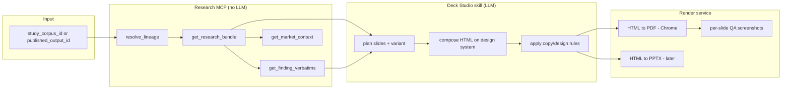

# 29 · Study → Deck (Deck Studio)

**Status:** Draft spec · Jul 2026
**Author:** derived from a real end-to-end run (Midnite / Novibet freebies)
**Goal:** productize the manual pipeline that turns a *published Signal / study corpus* into a *branded, client-ready deck (PDF/PPTX)* — so it can be triggered from Studio with one click instead of being hand-assembled.

---

## 0. TL;DR

Today, producing a client deck from a study is a manual, expert flow: connect to the corpus/DB, pull the structured research, research the brand/industry on the web, then compose slides in the Noisia design system and render to PDF. This spec defines that flow as three composable pieces:

1. **Research MCP** (data plane) — resolves a study's lineage and returns a stable, typed **Research Bundle** (the study's findings, distributions, verbatims, market context) from the existing DB/payload. *No LLM.*
2. **Deck Studio skill** (synthesis plane) — an agent skill that consumes a Research Bundle + the pitch-kit design system and composes a slide deck (HTML), applying Noisia's copy/design rules and audience/length/language **variants**.
3. **Render service** (output plane) — turns the HTML deck into **PDF** (and later PPTX), 1920×1080, print-perfect.

The value: any approved study can become a **freebie** (lead-gen), an **executive read**, or a **full deliverable** — in EN or ES — reproducibly.

---

## 1. Reference run (what was actually done)

This is the concrete sequence that produced `Downloads/Midnite/*` and `Downloads/Novibet/*`. The feature must reproduce it deterministically.

| Step | What happened | Where it lives today |
|------|---------------|----------------------|
| **1. Resolve lineage** | From a Signal URL `/signal/{outputId}`, trace `published_outputs → tb_analysis → snapshot → study_corpus → mentions`. | `apps/studio/src/lib/data/signal.ts` (`getSignalOutputForUser`) |
| **2. Extract structured research** | Read the output `payload` (JSON) + related tables: metrics, knowledge_impact, aggregates/distributions, the 19 findings, opportunities, action cards, competitive, emerging patterns, market analysis. | `published_outputs.payload`, `tb_findings`, aggregates in payload |
| **3. Pull verbatims** | Per finding, `tb_mention_codings → mentions.text_clean` (+ platform, url). Real quotes, traceable. | `apps/studio/src/lib/live-intelligence/corpus-explorer-route.ts` (`handleCorpusExplorerRequest`) |
| **4. External enrichment** | Web research for brand + industry context (operator history, market size, category events). | web search |
| **5. Compose deck** | Build 1920×1080 HTML slides on the pitch-kit design system; hand-coded charts; brand/social logos; copy rules. | `packages/pitch-kit/examples/_local/demo/` (`noisia-tokens.css`, `deck.css`, `logo_norm.svg`) |
| **6. Render** | Chrome headless `--print-to-pdf` → 19/14-slide PDF; screenshot QA per slide. | local Chrome |
| **7. Variants** | Full (19) → Freebie (14) → Industry reframe → ES translation. | manual edits |

**Access note:** in the reference run the data was read via the **Supabase REST API using the service-role key** (bypasses RLS) because prod Postgres creds weren't available. Productized, this must run **server-side inside Studio** using the app's existing DB pool + authZ (see §7).

---

## 2. Architecture



Three planes, cleanly separable:

- **Data plane is deterministic** (SQL/JSON only) → easy to test, cache, and expose as an MCP.
- **Synthesis plane is the "skill"** → the only LLM step; swappable prompt/templates.
- **Output plane is a service** → reused by any deck (also useful for the existing Signal press-deck export).

---

## 3. Component A — Research MCP (data plane)

An MCP server (or plain internal service) that exposes the study's data as **typed, LLM-free tools**. Each tool is a thin read over the existing DB; the value is a **stable contract** so the synthesis step never touches raw tables.

### 3.1 Tools

```ts
// resolve a study from any entry point (output id, corpus id, or signal URL)
resolve_lineage(input: { outputId?: string; studyCorpusId?: string }): Lineage

type Lineage = {
  outputId?: string;
  tbAnalysisId?: string; engineAnalysisId?: string;
  snapshotId?: string;
  studyCorpusId: string; baseCorpusId?: string;
  brandId?: string; themeId?: string;
  subject: { type: "brand" | "theme"; name: string; slug?: string };
  methodologySlug: string;                 // e.g. "triggers-barriers"
  publishedAt?: string; version?: number;
  mentionCount: number;                    // internal only — never shown to client
};

// the main payload: everything a deck needs, normalized
get_research_bundle(studyCorpusId: string, opts?: { outputId?: string }): ResearchBundle

// real quotes for a finding, translated on request
get_finding_verbatims(findingId: string, opts?: { limit?: number; locale?: "es"|"en" }): Verbatim[]

// market/industry context assembled from KB + (optional) web
get_market_context(subjectSlug: string): MarketContext
```

### 3.2 The Research Bundle (the contract that matters)

Grounded in the real `published_outputs.payload` + `tb_findings`. This is the **single artifact** the deck skill consumes.

```ts
type ResearchBundle = {
  subject: { type: "brand"|"theme"; name: string; anonymized?: string };
  headline: string;                 // report.headline
  business_answer: string;          // knowledge_impact.business_question_answer
  confirmed: string[];              // knowledge_impact.confirmed_by_corpus
  constraints: string[];            // knowledge_impact.strategic_constraints

  metrics: { findings: number; triggers: number; barriers: number; movable: number };

  // charts-ready distributions (all as % of de-noised conversation)
  distributions: {
    polarity: {label:string; count:number; pct:number}[];      // trigger/barrier/mixed
    layer: {label:string; count:number}[];                     // personal/social/psych/cultural
    mobility: {label:string; count:number}[];                  // movable/partial/structural
    platform: {label:string; pct:number}[];                    // X/FB/TikTok/...
    volume_timeline: {month:string; share:number}[];           // 13-month seasonality
  };

  findings: Finding[];              // the 19, ranked by decision_weight
  opportunities: Opportunity[];     // strategic_opportunities
  actions: ActionCard[];            // action_cards, by team
  competitive: { entities: Entity[]; ownership: OwnershipRow[] };
  emerging: { patterns: Pattern[]; future_signals: Signal[] };
  market_analysis: { headline: string; answer: string; patterns: string[] };
};

type Finding = {
  id: string;                       // "B-PER-01"
  name: string;
  polarity: "trigger"|"barrier"|"mixed";
  layer: "personal"|"social"|"psicologico"|"cultural";
  mobility: "movible_por_marca"|"parcialmente_movible"|"estructural";
  decision_weight: number;          // composite_score, 0–3.5  (renamed for clients)
  confidence: "alta"|"media"|"baja_direccional";
  share_pct: number;                // share_of_findings_pct — % of conversation
  protagonist_quote?: string;       // one lead verbatim
};
```

> **Naming discipline (client-facing):** the bundle keeps internal terms, but the deck layer renames them. `composite_score → "decision weight"`, `finding → "factor"`, `corpus → "research"`. Raw mention counts are **never** surfaced; only `share_pct`. See §6.

### 3.3 Source-of-truth table map

| Bundle field | Source |
|---|---|
| lineage | `published_outputs` (`tb_analysis_id`, `engine_analysis_id`, `study_corpus_id`, `brand_id`, `theme_id`, `methodology_slug`, `version`, `published_at`) → `study_corpora` → `tb_analyses` (`snapshot_id`) |
| headline/answer/constraints | `published_outputs.payload.{report, knowledge_impact}` |
| metrics/distributions | `payload.{metrics, aggregates.*}` |
| findings | `payload.findings[]` (or `tb_findings` for the full set) |
| opportunities/actions/competitive/emerging | `payload.{strategic_opportunities, action_cards, competitive, emerging_patterns, future_signals, market_analysis}` |
| verbatims | `tb_mention_codings.finding_id → mentions.text_clean` (+ `resolved_platform`, `url`, `source_file_name`) |

---

## 4. Component B — Deck Studio skill (synthesis)

The one LLM step. Consumes a `ResearchBundle` + a **variant spec** and emits an HTML deck.

### 4.1 Inputs

```ts
type DeckRequest = {
  studyCorpusId: string;
  variant: "full" | "freebie" | "executive";
  audience: { brand?: string; framing: "brand-gtm" | "industry" };  // "for Midnite" vs "industry read for Novibet"
  locale: "en" | "es";
  logos?: string[];                 // operator/brand marks to embed
};
```

### 4.2 Design system (fixed inputs)

- Tokens + components: `packages/pitch-kit/examples/_local/demo/noisia-tokens.css`, `deck.css`, `logo_norm.svg`.
- Font: **Product Sans** (local) → fallback Google Sans.
- Slide frame: `<section class="slide">` at **1920×1080**, header/footer, `.glass` cards, atmospheric blobs, `signal/tension/positive` palette.
- Print CSS: `@page{ size:1920px 1080px; margin:0 }`, `.slide{ width:1920px;height:1080px;page-break-after:always }`.

### 4.3 Slide catalog (composable blocks)

Each block reads specific bundle fields. A variant = an ordered list of blocks.

| Block | Reads | Used in |
|---|---|---|
| Cover | subject, meta | all |
| Playing field (facts) | market_context | all |
| Mandate / why | audience.framing | all |
| Method (sources + social icons) | distributions.platform, timeline | all |
| The answer (one line) | business_answer | all |
| Decision map (donut+bars+stat tiles) | distributions | all |
| Factors ranked | findings (top N + "+K more") | all |
| Top-factor deep-dive (1 per factor + verbatims) | findings[i] + get_finding_verbatims | freebie/full |
| Barriers / Triggers grids | findings by polarity | full |
| Opportunities (5) | opportunities | full |
| Action plan by team | actions | full |
| What to watch | future_signals | full |
| "We can also answer" teaser + CTA | (labels only) | freebie |
| Limits / honesty | constraints | full |
| Glossary ×2 | static + framework terms | freebie/full (appendix) |
| Close / CTA | audience | all |

**Freebie rule:** stop at the diagnosis. Deep slides (opportunities/actions/watch) collapse into ONE teaser card-set + CTA — "don't give too much."

### 4.4 Charts

Hand-coded, offline, brand-palette: SVG donut (dasharray), CSS horizontal bars, CSS column chart (timeline). No external chart libs (print/offline safe).

---

## 5. Component C — Render service

- **HTML → PDF:** Chrome headless **classic** (`--headless`, *not* `--headless=new`), `--print-to-pdf`, no header/footer, run detached with a file-poll watchdog. Output verified at 1920×1080 px.
- **QA:** tall screenshot (`--window-size=1920,N`) → crop per slide (PIL) → visual check for **vertical overflow** (footer must be visible) before delivery.
- **PPTX (phase 2):** map blocks → python-pptx or reuse the deck-stage renderer.

---

## 6. Copy & design ruleset (must be enforced by the skill)

From accumulated deck feedback (see memory `pitch-kit-learnings`):

- **Never** show internal tool/tech names to clients (SentiOne, scrapers, "corpus" as jargon) → say **"research"**.
- **Never** cite raw mention counts → **"% of the conversation"** (de-noised). Low-volume/high-impact findings show **decision weight**, not %.
- **"Factor"**, not "Force"/"finding" — self-explanatory umbrella; a factor *pushes* (Trigger) or *blocks* (Barrier).
- Don't insult the client for a thin brief; reframe positively.
- Add a **facts/context** slide up front; **define framework terms** before use (or glossary appendix).
- **No wasted whitespace:** center charts in cards, distribute columns, cards fill their track. Footer always visible.
- **Verbatims:** real, traceable; translate + label "· translated" only when not native locale. Spanish deck uses **original** quotes.
- Icons everywhere: Feather line icons + colored **social/brand favicons** (`google.com/s2/favicons?domain=…&sz=128`). `curl` may be blocked in sandbox; **node `fetch` works**.

---

## 7. Auth & security

- Productized, this runs **server-side in Studio** with the existing DB pool and **authZ** (`requirePortalUser`, `canManageCorpus`) — NOT with a raw service-role key from a laptop.
- The MCP tools must respect the same access model as `getSignalOutputForUser` (brand access / org / `noisia_internal`).
- Client decks must pass the same **publish guards / demo-mode** rules already in the Signal report (`validateEnginePublishReadiness`, anonymization for themes).
- Verbatims are user-generated public posts — fine to quote (short, attributed to platform), but respect the corpus's client-boundary flags.

---

## 8. Build plan

**Phase 1 — Research Bundle API.** Implement `resolve_lineage` + `get_research_bundle` + `get_finding_verbatims` as internal Studio endpoints (reuse `signal.ts` + `corpus-explorer`). Typed contract + tests. *Unlocks everything; no LLM.*

**Phase 2 — Deck Studio skill.** Package the pitch-kit design system as a skill with the slide catalog + copy rules + variant specs. Input = Research Bundle. Output = HTML.

**Phase 3 — Render service.** HTML→PDF endpoint (Chrome headless) + per-slide QA. Wire a "Generate deck" button in Studio (variant/locale/audience picker).

**Phase 4 — PPTX + self-serve.** Editable export; let KAMs generate freebies for any approved study.

### Open questions
- MCP vs internal service? MCP is attractive if **external agents** (or Claude) should generate decks; otherwise a plain typed service is simpler. Recommendation: build the **typed service first**, wrap as MCP only if a cross-agent surface is needed.
- Where do variant specs live — code, DB, or skill markdown?
- Chart rendering: keep hand-coded blocks, or introduce a small declarative chart schema in the bundle?
- Should market_context enrichment (web research) be cached per subject to keep decks reproducible?

---

## 9. Related
- Signal report + press-deck export (`apps/studio/src/app/signal/[outputId]/deck`) — the render service should be shared.
- Pitch-kit (`packages/pitch-kit`) — the design-system source.
- `04_DATABASE_SCHEMA.md`, `08_API_CONTRACTS.md` — align the bundle contract here.
