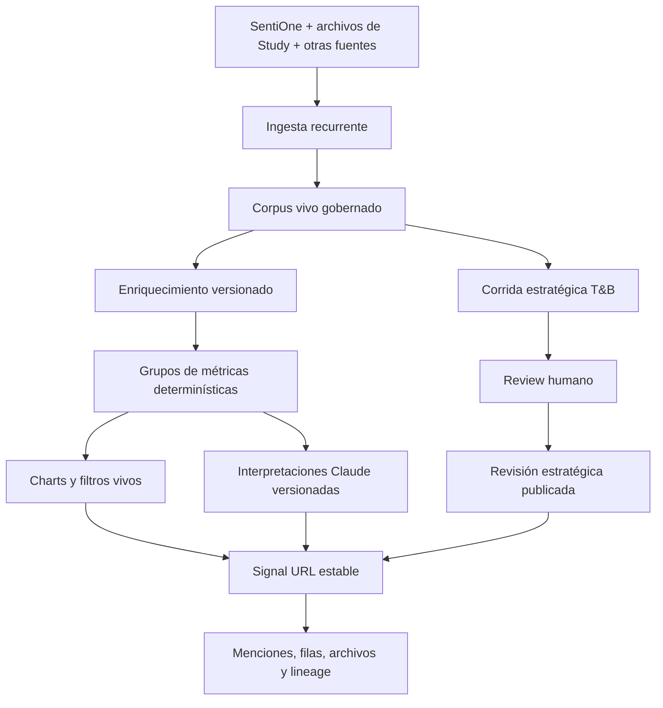

# 31 · Signal Product North Star

> **Estado:** canon de dirección de producto, 2026-07-21.
> **Decisión central:** reportes casi always-on y reportes estratégicos conviven en el
> mismo Signal del cliente.

Este documento define hacia dónde debe evolucionar Signal después de Data OS Cut 1.
Cuando una especificación anterior describa Signal solamente como un output periódico,
un payload JSON o una URL por publicación, este North Star gobierna la dirección
objetivo. No autoriza por sí solo una migración destructiva ni una activación en
producción.

## North Star

**Signal es el dashboard vivo y permanente de inteligencia de un cliente.** Su corpus se
alimenta de manera recurrente; sus métricas, charts y filtros consultan datos gobernados
en la base de datos; Claude interpreta cada grupo gobernado de métricas; y las corridas
estratégicas como Triggers & Barriers aparecen en esa misma experiencia como cortes
versionados, revisados y comparables.

El cliente no debe saltar entre una herramienta de social listening, un reporte de
consultoría y un archivo histórico. Entra a su Signal y encuentra las tres cosas como un
solo producto.

## Promesa De Producto

Signal debe responder dos ritmos diferentes sin confundirlos:

| Ritmo | Pregunta | Cadencia | Comportamiento |
|---|---|---|---|
| **Inteligencia operativa casi always-on** | ¿Qué está pasando ahora en la conversación? | Ingesta diaria, semanal o mensual según la fuente y el contrato | Métricas y charts vivos, filtros reales, comparaciones y bloques interpretativos actualizados de forma asíncrona |
| **Inteligencia estratégica** | ¿Qué significa estructuralmente y qué debemos hacer? | Corridas explícitas, típicamente mensuales, trimestrales o por evento | Metodología completa, Review humano, evidencia, oportunidades, acciones y una revisión publicada e inmutable |

“Casi always-on” no promete streaming en tiempo real. Promete que la data se actualiza
con una cadencia conocida, que el dashboard muestra su frescura y que no depende de
reconstruir manualmente un reporte JSON para enseñar el último corte.

## Una Sola Superficie Para El Cliente

La URL de Signal es una entrada estable al workspace de inteligencia de una marca o
tema. El identificador definitivo de esa URL se decidirá durante la migración, pero no
debe depender conceptualmente de un único `published_output`.

La ruta actual `/signal/{outputId}` es una transición report-centric. El destino es una
Signal home estable que resuelva:

- el sujeto y los accesos del cliente;
- el estado y la frescura del corpus vivo;
- los módulos operativos de social listening;
- la última corrida estratégica aprobada;
- el histórico de revisiones estratégicas;
- un estado de filtros compartido;
- evidencia y lineage navegables.

La futura arquitectura de información puede incluir módulos como Overview,
Conversation, Topics, Triggers & Barriers, Evidence e History. Esos nombres no fijan el
diseño visual; la especificación de UI V2 vendrá después.

## Arquitectura Objetivo

La solución tiene cinco planos que no deben colapsarse en un solo JSON:

1. **Data plane:** fuentes, imports, menciones, registros, observaciones, tags,
   features, periodos y lineage.
2. **Metric plane:** definiciones determinísticas, dimensiones, agregaciones y
   comparativos consultables.
3. **Interpretation plane:** artefactos generados por Claude con alcance, evidencia,
   modelo, prompt, watermark y vigencia explícitos.
4. **Strategic plane:** corridas metodológicas completas, Review, decisiones y
   revisiones publicadas.
5. **Experience plane:** Signal V2 compone los planos anteriores en un dashboard
   coherente para el cliente.

## El Corpus Es Vivo

- Cada fuente declara su cadencia esperada: diaria, semanal, mensual o ad hoc.
- Cada import conserva fuente, periodo, fecha de captura, sync run y quality state.
- La misma mención o fila no se duplica solamente porque otra metodología la consuma.
- Las metodologías pueden definir vistas de inclusión, codificaciones y cortes propios
  sobre la data gobernada.
- La UI muestra por separado `data_freshness` e `interpretation_freshness`.
- `unknown`, `not_available` y `stale` nunca se convierten silenciosamente en cero.
- Una actualización del corpus invalida únicamente las materializaciones e
  interpretaciones cuyo watermark quedó atrás.

Durante la transición, `study_corpora` puede seguir siendo la unidad de ejecución
metodológica. El destino es que la ingesta canónica pertenezca al workspace/sujeto y que
las metodologías la consuman mediante vistas gobernadas, no mediante copias opacas.

## Social Listening Operativo

Los Social Listening Reports de Signal se construyen directamente desde menciones
enriquecidas y tablas canónicas. El LLM no calcula los números y el frontend no agrega
un payload narrativo para inventarlos.

Capacidades mínimas:

- menciones a través del tiempo con granularidad diaria, semanal y mensual;
- volumen, share, sentimiento, engagement y velocidad con denominador explícito;
- desglose por plataforma, fuente, entidad, producto, campaña, tema y taxonomía;
- period-over-period y comparación entre ventanas compatibles;
- filtros globales reales que vuelven a consultar la capa de serving;
- drill-down de cualquier punto o segmento a las menciones que lo componen;
- lineage desde chart y métrica hasta fuente, import y corpus;
- estado de cobertura, calidad y frescura sin exponer cocina innecesaria al cliente.

La métrica siempre se computa en SQL/materialización gobernada. Claude explica su
significado; nunca se usa como calculadora ni como base de datos.

## Grupos De Métricas E Interpretación Con Claude

Cada familia coherente de métricas se registra como un **metric group**. Ejemplos:

- conversation health;
- volume and velocity;
- sentiment and emotion;
- platform and source mix;
- topics and narratives;
- entities, products and competitors;
- campaign or event impact;
- trigger/barrier movement.

Cada actualización gobernada del grupo produce un paquete determinístico con:

- `metric_group_key` y versión de definición;
- periodo, timezone, granularidad y filtros canónicos;
- valores, denominadores, deltas y benchmark disponible;
- tamaño de muestra, cobertura y quality flags;
- watermark del corpus y materialización;
- IDs de agregados, menciones, registros u observaciones que permiten auditarlo.

Claude recibe ese paquete y devuelve un artefacto `metric_interpretation` con:

- resumen de qué cambió;
- por qué puede importar;
- hipótesis e incertidumbre separadas de hechos;
- anomalías o preguntas que requieren revisión;
- referencias a las métricas y evidencia usadas;
- modelo, prompt version, fecha, alcance y vigencia.

Reglas operativas:

- No se invoca Claude en cada page view ni por cada movimiento de un filtro.
- Cada metric group tiene una política de refresh y presupuesto.
- Los filtros canónicos pueden tener interpretaciones precomputadas.
- Una combinación ad hoc muestra la interpretación compatible más reciente o solicita
  una nueva corrida asíncrona; nunca presenta texto de otro filtro como si aplicara.
- Si cambian la data, la definición o el alcance, la interpretación anterior queda
  `stale`; no se sobrescribe.
- Interpretaciones cliente-visibles pasan los controles editoriales definidos para su
  nivel de riesgo.

## Triggers & Barriers Estratégico

Triggers & Barriers no es el cálculo automático de cada page view. Es una corrida
estratégica sobre un corte gobernado del corpus, normalmente mensual pero configurable
por contrato o evento.

Cada corrida debe conservar:

- corpus revision y ventana analizada;
- protocolo/metodología y versiones de prompts/modelo;
- findings y sus menciones, registros y observaciones de evidencia;
- comparación con corridas anteriores compatibles;
- movilidad de triggers y barriers;
- oportunidades estratégicas y Action Studio;
- limitaciones y decisiones de Review;
- revisión exacta publicada en Signal.

Entre corridas estratégicas, Signal sigue vivo: entran menciones y se actualizan los
módulos operativos. La nueva data no reescribe silenciosamente el T&B aprobado; informa
su próxima corrida y puede marcar señales que ameritan adelantarla.

## Qué Se Congela Y Qué Sigue Vivo

| Elemento | Vivo | Versionado/congelado |
|---|---:|---:|
| Corpus e ingesta recurrente | Sí | Cada import y revisión conserva lineage |
| Métricas operativas | Sí | Cada materialización conserva periodo, filtros y watermark |
| Charts al cambiar filtros | Sí | La definición de métrica es versionada |
| Interpretación de un metric group | Se regenera por política | Cada artefacto previo se conserva |
| Corrida T&B aprobada | No cambia silenciosamente | Sí, como revisión estratégica |
| Export/PDF presentado | No | Sí, deriva de una revisión identificable |

El snapshot protege la verdad publicada; no convierte el dashboard en una foto muerta.

## Signal V2: Barra De Calidad

La futura UI debe sentirse como un producto principal, no como un BI genérico ni como
un JSON decorado. “Nivel Shopify” se usa aquí como barra de calidad de producto:

- arquitectura clara aunque haya mucha profundidad;
- velocidad percibida y estados de carga impecables;
- filtros consistentes y persistentes;
- densidad informativa sin ruido;
- componentes y patrones visuales sistemáticos;
- drill-down natural desde señal hasta evidencia;
- responsive real;
- empty, stale, error y partial states diseñados;
- detalles de interacción suficientemente pulidos para uso frecuente.

El lenguaje visual, layouts y componentes definitivos se especificarán con el brief de
Signal V2. Data OS y los contratos de serving deben permitir ese diseño sin dictarlo.

## Estado Actual Y Brecha

Ya existen piezas habilitadoras:

- ingesta de menciones y fuentes;
- Data OS para assets, records, observations, calidad y lineage;
- periodos, métricas y chart aggregates parciales;
- serving relacional de T&B;
- Analysis Artifact and Evidence Graph;
- snapshots y fallback de outputs publicados.

Todavía no equivale al North Star. Faltan, en orden:

1. contrato común de filtros y dimensiones;
2. catálogo completo de metric groups de social listening;
3. materializaciones y APIs vivas para esos grupos;
4. referencias explícitas de filas/observaciones estructuradas a claims y findings;
5. scheduler de interpretaciones Claude con watermarks, budgets y staleness;
6. T&B comparable por periodos sobre el mismo plano de data;
7. identidad/URL estable de Signal por workspace o sujeto;
8. rediseño integral de Signal V2;
9. shadow QA, performance, authZ y release gradual con un corpus real.

## Secuencia De Desarrollo

1. **Terminar la verdad de datos:** filtros, métrica, evidencia y lineage.
2. **Construir serving vivo de Social Listening:** series, agregados, drill-down y
   comparativos.
3. **Agregar interpretación recurrente:** metric packets y artefactos Claude
   versionados.
4. **Completar T&B vivo y comparable:** evidencia estructurada, movilidad y revisiones.
5. **Definir el contrato de Signal home:** identidad estable, navegación y permisos.
6. **Diseñar e implementar Signal V2:** UI/UX desde raíz sobre contratos ya probados.
7. **Migrar en shadow:** mantener fallback existente hasta validar con cliente/corpus
   real.

## Criterios De Aceptación Del North Star

La visión se considera materializada cuando, para un Signal real:

- una carga nueva de SentiOne actualiza métricas y charts sin reconstruir un payload;
- fecha, plataforma y al menos tres dimensiones enriquecidas filtran consultas reales;
- cualquier chart puede abrir sus menciones constituyentes;
- cada metric group muestra valor, denominador, frescura e interpretación compatible;
- Claude no es la fuente de ningún número mostrado;
- una corrida mensual T&B convive con las métricas operativas en la misma Signal home;
- el cliente puede comparar corridas T&B sin que una revisión reescriba otra;
- findings e interpretaciones importantes navegan a evidencia gobernada;
- el cliente entra por una URL estable y puede consultar historial sin conocer IDs de
  outputs;
- authZ, costo, performance, fallback y staging evidence pasan sus gates.
