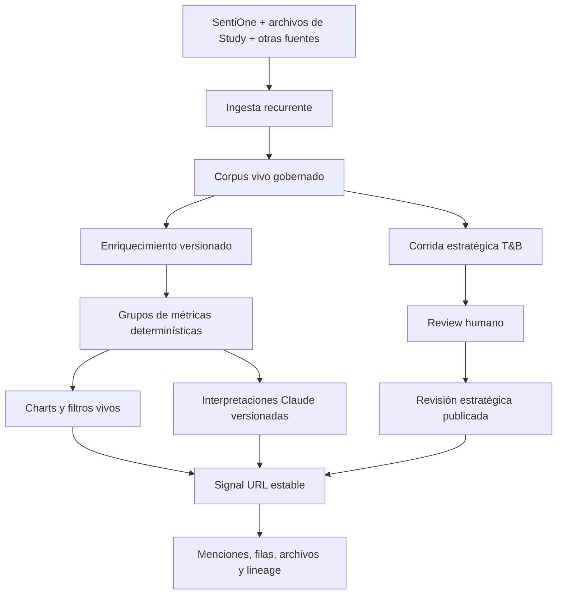
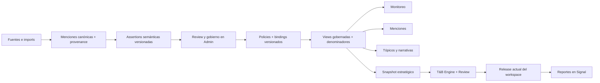

# 31 · Signal Product North Star

> **Estado:** canon de dirección de producto y corte holístico, actualizado
> 2026-08-15.
> **Decisión central:** reportes casi always-on y reportes estratégicos conviven en el
> mismo Signal del cliente.

Este documento define hacia dónde debe evolucionar Signal después de Data OS Cut 1.
Cuando una especificación anterior describa Signal solamente como un output periódico,
un payload JSON o una URL por publicación, este North Star gobierna la dirección
objetivo. No autoriza por sí solo una migración destructiva ni una activación en
producción.

La referencia inspeccionada para el lenguaje de interacción y el primer app shell de
Signal V2 vive en `33_SIGNAL_V2_SHOPIFY_UI_REFERENCE.md`.

El primer slice funcional —Monitoreo de marca— vive en
`34_SIGNAL_BRAND_MONITORING_V1.md`.

El contrato CDP-like de views, policies, cobertura y denominadores vive en
`50_SIGNAL_GOVERNED_VIEWS_AND_POPULATION_POLICIES.md`. Ese documento gobierna cuando
“población operacional” se use de forma ambigua para mezclar retención, visibilidad y
participación métrica.

## North Star

**Signal es el dashboard vivo y permanente de inteligencia de un cliente.** Su corpus se
alimenta de manera recurrente; sus métricas, charts y filtros consultan datos gobernados
en la base de datos; Claude interpreta cada grupo gobernado de métricas; y las corridas
estratégicas como Triggers & Barriers aparecen en esa misma experiencia como cortes
versionados, revisados y comparables.

El cliente no debe saltar entre una herramienta de social listening, un reporte de
consultoría y un archivo histórico. Entra a su Signal y encuentra las tres cosas como un
solo producto.

## Promesa De Producto

Signal debe responder dos ritmos diferentes sin confundirlos:

| Ritmo | Pregunta | Cadencia | Comportamiento |
|---|---|---|---|
| **Inteligencia operativa casi always-on** | ¿Qué está pasando ahora en la conversación? | Ingesta diaria, semanal o mensual según la fuente y el contrato | Métricas y charts vivos, filtros reales, comparaciones y bloques interpretativos actualizados de forma asíncrona |
| **Inteligencia estratégica** | ¿Qué significa estructuralmente y qué debemos hacer? | Corridas explícitas, típicamente mensuales, trimestrales o por evento | Metodología completa, Review humano, evidencia, oportunidades, acciones y una revisión publicada e inmutable |

“Casi always-on” no promete streaming en tiempo real. Promete que la data se actualiza
con una cadencia conocida, que el dashboard muestra su frescura y que no depende de
reconstruir manualmente un reporte JSON para enseñar el último corte.

## Una Sola Superficie Para El Cliente

La URL de Signal es una entrada estable al workspace de inteligencia de una marca o
tema. Su identidad canónica es `/signal/{workspaceSlug}` y no depende de un
`published_output`.

La ruta actual `/signal/{outputId}` es una transición report-centric. El destino es una
Signal home estable que resuelva:

- el sujeto y los accesos del cliente;
- el estado y la frescura del corpus vivo;
- los módulos operativos de social listening;
- la última corrida estratégica aprobada;
- el histórico de revisiones estratégicas;
- un estado de filtros compartido;
- evidencia y lineage navegables.

Para marcas, existe un solo workspace por organización. La flecha junto al nombre del
workspace cambia entre marcas asignadas al usuario. Los estudios Triggers & Barriers no
crean workspaces adicionales. El workspace expone un único reporte T&B; cada corrida
aprobada es un release versionado de ese reporte y no otra página cliente. El contrato
detallado vive en `37_SIGNAL_WORKSPACE_INFORMATION_ARCHITECTURE.md`; ADR 014 gobierna el
ownership canónico de data y actualiza el detalle transicional de ADR 011.

La futura arquitectura de información puede incluir módulos como Overview,
Conversation, Topics, Triggers & Barriers, Evidence e History. Esos nombres no fijan el
diseño visual; la especificación de UI V2 vendrá después.

## Arquitectura Objetivo

```mermaid
flowchart TD
  Sources["SentiOne + archivos de Study + otras fuentes"] --> Ingest["Ingesta recurrente"]
  Ingest --> Corpus["Corpus vivo gobernado"]
  Corpus --> Enrichment["Enriquecimiento versionado"]
  Enrichment --> Metrics["Grupos de métricas determinísticas"]
  Metrics --> Charts["Charts y filtros vivos"]
  Metrics --> Interpret["Interpretaciones Claude versionadas"]
  Corpus --> TB["Corrida estratégica T&B"]
  TB --> Review["Review humano"]
  Review --> Release["Revisión estratégica publicada"]
  Charts --> Signal["Signal URL estable"]
  Interpret --> Signal
  Release --> Signal
  Signal --> Evidence["Menciones, filas, archivos y lineage"]
```

La solución tiene cinco planos que no deben colapsarse en un solo JSON:

1. **Data plane:** fuentes, imports, menciones, registros, observaciones, tags,
   features, periodos y lineage.
2. **Metric plane:** definiciones determinísticas, dimensiones, agregaciones y
   comparativos consultables.
3. **Interpretation plane:** artefactos generados por Claude con alcance, evidencia,
   modelo, prompt, watermark y vigencia explícitos.
4. **Strategic plane:** corridas metodológicas completas, Review, decisiones y
   revisiones publicadas.
5. **Experience plane:** Signal V2 compone los planos anteriores en un dashboard
   coherente para el cliente.

## Corte Holístico Workspace-Owned

Backend, Admin y Signal V2 no son tres proyectos independientes. Forman una sola
vertical gobernada:

```mermaid
flowchart LR
  Sources["Fuentes e imports"] --> Canon["Menciones canónicas + provenance"]
  Canon --> Semantic["Assertions semánticas versionadas"]
  Semantic --> Admin["Review y gobierno en Admin"]
  Admin --> Policies["Policies + bindings versionados"]
  Policies --> Views["Views gobernadas + denominadores"]
  Views --> Monitoring["Monitoreo"]
  Views --> Mentions["Menciones"]
  Views --> Topics["Tópicos y narrativas"]
  Views --> Snapshot["Snapshot estratégico"]
  Snapshot --> Engine["T&B Engine + Review"]
  Engine --> Release["Release actual del workspace"]
  Release --> Signal["Reportes en Signal"]
```

Responsabilidades invariables:

- **Admin escribe y gobierna:** sources, imports, calidad, assertions semánticas,
  Review, accesos y lanzamiento de reportes.
- **Signal sólo consume:** poblaciones aprobadas, métricas determinísticas, evidence y
  releases actuales; no certifica semántica ni agrega un payload en el browser.
- **Los estudios consumen:** congelan una población gobernada, ejecutan metodología,
  pasan Review y publican una nueva revisión del reporte del workspace.
- **La marca/workspace es la identidad:** corpus, output y study pueden permanecer como
  lineage de ejecución, pero no gobiernan la navegación ni el serving cliente.

### Views, policies y denominadores

Operational V2 no es una sola bolsa de records que decide simultáneamente qué se
conserva, qué se ve y qué calcula una métrica. Signal separa:

- canonical retention;
- quality disposition;
- semantic assertions;
- eligibility policy;
- resolved membership;
- visibility policy;
- metric denominator.

Una mención fuera de métricas de marca puede seguir visible en una view gobernada de
competencia, categoría o contexto. `primary_brand` permanece como default de Brand
Monitoring. Signal nunca mezcla scopes dentro de ese denominador para recuperar volumen.

Las views son identidades de producto estables resueltas server-side mediante policy
bundles versionadas. Las materializaciones existen para hot paths y snapshots; no son
la autoridad del catálogo. Cada respuesta métrica declara `population_ref`, policy,
watermark, coverage y denominator. El navegador sólo envía una `view_key` cerrada y
nunca compone policies ni selecciona `population_id`.

Una policy client-safe también debe demostrar data rights por provenance. Quality es
una autoridad versionada sobre observaciones, mientras retention y licensing se ligan
a source/import con vigencia y usos cerrados. Una raíz con varias provenances puede usar
una ruta autorizada sin duplicarse; si no existe ninguna, permanece en el reservoir de
Admin pero no participa en la view. Desconocido nunca equivale a permitido ni a cero.

La autorización se evalúa por `(module_key, view_key)`: Monitoring requiere métricas
derivadas, Mentions requiere listado y excerpt, y Topics & Narratives requiere métricas
derivadas. Un módulo no hereda automáticamente la unión de permisos de los demás. Cada
compilación conserva la siguiente transición temporal relevante y el watermark durable
que permite invalidarla; al cruzar `effective_from`, `effective_to` o `retain_until`, el
resolver falla cerrado hasta recompilar.

La population semántica `brand` puede compartirse como conjunto candidato, pero no como
membership resuelta cuando los usos divergen. Cada identidad canónica
`(workspace_id, module_key, view_key)` materializable conserva una population derivada
estable, su digest, watermark, coverage y evidence. El bundle declara un *capability
envelope* de usos permitidos; cada compilación exige exactamente el subset cerrado de
su módulo. Reconciliar Mentions nunca puede reemplazar la membership de Monitoring o
Topics & Narratives.

### Regla de salida de V1

Operational V1 y los adapters Signal basados en `corpus`, `outputId`,
`published_outputs` o `?study=` son un puente de migración, no una arquitectura que deba
mantenerse en paralelo. En este entorno de desarrollo se retiran en el mismo corte en
que Operational V2 tenga:

1. assertions `mention_semantic` current, aprobadas y elegibles;
2. una view `brand` V2 no vacía y reconciliada;
3. bindings/pointers promovidos atómicamente y rollback ensayado;
4. coverage y denominator explícitos en los contratos cliente;
5. Monitoring, Mentions y Topics & Narratives reconciliados contra SQL;
6. views client-safe de exploración necesarias para no esconder scopes gobernados;
7. un release T&B workspace-native cuando el módulo estratégico se habilite.

No se exige paridad con V1 cuando V1 mezcla intención de adquisición con semántica. Se
exige corrección contra el contrato V2, cero diferencias inexplicadas, AuthZ, evidence y
cursores correctos. Una vez cumplido el gate, no se prolonga un dual-run de producto ni
se sigue desarrollando sobre fallbacks legacy.

Retirar V1 no significa borrar menciones, provenance, Review events, evidence, snapshots
o releases. Tampoco autoriza editar migraciones anteriores. El cleanup es forward-only y
elimina readers, flags, fallbacks y navegación legacy sólo después de comprobar el
reemplazo V2.

## El Corpus Es Vivo

- Cada fuente declara su cadencia esperada: diaria, semanal, mensual o ad hoc.
- Cada import conserva fuente, periodo, fecha de captura, sync run y quality state.
- La misma mención o fila no se duplica solamente porque otra metodología la consuma.
- Las metodologías pueden definir vistas de inclusión, codificaciones y cortes propios
  sobre la data gobernada.
- La UI muestra por separado `data_freshness` e `interpretation_freshness`.
- `unknown`, `not_available` y `stale` nunca se convierten silenciosamente en cero.
- Una actualización del corpus invalida únicamente las materializaciones e
  interpretaciones cuyo watermark quedó atrás.

Durante la transición, `study_corpora` puede seguir siendo la unidad de ejecución
metodológica. El destino es que la ingesta canónica pertenezca al workspace/sujeto y que
las metodologías la consuman mediante vistas gobernadas, no mediante copias opacas.

Una vista gobernada no es un payload ni una segunda copia del corpus. Es una definición
SQL reproducible y, cuando se necesita congelar una corrida, una membresía relacional de
IDs con watermarks y provenance. El frontend nunca recibe la población o snapshot
completo; consulta serving APIs compactas y paginadas. El contrato operativo vive en
`42_SIGNAL_WORKSPACE_DATA_OWNERSHIP.md`.

## Social Listening Operativo

Los Social Listening Reports de Signal se construyen directamente desde menciones
enriquecidas y tablas canónicas. El LLM no calcula los números y el frontend no agrega
un payload narrativo para inventarlos.

Capacidades mínimas:

- menciones a través del tiempo con granularidad diaria, semanal y mensual;
- volumen, share, sentimiento, engagement y velocidad con denominador explícito;
- desglose por plataforma, fuente, entidad, producto, campaña, tema y taxonomía;
- period-over-period y comparación entre ventanas compatibles;
- filtros globales reales que vuelven a consultar la capa de serving;
- drill-down de cualquier punto o segmento a las menciones que lo componen;
- lineage desde chart y métrica hasta fuente, import y corpus;
- estado de cobertura, calidad y frescura sin exponer cocina innecesaria al cliente.

La métrica siempre se computa en SQL/materialización gobernada. Claude explica su
significado; nunca se usa como calculadora ni como base de datos.

## Grupos De Métricas E Interpretación Con Claude

Cada familia coherente de métricas se registra como un **metric group**. Ejemplos:

- conversation health;
- volume and velocity;
- sentiment and emotion;
- platform and source mix;
- topics and narratives;
- entities, products and competitors;
- campaign or event impact;
- trigger/barrier movement.

Cada actualización gobernada del grupo produce un paquete determinístico con:

- `metric_group_key` y versión de definición;
- periodo, timezone, granularidad y filtros canónicos;
- valores, denominadores, deltas y benchmark disponible;
- tamaño de muestra, cobertura y quality flags;
- watermark del corpus y materialización;
- IDs de agregados, menciones, registros u observaciones que permiten auditarlo.

Claude recibe ese paquete y devuelve un artefacto `metric_interpretation` con:

- resumen de qué cambió;
- por qué puede importar;
- hipótesis e incertidumbre separadas de hechos;
- anomalías o preguntas que requieren revisión;
- referencias a las métricas y evidencia usadas;
- modelo, prompt version, fecha, alcance y vigencia.

Reglas operativas:

- No se invoca Claude en cada page view ni por cada movimiento de un filtro.
- Cada metric group tiene una política de refresh y presupuesto.
- Los filtros canónicos pueden tener interpretaciones precomputadas.
- Una combinación ad hoc muestra la interpretación compatible más reciente o solicita
  una nueva corrida asíncrona; nunca presenta texto de otro filtro como si aplicara.
- Si cambian la data, la definición o el alcance, la interpretación anterior queda
  `stale`; no se sobrescribe.
- Interpretaciones cliente-visibles pasan los controles editoriales definidos para su
  nivel de riesgo.

## Triggers & Barriers Estratégico

Triggers & Barriers no es el cálculo automático de cada page view. Es una corrida
estratégica sobre un corte gobernado del corpus, normalmente mensual pero configurable
por contrato o evento.

Cada corrida debe conservar:

- corpus revision y ventana analizada;
- protocolo/metodología y versiones de prompts/modelo;
- findings y sus menciones, registros y observaciones de evidencia;
- comparación con corridas anteriores compatibles;
- movilidad de triggers y barriers;
- oportunidades estratégicas y Action Studio;
- limitaciones y decisiones de Review;
- revisión exacta publicada en Signal.

Gate D añade una separación operativa igual de importante: el `GET` de preflight es
read-only y gratuito; sólo un `POST` explícito, con hard cap, digest vigente,
Idempotency-Key y autorización pagada server-side, puede congelar y encolar. La
population, policy, compilación, provenance y corpus compatible siempre se resuelven en
el servidor. Los usos `llm-processing` y `strategic-analysis` deben estar autorizados
por provenance vigente; un permiso genérico de staging no sustituye esa decisión.

El cliente ve una superficie T&B por workspace. Nuevas corridas fortalecen o revisan esa
lectura mediante Review y releases inmutables; no crean subsecciones por estudio. El
enrichment reusable aprobado puede persistir contra menciones canónicas, pero no muta
silenciosamente la revisión publicada.

Entre corridas estratégicas, Signal sigue vivo: entran menciones y se actualizan los
módulos operativos. La nueva data no reescribe silenciosamente el T&B aprobado; informa
su próxima corrida y puede marcar señales que ameritan adelantarla.

## Qué Se Congela Y Qué Sigue Vivo

| Elemento | Vivo | Versionado/congelado |
|---|---:|---:|
| Corpus e ingesta recurrente | Sí | Cada import y revisión conserva lineage |
| Métricas operativas | Sí | Cada materialización conserva periodo, filtros y watermark |
| Charts al cambiar filtros | Sí | La definición de métrica es versionada |
| Interpretación de un metric group | Se regenera por política | Cada artefacto previo se conserva |
| Corrida T&B aprobada | No cambia silenciosamente | Sí, como revisión estratégica |
| Export/PDF presentado | No | Sí, deriva de una revisión identificable |

El snapshot protege la verdad publicada; no convierte el dashboard en una foto muerta.

## Signal V2: Barra De Calidad

La futura UI debe sentirse como un producto principal, no como un BI genérico ni como
un JSON decorado. “Nivel Shopify” se usa aquí como barra de calidad de producto:

- arquitectura clara aunque haya mucha profundidad;
- velocidad percibida y estados de carga impecables;
- filtros consistentes y persistentes;
- densidad informativa sin ruido;
- componentes y patrones visuales sistemáticos;
- drill-down natural desde señal hasta evidencia;
- responsive real;
- empty, stale, error y partial states diseñados;
- detalles de interacción suficientemente pulidos para uso frecuente.

El lenguaje visual, layouts y componentes definitivos se especificarán con el brief de
Signal V2. Data OS y los contratos de serving deben permitir ese diseño sin dictarlo.

El desarrollo backend previo al rediseño se ejecuta mediante tareas acotadas en
`32_SIGNAL_BACKEND_EXECUTION_ROADMAP.md`.

## Estado Actual Y Brecha

Estado verificado de esta rama al 2026-08-12:

| Área | Estado real |
|---|---|
| Workspace, sources, imports, canonical mentions y provenance | Implementado |
| Poblaciones, materialización, invalidación y outbox | Implementado localmente |
| Snapshots, releases estratégicos y recuperación de dispatch | Implementado localmente |
| Migraciones 0059–0067 en `noisia-staging` | Aplicadas, con ledger/checksums verificados y producción intacta |
| Semantic Review | 729 raíces con assertion current; cero pendientes obsoletas accionables y Review append-only |
| View `brand` V2 | 276 raíces candidatas y memberships reconciliadas; definición draft sin current pointer |
| Scopes gobernados de prueba | 184 raíces competitor, 51 category y 246 unattributed; sirven como fixture de arquitectura, no thresholds de producción |
| Policies/views multi-población | 0068–0071 `staging_verified`; Backend 05A promovió atómicamente tres bindings `brand`, ensayó `withdraw-to-bridge` y los re-promovió sin mover el pointer operacional ni conectar readers |
| Governed serving module-aware | Backend 05B y 05C verificados: resolver fail-closed, boundary por módulo, evidence intersectada con Mentions, ETags/cursores ligados a authority, shadow staging con `unexplained_count=0` y canary visible restaurado a legacy; Advisor cerró con cero P0/P1 |
| Foundation multi-view | 0073 `staging_verified`: cuatro views cerradas, base atribuible neutral, derivaciones aisladas por módulo/view y binding sets atómicos; nueve bindings no-brand, nueve population refs y shadow con unión exacta, `unexplained_count=0` y cero cambios de pointer |
| Admin workspace | Review y Mentions funcionales; polish fino y recorrido integral pendientes |
| Signal V2 | UI avanzada; serving todavía conserva adapters y default legacy |
| T&B workspace-native | Backend 07 `staging_verified`: 0075 cerró aritmética exacta de presupuesto y 0076 aisló la base semántica estratégica neutral; Laika tiene authority `triggers-barriers/strategic`, 483 raíces, rights import-specific con expiración y Worker/recovery listos. El GET gratuito devolvió `ready=true` y `launch_authorized=true` con cero writes/jobs/provider calls; ninguna corrida pagada fue ejecutada |
| Producción | Sin cutover workspace-owned |
| Cleanup legacy | No iniciado |

La brecha central ya no es generar assertions ni crear bindings multi-view. Es completar
la autoridad estratégica sin confundir una autorización técnica de staging con derechos
de uso, ejecutar el preflight gratuito y dejar la decisión pagada al operador. El proceso
visible terminó restaurado a legacy y todavía falta el cutover general. Ejecutar otra vez
el backfill estructural de 0059 no corrige ninguna de esas brechas.

### Update operativo aditivo — 2026-08-12T12:45:03-06:00

Este checkpoint no reemplaza el estado anterior ni reescribe la historia de los gates.
Registra la lectura integral del rediseño después de Backend 07 y antes de ejecutar la
primera corrida T&B workspace-native real.

La distinción de estado vigente es:

| Capa | Estado en este checkpoint |
|---|---|
| Arquitectura Data OS/CDP-like | Resuelta: ownership por workspace, menciones canónicas, provenance, Review, policies, bindings, views, denominadores y evidence relacional |
| Backend operacional | 12 bindings actuales en `noisia-staging`: `brand`, `competition`, `category` y `all-governed` para Monitoring, Mentions y Topics & Narratives |
| Serving visible | Canary governed completado y rollback comprobado; el proceso visible permanece deliberadamente en `legacy` |
| Admin | Workspace, Data & Sources, Mentions, Semantic Review, Brand OS, Reports y Settings funcionales; falta polish fino y QA integral del recorrido |
| Signal V2 | Shell y módulos avanzados; falta hacer governed el default, exponer/validar la exploración multi-view y cerrar QA end to end |
| Study OS / T&B | Preflight gratuito `ready=true` y `launch_authorized=true`; ninguna corrida, snapshot pagado o release nuevo ejecutado |
| Producción | Sin lectura, migración, backfill, cutover o cleanup de V1 |

Capacidades de producto confirmadas en este corte:

- Admin puede crear y operar un workspace de marca, cargar fuentes/imports, inspeccionar
  el reservoir canónico, gobernar inclusión, ejecutar Review semántico y preparar una
  corrida estratégica con hard cap.
- Signal puede representar Monitoring, Mentions, Topics & Narratives y T&B dentro de una
  URL estable de workspace, con filtros, evidence, drawers y releases relacionales; el
  runtime governed ya fue probado, pero todavía no es el default visible.
- Una mención fuera del denominador `brand` no se elimina: puede permanecer en
  `competition`, `category`, `all-governed`, una población estratégica o el reservoir de
  Admin conforme a policy, visibility y data rights.
- Study OS puede congelar una población estratégica gobernada, reservar presupuesto,
  ejecutar con Workers/recovery y producir una revisión inmutable; falta demostrar el
  recorrido real corrida → Review → release → Signal.

La fixture Laika en este checkpoint conserva 4,587 raíces canónicas en el reservoir de
Admin, 729 raíces con estado semántico current, 276 en `brand`, 184 en `competition`, 51
en `category`, 483 en `all-governed` deduplicada y 246 `unattributed`. Estos conteos
validan arquitectura; no son thresholds, policies ni expectativas para producción.

Backend 07 dejó una authority estratégica temporal sobre 483 raíces, con estimate USD
11.13, hard cap USD 15, modelo/precio pinneados, Worker/recovery listos y rights
import-specific que expiran el 2026-08-19T16:57:26Z. El `GET` fue gratuito y produjo cero
writes, jobs o provider calls. El `POST` requiere una decisión posterior y explícita del
operador.

Por tanto, el orden vigente es:

1. ejecutar Gate D mediante confirmación del operador, supervisar la corrida, pasar
   Review y publicar el primer release T&B workspace-native;
2. completar Gate E: governed serving sostenido en staging, experiencia multi-view,
   polish de Admin y QA integral Admin + Signal;
3. completar Gate F: auditoría read-only de producción, restore, migrations/backfill,
   shadow, canary, autorización de cutover y rollback;
4. retirar V1 de forma forward-only sólo después de probar el reemplazo, conservando
   canonical data, provenance, Review, snapshots, evidence y releases.

El catálogo funcional y el backlog productizable derivados de este checkpoint viven en
[52_NOISIA_FEATURES_DESCRIPTION_V02.md](./52_NOISIA_FEATURES_DESCRIPTION_V02.md).

## Secuencia De Desarrollo

La prioridad vigente reemplaza cualquier plan que trate backend, Admin o Signal como
frentes separados:

1. **Completado: aplicar y verificar 0059–0067 en `noisia-staging`**, resolver el set de
   prueba y mantener producción/readers intactos.
2. **Gate B verificado en `noisia-staging`:** policy bundles, autoridades relacionales,
   compilaciones y populations derivadas por módulo/view. Backend 04B cargó sólo las
   decisiones staging-only aprobadas y reconcilió los tres módulos; Backend 04C aplicó
   0070 y demostró que recompilar bundles no muta la candidata semántica compartida.
3. **Binding gate `brand` completado en staging:** Backend 05A promovió como una sola
   unidad Monitoring, Mentions y Topics & Narratives, retiró el set completo hacia el
   bridge y lo re-promovió con historial append-only. Falta conectar readers en un gate
   separado. Backend 05B ya resuelve cada módulo desde su binding, declara
   coverage/denominator y ensayó el shadow read-only sin seguir el pointer operacional.
   Backend 05C aplicó 0072, ejecutó el canary visible en staging y restauró el proceso a
   legacy; Advisor cerró ambos checkpoints con cero P0/P1.
4. **Foundation multi-view verificada en staging:** 0073 cierra competition, category y
   all-governed, separa su base semántica neutral de las derivaciones por módulo/view y
   generaliza promoción/retiro atómicos sin tocar el bridge `brand`. Backend 06 aplicó y
   ensayó los nueve bindings no-brand, verificó la unión deduplicada y pasó Advisor con
   cero P0/P1. No crear una población física por cada filtro.
5. **Gate D desbloqueado en staging:** Backend 07 aplicó/verificó 0075 y 0076, cargó
   únicamente la autorización import-specific y temporal de
   `llm-processing` + `strategic-analysis`, construyó la authority estratégica sobre
   483 raíces deduplicadas y dejó Worker/recovery listos. El GET gratuito autenticado
   devolvió population, coverage `partial`, denominator, provider, presupuesto y digest
   reproducibles con cero writes/jobs/provider calls. Advisor cerró con cero P0/P1.
6. **Ejecutar una corrida T&B real sobre snapshot V2** sólo mediante acción posterior
   del operador, con presupuesto explícito, Review y current release del workspace.
7. **Cerrar Admin y Signal V2 como una sola experiencia**, reutilizando el frontend
   canónico y validando navegación, loading, responsive, i18n, AuthZ y evidence.
8. **Rehearsal y cutover de producción**, seguido por retiro/cleanup forward-only del
   runtime V1. El lineage permanece.

## Criterios De Aceptación Del North Star

La visión se considera materializada cuando, para un Signal real:

- una carga nueva de SentiOne actualiza métricas y charts sin reconstruir un payload;
- fecha, plataforma y al menos tres dimensiones enriquecidas filtran consultas reales;
- cualquier chart puede abrir sus menciones constituyentes;
- cada metric group muestra valor, denominador, frescura e interpretación compatible;
- cada módulo muestra coverage y distingue captured, reviewed, abstained, unattributed y
  used-by-this-view sin convertirlos en el mismo estado;
- una mención puede salir del denominador `brand` y seguir disponible en una view
  client-safe gobernada;
- ninguna unión de scopes existe sin policy, owner, version y denominator;
- Claude no es la fuente de ningún número mostrado;
- una corrida mensual T&B convive con las métricas operativas en la misma Signal home;
- el cliente puede comparar corridas T&B sin que una revisión reescriba otra;
- findings e interpretaciones importantes navegan a evidencia gobernada;
- el cliente entra por una URL estable y puede consultar historial sin conocer IDs de
  outputs;
- Operational V1 no es el default ni existe como fallback cliente después del gate V2;
- Admin puede revisar y resolver assertions semánticas sin convertir source intent en
  aprobación;
- Signal no depende de `corpus`, `outputId`, `published_outputs.payload` o `?study=` como
  identidad de producto;
- authZ, costo, performance, fallback y staging evidence pasan sus gates.

## Backend 09 · Greenfield productizado

Estado comprobado el 2026-08-12: `staging_verified` y listo para QA manual del operador.
Backend 09 cerró los blockers greenfield observados por la auditoría 53 sin reutilizar
la orquestación específica de Laika:

- Admin crea marca/workspace, Brand OS, identities category/reference, sources y timezone;
- “Preparación de datos” crea drafts y activa, sólo por decisión explícita, quality,
  retention, licensing y provenance versionadas;
- import y Semantic Review producen la base atribuible; estado derivado no sustituye
  revisión humana ni convierte `not_available` en aprobación;
- “Governed views” detecta aplicabilidad y reconcilia/promueve/retira los tres módulos
  para `brand`, `competition`, `category` y `all-governed`;
- Reports prepara y promueve una authority `triggers-barriers/strategic` server-owned,
  muestra el preflight gratuito y bloquea visual y contractualmente el POST hasta la
  confirmación humana del hard cap;
- Review, draft release, promoción e historial usan las APIs workspace-native.

La fixture sintética de staging creó 5 raíces, un alias duplicado, una raíz multi-entidad
y una raíz `unattributed`. Quedaron current las doce combinaciones operacionales, con
denominadores 2 (`brand`), 2 (`competition`), 1 (`category`) y 4 (`all-governed`) por
módulo. Monitoring, Mentions y Topics & Narratives leyeron bindings gobernados sin
fallback legacy. El preflight estratégico obtuvo denominator 4, coverage `partial`,
abstained `not_available`, estimate USD 4.41 y cap USD 15; la cola, outboxes y provider
calls permanecieron en cero. No se creó Alexa ni se ejecutó una corrida T&B.

0077 (`64b8302…f128c`) y 0078 (`5496e56…0b96e`) están `staging_verified`. Producción y
los pointers operacionales permanecen fuera de este checkpoint.

## Checkpoint QA greenfield · Alexa

**Registrado:** 2026-08-12T22:43:07-06:00 (`America/Mexico_City`)

La creación real de Alexa confirmó que el backend greenfield puede inicializar marca,
Brand OS, workspace, identidades y población sin depender de Laika. También reveló tres
deltas inmediatos de producto que deben cerrarse en Gate E sin degradar la capacidad ya
funcional:

1. **Crear marca sigue siendo una superficie legacy.** Su densidad, ancho, cards, fields,
   estados y responsive no pertenecen aún al sistema canónico de Admin; el recorrido debe
   reconstruirse con los primitives compartidos y QA visual real, no recibir otro skin
   aislado.
2. **La zona horaria no puede seguir siendo texto libre.** El valor persistido continúa
   siendo una clave IANA estable, pero la selección debe provenir de un catálogo gobernado,
   con búsqueda, labels comprensibles, validación server-side y sugerencias filtradas por
   país. El país puede sugerir una zona, nunca decidirla silenciosamente cuando existan
   varias.
3. **“Investigar marca con Claude” sí aporta valor y funciona.** Debe preservarse al
   sustituir la pantalla legacy, junto con la revisión humana de descripción, aliases,
   industria, países y competidores antes de crear el workspace.

El QA descubrió además una bifurcación de navegación: `Estudios → Nuevo estudio` continúa
siendo el wizard de compatibilidad legado. Una marca V0.2 no ejecuta T&B desde ahí. El
camino soportado es `Workspace → Datos y fuentes → Revisión semántica → Governed views →
Reportes`, donde la corrida se prepara mediante authority estratégica, preflight gratuito,
hard cap y confirmación del operador. Gate E debe hacer imposible confundir ambas rutas.

Estos defectos no invalidan el rehearsal greenfield ni autorizan ocultar decisiones. El
drawer de nueva source mantiene correctamente server-owned `CSV de listening`, `Carga
manual` y `Marca primaria`; lo pendiente es explicar por qué están bloqueados y guiar al
operador hacia el siguiente paso. El registro vivo de este recorrido está en
[54_ALEXA_GREENFIELD_OPERATOR_QA.md](./54_ALEXA_GREENFIELD_OPERATOR_QA.md).

El mismo principio aplica a toda “Preparación de datos”: una policy no puede presentarse
como un formulario técnico sin traducción de producto. Cada check y campo debe tener un
helper canónico accesible por hover, foco de teclado y tap, que explique en lenguaje de
operador qué decide, qué bloquea, qué módulos consume, qué significa `draft` frente a
`active` y cuál es el efecto de cada opción. El tooltip complementa el label; nunca será
la única forma de acceder a información necesaria ni dependerá sólo del hover.

El onboarding greenfield también tendrá una plantilla visible **Piloto · seis meses**.
Cuando aún no exista una policy, los drawers de Quality, Retention y Licensing se abren
prellenados con los valores aprobados para esta plantilla; el operador puede editarlos,
crea el draft y activa explícitamente. No se crean permisos current ni se certifica
quality en silencio. El plazo se calcula en meses calendario desde la fecha efectiva del
operador y se presenta antes de guardar. Una policy activa nunca desaparece: conserva
versión, estado, actor, vigencia y `Nueva versión`; esta última parte de los valores
current como punto de partida, en vez de resetear el formulario.

En desktop, las tres autoridades se muestran como un grupo horizontal compacto de tres
columnas equivalentes, no como tres filas altas apiladas. Tablet puede reflow a `2 + 1` y
móvil a una columna. Provenance conserva su tabla canónica independiente porque describe
bindings por source/import, no tipos de policy.

### Checkpoint de ingesta multiarchivo y multiscope

**Registrado:** 2026-08-12T23:48:41-06:00 (`America/Mexico_City`)

El primer import real de Alexa confirmó que una source admite varios imports separados,
preserva el nombre de cada archivo, sus conteos, lineage y deduplicación canónica, y que
un binding de provenance a nivel source cubre imports actuales y futuros. El primer batch
reconcilió 4,499 registros como 3,277 incluidos, 916 excluidos y 306 duplicados.

También expuso un límite de producto: el conector Admin disponible crea únicamente
sources con scope server-owned `primary_brand`. Un filename de competencia o categoría
no cambia ese contrato ni debe convertirse silenciosamente en clasificación semántica.
Semantic Review puede resolver posteriormente la entidad correcta mediante identidades
gobernadas, pero source intent sigue siendo sólo evidencia de adquisición, nunca una
aprobación semántica.

El contrato objetivo separa tres niveles:

1. **Source:** el conector estable, proveedor, conexión, cadence y policies de provenance.
2. **Import batch:** archivo/query pack, periodo capturado, intención de adquisición
   gobernada y entidad esperada (`primary_brand`, `competitor`, `category` o `reference`).
3. **Semantic assertion:** la clasificación aprobada de cada raíz; puede corregir la
   intención del batch sin reescribir la observación ni su lineage.

Admin debe incorporar una cola multiarchivo con preflight por CSV, selección explícita de
scope y entidad por batch, sugerencias basadas en filename sólo para reducir captura,
confirmación humana, progreso y resultado por archivo, retry idempotente y resumen de
duplicados. No se crearán múltiples sources falsas para representar queries del mismo
conector. Los bindings import-specific quedan reservados para excepciones de derechos o
retención, no para sustituir esta clasificación de adquisición.

El 2026-08-13 el primer archivo grande reveló que esta cola también es un requisito de
integridad, no sólo de UX. `Alexa Plus - Google.csv` es un export válido de 91.9 MB y
13,595 registros lógicos; la ruta workspace-owned original lo procesó síncronamente dentro
del request y dejó un batch `failed` con persistencia parcial sin conteos finales ni
watermark. El corpus de prueba incluye además archivos de 139–183 MB y dos de ~717 MB.

El P0 quedó cerrado en `noisia-staging` mediante 0079/0080 y el mismo worker/parser CSV
canónico. La única implementación de parseo, normalización, deduplicación, persistencia y
provenance vive en `infrastructure/db/sentione-csv-ingest.ts`; Studio y Workers sólo
inyectan su pool mediante adaptadores finos. Admin crea primero un batch durable, sube el archivo directamente a storage
privado en partes deterministas de 48 MB, recibe `202`, completa el upload y consulta el
estado `queued → processing → completed|failed` fuera de la conexión original. La DB
publica hash, conteos, watermark, sync e invalidaciones sólo en `completed`; readers,
facets, Review, compilaciones, denominadores y T&B consumen únicamente provenance
aceptada. Un retry crea un batch de supersession append-only, reutiliza raíces canónicas y
persiste su disposition/provenance antes de cualquier punto de interrupción del Worker.

El rehearsal local final, ya sobre la implementación consolidada, abortó a 7,500 registros,
reinició el Worker a 5,000 y reconcilió los 13,595 registros con un único batch aceptado,
watermark y sync. La recuperación real
conservó seis intentos fallidos auditables y terminó con un solo batch exitoso del hash
esperado, 10,417 raíces enlazadas a provenance aceptada y cero raíces servidas sólo por
intentos incompletos. Admin muestra progreso, historial, error recuperable y retry seguro;
Semantic Review volvió a cargar desde el estado aceptado. A 2.68 MB/s local y 0.74 MB/s
observado en staging, 717 MB se proyectan en aproximadamente 4.5–16.1 minutos de parsing y
persistencia, además del upload. Los archivos grandes usan multipart directo; el request de
Studio no transporta ni procesa el cuerpo completo.

El 2026-08-13 `Alexa Plus - Siri HomePod.csv` comprobó que el transporte durable y el
fail-closed de 0079/0080 funcionan, pero descubrió un segundo P0 en el contador de resume
del parser canónico. El archivo subió 182,930,651 bytes, el Worker leyó sus 56,079 filas y
llegó a 99%; PostgreSQL rechazó el cierre porque los contadores no reconciliaban. El batch
permaneció `failed`, sin watermark, sync ni memberships servibles.

El Worker tardó aproximadamente 43 minutos entre `processing` y el fallo final. Para 183 MB
esto equivale a ~0.071 MB/s y contradice el rehearsal de 0.74 MB/s usado para proyectar
16.1 minutos sobre 717 MB. A ese rendimiento observado, 717 MB tardarían cerca de 2.8 horas.
Por tanto N02-023 incluye también eliminar fallbacks fila-por-fila ante duplicados esperados,
medir por fase y demostrar throughput set-based con una mezcla real antes de importar el
siguiente archivo grande.

Después de aceptar todos los CSV de Alexa, el 2026-08-13 el corpus greenfield real superó
100,000 menciones y descubrió el siguiente gate. Semantic Review continúa construyendo y
clasificando la población completa antes de devolver una página de 50; el endpoint agotó
el tiempo operativo y respondió 503. El resolver tampoco puede lanzarse como bypass:
prepara el workload completo antes del estimate, limita un provider batch a 100,000 items
y no demuestra en esa selección el mismo contrato de provenance aceptada y licensing LLM.
N02-024 bloquea gasto real hasta que existan cola paginada, preflight gratuito, hard cap
humano, partición durable, recovery y observabilidad del run.

N02-024 quedó `staging_verified` el 2026-08-13. 0082
(`sha256:f000bfffe4378c36dad444aaf18235e9ce7ba50cff83c87803f519096b024c25`)
reemplaza esa lectura O(n) por una proyección versionada e incremental. La página y sus
filtros usan keyset SQL, aggregates indexados y cursores sellados al snapshot; imports
aceptados, Review, identities, governance y merges canónicos invalidan sólo el estado
derivado correspondiente. El rehearsal PostgreSQL con 120,003 raíces seleccionadas usó
cinco queries, p95 warm de 5.3 ms y cursor p95 de 3.9 ms; tres child batches de 50,000
probaron cancel, resume, replay, leases, hard cap y settlement bajo provider falso.

La primera reconciliación de staging descubrió un sort/scan global todavía costoso durante
el rebuild, no durante el GET. 0083
(`sha256:66049da1460b295ae00ec8b1b6d7ea9000d9b8894ef28c5cd15a20648c52e7cd`)
añadió exclusivamente los índices parciales de raíces aceptadas y provenance
`source_intent`; ambas migraciones tienen un solo ledger `applied`. La proyección de Alexa
cerró atómicamente en generación 1 con 109,056 raíces y provenance incompleta 0. El rebuild
completo tardó aproximadamente 3m21s; el recheck final de 12 lecturas warm de 50 registros
midió p95 427.7 ms para primera página, 287.9 ms para cursor y 415.9 ms para filtro. El GET ejecuta
cinco queries y el plan de página usa `Index Scan`, 51 filas, cero temp blocks y 0.151 ms de
ejecución SQL.

El preflight gratuito midió 109,056 raíces elegibles, 109,056 sin resolver, 24,577 en el
estrato determinístico y 84,479 ambiguas. Declaró tres child batches, modelo/precio
pinneados y estimate USD 327.233340 en 512.5 ms. Con hard cap de prueba USD 40 responde
`confirmation_required` y no reduce la población: cero runs nuevos, jobs, provider calls o
gasto. El proceso supervisado usa una cola semántica dedicada, heartbeat y ambos drainers;
el monitor es read-only. Ningún hecho de este cierre autoriza el POST pagado.

La reanudación final del 2026-08-14 detectó y corrigió un defecto genérico de recovery: los
dos paths de fallo del refresh enviaban `jsonb` a un writer SQL cuyo contrato es `text`, por
lo que un job fallido podía conservar su lease hasta expirar. Ambos paths usan ahora el tipo
exacto y una prueba estática evita la regresión. El refresh inválido de un workspace inactivo
agotó sus reintentos y quedó `dead_letter` auditable; Alexa no fue mutada, sus digests siguieron
idénticos y Resolution conservó cero jobs no terminales, child outbox y provider batches.

La causa es determinista: cuando un chunk mezcla inserts y conflictos, el parser registra
provenance de los inserts antes de resolver el resto; la consulta posterior vuelve a marcar
esos mismos inserts como `already_in_batch` y los suma una segunda vez. El resultado
correcto derivado del CSV y del lineage durable es
`56,079 = 40,647 included + 4,350 excluded + 11,082 duplicates`, donde 9,050 son
duplicados intraarchivo y 2,032 ya existían en otros imports. El recovery debe reutilizar
las partes privadas ya subidas, no exigir otra transferencia, y demostrar esta mezcla de
disposiciones antes de continuar con archivos mayores.

El P0 quedó cerrado con 0081
(`sha256:d351a6e2958b88ad64afbb692b8f5c7cdfd55f1380c3c42babfee231759234de`) y
verificado en `noisia-staging`. El parser resuelve
preestado, insertados del intento, conflictos previos y provenance mediante tres consultas
set-based por chunk; la clasificación no ejecuta consultas dentro del loop de filas y
declara `row_fallback_count=0`. El retry de producto reutilizó las cuatro partes privadas
del upload original, verificó tamaño y SHA-256 antes de persistir y creó una supersession
append-only. El intento original permanece `failed`.

La recuperación real produjo únicamente desde el pipeline canónico:

- `56,079 = 40,647 included + 4,350 excluded + 11,082 duplicate`;
- 9,050 duplicados intraarchivo y 2,032 contra otros imports;
- 47,029 memberships en el batch aceptado y cero raíces dependientes sólo del fallido;
- exactamente un batch `completed` para el contenido, un sync run y un watermark;
- una invalidación `operational_population_membership_changed` y una
  `workspace_data_accepted`, cada una emitida una sola vez;
- replay de la misma `Idempotency-Key` sobre el mismo intento, sin otro batch ni eventos.

La instrumentación separó verificación de storage (3.989 s), parseo/persistencia set-based
(20.567 s), cierre atómico (268.601 s) y total Worker (293.158 s). Fueron 95 chunks, 285
consultas cliente y cero fallbacks; la suma de latencia de queries fue 73.837 s porque seis
chunks trabajan concurrentemente. El throughput end-to-end fue ~0.624 MB/s y el tramo de
parseo ~8.9 MB/s: ~4 min 53 s frente a ~43 min del path defectuoso. El nuevo bottleneck es
el cierre relacional, no el parser. Una extrapolación conservadora y lineal de todo el
pipeline sitúa 717 MB alrededor de 19 minutos, más el upload inicial; debe verificarse con
el archivo real, pero ya no proyecta horas ni mantiene un request HTTP abierto.

## Decisión De Producto · Cascada Semántica Y Topic Contracts

**Registrada:** 2026-08-15T10:24:00-06:00 (`America/Mexico_City`)

El rehearsal de Alexa cambió el orden de ejecución del roadmap. Signal V0.2 no puede
depender de una llamada LLM por mención: 109,056 raíces sin resolver produjeron un
preflight de USD 327.233340, aunque 24,577 ya pertenecen a un estrato determinístico. El
worker vigente de Topics & Narratives también drena la población mediante Voyage y
Claude. Subir el hard cap o recortar silenciosamente la población no corrige esa
arquitectura.

El flujo objetivo anterior a publicar Signal queda canonizado así:

1. Brand OS crea el plan de adquisición con slots de marca primaria,
   categoría/industria y uno por competidor;
2. source, acquisition slot/query pack, import batch y semantic assertion permanecen
   separados;
3. ETL canónico y set-based tipa observaciones, normaliza, deduplica y conserva
   provenance sin provider por registro;
4. una cascada resuelve identidad exacta, labeling functions y clasificador local, y
   puede abstenerse;
5. Semantic Review concentra humanos o Claude bounded en incertidumbre, no en toda la
   población;
6. discovery local construye clusters sobre la población elegible completa;
7. Claude puede nombrar y proponer un Topic & Narrative Contract desde evidence
   representativa, pero nunca calcula counts ni genera SQL ejecutable;
8. un compiler server-owned valida un DSL cerrado y aplica matching híbrido local al
   corpus completo y a imports futuros;
9. Signal se previsualiza y publica sólo cuando Overview, Mentions y T&N declaran
   denominator, coverage, limitations, versions y watermark.

Semantic Review incompleta ya no bloquea necesariamente el publish. Produce un estado
explícito `partial`: unresolved/abstained nunca se convierten en approved, eligible o
cero, y cada métrica usa su denominator real. El primer publish sí exige un contrato T&N
current, evaluado y aplicado, aunque su coverage gobernada sea parcial.

La muestra de hasta 10,000 menciones pertenece al packet cualitativo, no al denominator
de clustering ni a los counts. Full-population charts requieren assignments sobre toda la
población elegible. Un tópico puede usar lexical + embeddings + clasificador; una
narrativa requiere positive/counterexamples y evidencia semántica más fuerte que una
coincidencia de keywords.

Advisor Fable 5 confirmó que esta dirección preserva el North Star, pero bloqueó avanzar
con el código vigente: autoaprobación basada en confidence/score declarados por el propio
modelo, assignments mutadas in-place, ausencia de `abstained`, guardas incompletas del
DSL y coexistencia del worker full-population Voyage/Claude. Estos P0/P1 son criterios de
salida, no deuda post-lanzamiento.

El contrato completo, benchmark tecnológico y Gates 10A–10F viven en
[55_SIGNAL_ACQUISITION_SEMANTIC_CASCADE_AND_TOPIC_CONTRACTS.md](./55_SIGNAL_ACQUISITION_SEMANTIC_CASCADE_AND_TOPIC_CONTRACTS.md).
La secuencia ejecutable 10A–10H, sus autoridades, tablas, workers, benchmark, QA y
rollback se mantienen en
[56_SIGNAL_SEMANTIC_CASCADE_EXECUTION_PLAN.md](./56_SIGNAL_SEMANTIC_CASCADE_EXECUTION_PLAN.md).
ADR 015 fija la decisión estructural.

## Decisión de producto · T&B Coding Workbench

**Registrada:** 2026-08-12T22:19:46-06:00 (`America/Mexico_City`)

La primera corrida greenfield de Alexa debe probar el contrato actual antes de diseñar
con datos ficticios, pero el producto final incluye una superficie permanente posterior
a T&B para gobernar la codificación de menciones. No es una mejora opcional ni una
segunda metodología: es la continuación operativa de T&B dentro de Data OS.

La corrida estratégica conserva una población y muestra selladas. Cada raíz realmente
procesada debe terminar con una feature `tb_coding` y lineage completo; cuando exista
evidencia suficiente, también materializa candidatos de trigger, barrier, layer y tags
emergentes. Aprobar el release acepta ese resultado analítico y congela su evidencia,
pero no convierte automáticamente cada inferencia en conocimiento reutilizable del
workspace. Una etiqueta reusable requiere aprobación humana o policy explícita.

Después de publicar la primera release, Admin debe ofrecer un **T&B Coding Workbench**
con la arquitectura canónica de Semantic Review y Mentions para:

- distinguir población gobernada, muestra procesada, resultado aceptado, tags aprobados,
  excepciones revisables y menciones no procesadas;
- revisar, aprobar, corregir, rechazar o superseder codificaciones y tags de la muestra;
- asignar manualmente trigger/barrier/irrelevant, layer, tags y findings a raíces que no
  formaron parte de la muestra;
- crear tags candidatos sin confundirlos con términos aprobados del catálogo;
- asociar menciones al catálogo de findings congelado por release;
- operar selección masiva, filtros, historial, actor, motivo, confidence, source y
  lineage sin editar SQL ni payloads;
- producir invalidaciones y nuevas materializaciones cuando cambie conocimiento current.

Las asignaciones posteriores amplían el conocimiento del workspace, pero nunca
reescriben la muestra, evidencia, denominador o release histórico que las originó. Si
deben modificar el dashboard cliente, generan una materialización o release posterior
explícita. El historial es append-only: el resultado de Claude, la corrección humana y
la decisión current permanecen distinguibles.

El backend ya contiene `record_tags`, `record_feature_values`, codificaciones T&B,
findings, citas, lineage y writers de review reusable. La API V2 acepta decisiones
`approve/correct/reject`, pero la aprobación general de Review todavía puede enviar una
selección vacía. El cierre pendiente es el read model paginado, las mutaciones masivas y
versionadas, la relación mención↔finding, invalidación/re-materialización y la UI
canónica. Esta capacidad se ejecutará como **Backend/Frontend 10**, después de observar
la primera corrida de Alexa y antes de considerar completo el gobierno longitudinal de
T&B.

## Decisión de ejecución · producto greenfield sobre rescate de fixtures

**Registrada:** 2026-08-15T16:18:23-06:00 (`America/Mexico_City`)

Noisia V0.2 permanece íntegramente en preproducción. Laika, Alexa y los demás workspaces
actuales son fixtures desechables: sirven para descubrir defectos, pero su continuidad,
backfill o recuperación no es una obligación de producto. El criterio de avance pasa a
ser un workspace nuevo creado desde Admin y operado sin scripts especiales a través del
camino greenfield soportado.

La decisión no abandona las migraciones forward-only ni autoriza borrar datos. Las
migraciones siguen creando el schema reproducible del producto; dejan de justificarse
por compatibilidad con fixtures. 0084 se conserva porque formaliza Acquisition Plan,
slots, queries, sellos de import y observaciones tipadas como capacidades generales.

El orden inmediato queda:

1. Frontend 10A.3 local para operar Acquisition Plan y sus slots desde Data & Sources;
2. QA browser con una marca nueva, primary/category/dos competidores y varios imports;
3. completar la cascada ETL/abstención y T&N bajo los Gates 10B–10F;
4. publicar un preview greenfield completo antes de cualquier rehearsal remoto orientado
   a compatibilidad;
5. abrir production readiness y migración de datos sólo cuando exista un primer cliente
   real o una fuente que deba conservarse.

El plan operativo detallado y su estado viven en
[56_SIGNAL_SEMANTIC_CASCADE_EXECUTION_PLAN.md](./56_SIGNAL_SEMANTIC_CASCADE_EXECUTION_PLAN.md).

## Checkpoint de ejecución · Acquisition Plan operable

**Registrado:** 2026-08-15T17:47:04-06:00 (`America/Mexico_City`)

Frontend 10A.3 quedó implementado y probado localmente sobre una marca greenfield creada
desde Admin. Data & Sources ya puede reconciliar Brand OS, exigir categoría gobernada,
crear primary/category/competitor slots, reutilizar un conector, versionar una query por
slot, resolver policies/provenance, promover el plan completo y abrir imports sellados e
historial por slot. El flujo pasó browser QA desktop y móvil a 390 px.

Este checkpoint confirma la dirección CDP-like: connector, intención de adquisición,
verdad semántica y serving permanecen separados. No se creó una source por CSV o keyword,
el filename no aprueba scope y un slot nunca se convierte en assertion. La importación
real contra storage remoto y el rehearsal staging 10A.4 siguen requiriendo autorización
separada.

El siguiente bloque de producto es **10B · Classification authority**: ledger append-only,
abstención explícita, gold/model registry y kill switch para que el etiquetado operacional
de 100K+ observaciones no dependa de Claude por raíz. 10A.4 puede ejecutarse después como
evidencia remota, pero no bloqueará el desarrollo greenfield ni rescatará fixtures.

## Corrección de producto · Query Engine antes de adquirir

**Registrada:** 2026-08-15T18:17:34-06:00 (`America/Mexico_City`)

El QA de Frontend 10A.3 reveló que los slots correctos existen, pero el primer estado de
Data & Sources todavía obliga al operador a escribir una query vacía. Eso no es el
producto objetivo. Noisia ya posee un Query Engine que combina Brand OS, Study OS y
Knowledge/RAG, construye una query primaria, una por competidor y una de categoría,
aplica validación determinística y conserva un fallback seguro. La capacidad debe
adaptarse al Acquisition Plan workspace-owned; no debe reescribirse ni permanecer
encerrada en `study_corpus_id` y `query_iterations` legacy.

Estas son **queries externas de recuperación para SentiOne**. No son SQL interno, Topic
& Narrative Contracts ni una inferencia posterior sobre menciones importadas. El orden
canónico queda:

1. Brand OS gobierna marca, aliases, handles, categoría y competidores;
2. un brief de adquisición/Study OS declara mercado, periodo y objetivo sin gobernar el
   ownership del plan;
3. Query Engine genera una propuesta provider-specific por slot;
4. el servidor compila y valida sintaxis, scope, entidades, periodo y provenance del
   contexto usado;
5. el operador revisa, corrige si hace falta y aprueba la versión; nunca comienza desde
   un campo vacío salvo override avanzado explícito;
6. sólo una query version aprobada puede participar en promoción e import sellado.

La generación consume una o pocas llamadas bounded por plan, no una llamada por mención.
Cada propuesta conserva modelo, pipeline, context digests, costo, validation report y
origen `engine-generated`; regenerar crea otra versión y jamás sobreescribe la ejecutada.
Frontend 10A.3 requiere además un pulido serio de first-use, empty states, jerarquía,
helpers y acciones canónicas antes de considerarse client-ready.

Por esta corrección, el siguiente bloque greenfield pasa a ser **10A.5A · Workspace-owned
Query Composer**. No se conecta el plan al runtime legacy ni se clona otro motor: el
compositor puro se conserva como única implementación y Study OS/Acquisition Plan son
adapters. 10A.5B añade review/approval y first-use; luego continúa 10B. 10A.4 permanece
como rehearsal remoto separado.

## Checkpoint de ejecución · Query Composer workspace-owned

**Registrado:** 2026-08-15 (`America/Mexico_City`)

Backend 10A.5A quedó `implemented_local`. `@noisia/query-engine` contiene un único núcleo
provider-neutral para construction plan, prompt, parser, repair, fallback y validation.
El Worker Study OS conserva un adapter delgado de compatibilidad; Acquisition Plan usa
otro adapter que resuelve Brand OS, Brief, slots y Knowledge workspace-owned, y persiste
query versions draft mediante el writer canónico. No fabrica `study_corpus_id`, no toca
`query_iterations/query_packs` y nunca genera reference.

0085 sella el Acquisition Brief y lineage mínimo de `engine-generated`; una regeneración
es append-only, la identidad de cada competitor proviene del `slot_key` server-owned y
ninguna propuesta promueve plan, aprueba semantic scope ni ejecuta un import. El preflight
es read-only y expresa modelo, pricing, máximo de llamadas, estimate y hard cap. Este
checkpoint no autoriza providers ni staging. El siguiente gate permitido es 10A.5B:
transporte explícito, review/approval y first-use frontend.

## Checkpoint de ejecución · Query generation y aprobación

**Registrado:** 2026-08-16 (`America/Mexico_City`)

Frontend 10A.5B quedó implementado localmente sobre el control plane workspace-owned.
Data & Sources ofrece `Generar queries` como camino principal y conserva el editor
manual únicamente como override avanzado. Antes de cualquier llamada presenta un
preflight gratuito con slots exactos, connector, modelo/pricing, máximo de dos llamadas,
estimate y hard cap; el operador debe confirmarlo. La API key y el provider permanecen
server-side.

Primary, category y cada competitor activo reciben una propuesta privada separada;
reference nunca se genera. Cada propuesta muestra validation/fallback, query y términos,
permite comparar contra la versión current, regenerar o crear una corrección append-only,
y exige decisión explícita `approved/rejected`. 0086 guarda el review en un ledger
inmutable; pending/rejected bloquean promoción y approval nunca se interpreta como
clasificación semántica de menciones.

Este checkpoint no ejecutó provider pagado ni escribe staging. El browser QA local pasó
en desktop (1280 px y 917 px) y móvil (390 × 844), incluyendo preflight bloqueado,
flight card y review drawer. El siguiente bloque del North Star es 10B: autoridad de
clasificación con abstention, gold sets, registry y kill switch del worker full-pop
legacy.

## Checkpoint de ejecución · Classification Authority 10B

**Registrado:** 2026-08-16T03:05:37-06:00 (`America/Mexico_City`)

Gate 10B quedó `implemented_local`. 0087 instala una sola autoridad append-only para
generations, assignments, labeling functions, approval policies, gold sets,
evaluations y modelos versionados. Método y decisión ya no comparten un enum;
`abstained` conserva denominator y se distingue de pending, rejected, unattributed y
error técnico. Score/confidence dejaron de producir `approved`; éste exige actor humano
o policy aprobada, efectiva y compatible.

El cierre local endureció también la frontera previa de Semantic Resolution: resultados
de provider se conservan como propuestas `pending`/no elegibles y PostgreSQL rechaza
nuevas attributions que intenten presentar `claude_semantic_resolution` como approval
authority. Gold-set y slice metrics se derivan server-side del ledger; ningún caller
puede declarar precision/recall/F1 o denominators como verdad.

`record_tags` permanece como proyección temporal de assignments approved, con único
projector owner, rebuild determinista, lineage e invalidación. INSERT/UPDATE/DELETE
directos de clasificación fallan en PostgreSQL. Su retiro obligatorio es 2026-10-15 en
Gate 10H, una vez que 10G pruebe readers por generation/watermark.

El provider drain `signal.taxonomy-enrichment.v1` quedó cerrado en producer, recovery,
queue, worker y DB. Flags y API keys no pueden reactivarlo; history permanece legible y
un run residual termina `blocked` con reason estable y `provider_calls=0`.

Este checkpoint es exclusivamente local: 10A.4 sigue pendiente e independiente; no se
conectaron readers, pointers o bindings y no hubo provider calls ni gasto.

## Checkpoint de ejecución · Local Modeling Benchmark 10C

**Registrado:** 2026-08-16 (`America/Mexico_City`)

Gate 10C produjo un export canónico read-only de 109,056/109,056 raíces desde staging y
ejecutó la matriz local pinneada sin providers ni writes a serving. El resultado
preregistrado es `no_adoption`: BERTopic+E5 quedó bajo el mínimo de topics efectivos,
BERTopic+BGE falló diversity mínima y ambas configuraciones FASTopic cruzaron durante
calibration el lower bound de ocho horas para full-pop. La referencia lexical pasó, pero
no es candidata automática de modelado.

Al no existir una pareja de finalistas operable, no se ejecutó full-pop/multi-seed y no
se recomendó un modelo. El packet ciego privado de calibration sólo permite revisar el
resultado técnico `none acceptable`; no puede autorizar un ganador. 10D permanece
bloqueado hasta una futura decisión de modelado preregistrada. 10A.4 sigue pendiente e
independiente.

## Corrección canónica · Gates 10C.0 y 10C.1

**Registrado:** 2026-08-16 (`America/Mexico_City`)

[ADR 016](../adr/016-signal-local-modeling-gate-sequence-and-contextual-naming.md)
establece una sola secuencia: 10A Acquisition Plan; 10B Semantic Authority; 10C/10C.1
benchmark local; 10D local semantic cascade shadow; 10E Topic Contract Control Plane y
contextual naming; 10F propagation/incremental/drift; 10G Signal prepublish; 10H
production readiness y retiro de bridges.

El `technical_no_adoption` original conserva validez exclusivamente para las
configuraciones ejecutadas. No prueba que el clustering local sea inviable: clustering,
representación y calidad humana del nombre son capas distintas. El benchmark correctivo
fija preprocessing y c-TF-IDF locale-aware, parámetros declarados=efectivos, probability
ausente=`not_available`, packet representativo adaptativo y un contexto gobernado que no
asume `es-MX`.

Un finalista técnico no abre 10D. Se requiere review ciego del operador y un ADR de
adopción separado. El naming contextual con Claude pertenece a 10E, es opcional,
O(clusters), rights-aware y nunca autoridad de memberships, counts, confidence,
promoción o publicación.

**Resultado 10C.1:** el run oficial ejecutó BGE-M3 + BERTopic balanced/detail sobre las
109,056 raíces completas con seeds 17/43/71. Ningún candidato pasó los gates full-seed:
balanced incumplió coverage o máximo de topics efectivos en dos seeds y detail incumplió
ambos en los tres. El resultado es `no_adoption`, el packet ciego queda disponible sólo
para review diagnóstica y 10D permanece bloqueado. El corpus sigue siendo single-scope
`primary_brand`; no constituye evidencia category/competitor/reference ni en-GB
gobernada. Véase [doc 58](./58_SIGNAL_LOCAL_MODELING_BENCHMARK.md).

## Checkpoint de ejecución · cutover 0084–0087 en staging

**Registrado:** 2026-08-17T09:53:26-06:00 (`America/Mexico_City`)

Las migraciones canónicas 0084, 0085, 0086 y 0087 quedaron `staging_verified`, en ese
orden y exactamente una vez. Sus SHA-256 son, respectivamente,
`d959f17e1af5378d798bc1ca089bc6802bf6c3e8455a6054a98aeec3359fd26b`,
`f36a32c1562147c0c94e7e00927d04902f4c4c3df446a5b28ea8ea3ff7b419d4`,
`8fda9ce4e45c8464be9cad10ab2a2df0859a6e3d7d03a731d977a3d088dac2b1` y
`fd62b7dd637e62475dcce0eedbbdfc021906b2a1d72a742f74a28e5851ab48d3`.

El target fue atestado por fingerprints sanitizados direct
`sha256:594e5c421bfb5300626b76ff71137c4fc3a5e7462a6e525f445c6f344abe2a19`, pooler
`sha256:0630a1bc2a84b4aa0864bb67312bf20238e778c03a566eae9bdd808661901815` y proyecto
`sha256:030c5a33e3b28881c4d77983a6049bbfa16c995da232454081cbccfcfa78aa32`.
Antes del apply se creó un dump consistente y restaurable de `public`, SHA-256
`9dc20fe442c4f7eeb0dff0cb8d83586abaf2a804d7869c218e1d427e6f8cf54b`, y se restauró
en PostgreSQL 17 local con ledger, conteos y digest protegidos idénticos.

La verificación independiente encontró 254/254 sentinels declarados y el mismo digest
protegido antes/después,
`sha256:5886fac9bd852e8dfeaa8fb9d95916e9f386f08f63a5253e6a5e6fcdd1d9a336`.
Las nuevas tablas de autoridad permanecieron data-neutral; menciones, raíces,
pointers operacionales, governed bindings y Signal visible no cambiaron. Amazon Alexa
continúa ausente en organization, brand, workspace, competitors, Brand OS y seeds.

El runtime local quedó conectado al mismo proyecto staging: Studio responde HTTP 200 en
`http://localhost:3001/studio/brands`; Query Engine y T&B publican heartbeats con TTL;
el drainer workspace-import está activo con cero outboxes reclamables y las colas
auditadas conservan cero jobs ejecutables. Este checkpoint habilita únicamente que el
operador recargue Admin y cree Amazon Alexa manualmente. No ejecutó generación de
queries, imports, clustering, providers, T&B ni reads/writes de producción.

### 10A.6 · Query lineage como evidencia graduada (2026-08-17)

La query de un CSV manual no es verificable a partir del archivo. El canon separa:

1. **observed**: archivo/hash, filas, fechas, idiomas, países, plataformas y contenido;
2. **operator-declared**: slot, query declarada o no disponible, periodo, mercado y actor;
3. **provider-verified**: únicamente evidencia producida por un adapter server-side.

**Query lineage is attested evidence unless a provider adapter proves execution.** Una
query propuesta por Query Composer es memoria operacional versionada, no semantic truth ni
prueba de que produjo el CSV. El plan puede quedar current y un connector manual puede
estar `ready_for_import=true` con cero queries; `query_playbook_complete=false` permanece
como warning de reproducibilidad futura. Ninguna de estas clases aprueba scope, eligibility,
quality o serving.

0088 materializa el sello inmutable de Query Evidence V2 y conserva recovery exacto. El
browser sólo puede atestiguar una query registrada o declarar una razón cerrada de no
disponibilidad; jamás puede fabricar `provider_verified`.

#### Checkpoint staging y browser · Query Evidence V2

**Registrado:** 2026-08-17T22:46:20-06:00 (`America/Mexico_City`)

0088 quedó `staging_verified` exactamente una vez con SHA-256
`11f28c563f64f8f17d5961d9bd0b9779d48663a4529b4b2025a4f53235f9dfb4`.
Antes del apply se creó un restore point nuevo de 333,919,833 bytes, SHA-256
`7d7b099c3556ee84c52432b911b800345480b5c3c20d9a14c565cb85713bab52`, y se restauró
en PostgreSQL 17 desechable con ledger y conteos protegidos idénticos. Apply y verify
independiente reconciliaron 21/21 sentinels; el digest protegido permaneció
`sha256:dda58a5454b6dac41697ace4938d030721f4d27c5f4524af128abc8d64bc7f2f`.

El QA firmado en `localhost:3001` activó explícitamente el plan v1 con ocho slots y cero
queries. La UI conserva `query_playbook_complete=false` como warning y ofrece en primary,
category y competitor los caminos `operator_attested`, registrar una query ejecutada y
`unavailable` con razón `historical_export`; `provider_verified` no es una opción del
browser. Cuando falta quality/retention/licensing/provenance, el drawer permite preparar
la evidencia pero mantiene archivo y submit bloqueados. No se creó ningún import batch,
query version o job y no hubo provider calls ni acceso a producción.
