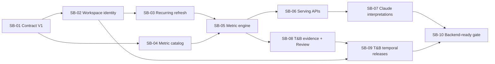

# 32 · Signal Backend Execution Roadmap

> **Estado:** plan de ejecución canónico, 2026-07-21.
> **Objetivo:** dejar el backend de Signal V2 listo y probado antes de comenzar el
> rediseño de frontend.
> **Rama de integración:** `codex/noisia-data-os-cut-1-wip`.

Este documento convierte el North Star de Signal en tareas secuenciales y acotadas. Cada
tarea está diseñada para ejecutarse de inicio a fin en una tarea nueva de Codex, con
contexto pequeño, un commit temático y un handoff verificable.

La especificación de producto autoritativa permanece en
`31_SIGNAL_PRODUCT_NORTH_STAR.md`. Este archivo gobierna **cómo desarrollar** esa visión.

## Resultado Esperado

Antes de diseñar Signal V2, el backend debe poder demostrar con un workspace real:

- una identidad estable de Signal que no dependa de un `outputId`;
- ingesta recurrente con frescura, watermarks e invalidación;
- filtros consistentes sobre métricas, charts y menciones;
- metric groups determinísticos calculados por Postgres;
- drill-down desde cualquier agregado a sus menciones o registros;
- interpretaciones Claude versionadas y compatibles con su periodo/filtros;
- T&B periódico, revisable, comparable y ligado a evidencia;
- operational intelligence y strategic releases bajo la misma Signal home;
- contratos API, authZ, fixtures, performance y shadow QA listos para frontend.

## Estado De Partida

| Base | Estado | Referencia |
|---|---|---|
| Data OS Cut 1 | Implementado local; staging pendiente | ADR 007 y docs 22-26 |
| T&B relational serving | Implementado | commit subject `Implement T&B relational serving layer` |
| Analysis Artifact/Evidence Graph | Implementado | ADR 008 / commit subject `Add analysis artifact evidence graph` |
| Signal Product North Star | Documentado | ADR 009 / commit `21c448e` |
| Backend Signal V2 | Pendiente | Este roadmap |

La rama sigue siendo WIP. Nada en este roadmap autoriza una PR a `main`, activación
cliente-visible, migración destructiva o uso de credenciales de producción.

## Protocolo Para Cada Tarea Nueva

Cada nueva tarea de Codex debe:

1. Leer `AGENTS.md` completo y cualquier `AGENTS.md` anidado en las rutas que vaya a
   tocar.
2. Leer `31_SIGNAL_PRODUCT_NORTH_STAR.md`, este roadmap y la sección de su tarea.
3. Confirmar que está en `codex/noisia-data-os-cut-1-wip`, sincronizada con origin y con
   worktree limpio. Si existen cambios ajenos, preservarlos y detenerse si se traslapan.
4. Ejecutar **solamente una tarea** de este roadmap.
5. Mantener migraciones aditivas y preservar `published_outputs.payload` y las rutas
   legacy.
6. No editar páginas, componentes o estilos de Signal V2. El frontend se hará después.
7. Aplicar authZ server-side en toda ruta nueva; Kinde autentica, la DB autoriza.
8. No invocar Claude sin budget cap, registro de costo y fallback.
9. Actualizar contratos, tests y este roadmap cuando cambie una decisión.
10. Ejecutar los gates de la tarea, hacer un commit temático y respaldarlo en la rama
    WIP. No abrir PR a producción.

### Regla De Concurrencia

Ejecutar las tareas **en secuencia**, no en paralelo, salvo que se creen worktrees
aislados y la tarea anterior no toque contratos/schema compartidos. La ruta recomendada
es un solo task activo sobre la rama WIP; al terminar y hacer push, se abre el siguiente.

### Handoff Obligatorio

El cierre de cada tarea debe reportar:

- resultado funcional;
- commit y rama;
- migraciones y backfills agregados;
- gates ejecutados y conteos;
- checks no ejecutados y razón;
- compatibilidad/fallback preservados;
- riesgo o deuda conocida;
- tarea siguiente habilitada.

## Priorización

| Prioridad | Tareas | Propósito | ¿Bloquea frontend? |
|---|---|---|---:|
| **P0 · Fundamento** | SB-01 a SB-03 | Identidad, contrato, recurrencia y verdad temporal | Sí |
| **P1 · Social Listening vivo** | SB-04 a SB-06 | Métricas, materialización, filtros, APIs y drill-down | Sí |
| **P2 · Inteligencia interpretada/estratégica** | SB-07 a SB-09 | Claude versionado, T&B revisable y releases comparables | Sí |
| **P3 · Front-ready** | SB-10 | Integración, backfill, performance y shadow QA | Gate final |

No comenzar por Claude ni por T&B temporal antes de P0/P1. Una interpretación sofisticada
sobre métricas o filtros inestables solo crea deuda y texto incompatible con la data.

## Dependencias



## Registro De Tareas

| ID | Nombre | Prioridad | Tamaño relativo | Dependencias | Estado inicial |
|---|---|---:|---:|---|---|
| SB-01 | Signal Backend Contract V1 | P0 | M | North Star | Completo (2026-07-21) |
| SB-02 | Signal Workspace Identity | P0 | L | SB-01 | Completo (2026-07-22) |
| SB-03 | Recurring Ingestion, Watermarks and Invalidation | P0 | L | SB-02 | Completo (2026-07-22) |
| SB-04 | Social Listening Metric Catalog V1 | P1 | M | SB-01 | Completo (2026-07-22) |
| SB-05 | Deterministic Metric Materialization Engine | P1 | XL | SB-03, SB-04 | Completo (2026-07-22) |
| SB-06 | Signal Workspace Serving APIs and Drill-down | P1 | L | SB-05 | Completo (2026-07-22) |
| SB-07 | Versioned Claude Metric Interpretations | P2 | XL | SB-06 | Completo local (2026-07-22) |
| SB-08 | T&B Structured Evidence and Artifact Review | P2 | XL | SB-05 | Pendiente / habilitada (2026-07-22) |
| SB-09 | T&B Temporal Comparison and Strategic Releases | P2 | L | SB-02, SB-08 | Pendiente |
| SB-10 | Signal Backend Integration and Front-ready Gate | P3 | XL | SB-07, SB-09 | Pendiente |

El tamaño es relativo, no una estimación de calendario. Cada tarea se divide internamente
en commits solo si supera un cambio coherente revisable; nunca se mezcla con la tarea
siguiente.

---

## SB-01 · Signal Backend Contract V1

### Objetivo

Congelar el lenguaje compartido que usarán Studio, workers, métricas y APIs antes de
crear más tablas o endpoints.

### Alcance

- Crear el contrato técnico `signal-backend-v1` en un paquete compartido, preferentemente
  `@noisia/query-engine`, para evitar imports desde `apps/studio` hacia workers.
- Definir tipos y validadores para:
  - identidad/locator de Signal workspace;
  - `SignalFilterV1`;
  - granularidad y rango temporal;
  - dimensiones y valores multiselect;
  - filtro normalizado y `filters_hash` estable;
  - `DataWatermark` y estados de freshness;
  - metric query, breakdown, series y drill-down cursor;
  - errores `invalid_filter`, `unsupported_dimension`, `stale`, `partial` y
    `not_available`.
- Canonicalizar timezone, fechas, arrays ordenados, vacíos y aliases antes de hashear.
- Rechazar dimensiones desconocidas, rangos inválidos y combinaciones incompatibles.
- Documentar request/response en `08_API_CONTRACTS.md` o en un nuevo contrato enlazado.
- Agregar tests determinísticos: filtros equivalentes deben producir el mismo hash;
  filtros distintos, un hash distinto.

### Fuera De Alcance

- Migraciones y tablas de workspace.
- Consultas SQL de métricas.
- Endpoints o UI.

### Gates

```bash
corepack pnpm --filter @noisia/query-engine typecheck
corepack pnpm --filter @noisia/query-engine test
corepack pnpm --filter @noisia/types typecheck  # solo si se toca
corepack pnpm data-os:verify
git diff --check
```

### Criterio De Salida

Studio y workers pueden importar un único contrato y los tests prueban que el alcance de
una métrica o interpretación es identificable sin depender de orden de query params.

### Estado / Handoff

**Completo, 2026-07-21.** `@noisia/query-engine` exporta `signal-backend-v1` con
identidad/locator, filtro canónico, hash SHA-256 estable, watermarks, freshness de data e
interpretación separadas, metric query, series, breakdowns, cursor de drill-down y
errores tipados. Los contract tests cubren equivalencia semántica, diferencias de scope,
orden de arrays/query params, aliases, rangos/combinaciones inválidas y consumo desde la
superficie pública del paquete. No se agregaron migraciones, backfills, SQL, endpoints,
Claude ni frontend; legacy `outputId` permanece intacto.

**Siguiente tarea habilitada:** SB-02 · Signal Workspace Identity puede partir de este
contrato para persistence y resolver authZ. SB-02 sigue pendiente y no fue iniciada en
este cambio.

### Commit Sugerido

`Define Signal backend contract v1`

### Prompt Para Tarea Nueva

> Ejecuta SB-01 de `docs/product/32_SIGNAL_BACKEND_EXECUTION_ROADMAP.md` de inicio a
> fin. Trabaja únicamente el contrato compartido Signal Backend V1; no implementes DB,
> endpoints ni frontend. Lee AGENTS y el North Star, agrega tests, corre los gates,
> actualiza el roadmap, haz commit y push a la rama WIP. No abras PR a main.

---

## SB-02 · Signal Workspace Identity

### Objetivo

Crear la identidad estable que representa el Signal permanente de una marca o tema y
dejar de usar un output como raíz conceptual.

### Alcance

- Agregar una migración forward-only con:
  - `signal_workspaces` con organización, brand/theme exactamente uno, slug estable,
    timezone, status y metadata;
  - membresía entre workspace y `study_corpora`, con role operacional/estratégico/legacy
    y vigencia;
  - constraints e índices de subject, slug y corpus activo.
- Mantener `study_corpora` como unidad metodológica durante la transición.
- Implementar resolver interno por workspace id/slug con ownership y brand access.
- Crear backfill dry-run/apply, idempotente y protegido para workspaces existentes desde
  brands/themes, corpora y outputs.
- No enlazar un corpus de otra organización aunque el UUID exista.
- Probar usuarios internos, cliente autorizado, cliente de otra marca y workspace
  inexistente.
- Mantener `/signal/{outputId}` intacto y documentar su mapping transitorio.

### Gates

```bash
corepack pnpm --filter @noisia/db typecheck
corepack pnpm --filter @noisia/db test
corepack pnpm --filter @noisia/studio typecheck
corepack pnpm --filter @noisia/studio test
corepack pnpm --filter @noisia/studio build
corepack pnpm data-os:verify
git diff --check
```

Si no existe Postgres local, registrar que la migración no fue aplicada; no fingir
evidencia runtime.

### Criterio De Salida

Un servicio autenticado puede resolver un Signal workspace, su sujeto y sus corpora sin
consultar primero un `published_output`.

### Estado / Handoff

**Completo, 2026-07-22.** La migración `0047_signal_workspace_identity` agrega
`signal_workspaces` y membresías temporales `signal_workspace_corpora`, con sujetos,
slugs, roles, vigencia, constraints, índices y triggers que impiden cruces de sujeto u
organización. Studio resuelve por ID o slug aplicando rol interno, ownership de
organización y acceso activo de marca; denegado e inexistente no filtran existencia.
El backfill es idempotente, dry-run por default, protegido para targets remotos y sólo
reporta conteos. El mapping transitorio desde `outputId` está documentado y las rutas
legacy no fueron modificadas.

Gates estáticos y build verdes. La migración no se aplicó en runtime: `DATABASE_URL` no
estaba disponible en shell y el daemon local de Docker estaba apagado. No se usó un
target remoto ni se inventó evidencia de ejecución.

**Siguiente tarea habilitada:** SB-03 · Recurring Ingestion, Watermarks and Invalidation
puede ligar políticas y watermarks a esta identidad estable. No se inició SB-03 en este
checkpoint.

### Commit Sugerido

`Add Signal workspace identity`

### Prompt Para Tarea Nueva

> Ejecuta SB-02 de `docs/product/32_SIGNAL_BACKEND_EXECUTION_ROADMAP.md` de inicio a
> fin, partiendo del checkpoint SB-01. Implementa schema aditivo, resolver autorizado,
> backfill protegido y tests. Conserva rutas/output legacy, no hagas frontend ni
> producción. Corre gates, actualiza el roadmap, commit y push a la rama WIP.

---

## SB-03 · Recurring Ingestion, Watermarks and Invalidation

### Objetivo

Convertir las cargas actuales en un ciclo operable daily/weekly/monthly que propaga
frescura e invalida downstream sin ejecutar Claude.

### Alcance

- Modelar políticas de refresh por source/workspace: cadencia, timezone, enabled,
  expected next run y owner.
- Persistir watermarks por workspace/corpus/source con:
  - corpus revision;
  - último sync/import aceptado;
  - máxima fecha de mención/observación;
  - materialized_at y freshness state.
- Registrar refresh runs idempotentes con status, attempt y error seguro.
- Implementar scheduler BullMQ y jobs con lock/dedupe; evitar jobs repetidos por deploy.
- Hacer que CSV upload y sync exitoso actualicen watermark y emitan invalidación.
- Invalidar solo materializaciones e interpretaciones que dependan de data nueva.
- Separar source freshness, data freshness e interpretation freshness.
- Incluir retries, dead-letter/failed state, observabilidad y safe defaults apagados.
- La integración API completa de SentiOne puede quedar detrás del adapter; el contrato
  recurrente debe funcionar ya con imports manuales.

### Gates

```bash
corepack pnpm --filter @noisia/db typecheck
corepack pnpm --filter @noisia/db test
corepack pnpm --filter @noisia/workers typecheck
corepack pnpm --filter @noisia/workers test
corepack pnpm --filter @noisia/studio typecheck
corepack pnpm --filter @noisia/studio test
corepack pnpm data-os:verify
git diff --check
```

### Criterio De Salida

Una carga nueva cambia el watermark exactamente una vez, encola invalidaciones
idempotentes y no dispara LLM ni reescribe releases estratégicos.

### Estado / Handoff

**Completo, 2026-07-22.** La migración `0048_signal_recurring_refresh` agrega policies
apagadas por default, watermarks por workspace/corpus/source, refresh runs,
invalidaciones selectivas e interpretation freshness separada. La función transaccional
`record_signal_data_acceptance` valida ownership del evento, avanza cada watermark una
sola vez y emite una invalidación idempotente. CSV síncrono/asíncrono y syncs exitosos de
performance/knowledge ya usan ese writer compartido.

El scheduler BullMQ requiere dos flags explícitos, usa tick/job IDs estables, locks,
dedupe, retries y dead-letter. El adapter recurrente consume imports y sync runs
existentes; el pull API automático de SentiOne queda pendiente. La invalidación traslapa
periodos y dependencias declaradas, sin tocar strategic releases, payloads ni Claude.

Gates estáticos verdes. La migración no se aplicó en runtime porque no hubo
`DATABASE_URL` local y el daemon de Docker siguió apagado; no se usó un target remoto.

**Siguiente tarea habilitada:** SB-04 · Social Listening Metric Catalog V1. SB-04 puede
registrar definiciones canónicas mientras SB-03 aporta la identidad temporal que SB-05
usará para materializar. No se inició SB-04 en este checkpoint.

### Commit Sugerido

`Add recurring Signal data refresh`

### Prompt Para Tarea Nueva

> Ejecuta SB-03 del roadmap Signal Backend de inicio a fin. Implementa políticas de
> refresh, watermarks, jobs BullMQ idempotentes e invalidación downstream, inicialmente
> compatible con CSV/imports existentes. No ejecutes Claude ni construyas UI. Sigue los
> guardrails de workers, agrega tests, gates, handoff, commit y push WIP.

---

## SB-04 · Social Listening Metric Catalog V1

### Objetivo

Fijar qué números existen, cómo se calculan, qué denominador usan y bajo qué dimensiones
pueden consultarse antes de escribir el motor SQL.

### Alcance

- Elegir y documentar un registry canónico reutilizando `metric_definitions` y
  `semantic_models`; evitar un segundo catálogo paralelo sin ADR.
- Definir los metric groups obligatorios V1:
  1. conversation volume and velocity;
  2. sentiment and emotion;
  3. platform and source mix;
  4. engagement;
  5. topics, narratives and governed entities.
- Dejar campaign/event impact como condicional a disponibilidad y T&B movement para
  SB-09.
- Para cada métrica especificar key, versión, descripción, fórmula, unidad, denominador,
  grain, dimensiones, null semantics, comparabilidad, quality rules y drill-down
  subject.
- Sembrar definiciones idempotentes y validar que no cambien fórmula sin nueva versión.
- Definir dimensión y valor visibles al cliente vs. internos.
- Agregar contract tests para catálogo, duplicados, units, denominators y dimensiones.

### Gates

```bash
corepack pnpm --filter @noisia/query-engine typecheck
corepack pnpm --filter @noisia/query-engine test
corepack pnpm --filter @noisia/db typecheck
corepack pnpm --filter @noisia/db test
corepack pnpm data-os:verify
git diff --check
```

### Criterio De Salida

Cada métrica V1 tiene definición inequívoca y ningún chart futuro necesita inventar una
fórmula o denominador en el frontend.

### Estado / Handoff

**Completo, 2026-07-22.** `@noisia/query-engine` exporta el catálogo canónico V1 con
cinco groups y once métricas versionadas. Cada definición fija fórmula + hash, unit,
denominador, grains, dimensiones/visibilidad, null semantics, comparabilidad, quality
rules y drill-down subject. Los contract tests cubren groups requeridos, duplicados,
versiones, units, denominadores, dimensiones y mutación de fórmula.

La migración `0049_signal_metric_catalog_v1` extiende el `metric_definitions` existente,
preserva `semantic_models` como grouping layer y rechaza cambios de fórmula sin nueva
versión. El seed `db:seed:signal-metrics` consume el catálogo compartido, es idempotente
y conserva los guardrails de target. Los writers Data OS existentes se adaptaron a
`(metric_key, version)`. No se materializaron métricas ni se agregó frontend/API.

Gates estáticos verdes. La migración y el seed no se ejecutaron contra Postgres por la
misma ausencia de DB local; no se usó un target remoto.

**Siguiente tarea habilitada:** SB-05 · Deterministic Metric Materialization Engine,
ahora con identidad, watermarks/invalidaciones y catálogo versionado disponibles. No se
inició SB-05 en este checkpoint.

### Commit Sugerido

`Define Signal metric catalog v1`

### Prompt Para Tarea Nueva

> Ejecuta SB-04 del roadmap Signal Backend. Define y siembra el catálogo V1 de metric
> groups con fórmulas, denominadores, dimensiones, null semantics y tests. Reutiliza el
> semantic layer actual, no materialices aún métricas ni hagas UI. Corre gates, actualiza
> el roadmap, commit y push WIP.

---

## SB-05 · Deterministic Metric Materialization Engine

### Objetivo

Calcular los metric groups V1 desde Postgres con filtros, periodos, denominadores,
watermarks y drill-down reproducibles.

### Alcance

- Implementar un query planner/predicate builder a partir de `SignalFilterV1`.
- Materializar series diarias, semanales y mensuales de los cinco grupos V1.
- Persistir definición/version, periodo, filtros hash, payload tipado, denominadores,
  sample size, quality, watermark, computed_at y stale_after.
- Soportar default y combinaciones canónicas precomputadas; consultas ad hoc pueden usar
  cache, nunca crear explosión combinatoria silenciosa.
- Usar `unknown`, `not_available`, `partial` y `stale`; nunca convertir faltantes en cero.
- Construir el mismo predicate para agregado y drill-down.
- Proyectar a `chart_aggregates` solo como compatibilidad, no como source of truth.
- Invalidar/recalcular incrementalmente desde SB-03.
- Agregar índices y revisar `EXPLAIN` con un fixture representativo.
- No invocar Claude.

### Gates

```bash
corepack pnpm --filter @noisia/db typecheck
corepack pnpm --filter @noisia/db test
corepack pnpm --filter @noisia/query-engine typecheck
corepack pnpm --filter @noisia/query-engine test
corepack pnpm --filter @noisia/workers typecheck
corepack pnpm --filter @noisia/workers test
corepack pnpm data-os:verify
git diff --check
```

Aplicar migration/smoke en Postgres local si está disponible. Si no, dejar el comando y
el blocker exacto para el siguiente operador.

### Criterio De Salida

Para filtros iguales, agregado y menciones constituyentes reconcilian; la misma data y
definición producen los mismos valores sin Claude ni payload publicado.

### Estado / Handoff

**Completo, 2026-07-22.** `signal-materialization-v1` aporta el único predicate builder
parameterizado para agregado y drill-down, límites de rango/cardinalidad, cache scope y
planes SQL diarios, semanales y mensuales para las once métricas de los cinco groups.
Los fixtures reconciliados prueban que agregado, breakdown y registros constituyentes
usan el mismo filtro y que faltantes permanecen `null`/`not_available`.

La migración `0050_signal_metric_materializations_v1` extiende la tabla canónica con
workspace, definición/version, periodos, filtro normalizado/hash, payload tipado,
value/denominator/sample size, quality, watermark/hash, freshness state y TTL de cache.
Incluye índices de series/freshness/periodo, identidad SHA-256 idempotente y un índice
parcial de mentions. `chart_aggregates` permanece sólo como adaptador legacy.

Las invalidaciones de SB-03 ahora marcan `stale` únicamente periodos traslapados y
encolan un job deduplicado. El worker, todavía cerrado por los flags seguros de Data OS,
usa advisory lock, combina watermarks, precomputa como máximo ocho filtros canónicos,
parte ventanas operativas largas e incluye un camino ad hoc limitado a cinco métricas
con TTL de 15 minutos. No lee `published_outputs.payload` ni invoca Claude.

Gates estáticos verdes. No se aplicó `0050` ni se ejecutó
`signal:materialization:explain` porque no hay `DATABASE_URL` local y el daemon Docker no
está disponible. El comando protegido quedó listo; no se usó un target remoto ni se
inventó evidencia runtime.

**Siguiente tarea habilitada:** SB-06 · Signal Workspace Serving APIs and Drill-down.
No se inició frontend, interpretación ni ninguna SB posterior.

### Commit Sugerido

`Materialize Signal metric groups`

### Prompt Para Tarea Nueva

> Ejecuta SB-05 del roadmap Signal Backend de inicio a fin. Implementa el motor SQL
> determinístico y materialización de los cinco metric groups V1 usando el contrato de
> filtros y watermarks existentes. Incluye denominadores, drill-down consistente,
> índices, tests y compatibilidad legacy. No uses Claude ni frontend. Gates, handoff,
> commit y push WIP.

---

## SB-06 · Signal Workspace Serving APIs and Drill-down

### Objetivo

Exponer el backend vivo bajo la identidad estable de Signal con contratos suficientes
para probarlo sin frontend.

### Alcance

- Crear rutas workspace-centric detrás de flags seguros para:
  - bootstrap/context;
  - facets disponibles;
  - metric groups y freshness;
  - series y breakdowns;
  - comparación de periodos;
  - menciones/registros constituyentes;
  - lineage básico.
- Usar como base `/api/data-os/signal/[workspaceId]/*`; no reutilizar
  `/api/signal/[outputId]/*` con una semántica distinta.
- Usar exclusivamente `SignalFilterV1` y el resolver authZ de SB-02.
- Implementar paginación/cursor, rangos máximos, cardinality limits, cache headers y
  errores tipados.
- Garantizar que facets respetan permisos y el filtro actual.
- No exponer raw metadata, fuentes internas o quality details sin visibilidad explícita.
- Mantener rutas `/api/data-os/pulse/:outputId/*` como adaptador/fallback.
- Actualizar OpenAPI/API contracts y crear fixtures de respuesta para frontend futuro.
- Agregar contract, authZ negative y integration tests.

### Gates

```bash
corepack pnpm --filter @noisia/studio typecheck
corepack pnpm --filter @noisia/studio test
corepack pnpm --filter @noisia/studio build
corepack pnpm --filter @noisia/db test
corepack pnpm data-os:verify
git diff --check
```

### Criterio De Salida

Con curl/tests se puede explorar un Signal, cambiar filtros, obtener métricas y abrir
drill-down sin leer `published_outputs.payload` ni renderizar una página.

### Estado / Handoff

**Completo, 2026-07-22.** Se agregaron ocho rutas protegidas bajo
`/api/data-os/signal/[workspaceId]`: bootstrap, facets, metric groups, series,
breakdowns, comparison, mentions y lineage. Todas resuelven la identidad/authZ de
SB-02, seleccionan el corpus operational vigente (legacy sólo como fallback), usan
`SignalFilterV1` y conservan errores, cursor, watermark y freshness de
`signal-backend-v1`.

`signal-workspace-serving.ts` lee exclusivamente stores relacionales vivos; el módulo
legacy `signal-serving.ts`, `/signal/{outputId}` y `/api/data-os/pulse/:outputId/*`
permanecen intactos. Cliente no recibe raw metadata, source type/provider/sync IDs ni
quality details internos. Facets se calculan bajo el filtro y authZ actuales. ETags son
privados y stale/partial no se cachea silenciosamente.

La API está cerrada por `NOISIA_SIGNAL_WORKSPACE_API_ENABLED=false`. El materializador
ad hoc tiene switch independiente, límites/TTL de SB-05 y respuesta 202 pending. Se
actualizaron contratos, OpenAPI y fixtures TypeScript de series, breakdown y
drill-down. Contract/source tests demuestran filtro normalizado, authZ negativa,
respuesta tipada y ausencia de lecturas a `published_outputs.payload`.

Gates Studio, DB, build, Data OS y diff verdes. No hubo runtime API contra Postgres
porque `DATABASE_URL` local sigue ausente y Docker no está disponible; no se usó target
remoto ni se inventó evidencia. No se activó ninguna flag.

**Siguiente fase requerida:** hardening post-SB-06. SB-07 tiene sus dependencias
arquitectónicas, pero no está habilitada para iniciar hasta cerrar el gate documentado
abajo. No se ejecutó Claude ni se creó interpretación alguna.

### Commit Sugerido

`Add Signal workspace serving APIs`

### Prompt Para Tarea Nueva

> Ejecuta SB-06 del roadmap Signal Backend. Construye APIs workspace-centric, facets,
> métricas, series, breakdowns y drill-down con authZ y contratos V1. Conserva rutas
> legacy y no implementes páginas/componentes. Incluye OpenAPI, fixtures, tests, build,
> handoff, commit y push WIP.

---

## Gate De Hardening Post-SB-06 · Conversation Following

### Auditoría Condicionada Del Checkpoint

**Aprobación condicionada, 2026-07-22, checkpoint `b656626`.** SB-02→SB-06 forman un
buen checkpoint WIP para funcionalidades de social listening y seguimiento continuo
de conversaciones. La arquitectura se conserva; no se debe desechar ni reescribir el
trabajo. Antes de comenzar SB-07 se requiere una fase de hardening que cierre los seis
hallazgos siguientes.

Gates observados en el checkpoint:

- rama limpia y sincronizada con
  `origin/codex/noisia-data-os-cut-1-wip`;
- DB: typecheck y 50 tests verdes;
- Query Engine: typecheck y 166 tests verdes;
- Workers: typecheck y 121 tests verdes;
- Studio: typecheck, 236 tests y build verdes;
- lint general y `data-os:verify` verdes.

No existe `DATABASE_URL` local y Docker no está disponible. Por eso las migraciones
0047–0050, workers, scheduler y APIs todavía no tienen comprobación runtime contra un
Postgres real. `data-os:verify` lo reporta correctamente como
`database.skipped: true`; este checkpoint no constituye evidencia runtime ni de
staging.

### Hallazgos Bloqueantes Para SB-07

1. **P1 · El scheduler puede perder una corrida.** Actualmente
   `expected_next_run` avanza antes de confirmar que BullMQ aceptó el job. Un fallo de
   Redis puede hacer desaparecer esa ocurrencia.
   Ver [signal-refresh.ts](../../services/workers/src/workers/signal-refresh.ts#L38).
   El hardening debe persistir el avance sólo después del enqueue confirmado o usar un
   mecanismo durable equivalente, con test explícito de fallo de Redis.
2. **P1 · La cadencia no gobierna realmente la frescura.** Las políticas daily,
   weekly y monthly se persisten, pero `stale_after` usa un fallback fijo de 24 horas y
   el watermark puede seguir figurando `fresh`.
   Ver [signal-materialization.ts](../../services/workers/src/workers/signal-materialization.ts#L103).
   `stale_after`, source freshness y data freshness deben derivarse de la policy y su
   siguiente corrida esperada, con casos daily/weekly/monthly.
3. **P1 · `conversation.velocity` no incluye el periodo anterior al rango.** El
   primer punto queda `not_available` aunque exista el bucket precedente. La
   invalidación incremental tampoco declara esa dependencia.
   Ver [signal-materialization-v1.ts](../../packages/query-engine/src/signal-materialization-v1.ts#L457).
   El planner debe incorporar un lookback de un bucket comparable y la invalidación
   debe recalcular el bucket dependiente.
4. **P1 · Las quality rules del catálogo no se ejecutan completamente.** Tags
   `unreviewed` pueden contar como gobernados porque sólo se excluyen los `rejected`, y
   el resultado puede persistirse como `pass/fresh`.
   Ver [signal-materialization-v1.ts](../../packages/query-engine/src/signal-materialization-v1.ts#L437).
   El motor debe evaluar las reglas versionadas y degradar o bloquear evidencia no
   gobernada; un estado no revisado nunca debe publicarse silenciosamente como
   `pass/fresh`.
5. **P1 · El backfill puede dejar varios corpora operacionales activos.** Serving
   elige uno por `valid_from`, pero el backfill puede crear varios con el mismo
   instante, produciendo selección arbitraria.
   Ver [backfill-signal-workspaces.ts](../../apps/studio/scripts/backfill-signal-workspaces.ts#L135).
   El backfill y el schema deben garantizar una selección determinística y exactamente
   un corpus `operational` activo por workspace, conservando idempotencia y scope de
   organización.
6. **P2 · Metric groups siempre anuncia cache `fresh`.** La ruta puede cachear
   respuestas con métricas `stale`, `partial` o `not_available` usando política de
   respuesta fresca.
   Ver [metric-groups/route.ts](../../apps/studio/src/app/api/data-os/signal/%5BworkspaceId%5D/metric-groups/route.ts#L23).
   El estado HTTP/cache debe derivarse del peor estado visible del response y usar
   `private, no-cache` para cualquier resultado degradado.

### Criterio De Salida Del Hardening

- Los seis hallazgos tienen tests de regresión y sus gates de paquete están verdes.
- Los gates finales de SB-02→SB-06 vuelven a pasar sin cambiar rutas legacy, frontend,
  Claude ni flags cliente-visibles.
- Si sigue sin existir Postgres local, el handoff conserva explícitamente el runtime
  DB como pendiente; no inventa evidencia. Antes de activación interna o cliente-visible
  sí se requiere aplicar 0047–0050 y ejecutar scheduler, materialización y serving
  smoke contra Postgres no productivo.
- Sólo después de este cierre SB-07 cambia de `Bloqueada` a `Pendiente/habilitada`.
  El orden posterior permanece SB-07→SB-10.

### Estado / Handoff Del Hardening

**Completo local, 2026-07-22.** La migración aditiva
`0051_signal_backend_foundation_hardening` convierte `signal_refresh_runs` en outbox
Postgres reconciliable: cada ocurrencia se persiste antes de `queue.add`,
`expected_next_run` sólo avanza después de confirmación de BullMQ y una falla de Redis
queda `failed/enqueue_failed` recuperable con el mismo idempotency key. El tick también
reconcilia runs `queued/failed` tras deploy.

Freshness usa tolerancias explícitas por cadencia (`hourly=15m`, `daily=6h`,
`weekly=24h`, `monthly=72h`, `manual` sin deadline automático) sobre el
`expected_next_run` calculado en timezone local. Source, data y materialization
freshness se evalúan por separado; aceptación nueva recupera el watermark y el
materializador dejó de inventar un TTL fijo de 24 horas.

`conversation.velocity` incluye el bucket inmediatamente anterior aunque quede fuera
del rango visible, genera buckets contiguos y declara su dependencia durante
invalidación. Serving nunca promedia esos ratios no aditivos. El motor ejecuta los
quality rules V1 y sólo acepta tags `approved`; `unreviewed/pending` queda excluido de
evidencia aceptada y degrada la fila a `partial` con razón.

El backfill ordena corpora Signal Pulse por publicación/revisión de corpus, cierra el
operational anterior y el schema impone un único operational activo por workspace.
Serving falla cerrado ante datos históricos ambiguos. Bootstrap y metric groups derivan
cache del peor estado visible; `stale`, `partial`, `pending` y `not_available` usan
`private, no-cache`.

Gates locales de DB, Query Engine, Workers y Studio, build y `data-os:verify` quedaron
verdes; los tests de regresión incluyen fallo de `queue.add`, transición/recovery de
freshness, lookback de velocity, review pending, dos corpora operacionales y cache
degradado. `git diff 0961c66..HEAD --check` quedó limpio.

**Evidencia runtime pendiente:** no existe `DATABASE_URL` local, no hay `psql` y el
daemon Docker no está disponible. Por ello 0047–0051 y el fixture SQL de reconciliación
siguen pendientes de ejecución contra Postgres disposable o staging/preview aprobado.
No se usó target remoto ni se inventó evidencia.

**Siguiente tarea habilitada:** SB-07 · Versioned Claude Metric Interpretations.

### Prompt Para La Siguiente Tarea

> Ejecuta únicamente el hardening post-SB-06 de Conversation Following. Corrige los
> seis hallazgos P1/P2 documentados, agrega tests de regresión y repite los gates de
> DB, Query Engine, Workers, Studio, build y Data OS. No inicies SB-07 ni ejecutes
> Claude. Conserva rutas legacy, flags apagadas y reporta cualquier smoke de Postgres
> que siga pendiente.

---

## SB-07 · Versioned Claude Metric Interpretations

### Objetivo

Interpretar cada metric group sin convertir Claude en calculadora, base de datos o
request síncrono del dashboard.

### Alcance

- Crear `metric_interpretation_runs`, `metric_interpretations` y
  `metric_interpretation_evidence` (o nombres equivalentes documentados) con workspace,
  corpus, metric group/version, period, filters hash, watermark, prompt/model version,
  facts, hypotheses, evidence refs, cost y status.
- Mantener estas tablas separadas de `analysis_artifacts`; no debilitar el constraint
  actual que exige un analysis owner. Una unificación futura requiere otro ADR.
- Construir metric packets únicamente desde SB-05.
- Implementar worker asíncrono, idempotency key, timeout, retries, budget cap y registro
  de costo.
- Validar JSON/schema, números citados, alcance, evidencia y lenguaje de incertidumbre.
- Persistir fallback determinístico y motivos de `skipped`/`failed`.
- Marcar stale cuando cambie watermark, definición o filtro.
- Nunca correr Claude en page view ni para cada combinación arbitraria.
- Política inicial recomendada:
  - descriptivo de bajo riesgo puede auto-publicarse después de gates;
  - causalidad, recomendación o estrategia queda `needs_review`.
- Exponer interpretación compatible, pending, stale o unavailable desde serving.

### Gates

```bash
corepack pnpm --filter @noisia/db typecheck
corepack pnpm --filter @noisia/db test
corepack pnpm --filter @noisia/workers typecheck
corepack pnpm --filter @noisia/workers test
corepack pnpm --filter @noisia/studio typecheck
corepack pnpm --filter @noisia/studio test
corepack pnpm data-os:verify
git diff --check
```

No ejecutar un run real pagado sin presupuesto y autorización explícita. Tests/fakes son
el default.

### Criterio De Salida

Cada metric group puede devolver una interpretación cuya data scope es verificable; un
filtro o watermark incompatible nunca reutiliza texto como si fuera vigente.

### Commit Sugerido

`Persist Signal metric interpretations`

### Estado / Handoff SB-07

**Completo local, 2026-07-22.** `signal-interpretation-v1` define packets canónicos
desde SB-05, identidad idempotente por filter/watermark/prompt/model, refs numéricas
exactas y separación obligatoria entre facts, hypotheses, causal claims y
recommendations. La migración `0052_signal_metric_interpretations_v1` agrega runs,
interpretations y evidence sin modificar `analysis_artifacts`.

El worker Data OS es asíncrono, tiene timeout de 45 segundos, tres intentos, cap de
presupuesto, costo persistido y fallback determinístico. Los dos switches LLM nacen
apagados y el budget default es cero; los tests usan un fake y no hubo llamada ni gasto
Anthropic. Serving expone `/interpretations`, agrega freshness a bootstrap/metric
groups y filtra `needs_review` para clientes. OpenAPI y contratos quedaron actualizados.

**Evidencia runtime pendiente:** `0052` no se aplicó por ausencia de Postgres local/
Docker operativo y no se usó un target remoto. Esta limitación se conserva para el
gate final SB-10.

**Siguiente tarea habilitada:** SB-08 · T&B Structured Evidence and Artifact Review.

### Prompt Para Tarea Nueva

> Ejecuta SB-07 del roadmap Signal Backend. Implementa persistence y workers de
> interpretaciones Claude por metric group con scope, watermark, evidencia, staleness,
> budget y fallback. Usa fakes salvo autorización de gasto; no hagas UI. Actualiza
> serving/contracts, tests, gates, handoff, commit y push WIP.

---

## SB-08 · T&B Structured Evidence and Artifact Review

### Objetivo

Completar el vínculo claim/finding → observación/fila/archivo y permitir Review real por
artefacto antes de una publicación estratégica.

### Alcance

- Incluir tokens/IDs gobernados de `data_asset_records` y `data_observations` en el
  contexto RAG de T&B.
- Extender schemas/prompts para que Claude devuelva refs explícitos por finding; refs
  desconocidos deben fallar o quedar contextual, nunca claim-specific.
- Persistir evidence links exactos y lineage hasta asset/source/import.
- Mantener las citas exactas finding → mention ya existentes.
- Implementar operaciones Review por artefacto:
  - accept;
  - correct con nueva revision;
  - limit con notas/alcance;
  - reject.
- Registrar reviewer, patch, notas y timestamp.
- Evitar mutación in-place de artifacts publicados; reforzar la inmutabilidad en DB o en
  un writer central con tests de bypass.
- Actualizar readiness para cobertura de evidencia estructurada y estados editoriales.
- No rediseñar la pantalla Review; solo backend/API mínima verificable.

### Gates

```bash
corepack pnpm --filter @noisia/db typecheck
corepack pnpm --filter @noisia/db test
corepack pnpm --filter @noisia/workers typecheck
corepack pnpm --filter @noisia/workers test
corepack pnpm --filter @noisia/studio typecheck
corepack pnpm --filter @noisia/studio test
corepack pnpm --filter @noisia/studio build
corepack pnpm data-os:verify
git diff --check
```

### Criterio De Salida

Un finding puede abrir menciones y evidencia estructurada exacta, y una corrección
editorial crea una nueva revisión sin reescribir la publicación anterior.

### Commit Sugerido

`Complete T&B evidence review`

### Prompt Para Tarea Nueva

> Ejecuta SB-08 del roadmap Signal Backend. Completa refs explícitos de records/
> observations por finding y operaciones backend de Review por artefacto con revisiones
> inmutables. No diseñes UI. Conserva menciones y fallbacks, agrega readiness, tests,
> build, handoff, commit y push WIP.

---

## SB-09 · T&B Temporal Comparison and Strategic Releases

### Objetivo

Hacer que T&B corra cada X tiempo, sea comparable y aparezca como strategic release
dentro del mismo Signal workspace.

### Alcance

- Hacer explícitos period window, corpus revision, snapshot y metodología/prompt/model
  versions de cada corrida.
- Definir compatibilidad entre corridas antes de comparar cobertura, frecuencia,
  intensidad, capacidad predictiva y movilidad.
- Materializar métricas T&B filtrables por periodo, plataforma, entidad, polaridad,
  layer y finding cuando la evidencia lo permita.
- Calcular movilidad: emergente, creciente, decreciente, persistente, mutada o
  desaparecida con razones/quality.
- Agregar `signal_workspace_releases` o contrato equivalente que apunte a la revisión
  estratégica aprobada y preserve histórico.
- Resolver current release e history sin depender de payload.
- No actualizar el release actual hasta aprobación humana y gate completo.
- Probar que nueva ingesta operativa no modifica una corrida T&B publicada.

### Gates

```bash
corepack pnpm --filter @noisia/db typecheck
corepack pnpm --filter @noisia/db test
corepack pnpm --filter @noisia/workers typecheck
corepack pnpm --filter @noisia/workers test
corepack pnpm --filter @noisia/studio typecheck
corepack pnpm --filter @noisia/studio test
corepack pnpm --filter @noisia/studio build
corepack pnpm data-os:verify
git diff --check
```

### Criterio De Salida

Dos corridas compatibles se comparan desde filas canónicas; el workspace expone current
y history, y la corrida anterior permanece idéntica después de nueva data.

### Commit Sugerido

`Add T&B strategic releases`

### Prompt Para Tarea Nueva

> Ejecuta SB-09 del roadmap Signal Backend. Implementa periodos/comparabilidad T&B,
> movilidad y strategic releases ligados al Signal workspace, preservando historial e
> inmutabilidad. No hagas frontend. Incluye APIs/backend necesarias, tests, build,
> handoff, commit y push WIP.

---

## SB-10 · Signal Backend Integration and Front-ready Gate

### Objetivo

Integrar operational metrics, Claude interpretations y strategic releases en un contrato
estable y demostrar que el backend está listo para diseñar Signal V2.

### Alcance

- Crear/finalizar el backend facade de Signal home con:
  - workspace/subject;
  - data e interpretation freshness;
  - filter capabilities/facets;
  - metric group summaries y links de consulta;
  - última strategic release e history;
  - visibility y feature capabilities;
  - estados partial/stale/unavailable;
  - fallback legacy explícito.
- Consolidar ese facade sobre `/api/data-os/signal/[workspaceId]`; no crear un segundo
  contrato competidor durante el hardening.
- Congelar OpenAPI y fixtures tipados que usará el frontend.
- Crear un backfill/migración protegida para un Signal real.
- Ejecutar reconciliación de cada métrica contra SQL base y drill-down.
- Validar authZ negativa en todas las rutas workspace-centric.
- Medir queries con volumen real, agregar índices y fijar budgets de respuesta/carga.
- Probar retries, idempotencia, concurrent refresh, staleness e invalidación.
- Ejecutar shadow comparando backend nuevo vs. rutas/payload legacy.
- Mantener flags apagados para clientes y rollback al output actual.
- Actualizar completion audit con evidencia honesta.

### Gates Locales

```bash
corepack pnpm typecheck
corepack pnpm lint
corepack pnpm test
corepack pnpm --filter @noisia/studio build
corepack pnpm data-os:verify
git diff --check
```

### Gates Staging/Preview

```bash
corepack pnpm data-os:staging-check
corepack pnpm data-os:staging-shadow
# cuando el wrapper pida review humano:
corepack pnpm data-os:staging-finalize
```

Si faltan `DATABASE_URL`, target, workspace/corpus/output IDs o aprobación explícita,
detenerse en el handoff. No inventar evidencia ni usar producción.

### Criterio De Salida

El gate **Backend Ready For Signal V2** pasa completo y existe un fixture/preview que el
frontend puede consumir sin cambios de schema o semántica previstos.

### Commit Sugerido

`Harden Signal backend for V2`

### Prompt Para Tarea Nueva

> Ejecuta SB-10 del roadmap Signal Backend de inicio a fin. Integra el facade de Signal
> home, congela OpenAPI/fixtures, backfill protegido y corre los gates completos. No
> construyas frontend ni actives clientes. Si falta staging, entrega un handoff exacto
> sin fingir evidencia. Actualiza docs, commit y push WIP; no abras PR a main.

---

## Backend Ready For Signal V2

No iniciar el rediseño frontend hasta que SB-10 demuestre, en un corpus/workspace real:

1. Una carga nueva actualiza watermark, métricas y freshness sin reconstruir JSON.
2. El mismo filtro produce métricas, breakdowns y drill-down reconciliados.
3. Al menos los cinco metric groups V1 tienen series y denominadores auditables.
4. Claude interpreta paquetes SQL versionados y nunca es source of truth numérico.
5. Una interpretación incompatible aparece stale/pending, no como vigente.
6. Una corrida T&B aprobada convive con la data operativa y no cambia con nueva ingesta.
7. Dos corridas T&B compatibles pueden compararse con evidencia.
8. El cliente se autoriza por workspace/brand, no por conocer un UUID de output.
9. OpenAPI, fixtures y errores están congelados para el frontend.
10. Build, tests, authZ, performance, shadow y rollback están documentados y verdes.

Pasar este gate no activa producción. Únicamente habilita que producto y Codex diseñen
juntos Signal V2 sobre un backend confiable.

## Con Qué Avanzar Ahora

La siguiente tarea es **SB-01 · Signal Backend Contract V1**.

Razón de prioridad:

- todos los grupos de métricas dependen de un filtro estable;
- toda interpretación depende de periodo, filtro y watermark inequívocos;
- workspace, workers y APIs necesitan compartir tipos sin importar código desde Studio;
- es el cambio más pequeño que reduce retrabajo en los nueve bloques siguientes.

Usar el prompt de SB-01 en una tarea nueva. No combinar SB-01 y SB-02 en el mismo chat:
primero se revisa el contrato, después se materializa su identidad en DB.
