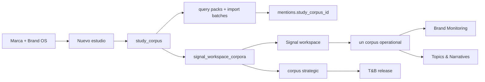
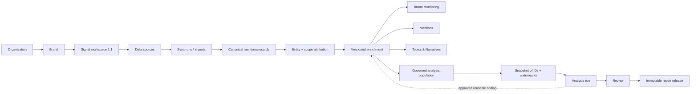

# 42 · Signal Workspace Data Ownership and Study Model

> **Estado:** canon de producto y datos para la siguiente fase de
> `codex/noisia-data-os-cut-1-wip`, actualizado 2026-08-10.
> **Decisión relacionada:** ADR 014.
> **Objetivo:** completar el paso de una plataforma centrada en estudios a un workspace
> vivo por marca sin perder el ETL, lineage, Review ni releases ya construidos.

El contrato que separa populations, views, policies, visibilidad, coverage y
denominadores vive en `50_SIGNAL_GOVERNED_VIEWS_AND_POPULATION_POLICIES.md` y gobierna
la evolución multi-view de este modelo.

## Resumen Ejecutivo

El producto correcto no comienza creando un estudio. Comienza creando una marca y su
workspace de Signal. La marca recibe fuentes y menciones de manera recurrente; esas
menciones se normalizan y enriquecen permanentemente; Brand Monitoring, Mentions y
Topics & Narratives consultan la misma base gobernada. Los estudios estratégicos toman
cortes reproducibles de esa base, añaden codificación y contexto y publican releases
revisados.

La rama actual construyó muchas de las piezas necesarias, pero conserva un límite
heredado: `study_corpora` todavía posee los imports y las menciones. Signal resuelve un
corpus operativo y varios corpora estratégicos. El siguiente corte debe mover el
ownership canónico al workspace sin rehacer el Engine ni romper compatibilidad.

## Tres Capas Que No Deben Confundirse

| Capa | Estado real | Decisión |
|---|---|---|
| Engine heredado | Marca → estudio → corpus → imports/menciones | Se conserva como compatibilidad y ejecución, no como ownership final |
| Data OS + Signal de esta rama | Workspace, serving relacional, métricas, lineage, releases, perfiles TN | Se conserva y se vuelve consumidor del plano canónico del workspace |
| Producto objetivo | Marca/workspace → fuentes → menciones → enrichment → módulos/estudios | Es la autoridad para la migración siguiente |

El `main` local y el branch no deben describirse automáticamente como el deploy exacto
de producción. Un nuevo agente debe inspeccionar producción y registrar el SHA/entorno
observado antes de afirmar paridad.

## Flujo Actual Auditado



Implicaciones observadas:

- una marca sin estudio no tiene garantizado un workspace útil ni una ruta de ingesta;
- el workspace se crea al insertar un `study_corpus` mediante migración 0056;
- CSV, query packs, batches y menciones se autorizan y persisten por corpus;
- Brand Monitoring y Topics & Narratives exigen exactamente un corpus `operational`;
- una fuente agregada por T&B puede no alimentar el corpus operativo;
- la deduplicación global evita copias, pero no existe todavía una membresía canónica
  que permita a varios estudios consumir el mismo registro limpiamente;
- el corpus observado de Laika mezcla alcances de marca, competidores, categoría y
  registros sin atribuir; ese scope no puede quedar implícito en métricas cliente.

## Flujo Objetivo



## Qué Es Canónico

### Canonical mention/record

Se persiste una sola vez y conserva:

- workspace, organización y marca propietaria;
- source system, external ID y text hash;
- import/sync provenance;
- texto original, texto normalizado y URL;
- autor, fecha, plataforma, país y engagement;
- estado de inclusión, calidad y exclusión;
- timestamps y revisiones.

Otra metodología referencia el registro; nunca vuelve a insertarlo para “tener su
propio corpus”.

### Enrichment permanente y versionado

Debe quedar en DB/API, conectado al registro original:

- plataforma y content type normalizados;
- language y geography;
- entidad/sujeto y scope;
- sentimiento y otras features operativas;
- topic/narrative assignments;
- tags metodológicos reutilizables cuando la política lo permita;
- modelo, prompt/policy version, confidence, review status y fecha de aprobación.

Un artefacto Claude puede explicar o proponer. No se convierte en la única copia del
enrichment.

## Scopes, Policies, Views Y Poblaciones

El workspace puede conservar más data que la población primaria que alimenta un KPI.
Cada mención debe declarar uno o más alcances gobernados:

| Scope | Uso por defecto |
|---|---|
| `primary_brand` | Incluido en métricas principales de la marca si pasa calidad |
| `competitor` | Comparativas y filtros; no infla el denominador primario |
| `category` | Contexto de categoría y discovery |
| `reference` | Contexto de estudio, no conversación operacional por defecto |
| `unattributed` | estado final honesto o QA; no entra a métricas cliente por defecto |

“El 100% llega al workspace” significa que ningún registro aceptado queda aislado en un
estudio. No significa que raw, unreviewed, abstained, unattributed, competitor y category
deban sumarse silenciosamente al mismo KPI ni que todos sean visibles al mismo rol.

Scope no es population, y population no es view:

- un scope es una assertion semántica sobre una raíz;
- una policy versionada define elegibilidad y denominador;
- una population es el conjunto reproducible resuelto por esa policy en un watermark;
- una view es la identidad client-safe que un módulo expone mediante un binding
  server-owned;
- una materialización es sólo una aceleración o snapshot de ese conjunto.

Una población gobernada es una definición reproducible, por ejemplo:

```text
workspace = laika
scope = primary_brand
inclusion_status = included
quality_policy = client_safe_v1
period = 2026-07-01..2026-07-31
taxonomy_profile = laika_topics_v1
```

La policy puede resolverse como SQL parametrizado y, para hot paths, persistir una
membresía/materialización relacional. La policy sigue siendo source of truth. No es un
JSON generado para el navegador ni se permite que el cliente componga scopes.

Cada métrica y colección client-safe declara view, population reference, policy
version, watermark, coverage y denominator. Salir de `primary_brand` no borra una
mención: puede permanecer en competition, category, all-governed, strategic o en el
reservoir auditable de Admin según su visibility policy.

## Qué Es Un Snapshot

Un snapshot protege la reproducibilidad de una corrida estratégica. Guarda:

- snapshot ID;
- population definition/version;
- mention/record IDs incluidos;
- data and enrichment watermarks;
- periodo y timezone;
- quality state;
- actor y fecha de creación.

No vuelve a guardar textos completos, charts ni un dashboard. El frontend nunca recibe
el snapshot entero. Los endpoints sirven overview, métricas, series, detail y evidencia
paginada mediante joins contra la data canónica.

```text
canonical mention
  → versioned enrichment
  → governed population
  → immutable ID snapshot
  → SQL metrics + approved artifacts
  → compact serving APIs
  → frontend
```

## Estudios Y Reportes

### Estudio/corrida

“Nuevo estudio” debe evolucionar a una operación sobre la marca:

1. seleccionar workspace y metodología;
2. definir objetivo, población y periodo;
3. agregar fuentes si hacen falta;
4. ingerir esas fuentes primero al workspace;
5. completar enrichment requerido;
6. congelar snapshot;
7. ejecutar metodología;
8. revisar y publicar.

`study_corpora` puede seguir existiendo durante la transición como contenedor de
ejecución y compatibilidad, pero deja de ser la entidad que posee la data.

### Triggers & Barriers

- El workspace tiene un único reporte cliente de T&B.
- Una corrida posterior no crea otra subsección ni otra URL.
- La nueva corrida conserva la revisión anterior y produce una candidata nueva.
- Review decide qué findings se conservan, fortalecen, fusionan, retiran o agregan.
- Al aprobar, la candidata se promueve como release actual.
- Las codificaciones reutilizables aprobadas pueden enriquecer permanentemente las
  menciones, sin mutar releases históricos.

### Reportes futuros

El concepto cliente es `report_key`, no `study_corpus_id`. Ejemplos:

- `triggers_barriers`;
- futuras metodologías aprobadas.

La identidad “current release” debe ser por `(workspace_id, report_key)`. Los runs,
snapshots y releases son historia interna de cada reporte.

## Experiencia Admin Objetivo

### Crear marca

La transacción crea:

- organización/marca;
- Brand OS;
- Signal workspace;
- población operacional inicial;
- perfiles/policies iniciales;
- estado vacío de fuentes y frescura.

### Detalle de marca

Debe ser el centro de operaciones:

- fuentes y cadencias;
- total de registros y cobertura temporal;
- último import/sync;
- calidad, pendientes y exclusiones;
- perfiles de enrichment;
- acceso a Signal;
- ejecutar/actualizar reporte.

`Corpora` puede permanecer en operator UI mientras exista compatibilidad, pero no es el
KPI principal del cliente o de la marca.

## Experiencia Signal Objetivo

Navegación cliente limpia:

- Monitoreo de marca;
- Menciones;
- Tópicos y narrativas;
- Reportes;
  - Triggers & Barriers;
- Configuración.

`Oportunidades` permanece dentro del reporte que la produjo hasta tener un contrato
cross-report gobernado. Evidencia transversal vive en Mentions/drill-down salvo que se
construya una capacidad distinta. Release e historial viven dentro del reporte.

## Mapa De Cambio Técnico

| Actual | Destino |
|---|---|
| workspace creado después de un estudio | workspace creado con la marca |
| `mentions.study_corpus_id` como ownership | mention propiedad del workspace + memberships |
| `import_batches.study_corpus_id` | imports del workspace + provenance opcional del run |
| un corpus `operational` | una población operacional gobernada |
| study sources aisladas | source/import entra primero al workspace |
| T&B study como página cliente | un reporte T&B con runs/releases internos |
| current release único por workspace | current release por workspace + report key |
| payload/report renderer | APIs relacionales pequeñas y paginadas |

## Estrategia De Migración

La migración es forward-only:

1. agregar ownership/membership nuevo sin remover columnas legacy;
2. backfill workspace desde `signal_workspace_corpora`, brand y source provenance;
3. reconciliar external IDs, hashes, batches, scopes y quality state;
4. dual-write nuevos imports al modelo canónico y compatibilidad;
5. dual-read/shadow serving por workspace;
6. reconciliar conteos, denominadores, series, detail y evidence contra SQL;
7. agregar policies y bindings versionados por workspace + módulo + view;
8. cambiar Brand Monitoring/TN al resolver server-owned de la view `brand`;
9. habilitar views client-safe de competencia/categoría sin mezclar denominadores;
10. cambiar T&B a snapshot de una policy estratégica explícita;
11. retirar dependencia cliente de `study` y del corpus operativo sólo después de gates;
12. conservar rutas/output legacy hasta completar rollback window.

No borrar `published_outputs.payload`, migraciones previas, snapshots ni evidence graph.

## Gates De Producto Y Datos

- Una marca nueva puede ingerir y abrir Signal sin crear un estudio.
- Un import nuevo aparece una sola vez y actualiza serving operacional.
- Un archivo agregado durante T&B nutre el workspace antes del snapshot.
- Monitoring y TN declaran la misma view/policy cuando representan el mismo
  denominador; una view diferente se identifica explícitamente.
- Scopes de competidor/categoría no contaminan el denominador primario.
- Toda métrica expone coverage y denominator reproducibles.
- El cliente nunca envía population IDs ni expresiones de policy.
- Un cambio de policy invalida cursores/materializaciones afectados.
- `unreviewed`, `abstained` y `unattributed` permanecen estados distintos.
- T&B usa IDs congelados y no mezcla menciones posteriores.
- Enrichment reusable sigue disponible después de terminar la corrida.
- Publicar un release no modifica el anterior.
- Evidence navega a la mención canónica.
- Ningún endpoint cliente sirve un snapshot/payload gigante.
- AuthZ y lineage se mantienen server-side.

## Fuera De Alcance De La Migración Base

- reescribir el Engine T&B;
- reactivar las metodologías multimethod pausadas;
- correr Claude/Voyage/backfills sin presupuesto y aprobación;
- resolver el gate general de Signal Pulse por atajo;
- borrar compatibilidad legacy;
- rediseñar otra vez el shell de Signal;
- ocultar `partial`, `pending`, `stale` o `not_available`.

## Admin Como Operador Del Workspace — Fase 6

Admin ya no toma el número de corpora como estado principal de una marca. Las vistas de
Dashboard, Brands y Brand workspace resuelven estado operativo desde el workspace:

- current operational population y memberships primary-brand;
- sources, refresh policies, imports, watermarks y quality state;
- perfiles activos;
- `signal_workspace_reports` y el current release por
  `(workspace_id, report_key)`;
- corpora sólo como ejecución/provenance/compatibilidad.

La vertical de datos usa directamente:

```text
POST /api/data-os/signal/{workspaceId}/sources
GET  /api/data-os/signal/{workspaceId}/sources
POST /api/data-os/signal/{workspaceId}/sources/{sourceId}/imports
GET  /api/data-os/signal/{workspaceId}/sources/{sourceId}/imports
```

El formulario sólo crea fuentes `primary_brand` con policy server-owned. Usa claves
canónicas `social-listening` y `manual-csv`; competitor/category permanecen fail-closed
hasta Fase 4B. Importar desde Admin no crea estudio ni corpus y actualiza coverage,
freshness y población operacional mediante el mismo contrato workspace-owned.

El lanzamiento de T&B desde Admin usa el contrato workspace-native y un
`Idempotency-Key`; muestra sources, coverage, quality, population, periodo, timezone y
tope de presupuesto antes de habilitar la acción. La UI no usa `study_corpus_id` como
identidad de producto.

Archive/delete también sigue ownership: una marca con workspace se archiva de forma
conservadora; el borrado permanente se bloquea para no dejar data, snapshots o releases
huérfanos. Las marcas legacy sin workspace conservan su adapter de compatibilidad.

## Transición Semántica 0064

La intención de adquisición no es una certificación semántica. 0064 formaliza dos
bases dentro del mismo lineage canónico:

- `source_intent`: scope/query/source/import que trajo la mención. Se preserva, puede
  seguir sosteniendo v1 durante rollback, pero nunca es elegible para v2;
- `mention_semantic`: assertion versionada, auditable y revisable sobre una mención
  canónica. Sólo su versión current `approved + eligible` puede sostener una membership
  v2 o una población estratégica nueva.

La definición operational v2 nace `draft` y sin pointer. El apply de 0064 no retira v1,
no cambia su serving y no promueve resultados del scan privado de Laika. Approval,
rejection y supersession reconcilian exclusivamente la candidata v2;
multi-attribution no duplica la mención dentro de una población. Competitor/category
sin identidad gobernada y unattributed sin resolución permanecen fail-closed.

V1 se preserva durante el apply como protección transaccional, no como destino de
producto. En desarrollo, su vida termina cuando una población V2 no vacía pase Review,
reconciliación SQL, AuthZ, evidence y promoción atómica. Después de ese gate se retiran
los readers y fallbacks legacy en un cambio forward-only; canonical mentions,
provenance, Review events, snapshots y releases permanecen.

Estado al 2026-08-06: 0064 está implementado, probado localmente y aplicado/verificado
mediante rehearsal acotado en `noisia-staging`. Operational V1 permaneció exactamente
igual y Operational V2 quedó sólo como candidata draft sin pointer ni memberships. El
siguiente paso es Review semántico real con autorización separada; promoción, serving
switch y T&B real continúan bloqueados.

### Candidate generation y Review (Fase 7B)

El backend de Admin usa una sola cola por workspace sobre raíces canónicas incluidas.
La política determinista `signal-semantic-governed-identity@1` puede proponer una o más
assertions por mención, pero cada propuesta nace siempre `pending/candidate`. Coincide
únicamente con identidades gobernadas: el brand del workspace, competidores con ID
estable e intelligence entities activas. La intención del source/import se conserva y
se muestra como provenance, pero no activa propuestas ni memberships.

La cola es cursor-paginada sobre el conjunto completo y reconcilia cada raíz una vez.
El Admin recibe excerpt/contexto sólo tras AuthZ interna; los evidence packs públicos
usan hashes, no texto, handles, URLs ni UUIDs. El reviewer y workspace se resuelven de
la sesión server-side, y todas las mutaciones requieren idempotencia.

Crear candidatos no crea Review events, no aprueba assertions, no modifica V1, no
materializa memberships V2 y no promueve el pointer. Approval, rejection y
supersession son decisiones posteriores, append-only. Operational V1 permanece como
serving visible durante este subgate; retirarla requiere población V2 revisada,
reconciliación de los tres módulos y promoción explícita.

Rehearsal `noisia-staging` del 2026-08-06: las 729 raíces incluidas reconciliaron como
178 raíces candidate-pending y 551 unresolved. Las 178 sostienen 183 assertions
multi-entidad (`99 primary_brand`, `84 competitor`), todas high-confidence por regla
determinista, pending/candidate y con identidad gobernada. La primera ejecución creó
183; la segunda creó 0 y resolvió las mismas 183. V1 siguió con 192 memberships activas
y hashes idénticos; V2 quedó con cero pointer/memberships, approvals y Review events.
