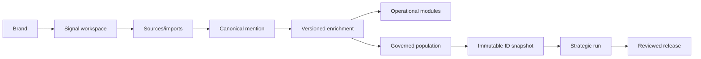

# 44 · Signal Workspace Data Plane Migration Handoff

> **Estado:** handoff ejecutable para continuar en un nuevo chat desde el worktree local,
> 2026-08-02.
> **Misión:** convertir la ingesta y el enrichment en capacidades canónicas del
> workspace/marca sin perder el Engine, Data OS, lineage, Signal V2 ni releases T&B.

> **Actualización 2026-08-03:** el hardening local cierra Fase 4A
> `primary_brand`, incluida invalidación de memberships y shadow post-response con
> outbox durable. El overview TN usa un ETag semántico que cambia con coverage,
> términos, series y coocurrencias, y permanece estable al persistir un read-through
> equivalente. Competitor/category exploration sigue aplazado; por eso este
> documento no autoriza declarar completa la Fase 4 ni iniciar staging.

## Resultado Esperado

Una marca recién creada puede:

1. tener un Signal workspace sin crear un estudio;
2. conectar/importar menciones al workspace;
3. persistir enrichment reusable en DB/API;
4. alimentar Brand Monitoring, Mentions y Topics & Narratives desde una población
   gobernada común;
5. ejecutar T&B sobre un snapshot relacional de esa población;
6. publicar una nueva revisión T&B sin crear otra subsección ni mutar la anterior.

No se debe construir otra implementación paralela ni reemplazar Data OS con JSON.

## Contexto Local Que Debe Preservarse

- Repositorio: `/Users/brandhon_o/Downloads/noisia-website`
- Rama: `codex/noisia-data-os-cut-1-wip`
- El worktree está sucio y contiene trabajo válido en frontend, serving, workers,
  query-engine y documentación.
- No hacer reset, stash, checkout destructivo, limpieza general, commit ni push sin
  petición explícita.
- Aplicar cambios manuales con `apply_patch`.
- No volver a correr Claude, Voyage, backfills, discovery, T&B o Signal Pulse para
  explorar esta arquitectura.
- No modificar migraciones existentes. Toda migración nueva es forward-only y
  hand-verified.

## Lectura Obligatoria

Leer completos, en este orden:

1. `AGENTS.md`
2. `apps/studio/AGENTS.md`
3. `services/workers/AGENTS.md`
4. `packages/query-engine/AGENTS.md`
5. `docs/product/31_SIGNAL_PRODUCT_NORTH_STAR.md`
6. `docs/adr/009-signal-always-on-strategic-dashboard.md`
7. `docs/adr/011-signal-one-workspace-per-brand.md`
8. `docs/adr/012-signal-versioned-taxonomy-profiles.md`
9. `docs/adr/014-signal-workspace-owned-data-plane.md`
10. `docs/product/37_SIGNAL_WORKSPACE_INFORMATION_ARCHITECTURE.md`
11. `docs/product/38_SIGNAL_LOADING_AND_NAVIGATION_STANDARD.md`
12. `docs/product/42_SIGNAL_WORKSPACE_DATA_OWNERSHIP.md`
13. `docs/product/43_SIGNAL_V2_FRONTEND_SYSTEM.md`
14. este documento.

Cuando una instrucción histórica contradiga ADR 014 o el documento 42 respecto a
ownership de data o páginas T&B, gobiernan ADR 014 y 42. No asumir que un spec describe
algo ya implementado: comprobar schema, rutas, SQL y UI.

## Exploración Obligatoria Antes De Editar

### Repositorio y ramas

- revisar `git status --short`, branch, log y merge-base;
- comparar `main...HEAD` sin tocar el worktree;
- distinguir explícitamente:
  - baseline heredado del Engine/Prod;
  - cambios committed de Data OS/Signal en la rama;
  - WIP local sin commit;
- no afirmar que el `main` local es producción desplegada;
- inspeccionar migrations 0035–0058 y el schema actual;
- localizar toda query que use `study_corpus_id` para ownership, authZ, serving,
  materialización, snapshots o lineage.

### Producto real

Usar la skill del navegador y el navegador integrado con sesión disponible.

Explorar el flujo completo, no sólo Signal:

1. Studio home;
2. lista y creación de marca;
3. detalle Brand OS/Data OS;
4. New Study;
5. Corpus Engine, sources, query packs, CSV import y mentions;
6. Review/publicación T&B;
7. Signal Brand Monitoring;
8. Signal Mentions;
9. Signal Topics & Narratives;
10. Signal Reports/T&B;
11. Configuración si existe.

Explorar también el producto desplegado en producción con sesión autenticada. Registrar
URL, build/commit cuando sea observable y diferencias contra local. Si no hay una URL
segura disponible, reportar el límite y pedirla; no inferir producción desde screenshots
o desde `main`.

Shopify Admin sigue siendo la referencia visual para densidad, feedback, filtros,
helpers y geometría. No copiar contratos de datos de Shopify.

Guardar capturas de estados finales y de cargas importantes. Las capturas no sustituyen
la inspección de DOM, requests, consola y tiempos.

## Estado Técnico Confirmado Al Crear Este Handoff

### Bien construido y reutilizable

- `signal_workspaces` y routing estable `/signal/{workspaceSlug}`;
- roles/memberships de corpora como puente de transición;
- Data Catalog, assets, observations, quality y lineage;
- record tags, features, taxonomy profiles y assignments versionados;
- filtros/materializaciones/serving relacional;
- Topics & Narratives incremental;
- T&B findings, evidence, temporal metrics, artifacts, snapshots y releases;
- current release y compatibilidad con published outputs;
- Signal V2 shell, filtros, charts, drawers, skeletons y navegación.

### Brecha central

- `mentions.study_corpus_id` e `import_batches.study_corpus_id` siguen siendo ownership;
- CSV y workers reciben `corpusId` como contexto principal;
- brand creation no crea el workspace;
- migration 0056 crea workspace después de insertar un estudio;
- serving operativo exige exactamente un corpus `operational`;
- TN filtra su población por ese corpus;
- T&B todavía resuelve `workspace + studyCorpusId`;
- current release sólo tiene identidad por workspace, no por report key;
- Studio presenta el estudio como camino principal para conseguir data.

## Invariantes De Diseño



- Una mención existe una sola vez.
- Un estudio crea memberships/snapshot, no copias.
- Enrichment reusable persiste contra la mención.
- Snapshot contiene IDs/watermarks/provenance, no un frontend payload.
- El frontend recibe APIs compactas y paginadas.
- Operacional cambia con nueva data; release estratégico no.
- Scope de marca/competidor/categoría es explícito.
- T&B tiene una superficie cliente; nuevas corridas son revisiones.

## Plan De Implementación

### Fase 0 · Auditoría y contrato

Antes de DDL:

- inventariar tablas y flows que dependen de `study_corpus_id`;
- producir un mapa exacto de ownership, membership y provenance;
- reconciliar una muestra Laika de imports, external IDs, hashes, scopes y memberships;
- comprobar qué diferencias existen realmente en producción;
- escribir contratos Zod/TypeScript de workspace import, population y snapshot;
- actualizar schema canon/API docs si el diseño final difiere de 42.

No detenerse en un diagnóstico genérico. Entregar la lista concreta de tablas, rutas,
workers y tests que cambia cada fase.

### Fase 1 · Schema aditivo

Diseñar una migración nueva, sin editar 0056–0058, que cubra:

- ownership workspace/brand de fuentes, batches y menciones;
- memberships reutilizables de records en poblaciones/análisis;
- explicit scope/entity attribution;
- provenance del study/run que contribuyó una fuente o import;
- population definition/version/watermark;
- report identity y current release por `(workspace, report_key)`;
- índices para periodo, scope, inclusion, platform y cursor pagination;
- checks que impidan cross-org/cross-workspace references.

Si se agrega `workspace_id` a tablas actuales, mantener `study_corpus_id` durante el
dual-write. No relajar `NOT NULL` ni borrar constraints hasta después del backfill y el
shadow gate.

### Fase 2 · Brand + source ingestion

- crear workspace/policies en la transacción de alta de marca;
- agregar APIs server-side y authZ para source/import del workspace;
- hacer que CSV/worker normalicen y dedupliquen por workspace;
- conservar import batch, source file, query pack, entity y lineage;
- permitir `initiated_by_study_run` sin transferir ownership al estudio;
- persistir acceptance/watermarks a nivel workspace.

### Fase 3 · Backfill y dual-write

- derivar workspace de memberships/brand existentes;
- backfill sources, batches, mentions y scopes;
- detectar conflictos globales de external ID/text hash antes de decidir canon;
- registrar resultados y excepciones, no ocultarlas;
- dual-write nuevas ingestas al modelo actual y nuevo;
- no correr el backfill contra staging/prod sin autorización y flight card.

### Fase 4 · Operational serving

- introducir un `workspace population resolver`;
- migrar Brand Monitoring, Mentions y TN en shadow;
- preservar filtros, cursor, partial state y metric definitions;
- comparar conteos, denominadores, series, shares, sentiment, detail y evidence;
- hacer scope primario explícito y exponer competidor/categoría mediante filtros;
- retirar `requireOperationalCorpus` sólo después de reconciliación completa.

### Fase 5 · Strategic consumption

- T&B selecciona population y congela IDs/watermarks;
- el Engine conserva pipeline, Review, artifacts, evidence y quality gates;
- codificación reusable aprobada vuelve al enrichment canónico;
- release sigue inmutable;
- una nueva corrida promueve una revisión actual sin crear navegación nueva;
- remover dependencia cliente de `?study=` sólo después de mantener compatibilidad.

Estado local al 2026-08-04: implementado en las migraciones aditivas 0062–0063 y en el
orquestador workspace-native. La integración PostgreSQL determinista demuestra dos
snapshots, Review selectivo, enrichment alias→raíz, releases 1→2 e inmutabilidad; el
reader cliente carga la current release por `report_key` en una sola URL sin `?study=`.
El drainer de Workers recupera commits sin dispatch, leases huérfanos y ACKs BullMQ
perdidos mediante job ID determinista, backoff y dead letter. El corpus y las URLs
antiguas permanecen como adapters de rollback. Esto no autoriza staging/cutover y no
cambia el estado cerrado de Fase 4A primary-brand ni su aplazamiento separado de
exploration competitor/category.

### Fase 6 · Admin y Settings

- Brand detail: fuentes, coverage, freshness, calidad, imports y Open Signal;
- “Nuevo estudio” → ejecutar análisis/actualizar reporte;
- fuentes agregadas en el wizard se ingieren primero al workspace;
- corpora quedan como operator/compatibility UI;
- Signal Settings: sources, cadence, profiles, access y report state.

### Fase 7 · Cutover y cleanup

- shadow real con una marca y data reconciliada;
- feature flag/rollback documentado;
- cambiar reads cliente después del evidence pack;
- preservar V1 únicamente como rollback técnico hasta que V2 tenga población no vacía,
  reconciliación y current pointer;
- en desarrollo, retirar readers, flags, rutas/output y navegación legacy en el mismo
  corte validado; no mantener dos productos en paralelo;
- conservar canonical data, provenance, Review events, snapshots y releases; cualquier
  cleanup de schema es forward-only y posterior al cutover.

El orden y el estado actual de este corte están gobernados por
`31_SIGNAL_PRODUCT_NORTH_STAR.md` y `47_SIGNAL_WORKSPACE_STAGING_REHEARSAL.md`. Al
2026-08-06, el siguiente paso inmediato es el rehearsal remoto de 0064 en
`noisia-staging`, no otro backfill de la semántica legacy.

## Frontend: No Regresar

El cambio de backend debe preservar `43_SIGNAL_V2_FRONTEND_SYSTEM.md`:

- `SignalV2ModuleHeader` compartido;
- shell y nav persistentes;
- feedback inmediato y stale data durante revalidación;
- skeleton frío retrasado y de geometría real;
- `SignalEChart`/runtime diferido;
- drawer de evidencia compartido;
- selección única list/chart/detail;
- i18n, focus, reduced motion y breakpoints;
- sin gradients, cards decorativas, helpers técnicos o loading global.

No usar una migración de data como excusa para rehacer la UI.

## Validación

Primero tests enfocados por paquete tocado. Antes de declarar el corte listo:

```bash
corepack pnpm --filter @noisia/db typecheck
corepack pnpm --filter @noisia/db test
corepack pnpm --filter @noisia/studio typecheck
corepack pnpm --filter @noisia/studio test
corepack pnpm --filter @noisia/query-engine typecheck
corepack pnpm --filter @noisia/query-engine test
corepack pnpm --filter @noisia/workers typecheck
corepack pnpm --filter @noisia/workers test
git diff --check
```

Confirmar el nombre real del package de workers antes de usar el filtro. Para release:

```bash
corepack pnpm --filter @noisia/studio build
corepack pnpm data-os:verify
corepack pnpm data-os:staging-check
corepack pnpm data-os:staging-shadow
```

`staging-check` incompleto es handoff, no permiso para inventar evidencia.

## Prohibiciones

- No reset, stash, destructive checkout o cleanup.
- No crear una implementación paralela de Signal o ingestion.
- No mutar perfiles/approvals/releases para hacer pasar una demo.
- No cambiar migraciones existentes.
- No leer `published_outputs.payload` para serving nuevo.
- No servir snapshots o poblaciones completas al frontend.
- No duplicar menciones por metodología.
- No habilitar Kinde middleware ni protected-route prefetch.
- No correr LLMs o embeddings sin presupuesto y autorización.
- No commit/push salvo petición expresa.

## Prompt De Inicio Para Un Nuevo Chat

Copiar íntegramente:

```text
Continúa Noisia Data OS/Signal exactamente desde el estado local actual.

REPOSITORIO
/Users/brandhon_o/Downloads/noisia-website

RAMA
codex/noisia-data-os-cut-1-wip

MISIÓN
Implementa la migración de Signal desde ownership de menciones por study_corpus hacia un
data plane canónico propiedad del workspace/marca. La marca debe poder recibir fuentes y
menciones antes de crear un estudio; Brand Monitoring, Mentions y Topics & Narratives
deben consumir una población gobernada común; T&B debe consumir un snapshot relacional
de esa población y publicar revisiones sin crear otra subsección cliente.

IMPORTANTE
- El worktree está sucio y contiene trabajo válido. No descartes, reviertas, sobrescribas
  ni reformatees cambios ajenos.
- No reset, stash, checkout destructivo, limpieza, commit ni push.
- Usa apply_patch para editar.
- No crees otra implementación paralela.
- No modifiques migraciones existentes; cualquier DDL nuevo es forward-only.
- No corras Claude, Voyage, backfills, discovery, T&B o Signal Pulse sin autorización.
- No uses published_outputs.payload ni un JSON/snapshot grande para nutrir el frontend.
- No rompas el frontend Signal V2 ya construido.

ANTES DE EDITAR
1. Lee completos AGENTS.md, apps/studio/AGENTS.md, services/workers/AGENTS.md y
   packages/query-engine/AGENTS.md.
2. Lee completos:
   - docs/adr/014-signal-workspace-owned-data-plane.md
   - docs/product/31_SIGNAL_PRODUCT_NORTH_STAR.md
   - docs/product/37_SIGNAL_WORKSPACE_INFORMATION_ARCHITECTURE.md
   - docs/product/38_SIGNAL_LOADING_AND_NAVIGATION_STANDARD.md
   - docs/product/42_SIGNAL_WORKSPACE_DATA_OWNERSHIP.md
   - docs/product/43_SIGNAL_V2_FRONTEND_SYSTEM.md
   - docs/product/44_SIGNAL_WORKSPACE_DATA_PLANE_HANDOFF.md
3. Explora el repo y compara main...HEAD distinguiendo baseline heredado, commits de la
   rama y WIP local.
4. Usa el navegador integrado. Explora el flujo completo local: crear marca, detalle de
   marca, nuevo estudio, Corpus Engine/import, Review/publicación y todos los módulos de
   Signal.
5. Explora también el producto desplegado en producción con sesión autenticada. Registra
   URL/build/commit cuando sea observable y no asumas que main local equivale a Prod.
6. Inspecciona Shopify Admin como referencia de densidad y comportamiento del frontend.

MODELO OBLIGATORIO
canonical mention
→ versioned permanent enrichment
→ governed population
→ immutable snapshot of IDs/watermarks
→ deterministic metrics + reviewed artifacts
→ compact/paginated serving APIs
→ existing Signal V2 frontend

No significa un JSON pesado. El frontend nunca recibe la población o snapshot completo.

PRIMERA ENTREGA
- Audita y documenta cada dependencia real de study_corpus_id.
- Define contratos y DDL aditivo para workspace ownership, memberships, scopes,
  populations y report_key.
- Implementa la primera vertical segura: brand creation crea workspace + APIs/serving
  mínimos de source/import workspace-owned, con tests y compatibilidad.
- Si el alcance seguro permite continuar, agrega dual-write/backfill local y shadow
  resolver. No escribas en staging/prod sin autorización.
- Conserva T&B Engine, lineage, artifacts, releases y frontend salvo un bug demostrado.

VALIDACIÓN
Ejecuta typecheck/tests enfocados de cada paquete tocado y git diff --check. Levanta
Studio y valida flujo real, consola, authZ, navegación y ausencia de layout shift. No
declares éxito si sólo comprobaste código o screenshots.

ENTREGA
Explica qué encontraste en local vs Prod, qué cambiaste, archivos, migración, tests,
reconciliación lograda, riesgos y qué no pudiste comprobar realmente.
```

## Handoff Local — Fase 6 Unified Admin Workspace + Settings

Estado: **implementado y validado localmente; no activado fuera del workspace local**.

La vertical entregable es:

```text
shared WorkspaceShell
→ Dashboard/Brands workspace-aware
→ Brand workspace contextual
→ source creation + CSV import workspace-owned
→ report registry + workspace-native run preflight
→ Admin Settings / client-safe Signal Settings
```

No hubo migración nueva ni cambio de OpenAPI: se reutilizaron APIs workspace-owned ya
documentadas. El backend sólo recibió el hardening demostrado de archive/delete; la
creación de marca existente sigue inicializando workspace, population pointer, report
registry y refresh policy transaccionalmente.

Evidence local relevante:

- 0000–0063 aplicadas en PostgreSQL 16 + pgvector;
- integración data plane: 15/15;
- runtime sin study/corpus: 1 canonical mention, 3 imports, 3 memberships, 3
  attributions, 2 scopes, 1 operational membership y 0 studies;
- integración materialization Worker autónoma: 1/1;
- outbox estratégico con PostgreSQL + Redis locales: 2/2;
- browser Admin: alta de source `primary_brand` e import CSV con 1 record, 1 included,
  0 excluded y 0 duplicates; el fixture visible pasó 107→108 y coverage terminó en
  agosto de 2026;
- browser Signal: Settings client-safe y Monitoring conservaron el mismo shell.

Antes de staging se necesita configuración/autorización explícita, cuentas con roles
representativos y un dataset staging. No ejecutar migraciones, backfills, Claude,
Voyage, T&B ni cutover como parte de este handoff.
