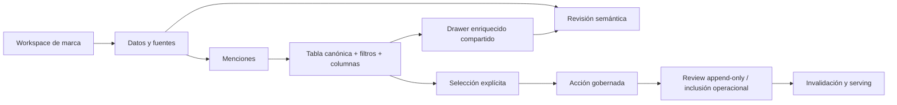

# 48 · Noisia Admin Mentions — frontend recovery handoff

**Fecha:** 2026-08-09

**Rama:** `codex/noisia-data-os-cut-1-wip`

**Estado:** contrato backend de Admin Mentions cerrado en `noisia-staging`; integración frontend funcional en validación. Pulido visual fino del panel de filtros pendiente.

**Ámbito de este handoff:** Admin interno, específicamente la gestión de menciones dentro del workspace de marca

> Este documento declara el estado real después de un turno fallido de frontend. El turno terminó tras múltiples compactaciones, lectura repetida y sin una entrega validada. Este documento reemplaza cualquier afirmación de que la vista Admin Mentions ya alcanzó paridad con Signal. No reemplaza el sistema canónico descrito en los documentos 38, 43 y 46.

## Actualización de continuidad — 2026-08-09

El backend dejó de ser un gap para la lectura y gobernanza individual de Admin Mentions:

- `GET /admin-mentions` entrega lista ligera con `operator_summary`, filtros server-side y `operator_facets` calculadas sobre todas las raíces canónicas del workspace;
- el GET enfocado por `mention` entrega `record + operator`, con lineage, provenance, Review, populations, tags/features, T&B y governance sin exponer metadata cruda;
- `POST /admin-mentions/{mentionId}/governance` soporta `include`, `exclude`, `revert` y `send_to_review` con idempotencia, actor autenticado e historial append-only;
- Semantic Review acepta `mention={canonicalMentionId}` para abrir una raíz enfocada;
- la migración forward-only `0067_signal_canonical_mention_governance.sql` fue aplicada únicamente en `noisia-staging`. Producción y los pointers de Operational V2 permanecen intactos.

La integración frontend consume esos contratos y conserva los primitives canónicos de Signal para periodo, toolbar, tabla, selección, filtros y drawer. Las pruebas de UI no deben confirmar mutaciones sobre staging: los diálogos pueden abrirse y cancelarse; la persistencia ya está cubierta por la validación backend.

Pendiente explícito: **pulido visual del panel de filtros** —espaciado, densidad, jerarquía y comportamiento fino en breakpoints—. Es deuda de UI, no una razón para inventar otro componente ni para pedir cambios semánticos al backend.

## 1. Resultado que se busca

Noisia Admin y Signal comparten un sistema visual, pero sirven a usuarios distintos:

- **Signal** es client-facing: permite explorar la población aprobada y su enriquecimiento.
- **Admin** es operator-facing: permite inspeccionar el registro canónico completo, comprender provenance y estado semántico, corregirlo y gobernar qué puede entrar al serving.

La vista de menciones del Admin debe ser como mínimo igual de legible y completa que la vista de Signal, y superior en capacidades de gestión. No debe ser una lista reducida incrustada al final de “Datos y fuentes”. Debe vivir como subsección propia del workspace:

```text
/studio/brands/:brandId/data             Datos y fuentes
/studio/brands/:brandId/data/mentions    Menciones
/studio/brands/:brandId/data/review      Revisión semántica
```

La navegación secundaria de la marca debe hacer visible esa jerarquía sin crear otro shell.

## 2. Estado real del workspace

El worktree contiene aproximadamente 250 cambios y archivos sin seguimiento de varias misiones válidas: Data OS, Signal V2, Admin, migraciones 0059–0066, workers, contratos y documentación. Todo debe tratarse como trabajo del usuario.

Reglas no negociables:

- Trabajar directamente en `/Users/brandhon_o/Downloads/noisia-website`.
- No ejecutar `reset`, `checkout` destructivo, `stash`, limpieza general ni reformateo masivo.
- No borrar, revertir ni sobrescribir cambios ajenos.
- No crear una implementación paralela.
- Editar archivos manualmente con `apply_patch`.
- No hacer commit ni push.
- No cambiar authZ, migraciones ni serving backend para “hacer que el frontend funcione”.
- No volver a ejecutar Claude, Voyage, Topics & Narratives ni Triggers & Barriers.

El attachment del turno fallido está en:

```text
/Users/brandhon_o/.codex/attachments/557d7ace-d0e1-48dc-95e6-ade17f40e8ac/pasted-text.txt
```

Sirve únicamente como evidencia forense. No es canon de producto y no hace falta cargar sus 1,130 líneas para continuar.

## 3. Qué existe hoy

### 3.1 Base actual del Admin

Archivos principales:

- `apps/studio/src/app/studio/brands/[id]/data/mentions/page.tsx`
- `apps/studio/src/components/admin/AdminBrandMentionsManager.tsx`
- `apps/studio/src/app/api/data-os/signal/[workspaceId]/admin-mentions/route.ts`

La ruta ya es una subsección independiente y reutiliza el drawer enriquecido de Signal. Eso debe conservarse.

La implementación actual todavía es sólo una base:

| Área | Estado actual | Problema |
|---|---|---|
| Listado | Filas clickeables con texto, plataforma, fecha, scope y chevron | Tiene menos columnas, jerarquía y capacidades que Signal |
| Drawer | Reutiliza `SignalMentionDetailDrawer` | Correcto como dirección; faltan extensiones de operador gobernadas |
| Búsqueda | Dentro del drawer de filtros | Debe vivir en la toolbar principal |
| Periodo | Dentro del drawer | Viola el canon: debe estar fuera, visible y persistente |
| Orden | Dentro del drawer como dos selects | Viola el canon: debe ser un control compacto en la toolbar |
| Filtros | Plataforma y rol | Son insuficientes para la gestión interna |
| Columnas | No configurables | Signal ya tiene selector de columnas |
| Selección | No hay checkboxes ni seleccionar página | Impide cualquier flujo de gestión por lote |
| Acciones masivas | No existen | No se puede excluir, incluir ni reclasificar una selección |
| URL | Estado parcial | Filtros, búsqueda, orden y periodo deben ser reproducibles |
| Paginación | Offset/limit básico | Debe conservar selección, filtros y feedback sin saltos |

### 3.2 API actual

`apps/studio/src/app/api/data-os/signal/[workspaceId]/admin-mentions/route.ts` es un reader `GET` con authZ server-side. Soporta lista ligera, foco por raíz o alias, paginación, búsqueda, plataforma, rol, periodo, orden y filtros operator-facing de inclusión, resolución, Review, eligibility, calidad, governance y provenance. Sus facetas operator-facing pertenecen a las raíces canónicas del workspace, no sólo a la población operacional.

La mutación gobernada individual vive en `POST /admin-mentions/{mentionId}/governance` y soporta `include`, `exclude`, `revert` y `send_to_review`. La UI puede componer acciones de lote ejecutando el contrato idempotente por cada ID seleccionado, mostrando resultado parcial cuando corresponda; no debe escribir directo a tablas ni representar `reclassify` como disponible mientras no exista un contrato gobernado específico.

### 3.3 Referencia canónica que ya existe

`apps/studio/src/components/signal-v2/SignalV2Mentions.tsx` ya resuelve:

- header y periodo visibles;
- “Más filtros” en drawer;
- búsqueda fuera del drawer;
- toggle lista/grid;
- selector de orden compacto;
- selector de columnas;
- checkboxes y selección de página;
- toolbar de selección;
- tabla configurable;
- helpers canónicos;
- skeletons con geometría real;
- paginación;
- drawer enriquecido con verbatim, fuente, fecha, original, desempeño, scope, T&B, Topics & Narratives, atributos y detalles del registro.

No se debe copiar ese archivo ni crear una versión “Admin” independiente. Primero hay que identificar y extraer primitives compartibles; después componer las diferencias operator-facing.

## 4. Canon frontend obligatorio

Leer completos, antes de editar:

1. `AGENTS.md`
2. `apps/studio/AGENTS.md`
3. `docs/product/38_SIGNAL_LOADING_AND_NAVIGATION_STANDARD.md`
4. `docs/product/42_SIGNAL_WORKSPACE_DATA_OWNERSHIP.md`
5. `docs/product/43_SIGNAL_V2_FRONTEND_SYSTEM.md`
6. `docs/product/46_NOISIA_ADMIN_FRONTEND_AUDIT.md`

Usar la skill `design-taste-frontend`. Para la auditoría visual, usar la skill de auditoría de producto si está disponible. Inspeccionar el Admin de Shopify en la sesión iniciada; no inferir tamaños únicamente desde capturas.

Valores del shell ya medidos y documentados:

- topbar: 48px, fondo `#0a0a0a`;
- búsqueda: 620 × 32px, radio 12px;
- rail: 208px, `#ebebeb`;
- main: `#f1f1f1`, padding 12px;
- nav row: 27px, radio 8px;
- controles: 32px, radio 8px, texto funcional de 13px;
- chips: 22px, radio 6px;
- cards y superficies internas: radio 8px cuando corresponda.

Reglas visuales y de interacción:

- Product/Google Sans existente.
- Densidad Shopify-like; no big cards decorativas.
- Sin gradients ni sombras flotantes innecesarias.
- Sin cards dentro de cards sin función estructural.
- Sentence case.
- Helpers sin icono: subrayado punteado y `cursor: help`.
- Estados `hover`, `selected` y `focus-visible` distintos.
- Ninguna información funcional por debajo de 12px.
- El shell no se convierte en skeleton.
- Feedback inmediato en navegación; skeleton sólo para cold load después del umbral canónico.
- Revalidación de filtros conserva datos previos y geometría.
- Respetar `prefers-reduced-motion`.
- No habilitar prefetch en rutas protegidas.
- Toda cadena nueva debe existir en `apps/studio/messages/en-US.json` y `apps/studio/messages/es-MX.json`.

## 5. Arquitectura de la pantalla requerida

### 5.1 Header de página

Usar `AdminWorkspaceHeader` y el shell compartido, no un header local.

Contenido:

- eyebrow contextual: `LAIKA MASCOTAS · DATOS Y FUENTES`;
- título: `Menciones`;
- descripción corta de gestión interna;
- acción secundaria: `Abrir revisión semántica`;
- no badges decorativos ni resúmenes duplicados.

### 5.2 Toolbar persistente

Debe aparecer sobre la tabla y permanecer estable:

1. rango de fechas;
2. búsqueda de texto;
3. selector de vista, sólo si aporta valor real;
4. orden compacto con dirección integrada;
5. selector de columnas;
6. botón `Más filtros` con contador de filtros activos.

El periodo y el orden nunca van dentro del drawer de filtros avanzados.

### 5.3 Drawer de filtros avanzados

Debe reutilizar el drawer canónico de Signal/Admin y agrupar filtros de manera legible. Antes de mostrarlos, verificar qué soporta el reader real. El conjunto objetivo es:

- scope semántico: primary brand, competitor, category, reference, unattributed;
- estado semántico: approved, pending, rejected, needs context, superseded;
- elegibilidad operacional: incluida o fuera de métricas;
- confianza;
- plataforma;
- source/import;
- rol en la conversación;
- formato/tipo de mención;
- sentimiento;
- presencia de Topics & Narratives;
- presencia de Triggers & Barriers;
- enriquecimiento disponible o pendiente;
- multi-entidad.

No poner controles sin backend real. No poner búsqueda, periodo, orden ni dirección aquí.

### 5.4 Tabla

La tabla debe partir de la tabla de Signal y añadir campos de operador. Columnas mínimas sugeridas:

- checkbox;
- mención;
- scope semántico;
- estado de Review;
- elegibilidad operacional;
- fuente/plataforma;
- rol;
- publicada;
- sentimiento;
- interacciones;
- Topics & Narratives;
- Triggers & Barriers;
- provenance/source import;
- acción de detalle.

No todas tienen que estar visibles de inicio. El selector de columnas debe conservar una configuración densa y razonable por defecto.

Las filas deben reutilizar:

- `SignalSourceIcon`;
- chips canónicos;
- helpers canónicos;
- geometría y estados de selección de Signal;
- truncado de texto con acceso al contenido completo en el drawer.

### 5.5 Selección y acciones masivas

La selección debe ser explícita y accesible:

- checkbox por fila;
- seleccionar la página visible;
- contador de selección;
- limpiar selección;
- preservar selección razonablemente durante paginación y filtros, sin afirmar que se seleccionó todo el corpus si sólo se seleccionó una página.

Acciones objetivo:

- `Excluir de métricas`;
- `Incluir en métricas` cuando la assertion actual sea elegible;
- `Reclasificar` scope semántico;
- enviar a `Revisión semántica`;
- exportar selección.

Semántica de seguridad:

- “Eliminar” nunca significa borrar físicamente la mención canónica ni su provenance.
- La operación segura es excluir reversiblemente del serving y conservar historial.
- Reclasificar debe producir una assertion/review gobernada, versionada y auditable; no un `UPDATE` silencioso.
- Ninguna aprobación masiva automática.
- Multi-entidad no se colapsa ni se duplica en métricas.
- Si el contrato backend no existe, no fingir éxito en UI.

### 5.6 Drawer de mención enriquecida

Debe abrir dentro de Admin, sin navegar a Signal.

Base obligatoria: `SignalMentionDetailDrawer` compartido. No crear otro drawer.

El modo Admin puede añadir un bloque de acciones de operador mediante una extensión/composición explícita:

- abrir revisión semántica enfocada en la misma mención;
- corregir/supersede cuando el contrato exista;
- mostrar provenance e historial de Review;
- mostrar inclusión/exclusión operacional;
- enlazar original sólo cuando exista URL.

El contenido enriquecido visible en Signal debe seguir disponible. Admin no puede mostrar menos contexto que el cliente.

## 6. Flujo y ownership



La tabla no es dueña de los datos ni del algoritmo semántico. Es una superficie de lectura y gestión que consume contratos de Data OS. La población operacional sigue siendo server-owned y fail-closed.

## 7. Defectos concretos que no deben sobrevivir

En `AdminBrandMentionsManager.tsx`:

- `sort` y `direction` están dentro del drawer;
- `start` y `end` están dentro del drawer;
- búsqueda está dentro del drawer;
- sólo existen filtros de plataforma y rol;
- no hay selector de columnas;
- no hay checkboxes ni selección;
- no hay acciones masivas;
- el listado tiene menos densidad informativa que Signal;
- el manager recrea estructuras que ya existen en `SignalV2Mentions`.

No resolver esto agregando más estado y JSX al mismo componente monolítico. Primero separar primitives reutilizables de presentación y estado:

- toolbar de menciones;
- tabla/lista de menciones;
- selector de columnas;
- selección y selection bar;
- drawer enriquecido;
- adapter client-facing vs. operator-facing.

La composición puede diferir entre Admin y Signal; los primitives visuales y de interacción no.

## 8. Proceso de implementación recomendado

### Paso A — Auditoría antes de editar

1. Inspeccionar el worktree y diffs solapados.
2. Levantar o reutilizar Studio sin asumir el puerto.
3. Recorrer Signal Mentions y Admin Mentions en desktop y laptop.
4. Capturar geometría, estados y controles de ambos.
5. Inspeccionar en Shopify una tabla operativa, su toolbar, filtros y acciones masivas.
6. Elaborar un inventario breve de primitives que se reutilizan, se extraen o se eliminan.

### Paso B — Canonización

1. Extraer lo estrictamente compartido de Signal sin cambiar su comportamiento.
2. Añadir variantes por composición, no mediante duplicación de CSS/JSX.
3. Mantener nombres neutrales cuando el componente sea realmente compartido.
4. Colocar estilos globales en el sistema existente, no en una hoja aislada de la página.

### Paso C — Admin Mentions

1. Corregir toolbar y drawer.
2. Alcanzar paridad visual y de datos con Signal.
3. Añadir campos operator-facing y columnas configurables.
4. Añadir selección y estados de acciones gobernadas.
5. Integrar el drawer compartido dentro de Admin.
6. Mantener URL, paginación, skeletons y errores estables.

### Paso D — QA real

No afirmar que quedó listo sin usar la interfaz.

## 9. Criterios de aceptación

### Arquitectura

- [ ] No existe una segunda implementación completa de Mentions.
- [ ] Signal y Admin usan los mismos primitives visuales de toolbar, tabla, chips, helpers y drawer.
- [ ] Admin Mentions es una subsección navegable del workspace de marca.
- [ ] El shell general no cambió de escala ni geometría.

### Toolbar y filtros

- [ ] Periodo está fuera del drawer.
- [ ] Búsqueda está fuera del drawer.
- [ ] Orden y dirección son un único control fuera del drawer.
- [ ] `Más filtros` abre el drawer canónico.
- [ ] El drawer sólo contiene filtros avanzados soportados.
- [ ] Los filtros activos son visibles, limpiables y reproducibles en URL.

### Tabla y detalle

- [ ] Admin muestra al menos la misma información útil que Signal.
- [ ] Columnas configurables funcionan.
- [ ] Selección individual y de página funciona.
- [ ] El drawer abre dentro de Admin y no redirige a Signal.
- [ ] Fuente, fecha, contenido y enriquecimientos no se duplican.
- [ ] Multi-entidad y estado semántico se entienden sin conocer colores internos.

### Gestión

- [ ] Las acciones destructivas están expresadas como exclusión reversible, no borrado físico.
- [ ] No existe mutación optimista falsa.
- [ ] AuthZ es server-side y fail-closed.
- [ ] Las acciones sin contrato backend se documentan honestamente como gap.

### Calidad

- [ ] es-MX y en-US no muestran keys crudas.
- [ ] Focus visible y navegación por teclado funcionan.
- [ ] Sin layout shift durante cold load, revalidación o drawer.
- [ ] `prefers-reduced-motion` se respeta.
- [ ] Desktop amplio, laptop y breakpoint compacto fueron comprobados.
- [ ] No hay errores ni warnings en consola.

## 10. Validación técnica requerida

Primero enfocada:

```bash
corepack pnpm --filter @noisia/studio typecheck
corepack pnpm --filter @noisia/studio test
git diff --check
```

Si se extraen primitives compartidos o se toca serving/query-engine:

```bash
corepack pnpm --filter @noisia/query-engine typecheck
corepack pnpm --filter @noisia/query-engine test
```

También:

- comprobar navegación warm desde Dashboard/Brands/Data a Mentions;
- comprobar entrada directa por URL;
- verificar búsqueda, periodo, orden, filtros, columnas y paginación;
- abrir distintas menciones y cerrar drawer;
- cambiar locale;
- validar que Signal Mentions no sufrió regresiones;
- documentar qué acción masiva no pudo validarse por ausencia de contrato.

## 11. Pass de jerarquía, Review y latencia percibida — 2026-08-09

Estado comprobado en navegador contra `noisia-staging`, sin POST ni escrituras:

- la tabla separa `Métricas` de `Estado semántico`; cada columna muestra un solo estado y ya no imprime Review, elegibilidad, sources, assertions ni calidad como texto auxiliar;
- el drawer conserva el encabezado canónico de Signal y ordena el contenido como mención → estado del registro → T&B → alcance → contexto enriquecido → atributos → registro → desempeño;
- los detalles de procedencia, población, features, historial y alias permanecen disponibles en un único disclosure `Detalles técnicos y trazabilidad`, cerrado por defecto y con labels operator-facing;
- `mention_operational_context`, `tb_coding` y las features internas de clasificación ya no se renderizan como tarjetas públicas ni como dumps de código;
- Revisión semántica abre un `SignalMentionDetailDrawer` simplificado en la misma ruta. La acción muestra estado de carga, el drawer cierra de vuelta a Review y no construye una navegación con query params visibles;
- Menciones y Review reutilizan coalescencia de GETs idénticos en vuelo desde `signal-client-fetch.ts`; en QA, la recarga de Review pasó de dos lecturas iguales de la cola a una;
- se comprobaron menciones excluidas/sin resolver, incluidas/aprobadas, con y sin T&B, filtros abiertos, detalle técnico plegado y entrada desde Review.

Evidencia de performance warm observada en Next dev:

- lista filtrada de Admin Mentions: `1.68–1.73 s` server-side;
- detalle enfocado: `1.50–3.63 s` server-side;
- cola de Semantic Review: `2.41–2.44 s` server-side.

Las primeras compilaciones de Next dev agregaron entre `2.8 s` y `12 s` y no representan el runtime de producción; una corrida de la cola durante recompilación llegó a `6.19 s`.

La coalescencia elimina trabajo duplicado de frontend, pero no resuelve el costo relacional de esos tres GET. El siguiente trabajo de performance es backend: `EXPLAIN (ANALYZE, BUFFERS)` sobre los paths reales, índices/CTEs y presupuestos de latencia, sin alterar semántica, seguridad ni payloads.

## 12. Prompt listo para el nuevo chat

Copiar desde aquí:

---

Continúa el frontend de Noisia exactamente desde el estado local actual del workspace.

### Repositorio y rama

```text
/Users/brandhon_o/Downloads/noisia-website
codex/noisia-data-os-cut-1-wip
```

### Estado y seguridad

- El worktree está muy sucio y contiene trabajo válido de múltiples misiones.
- No descartes, reviertas, sobrescribas ni reformatees cambios ajenos.
- No hagas reset, checkout destructivo, stash ni limpieza general.
- No crees otra implementación paralela.
- No hagas commit ni push.
- Usa `apply_patch` para editar.
- No modifiques migraciones, authZ, serving o contratos backend salvo un bug frontend bloqueante demostrado y autorizado.
- No ejecutes Claude, Voyage, Topics & Narratives ni Triggers & Barriers.

### Lee primero, completos

```text
/Users/brandhon_o/Downloads/noisia-website/AGENTS.md
/Users/brandhon_o/Downloads/noisia-website/apps/studio/AGENTS.md
/Users/brandhon_o/Downloads/noisia-website/docs/product/38_SIGNAL_LOADING_AND_NAVIGATION_STANDARD.md
/Users/brandhon_o/Downloads/noisia-website/docs/product/42_SIGNAL_WORKSPACE_DATA_OWNERSHIP.md
/Users/brandhon_o/Downloads/noisia-website/docs/product/43_SIGNAL_V2_FRONTEND_SYSTEM.md
/Users/brandhon_o/Downloads/noisia-website/docs/product/46_NOISIA_ADMIN_FRONTEND_AUDIT.md
/Users/brandhon_o/Downloads/noisia-website/docs/product/48_NOISIA_ADMIN_MENTIONS_FRONTEND_HANDOFF.md
```

Usa la skill `design-taste-frontend`. Si está disponible, usa también la skill de auditoría de producto. Inspecciona el Admin de Shopify abierto con sesión iniciada para estudiar tablas, filtros, toolbars, selección y drawers. No copies Shopify literalmente y no deduzcas estilos sólo desde capturas: usa inspección real.

### Verdad del estado actual

El último turno frontend falló: tuvo múltiples compactaciones y terminó sin entrega verificable. La vista actual de Admin Mentions es una base incompleta. No asumas que está cerrada.

Archivos principales:

```text
apps/studio/src/app/studio/brands/[id]/data/mentions/page.tsx
apps/studio/src/components/admin/AdminBrandMentionsManager.tsx
apps/studio/src/app/api/data-os/signal/[workspaceId]/admin-mentions/route.ts
apps/studio/src/components/signal-v2/SignalV2Mentions.tsx
apps/studio/src/components/signal-v2/SignalSourceIcon.tsx
apps/studio/src/components/workspace/
apps/studio/src/app/workspace-shell.css
apps/studio/messages/en-US.json
apps/studio/messages/es-MX.json
```

### Objetivo

Reconstruye Admin Mentions como una subsección profesional dentro de Datos y fuentes:

```text
/studio/brands/:brandId/data/mentions
```

Admin es operator-facing y Signal es client-facing. Admin debe ofrecer al menos la misma visibilidad y refinamiento de Signal Mentions, más capacidades de gobernanza. No incrustes otra lista simplificada y no copies toda la implementación de Signal.

Primero audita y extrae primitives compartibles de `SignalV2Mentions`; luego compón las diferencias de Admin.

### Requisitos exactos

1. Usa el shell, header, navegación, controles, chips, helpers, skeletons y drawer canónicos.
2. Periodo, búsqueda y orden deben estar fuera del drawer.
3. Orden + dirección deben ser un control compacto, como Signal.
4. `Más filtros` abre el drawer canónico y sólo contiene filtros avanzados reales.
5. La tabla debe tener columnas configurables y como mínimo paridad con Signal: mención, scope, fuente, rol, fecha, sentimiento, interacciones, T&B, Topics & Narratives y detalle.
6. Añade campos operator-facing: estado semántico, elegibilidad operacional, provenance/import y multi-entidad.
7. Añade checkboxes, selección de página, contador, limpiar selección y selection bar.
8. Diseña las acciones `Excluir de métricas`, `Incluir`, `Reclasificar`, `Enviar a revisión` y exportar, pero no finjas persistencia. Si falta contrato backend, deja el gap explícito y no escribas directo a DB.
9. “Eliminar” no borra una mención canónica: significa exclusión reversible con historial.
10. Reutiliza `SignalMentionDetailDrawer` dentro de Admin. Nunca navegues a Signal para ver una mención.
11. Permite extensiones de operador por composición: Review, provenance, estado operacional e historial.
12. No disminuyas las capacidades ni rompas el UX actual de Signal Mentions.
13. Mantén estado en URL, paginación estable, feedback inmediato y skeletons con geometría real.
14. Toda cadena nueva debe existir en es-MX y en-US.

### Método obligatorio

Antes de editar:

- inspecciona el dirty worktree y los diffs de archivos solapados;
- recorre Signal Mentions y Admin Mentions reales;
- inspecciona en Shopify una tabla operativa con filtros y selección;
- documenta brevemente qué primitives reutilizas, cuáles extraes y qué duplicación eliminas.

Después implementa. No te detengas en un diagnóstico superficial, pero tampoco afirmes que una acción funciona sin haberla probado.

### Validación

```bash
corepack pnpm --filter @noisia/studio typecheck
corepack pnpm --filter @noisia/studio test
git diff --check
```

Prueba manualmente:

- entrada directa y navegación warm;
- periodo, búsqueda, orden, filtros y columnas;
- selección individual y de página;
- paginación sin saltos;
- drawer dentro de Admin;
- paridad/no regresión de Signal Mentions;
- desktop amplio, laptop y compacto;
- es-MX y en-US;
- consola limpia.

Entrega final concisa:

- qué auditaste en Signal, Admin y Shopify;
- qué componentes canonizaste o reutilizaste;
- qué archivos tocaste;
- qué validaciones pasaron;
- qué acciones no pudieron validarse por falta de contrato backend;
- no digas que quedó listo si no comprobaste interacción real;
- no hagas commit ni push.

---
