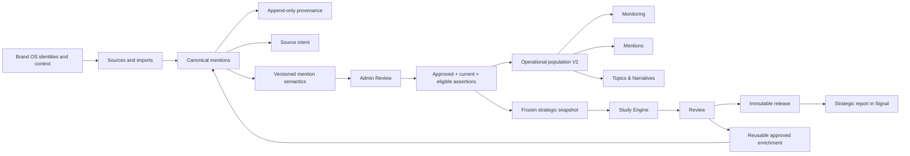

# Noisia Workspace OS — branch context and continuation handoff

> **Status:** branch-wide context handoff
>
> **Branch:** `codex/noisia-data-os-cut-1-wip`
>
> **Last reconstructed:** 2026-08-12
> **Audience:** coding agents and engineers continuing Data OS, Brand OS, Study OS,
> Signal V2 or the internal Admin
>
> **Purpose:** explain what exists in production, what this branch changes, why it
> changes it, what has actually been proven, and what must be inspected before the
> next implementation.

This document is the entry point for the **whole branch**. It is intentionally broader
than the frontend recovery handoff in
[48_NOISIA_ADMIN_MENTIONS_FRONTEND_HANDOFF.md](./48_NOISIA_ADMIN_MENTIONS_FRONTEND_HANDOFF.md).

It does not replace the product specs, ADRs, runbooks, migration evidence or source
code. It tells a new task **how to read them without confusing intent, local code,
staging evidence and production reality**.

---

## 1. Executive summary

Noisia is moving from a study/corpus/output-centric product to a persistent
brand/workspace intelligence system.

The old center of gravity is approximately:

```text
Brand
  -> Study
    -> Corpus
      -> Imports and mentions
        -> Engine output / published payload
          -> Report page
```

The target center of gravity is:

```text
Organization
  -> Brand
    -> Signal workspace
      -> Sources and imports
        -> Canonical mentions + provenance
          -> Governed semantic assertions
            -> Operational populations
              -> Brand Monitoring / Mentions / Topics & Narratives
            -> Frozen strategic snapshots
              -> Study Engine / Review / immutable release
                -> Strategic report in the same Signal workspace
```

The branch exists because the old model makes the study or generated output behave as
the owner of data. That creates copies, static payloads, disconnected enrichments,
study-specific URLs and frontend “data blenders”. The new model makes the workspace own
each canonical mention once and lets operational modules and strategic studies consume
governed views of those same records.

The central rule is:

> **Admin writes and governs. Signal consumes. Studies freeze and interpret; they do
> not own or duplicate mentions.**

---

## 2. The four truth levels — never collapse them

Every continuation must label a claim with one of these levels.

### 2.1 Production truth

Production truth is what is deployed and connected to the production database and
workers **at the time of the audit**.

- Do not infer it from `main`.
- Do not infer it from the current branch.
- Do not infer it from a successful local test.
- Do not infer it from a migration file existing.
- Do not infer it from a screenshot of localhost.
- Audit production read-only before making claims about it.

The last reconstructed operating picture is that production still uses significant
legacy study/corpus/output ownership and legacy readers. Treat that as a hypothesis to
verify, not as permission to mutate production.

### 2.2 Branch implementation truth

This is code and schema present in
`codex/noisia-data-os-cut-1-wip`. It may be locally tested but not deployed.

The worktree is intentionally dirty and contains valid work from many missions. Never
reset, stash, clean, mass-format or revert it. Inspect before editing.

### 2.3 Local or staging evidence

This is behavior actually reproduced against disposable PostgreSQL/Redis or the isolated
`noisia-staging` project. It is stronger than code presence, but it is still not a
production cutover.

Remote evidence must identify:

- target and environment class;
- migration ledger/checksums;
- restore point;
- read/write mode;
- before/after invariants;
- whether workers were connected;
- whether shadow, canary or cutover occurred.

### 2.4 Product target

This is the approved North Star and architecture. Some parts are shipped, some are
implemented behind flags, and some remain future work. A product target is not evidence
that a reader, route or UI already uses it.

### Mandatory status vocabulary

Use these labels in handoffs and final answers:

- `production_verified`
- `staging_verified`
- `local_verified`
- `implemented_unverified`
- `documented_target`
- `blocked`
- `legacy_bridge`

Avoid vague claims such as “done”, “live”, “migrated” or “ready” without a level and a
named gate.

---

## 3. Why this branch exists

The branch is not a collection of unrelated redesigns. Its backend and frontend changes
solve one ownership problem from opposite sides.

### Problems in the legacy product model

1. A brand is created, then a study/corpus becomes the practical owner of mentions.
2. Re-running a study can create a new output or page instead of strengthening the same
   workspace.
3. Operational monitoring and strategic analysis can read different populations.
4. Enrichment can remain trapped in an output payload instead of returning to the
   canonical mention.
5. Client serving can hydrate from large JSON payloads or study-specific adapters.
6. `?study=` and output identifiers leak backend lifecycle into client navigation.
7. Batch labels can be mistaken for mention-level semantic truth.
8. Admin and Signal can expose inconsistent data, filters and design systems.

### Intended correction

1. The brand has one persistent Signal workspace.
2. Sources and imports feed canonical mentions into that workspace before any study.
3. Provenance is append-only and remains connected to the original record.
4. Scope is governed at mention level, not inherited blindly from a batch.
5. Operational populations and strategic snapshots are explicit server-owned data
   products.
6. Studies produce reviewed revisions/releases inside the workspace.
7. Approved reusable enrichment returns to canonical records through relational tables
   and APIs.
8. Signal V2 is the stable client-facing read surface; Admin is the operator-facing
   governance surface.

The foundational decisions are captured in:

- [31_SIGNAL_PRODUCT_NORTH_STAR.md](./31_SIGNAL_PRODUCT_NORTH_STAR.md)
- [42_SIGNAL_WORKSPACE_DATA_OWNERSHIP.md](./42_SIGNAL_WORKSPACE_DATA_OWNERSHIP.md)
- [50_SIGNAL_GOVERNED_VIEWS_AND_POPULATION_POLICIES.md](./50_SIGNAL_GOVERNED_VIEWS_AND_POPULATION_POLICIES.md)
- [ADR 014 — workspace-owned data plane](../adr/014-signal-workspace-owned-data-plane.md)
- [ADR 009 — always-on and strategic Signal](../adr/009-signal-always-on-strategic-dashboard.md)

---

## 4. Product boundaries: what each “OS” owns

### 4.1 Brand OS

Brand OS is the governed identity and context of the brand:

- organization and brand identity;
- display name and slug;
- aliases, handles and markets;
- industry and subindustry;
- primary-brand identities;
- governed competitors and category entities;
- strategic brand context;
- connected Knowledge Base context.

Brand OS is not a decorative onboarding form and not an opaque generated blob. Its data
must persist relationally and be reusable by ingestion, classification, studies and
serving.

Read:

- [27_BRAND_OS_DATA_OS_PERSISTENCE_AUDIT.md](./27_BRAND_OS_DATA_OS_PERSISTENCE_AUDIT.md)
- [22_NOISIA_DATA_OS_CUT_1.md](./22_NOISIA_DATA_OS_CUT_1.md)
- `apps/studio/src/app/studio/brands/[id]/brand-os/page.tsx`
- `apps/studio/src/lib/data/brands.ts`
- `apps/studio/src/lib/data/admin-workspace.ts`
- Brand routes under `apps/studio/src/app/studio/brands/`

Historical warning: the Brand OS persistence audit recorded a gap where edits to the
brand record did not necessarily synchronize every Data OS projection. Verify current
code and database behavior; do not assume the old gap is fixed or still present.

### 4.2 Data OS

Data OS owns the durable data plane:

- source catalog and imports;
- canonical records and aliases;
- import/study provenance;
- inclusion, exclusion and quality state;
- semantic scope assertions and Review history;
- operational populations and pointers;
- frozen strategic populations/snapshots;
- materializations, freshness and invalidation;
- lineage and serving APIs;
- enrichment attached to canonical records.

Data OS exists specifically to prevent Claude or any report generator from “liquefying”
the evidence into a static JSON object.

Read:

- [22_NOISIA_DATA_OS_CUT_1.md](./22_NOISIA_DATA_OS_CUT_1.md)
- [23_NOISIA_DATA_OS_STAGING_RUNBOOK.md](./23_NOISIA_DATA_OS_STAGING_RUNBOOK.md)
- [26_NOISIA_DATA_OS_COMPLETION_AUDIT.md](./26_NOISIA_DATA_OS_COMPLETION_AUDIT.md)
- [42_SIGNAL_WORKSPACE_DATA_OWNERSHIP.md](./42_SIGNAL_WORKSPACE_DATA_OWNERSHIP.md)
- [44_SIGNAL_WORKSPACE_DATA_PLANE_HANDOFF.md](./44_SIGNAL_WORKSPACE_DATA_PLANE_HANDOFF.md)
- [45_SIGNAL_WORKSPACE_DATA_PLANE_IMPLEMENTATION_AUDIT.md](./45_SIGNAL_WORKSPACE_DATA_PLANE_IMPLEMENTATION_AUDIT.md)
- [47_SIGNAL_WORKSPACE_STAGING_REHEARSAL.md](./47_SIGNAL_WORKSPACE_STAGING_REHEARSAL.md)
- [ADR 007 — Data OS Cut 1](../adr/007-noisia-data-os-cut-1.md)

### 4.3 Study OS

Study OS owns the strategic analysis lifecycle, not the mentions:

- study/report definition;
- frozen governed population;
- period, timezone, watermarks and policy versions;
- engine run and cost controls;
- candidate findings;
- human Review;
- immutable release;
- current report pointer;
- lineage from finding to evidence and canonical mention.

A new Triggers & Barriers run should create a new candidate revision and, after Review,
a new release of the same workspace report. It should not create a second client page or
copy the corpus.

Read:

- [28_CORPUS_ENGINE_VALIDATION_CONTRACT.md](./28_CORPUS_ENGINE_VALIDATION_CONTRACT.md)
- [41_SIGNAL_TRIGGERS_BARRIERS_V2_HANDOFF.md](./41_SIGNAL_TRIGGERS_BARRIERS_V2_HANDOFF.md)
- [42_SIGNAL_WORKSPACE_DATA_OWNERSHIP.md](./42_SIGNAL_WORKSPACE_DATA_OWNERSHIP.md)
- [ADR 008 — artifact and evidence graph](../adr/008-analysis-artifact-evidence-graph.md)
- `apps/studio/src/lib/data-os/signal-strategic-consumption.ts`
- `services/workers/src/workers/signal-strategic-run-outbox.ts`
- Triggers & Barriers engine and Review paths under `apps/studio`, `packages/query-engine`
  and `services/workers`.

Claude may interpret evidence within a governed job. It may not become the owner of the
population, silently approve backend state or replace canonical relational data.

### 4.4 Signal V2

Signal V2 is the client-facing workspace experience:

- one stable `/signal/{workspaceSlug}` identity;
- Brand Monitoring;
- Mentions;
- Topics & Narratives;
- strategic reports such as Triggers & Barriers;
- evidence and releases;
- consistent dates, filters, loading, navigation and drawers.

Signal V2 consumes governed APIs. It does not edit source truth and must never hydrate a
whole product surface from `published_outputs.payload` or another static report blob.

Read:

- [31_SIGNAL_PRODUCT_NORTH_STAR.md](./31_SIGNAL_PRODUCT_NORTH_STAR.md)
- [32_SIGNAL_BACKEND_EXECUTION_ROADMAP.md](./32_SIGNAL_BACKEND_EXECUTION_ROADMAP.md)
- [33_SIGNAL_V2_SHOPIFY_UI_REFERENCE.md](./33_SIGNAL_V2_SHOPIFY_UI_REFERENCE.md)
- [34_SIGNAL_BRAND_MONITORING_V1.md](./34_SIGNAL_BRAND_MONITORING_V1.md)
- [35_SIGNAL_FILTERING_ARCHITECTURE.md](./35_SIGNAL_FILTERING_ARCHITECTURE.md)
- [37_SIGNAL_WORKSPACE_INFORMATION_ARCHITECTURE.md](./37_SIGNAL_WORKSPACE_INFORMATION_ARCHITECTURE.md)
- [38_SIGNAL_LOADING_AND_NAVIGATION_STANDARD.md](./38_SIGNAL_LOADING_AND_NAVIGATION_STANDARD.md)
- [38_SIGNAL_TOPICS_NARRATIVES_BACKEND_EXECUTION.md](./38_SIGNAL_TOPICS_NARRATIVES_BACKEND_EXECUTION.md)
- [39_SIGNAL_TOPICS_NARRATIVES_BACKEND_AUDIT.md](./39_SIGNAL_TOPICS_NARRATIVES_BACKEND_AUDIT.md)
- [40_SIGNAL_TOPICS_NARRATIVES_STAGING_RUNBOOK.md](./40_SIGNAL_TOPICS_NARRATIVES_STAGING_RUNBOOK.md)
- [43_SIGNAL_V2_FRONTEND_SYSTEM.md](./43_SIGNAL_V2_FRONTEND_SYSTEM.md)
- [50_SIGNAL_GOVERNED_VIEWS_AND_POPULATION_POLICIES.md](./50_SIGNAL_GOVERNED_VIEWS_AND_POPULATION_POLICIES.md)

Primary code map:

- `apps/studio/src/components/signal-v2/SignalV2WorkspacePage.tsx`
- `apps/studio/src/components/signal-v2/SignalV2BrandMonitoring.tsx`
- `apps/studio/src/components/signal-v2/SignalV2Mentions.tsx`
- `apps/studio/src/components/signal-v2/SignalV2TopicsNarratives.tsx`
- `apps/studio/src/components/signal-v2/SignalV2TriggersBarriers.tsx`
- `apps/studio/src/components/signal-v2/SignalV2Settings.tsx`
- `apps/studio/src/app/signal-v2/signal-v2.css`
- `apps/studio/src/components/workspace/WorkspaceShell.tsx`

### 4.5 Noisia Admin

Admin is the internal operator surface. It shares canonical visual primitives and shell
metrics with Signal V2 but has different permissions and jobs:

- brands and Brand OS;
- sources, imports, freshness and quality;
- canonical mention management;
- semantic Review and correction history;
- studies, reports and releases;
- team, access and configuration;
- operator-only lineage and technical state.

Admin must be more capable than Signal for data management. Signal is not an acceptable
escape hatch for actions that belong to operators.

Read:

- [46_NOISIA_ADMIN_FRONTEND_AUDIT.md](./46_NOISIA_ADMIN_FRONTEND_AUDIT.md)
- [48_NOISIA_ADMIN_MENTIONS_FRONTEND_HANDOFF.md](./48_NOISIA_ADMIN_MENTIONS_FRONTEND_HANDOFF.md)
- `apps/studio/src/components/workspace/AdminShell.tsx`
- `apps/studio/src/components/admin/AdminBrandMentionsManager.tsx`
- `apps/studio/src/components/admin/AdminSemanticReviewExperience.tsx`
- `apps/studio/src/components/admin/SemanticReviewQueue.tsx`
- `apps/studio/src/components/mentions/MentionsBrowser.tsx`
- routes under `apps/studio/src/app/studio/`

---

## 5. Canonical data flow and invariants



### Non-negotiable invariants

1. A canonical mention is persisted once per workspace identity.
2. An alias resolves to a root; it does not create another metric record.
3. Provenance is preserved even when semantic classification changes.
4. `source_intent` describes acquisition context, not mention-level semantic truth.
5. Only `current + approved + eligible` mention semantics may feed Operational V2.
6. `primary_brand` drives the default client denominator.
7. Competitor and category are explicit exploration scopes, not hidden denominator
   inflation.
8. `reference` and `unattributed` remain available for lineage/QA but are not default
   operational metrics.
9. A strategic snapshot contains IDs, policy, watermarks and quality state—not a duplicate
   corpus or full dashboard JSON.
10. Approved enrichment remains connected to the canonical mention.
11. AuthZ is server-side and DB-owned. Kinde only authenticates.
12. A feature flag or migration bridge is not the target architecture.

---

## 6. Production vs branch vs target

| Concern | Production / legacy assumption to verify | Current branch direction | Target state |
|---|---|---|---|
| Ownership | Study/corpus often acts as mention owner | Workspace ownership schema and adapters exist | Workspace is sole canonical owner |
| Identity | Study/output IDs leak into routes | Workspace IDs/slugs introduced | Stable workspace URL and report keys |
| Ingestion | Imports commonly attach to a corpus | Brand/workspace source catalog and provenance | Mentions arrive before studies |
| Scope | Batch `mention_type` can act as truth | Source intent separated from semantic assertions | Approved mention-level semantics |
| Operational serving | Legacy readers and mixed denominators | Governed readers, shadow and invalidation exist | Operational V2 is sole reader |
| Strategic analysis | Output/payload can become product | Relational snapshots/releases/outbox exist | Study revisions over frozen workspace population |
| Enrichment | Can remain trapped in an output | Canonical enrichment contracts exist | Reusable approved enrichment on canonical record |
| Signal | Report/study-oriented adapters | Signal V2 workspace UI implemented | One persistent client workspace |
| Admin | Fragmented legacy screens | New shell, brand workspace and Review UI are WIP | Complete operator governance surface |
| Frontend data | Large payload/static render risk | Serving APIs and compact adapters | Paginated/filterable DB/API serving only |

This matrix is a reading guide, not deployment evidence. The first column must be
confirmed through a production audit before cutover or cleanup.

---

## 7. Migration and implementation timeline

The exact SQL is the source of truth. Read each migration; do not trust this summary as a
substitute.

| Migration | Responsibility | Evidence reconstructed | Production status |
|---|---|---|---|
| 0059 | Workspace-owned data plane, canonical roots, provenance, populations | Local and `noisia-staging` rehearsal reported verified | Unknown; inspect production |
| 0060 | Operational population serving | Local and staging schema evidence | Unknown |
| 0061 | Membership invalidation and module shadow outbox | Local PostgreSQL/invalidation tests | Unknown |
| 0062 | Strategic consumption, snapshots/releases | Local PostgreSQL integration | Unknown |
| 0063 | Durable strategic-run outbox recovery | Local PostgreSQL + BullMQ/Redis tests | Unknown |
| 0064 | Semantic scope hardening; source intent vs mention semantic; V2 draft | Local verified and reported applied to `noisia-staging` | Unknown |
| 0065 | Governed semantic resolution runs/items and Review integration | Present locally and reported applied/verified on `noisia-staging` | Unknown |
| 0066 | Anthropic Message Batches durability and accounting | Present in worktree; current remote ledger/status must be inspected | Unknown |
| 0067 | Canonical mention governance events and operator actions | Applied and verified on `noisia-staging` | Unknown |
| 0068 | Governed-view policy bundles, compilations and bindings | `staging_verified`; no current binding created | Unknown |
| 0069 | Versioned quality, retention and licensing authorities; module-isolated derivations | `staging_verified`; Backend 04B produced three ready/current compilations | Unknown |
| 0070 | Semantic base isolation and contamination guard | `staging_verified`; exact 0064 base normalized without membership change | Unknown |
| 0071 | Atomic governed brand binding sets and append-only `withdraw-to-bridge` | `staging_verified`; promote → bridge withdrawal → re-promote completed with protected state unchanged | Unknown |
| 0072 | Binding-set actor, bundle, identity and exact-cardinality integrity | `staging_verified`; canary governed visible ensayado y proceso restaurado a legacy | Unknown |
| 0073 | Neutral attributable semantic base and atomic binding sets for four closed client views | `staging_verified`; SHA-256 `8cc2d1c5…58cae`, 39/39 sentinels, nueve bindings/population refs no-brand y shadow read-only con `unexplained_count=0` | Unknown |
| 0074 | Governed strategic preflight, atomic launch, runtime authority, budget/step FSM and idempotent Review/release | `staging_verified`; SHA-256 `1eb15739…e13d69`, 108/108 sentinels, 8/8 markers, ledger único y protected digest sin cambios | Unknown |

Migration files:

- `infrastructure/db/migrations/0059_signal_workspace_owned_data_plane.sql`
- `infrastructure/db/migrations/0060_signal_operational_population_serving.sql`
- `infrastructure/db/migrations/0061_signal_operational_membership_invalidation_shadow_outbox.sql`
- `infrastructure/db/migrations/0062_signal_strategic_consumption.sql`
- `infrastructure/db/migrations/0063_signal_strategic_run_outbox_recovery.sql`
- `infrastructure/db/migrations/0064_signal_semantic_scope_hardening.sql`
- `infrastructure/db/migrations/0065_signal_semantic_resolution.sql`
- `infrastructure/db/migrations/0066_signal_semantic_resolution_message_batches.sql`
- `infrastructure/db/migrations/0067_signal_canonical_mention_governance.sql`
- `infrastructure/db/migrations/0068_signal_governed_views_population_policies.sql`
- `infrastructure/db/migrations/0069_signal_data_governance_policies.sql`
- `infrastructure/db/migrations/0070_signal_semantic_base_isolation.sql`
- `infrastructure/db/migrations/0071_signal_governed_brand_binding_withdrawal.sql`
- `infrastructure/db/migrations/0072_signal_governed_brand_binding_set_integrity.sql`
- `infrastructure/db/migrations/0073_signal_governed_multi_view_binding_sets.sql`
- `infrastructure/db/migrations/0074_signal_strategic_gate_d_preflight.sql`

### Important documentation lag

The durable canon and staging runbook describe 0059–0064 and Phase 7B in depth. The
worktree already contains 0065–0066 and resolver/UI/worker code that is newer than parts
of those documents.

Therefore:

- treat 0065–0066 as **implementation present that must be verified**;
- inspect the remote migration ledger before claiming they exist on staging;
- inspect current API/DB state before trusting UI counters;
- update the audit/runbook after evidence is reconciled;
- never declare a production cutover from worktree presence.

---

## 8. Reconstructed evidence to verify, not blindly repeat

The branch handoffs and staging artifacts reported the following sequence for Laika on
`noisia-staging`:

1. 0059–0063 were applied and verified against an isolated/restorable preview.
2. A read-only audit found 4,587 canonical records.
3. Legacy included 729 records:
   - 192 `primary_brand`;
   - 502 `competitor`;
   - 29 `category`;
   - 6 `unattributed`.
4. Another 3,858 records were retained but excluded.
5. A semantic sample proved that batch-level scope was not reliable mention-level truth.
6. That finding produced 0064: source intent became non-eligible provenance and semantic
   assertions became versioned/reviewable.
7. 0064 was rehearsed without moving the V1 pointer; V2 started as a draft candidate.
8. A deterministic candidate pass reported 178 candidates and 551 unresolved roots.
9. 0065 added durable governed resolver runs/items and cost/accounting controls.
10. 0066 added provider Message Batch state to avoid fragile per-request execution.

Later UI work showed counters such as zero candidates/unresolved and 729 approved, while
also exposing stale or conflicting assertion states on some multi-entity mentions. That
means the current semantic state must be reconciled directly in SQL/API. Do not canonize
the screenshot or a previous final answer.

If `.data/signal-7a/` exists locally, it may contain private rehearsal artifacts. It is
not versioned canon. Handle it as sensitive evidence, do not quote mention text or IDs in
public docs, and do not commit it.

---

## 9. Current state by workstream

### Data OS

**Implemented/proven locally**

- relational ownership and provenance;
- canonical identity/root model;
- operational populations and pointers;
- materialization freshness/invalidation;
- module shadow infrastructure;
- strategic snapshots/releases;
- durable strategic and semantic resolver outboxes;
- mention-level semantic Review contract;
- aliases and canonical enrichment resolution tests;
- fail-closed scope rules.

**Still gated**

- current staging truth after 0065/0066 and resolver runs;
- promotion of Operational V2 current pointer;
- full module reconciliation on current real staging data;
- production read-only audit and controlled rehearsal;
- eventual removal of V1/legacy bridges.

### Brand OS

**Present**

- brand onboarding/context and Data OS catalog integration;
- internal Admin brand workspace routes;
- aliases, markets, competitors and Knowledge Base concepts.

**Must be verified/completed**

- edits synchronize every governed projection;
- identities are sufficient for semantic resolution;
- competitor/category entities are governed rather than free text;
- new imports use Brand OS identity without auto-approving scope;
- operator UX is consistent across overview, data, Brand OS, reports and access.

### Study OS / Triggers & Barriers

**Present**

- relational strategic consumption contracts;
- snapshots/releases/current report pointer;
- durable run dispatch/recovery;
- Gate D preflight read-only, atomic governed launch, sealed deterministic sample,
  runtime authority, exact budget reservations and durable step FSM;
- atomic/idempotent Review + release draft and idempotent current-release promotion;
- T&B V2 client UI and evidence linkage.

**Still gated**

- the free preflight already ran with zero writes/jobs/provider calls and returned
  `ready=false`; rerun it only after its exact blockers are resolved;
- create an operator-approved strategic binding and explicit provenance authorization
  for both `llm-processing` and `strategic-analysis`; generic staging write authority
  is not a legal-use decision;
- make the governed Worker and recovery path ready;
- a real workspace-native T&B run on approved Operational V2 semantics;
- Review and publication of that run;
- proof that approved reusable enrichment returns to canonical mentions;
- removal of `?study=` only after compatible workspace-native navigation is proven;
- one report identity with revisions, not duplicated sidebar pages.

### Signal V2

**Present**

- unified workspace shell;
- Brand Monitoring, Mentions, Topics & Narratives and T&B surfaces;
- canonical loading/navigation rules;
- shared filters/drawers/helpers/chips/chart wrapper;
- Topics & Narratives governed serving and evidence flows;
- performance and skeleton work.

**Still gated**

- all modules reading the same promoted Operational V2 population;
- complete navigation and console QA after reader switch;
- current T&B release restored on the same workspace without study coupling;
- cleanup of legacy adapters only after measured equivalence/correctness.

### Admin

**Present but incomplete**

- internal shell and brand workspace information architecture;
- Dashboard/Brands/Data/Reports/Team/Settings work;
- semantic Review queue and Claude resolver controls;
- a first Admin Mentions management surface.

**Known frontend recovery area**

The Admin Mentions surface is currently below the intended product bar. It must be a
first-class subsection of the brand workspace, more capable than client Mentions, with
filtering, sorting, visible columns, selection, bulk actions, canonical enriched drawer,
editing and semantic correction. See
[48_NOISIA_ADMIN_MENTIONS_FRONTEND_HANDOFF.md](./48_NOISIA_ADMIN_MENTIONS_FRONTEND_HANDOFF.md).

Do not continue by embedding another partial mentions list inside “Data & sources”.

---

## 10. The fixture is not a parallel product

The Admin QA fixture is disposable **database state** used to render and test the real
Admin code against the new schema.

It is not:

- a standalone frontend;
- a fake backend architecture;
- a second implementation to migrate later;
- a substitute for staging;
- evidence of production readiness.

Its purpose is to provide deterministic local identities, sources, imports, mentions,
profiles, snapshots, releases and an authorized user after a disposable database reset.
The actual UI components, routes and server adapters remain the same code paths.

`noisia-staging`, by contrast, is the real isolated rehearsal database containing Laika
and branch-era data. Never point a local dev process at an unknown remote target without
an explicit environment audit and authorization.

---

## 11. Decisions that are closed unless evidence disproves them

Do not reopen these as greenfield product questions:

1. The workspace, not the study, owns mentions.
2. Brand Monitoring is operational and always-on.
3. Topics & Narratives is operational enrichment over the same population.
4. T&B is strategic, versioned and published inside the same workspace.
5. A new T&B run creates a revision, not another client navigation item.
6. `primary_brand` is the default operational denominator.
7. Batch source intent is not approved mention semantic truth.
8. Governed semantic Review is append-only and versioned.
9. `unattributed` can be an honest final reviewed state and remains outside default
   metrics.
10. Data must be served from relational DB/API contracts, filterable and traceable to
    original mentions.
11. Client Signal must not read `published_outputs.payload` as its source of truth.
12. Admin and Signal share a frontend system; Admin has operator capabilities and Signal
    has client-safe read capabilities.
13. Shopify is a behavior/density benchmark, not a license to copy isolated CSS or build
    standalone screens.
14. V1 is a rollback/migration bridge, not the architecture target.

---

## 12. Known gaps and recommended continuation order

### Gate A — reconcile actual semantic state

Before more UI or cutover work:

1. Inspect the `noisia-staging` migration ledger for 0064–0067.
2. Inspect semantic resolver runs/items, Review events and current assertions.
3. Reconcile counts by final state and multi-entity mention.
4. Prove there are no stale pending assertions presented as actionable after a final
   reviewed assertion.
5. Verify provider batch completion, token/cost accounting and errors.
6. Produce a redacted evidence pack.

### Gate B — implement governed policies and bindings

Estado al cierre de Backend 04C: 0068 implementa bundle/compilation/binding y 0069
agrega autoridades verificables de quality, retention y licensing por provenance.
Ambas están `staging_verified`; Backend 05A creó tres current bindings `brand`, pero no
hay cambios de reader visible. Las
policies cargadas por Backend 04B son decisiones explícitas, acotadas a la fixture Laika
en staging y no constituyen defaults de producción. El hardening final de 0069 deja los writers como statements
transaccionales con advisory locks e idempotencia concurrente; persiste la próxima
frontera temporal y exige watermark durable antes de permitir una compilación `ready` o
un binding. La invalidación de provenance recorre todas las rutas import/source de la
raíz, incluso las que no fueron seleccionadas por la evaluación anterior. Los usos de
licencia se resuelven por módulo/view y no mediante una unión global.

Backend 03.2 cierra localmente el aislamiento de denominadores: la candidata semántica
`brand` permanece compartida como base, pero 0069 deriva una population estable por
`(workspace_id, module_key, view_key, policy_bundle_id)`. La evaluación, compilación,
watermark, digest y evidence referencian esa population exacta. `required_usage_purposes`
del bundle es un capability envelope; la compilación sólo puede usar el subset exacto
cerrado del módulo. No se crea ningún binding ni pointer durante la derivación.

La fixture PostgreSQL divergente deja simultáneamente `ready/current` a Monitoring y
Topics & Narratives con una raíz autorizada para métricas, y a Mentions sin esa raíz
porque listado/excerpt están prohibidos. Los conteos observados fueron `5 / 4 / 5`, con
tres population refs distintas, resultado independiente del orden e invalidación
acotada a `client-mention-list` sólo sobre Mentions. Operational V1 quedó idéntica.

Backend 04B completó el rehearsal gobernado en `noisia-staging`: tres derivaciones
distintas quedaron `ready/current`, con el mismo conjunto autorizado, cero diferencias
inexplicadas, cero current governed bindings y cero pointers V2. Backend 04C aplicó 0070
y normalizó la candidata `signal-operational-primary-brand-semantic-v2` al contrato
exacto de 0064. La base conservó 276 memberships y su digest; recompilar en orden normal
e inverso dejó base, V1, derivaciones y compilaciones semánticamente idénticas. Readers,
producción y cutover permanecen pendientes.

Backend 05A aplicó 0071 exclusivamente en `noisia-staging` y cerró la salida auditable
de la primera promoción. El orquestador promovió atómicamente los tres bindings
`brand`, comprobó resolución `governed-binding`, retiró los tres mediante
`withdraw-to-bridge`, comprobó la resolución natural del bridge y re-promovió un set
nuevo. El historial conserva `promote → withdraw-to-bridge → promote`; al cierre hay
exactamente tres current bindings y cero pointers V2. Operational V1, su pointer, la
base semántica, Review, assertions y compilaciones conservaron sus hashes. Esto no
conecta readers: Signal visible y las APIs cliente continúan fuera de este gate.

Backend 05B dejó localmente module-aware el consumo de esos bindings sin activar el
reader visible. El resolver distingue ausencia real de binding (bridge) de binding
current inválido (`not_available`); Monitoring, Mentions y Topics & Narratives reciben
population/compilation/watermark propios, y cualquier texto de Monitoring o T&N se
intersecta con la capability exacta de Mentions. ETags y cursores incluyen la autoridad
completa. El shadow read-only de `noisia-staging` obtuvo tres population refs distintas,
denominador 271 por módulo, coverage `partial`, `abstained=not_available/count=null`,
`unexplained_count=0` y `operational_pointer_followed=false`. Backend 05B pasó Advisor
con cero P0/P1. Backend 05C aplicó 0072 exclusivamente en staging, ejecutó el canary
governed visible, comprobó los tres módulos y restauró el proceso a legacy sin mover
pointers o bindings. El checkpoint 05C también pasó Advisor con cero P0/P1.

Backend 06 agregó y verificó 0073 en `noisia-staging` sin alterar 0068–0072. La view `brand` conserva la
base semántica estricta de 0064 y su retiro `withdraw-to-bridge`. `competition`,
`category` y `all-governed` comparten una base neutral workspace-scoped de raíces con
assertions current+approved+eligible y entidades gobernadas, pero cada módulo/view
mantiene una derivación, population, digest, watermark, evaluación y compilación
propios. La base neutral no contiene quality, rights, periodo ni identidad de módulo y
no es creada automáticamente por la migración. `all-governed` compila una unión
explícita no vacía de scopes realmente gobernados y deduplica por raíz; no exige una
entidad `reference` inexistente ni admite `unattributed`.

El ledger append-only de binding sets se generaliza in-place para las cuatro views,
siempre con Monitoring, Mentions y Topics & Narratives como set exacto. Las views sin
bridge usan `withdraw-to-absence`; actor, bundle, entidad, CAS, idempotencia y
cross-workspace permanecen fail-closed. La prueba local cubrió merge/split de aliases,
multi-entidad, retiro de entidad gobernada e invalidación selectiva, retry/concurrencia
y preservación de V1 y de la base `brand`. El runner específico de 0073 usa checksum,
ledger, advisory lock, sentinels y hash de estado protegido. El rehearsal remoto dejó
nueve bindings y nueve population refs distintas para `competition`, `category` y
`all-governed`; la unión fue exacta y deduplicada, `governance_unknown_count=0`,
`unexplained_count=0` y el pointer operacional no cambió. Advisor autorizó avanzar con
cero P0/P1.

1. Treat policies as source of truth and memberships/materializations as derived state.
2. Add versioned `(workspace, module, view_key) → policy bundle` bindings forward-only.
3. Preserve the operational pointer as the temporary `brand` bridge.
4. Reconcile IDs, scopes, periods, hashes, coverage and denominators.
5. Verify evidence, aliases, multi-membership and cross-view AuthZ.
6. Do not create a physical population for every facet or UI filter.

### Gate C — connect the promoted brand bindings and finish multi-view serving

1. Consume server-side the already promoted `brand` binding set; do not move the
   operational pointer or let clients select population IDs.
2. Include population reference, policy, watermark, coverage and denominator in serving.
3. Conservar como autoridad las nueve derivaciones/bindings de 0073 ya verificadas en
   staging; competition/category/all-governed son las únicas nuevas views client-safe
   nombradas y no autorizan crear populations ad hoc.
4. Exercise authZ, pagination, cursors, ETags, freshness and invalidation per view.
5. Measure visible latency and materialization/rebuild cost.
6. Run browser QA in es-MX and en-US with zero raw translation keys or console errors.
7. Stop pursuing equality with contaminated legacy scope; require explained differences
   and governed correctness.

### Gate D — run Study OS end to end

1. Preserve the `staging_verified` 0074 foundation and its protected-state digest.
2. Resolve the observed blockers without weakening guards: no current strategic binding,
   zero provenance routes allowing both usages, Worker offline and recovery not ready.
3. Rerun the free read-only preflight for exact strategic binding/policies, population,
   provenance, denominator/coverage, Worker readiness, closed provider plan and hard cap.
   Stop again if either usage lacks explicit current licensing authority; do not infer
   rights from a general staging permission.
4. Let the operator freeze/launch only after `ready=true`, `launch_authorized=true`, an
   explicit cap and a current `preflight_digest`. The free gate never launches itself.
5. Review and publish through the idempotent V2 operations; confirm evidence opens the
   canonical Admin/Signal mention and respects client list/excerpt authority.
6. Confirm approved reusable enrichment returns to the canonical record and a later run
   creates a revision of the same report.

### Gate E — complete Admin product surfaces

1. Recover Admin Mentions according to doc 48.
2. Finish the brand workspace journey: Overview, Data & sources, Mentions, Semantic
   Review, Brand OS, Reports, Access & configuration.
3. Use shared primitives and page-level information architecture, not nested-card
   patches.
4. Keep filters, loading, helpers, drawers, notices and bulk actions canonical.
5. Verify responsive behavior and real navigation.

### Gate F — production audit, cutover and cleanup

1. Audit production read-only and document the actual deployed schema/readers.
2. Create or confirm a restore point and isolated rehearsal.
3. Apply forward-only migrations using the guarded runners.
4. Backfill selected workspaces and run semantic Review.
5. Run shadow/canary with evidence and rollback.
6. Cut readers only with explicit authorization.
7. Remove V1/legacy bridges only after the target readers have been proven.

---

## 13. Frontend system rules for every continuation

Read [43_SIGNAL_V2_FRONTEND_SYSTEM.md](./43_SIGNAL_V2_FRONTEND_SYSTEM.md) and
`apps/studio/AGENTS.md` before touching Studio.

At minimum:

- reuse shell, navigation, filters, helpers, chips, drawers, notices and skeletons;
- do not recreate a local variant because a page is “internal”;
- static shell stays visible while variable data loads;
- skeleton geometry matches final content and respects reduced motion;
- navigation gives immediate feedback and protected links use `prefetch={false}`;
- filter drawer behavior is shared; primary period/sort controls follow the established
  module pattern;
- minimum functional text remains legible;
- focus-visible and keyboard behavior are not optional;
- all new copy exists in `en-US.json` and `es-MX.json`;
- do not use gradients, decorative mega-cards or generic AI-style left rules;
- validate in the browser rather than declaring parity from code inspection.

The user-facing benchmark is Shopify Admin adapted to Noisia/Product Sans density. When
Shopify is used as evidence, inspect behavior, geometry and states in the authenticated
browser. Translate the pattern into canonical Noisia primitives; do not paste one-off
Shopify-looking CSS into a page.

---

## 14. Authorization and safety boundaries

- Kinde authenticates; Noisia DB roles and brand access authorize.
- Never weaken server-side authZ to make QA pass.
- Do not add Kinde middleware back to Studio.
- Do not enable protected-route link prefetch.
- Never print, store or commit secrets, URLs with credentials or private mention text.
- Migrations are forward-only and hand-verified.
- Never mutate production from an exploratory task.
- LLM, embedding and strategic runs cost money; require an explicit cap and durable
  accounting.
- Do not run Claude, Voyage, T&B or backfills merely to make a UI screenshot.
- No commit or push unless the user explicitly requests it.

Read:

- `AGENTS.md`
- `apps/studio/AGENTS.md`
- `services/workers/AGENTS.md` when touching workers
- recheck for a nested DB `AGENTS.md` before touching DB code; none existed at this
  reconstruction checkpoint
- [docs/AGENT_GUARDRAILS.md](../AGENT_GUARDRAILS.md)

---

## 15. Required reading order for a new task

Do not start with random code search. Use this order:

### A. Operating rules

1. `AGENTS.md`
2. `apps/studio/AGENTS.md`
3. the nested `AGENTS.md` for every area to be changed
4. [docs/AGENT_GUARDRAILS.md](../AGENT_GUARDRAILS.md)

### B. Product and ownership canon

1. [31_SIGNAL_PRODUCT_NORTH_STAR.md](./31_SIGNAL_PRODUCT_NORTH_STAR.md)
2. [42_SIGNAL_WORKSPACE_DATA_OWNERSHIP.md](./42_SIGNAL_WORKSPACE_DATA_OWNERSHIP.md)
3. [ADR 014](../adr/014-signal-workspace-owned-data-plane.md)
4. [ADR 009](../adr/009-signal-always-on-strategic-dashboard.md)

### C. Data plane implementation and evidence

1. [22_NOISIA_DATA_OS_CUT_1.md](./22_NOISIA_DATA_OS_CUT_1.md)
2. [44_SIGNAL_WORKSPACE_DATA_PLANE_HANDOFF.md](./44_SIGNAL_WORKSPACE_DATA_PLANE_HANDOFF.md)
3. [45_SIGNAL_WORKSPACE_DATA_PLANE_IMPLEMENTATION_AUDIT.md](./45_SIGNAL_WORKSPACE_DATA_PLANE_IMPLEMENTATION_AUDIT.md)
4. [47_SIGNAL_WORKSPACE_STAGING_REHEARSAL.md](./47_SIGNAL_WORKSPACE_STAGING_REHEARSAL.md)
5. migrations 0059–0066 in order
6. relevant schema, serving adapters and workers

### D. Product surfaces

1. [43_SIGNAL_V2_FRONTEND_SYSTEM.md](./43_SIGNAL_V2_FRONTEND_SYSTEM.md)
2. [46_NOISIA_ADMIN_FRONTEND_AUDIT.md](./46_NOISIA_ADMIN_FRONTEND_AUDIT.md)
3. [48_NOISIA_ADMIN_MENTIONS_FRONTEND_HANDOFF.md](./48_NOISIA_ADMIN_MENTIONS_FRONTEND_HANDOFF.md)
4. relevant Signal V2 and Admin components

### E. Verify current state

1. `git status --short`
2. `git diff --stat`
3. inspect overlapping diffs before editing
4. inspect local processes and environment target without printing secrets
5. query migration/serving state read-only when authorized
6. reproduce the relevant UI route before changing it

---

## 16. Validation matrix

Choose checks proportionate to touched areas, but never claim a gate without running it.

### Studio

```bash
corepack pnpm --filter @noisia/studio typecheck
corepack pnpm --filter @noisia/studio test
corepack pnpm --filter @noisia/studio build
```

### Query Engine

```bash
corepack pnpm --filter @noisia/query-engine typecheck
corepack pnpm --filter @noisia/query-engine test
```

### Database

```bash
corepack pnpm --filter @noisia/db typecheck
corepack pnpm --filter @noisia/db test
```

Run the relevant opt-in PostgreSQL migration/integration test when schema or serving
semantics change.

### Workers

```bash
corepack pnpm --filter @noisia/workers typecheck
corepack pnpm --filter @noisia/workers test
```

Run real PostgreSQL/Redis integration for outbox, leasing, retries or provider batch
changes.

### Workspace hygiene

```bash
git diff --check
```

### Browser QA

- real navigation, not just direct URL loads;
- desktop, laptop and compact widths;
- es-MX and en-US;
- loading, empty, partial, error and success states;
- keyboard/focus behavior;
- no console errors;
- network/API responses match visible state;
- no layout shifts or stale selection.

---

## 17. Start prompt for a new branch-wide continuation task

Copy the prompt below into a fresh task. Append one concrete mission after the final
line; do not ask the new task to “finish the whole branch” in one pass.

```text
Continúa Noisia exactamente desde el estado local actual del workspace.

REPOSITORIO
/Users/brandhon_o/Downloads/noisia-website

RAMA
codex/noisia-data-os-cut-1-wip

PRIMERO
Lee por completo:
- /Users/brandhon_o/Downloads/noisia-website/AGENTS.md
- el AGENTS.md anidado de cada área que vayas a tocar
- /Users/brandhon_o/Downloads/noisia-website/docs/AGENT_GUARDRAILS.md
- /Users/brandhon_o/Downloads/noisia-website/docs/product/49_NOISIA_WORKSPACE_OS_BRANCH_CONTEXT_HANDOFF.md

Después sigue el orden de lectura que define el documento 49. No empieces a editar antes
de reconstruir el estado actual con git status, diffs solapados, código, migraciones y la
evidencia correspondiente.

CONTEXTO ESTRATÉGICO
Esta rama convierte Noisia de un producto study/corpus/output-centric a un workspace
persistente por marca. El workspace posee cada mención canónica una sola vez. Data OS
gobierna source catalog, imports, provenance, identidad canónica, semántica, poblaciones,
snapshots, materializaciones, lineage y serving. Brand OS gobierna identidad y contexto.
Study OS congela una población gobernada y produce revisiones/releases estratégicos sin
duplicar menciones. Signal V2 es la superficie cliente estable. Admin es la superficie
interna de escritura y gobierno.

REGLA DE VERDAD
Separa siempre:
1. producción realmente auditada;
2. implementación presente en la rama;
3. evidencia local;
4. evidencia de noisia-staging;
5. arquitectura objetivo.
No declares una como otra. main, un migration file, localhost o una suite verde no son
evidencia de producción.

ESTADO DEL WORKTREE
Está sucio y contiene trabajo válido de múltiples misiones. No hagas reset, checkout
destructivo, stash, clean, reformat general ni reviertas cambios ajenos. Inspecciona cada
archivo antes de editar. Usa apply_patch para cambios manuales. No hagas commit ni push
salvo autorización expresa.

INVARIANTES
- Admin escribe y gobierna; Signal consume.
- El workspace, no el study, posee menciones.
- Source intent no equivale a semántica aprobada.
- Sólo assertions current + approved + eligible alimentan Operational V2.
- primary_brand es el denominador operacional por defecto.
- Studies usan snapshots relacionales de IDs y publican revisiones del mismo reporte.
- No leas published_outputs.payload ni introduzcas JSON estático para servir Signal.
- Conserva authZ server-side, provenance, lineage, partial state y conexión a menciones.
- V1 es un bridge de rollback/migración, no el objetivo.
- No persigas paridad ciega con legacy si mezcla scopes; exige corrección gobernada y
  diferencias explicadas.

ANTES DE IMPLEMENTAR
Entrega un diagnóstico corto con:
- qué existe realmente;
- qué está probado y dónde;
- qué es legacy bridge;
- qué falta para el objetivo;
- archivos y contratos que reutilizarás;
- riesgos de authZ, datos, dinero, migración y frontend;
- alcance exacto de esta misión.

No hagas una implementación superficial ni paralela. Reutiliza el sistema existente,
prueba el flujo real y documenta cualquier diferencia entre código, docs, staging y
producción.

MISIÓN CONCRETA
[PEGAR AQUÍ UNA SOLA MISIÓN, SUS CRITERIOS DE ACEPTACIÓN Y LA VALIDACIÓN REQUERIDA]
```

---

## 18. Final reminder

The branch is one program, not four independent rewrites:

```text
Brand OS supplies governed identity
        ↓
Data OS owns and governs durable evidence
        ↓
Operational modules and Study OS consume governed populations
        ↓
Signal V2 presents client-safe intelligence
        ↑
Admin manages and corrects the system
```

If a change cannot explain where it lives in that flow, which contract owns it and how
its evidence remains connected to a canonical mention, it is probably recreating the
legacy problem this branch was built to remove.
