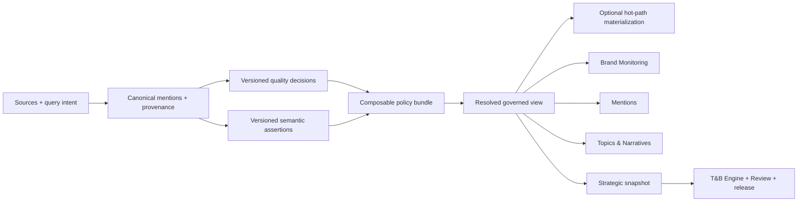

# 50 · Signal Governed Views And Population Policies

> **Estado:** canon de producto y datos; 0068–0076 `staging_verified`; Backend 05B,
> 05C, 06 y Backend 07 pasaron Advisor con cero P0/P1. El proceso visible operacional
> permanece restaurado a legacy. Gate D quedó desbloqueado para el operador en Laika:
> el GET gratuito devolvió `ready=true` y `launch_authorized=true` sin mutaciones, jobs
> ni provider calls. La corrida T&B pagada y cualquier cutover permanecen pendientes.
>
> **Fecha:** 2026-08-12.
>
> **Decisión central:** una mención puede pertenecer al workspace, ser visible y aportar
> contexto sin participar en el denominador principal de marca. Captura, calidad,
> semántica, elegibilidad, membership, visibilidad y denominador son decisiones
> independientes y auditables.
>
> Este documento no autoriza DDL remoto, una corrida LLM, promoción de pointers,
> cambio de readers ni cutover. La implementación será forward-only y seguirá los
> gates de staging del repositorio.

## Por Qué Existe Este Canon

Signal necesita proteger dos verdades al mismo tiempo:

1. una métrica de marca no puede contaminarse con conversación de competidores,
   categoría o contexto de mercado;
2. salir de esa métrica no puede significar que una mención válida desaparezca del
   producto y deje de estar disponible para exploración o análisis estratégico.

El modelo anterior hacía demasiado trabajo con una decisión binaria de
`included/excluded`. Ese binario puede describir una acción operativa concreta, pero no
puede ser simultáneamente la autoridad de retención, calidad, relevancia, visibilidad y
participación métrica.

Noisia es CDP-like en este sentido: conserva identidad y lineage canónicos, deriva
segmentos o poblaciones reproducibles mediante policies versionadas y sirve distintas
experiencias desde esas mismas entidades. No significa copiar el modelo de marketing
activation de una CDP ni convertir tags sueltos en audiencias.

## Decisiones Cerradas

1. El workspace conserva cada mención canónica aceptada una sola vez.
2. `source_intent` explica por qué entró un registro; no certifica su semántica.
3. El semantic engine produce assertions versionadas y puede abstenerse. No elimina
   registros, no escribe memberships a mano y no decide la UI.
4. Membership es el resultado reproducible de una policy sobre assertions, calidad,
   identidades y watermarks.
5. Una raíz puede participar en varias views; un alias nunca crea otra unidad métrica.
6. `primary_brand` permanece como denominador predeterminado de Brand Monitoring.
7. Competencia, categoría y contexto no contaminan ese denominador, pero pueden tener
   views y denominadores propios.
8. El navegador sólo envía una `view_key` pública y cerrada. Nunca elige
   `population_id`, combina policies ni construye un scope arbitrario.
9. Las policies composables son source of truth. Las materializaciones son caches o
   snapshots tácticos de hot paths, no el catálogo de producto.
10. Cada métrica declara población, policy, watermark, cobertura y denominador.
11. Admin gobierna y audita. Signal consume únicamente views client-safe.
12. Un estudio congela una población estratégica explícita; no duplica menciones ni
    modifica las views operacionales.

## Siete Decisiones Que No Deben Colapsarse

| Eje | Pregunta | Autoridad |
|---|---|---|
| Ownership y retención | ¿El registro pertenece al workspace y debe conservarse? | canonical data + policy de retención/licencia |
| Calidad y disposición | ¿Es utilizable, está en cuarentena o es ruido técnico confirmado? | quality decision versionada |
| Semántica | ¿De qué entidad o contexto habla? | assertion versionada + Review |
| Elegibilidad | ¿Satisface la policy de una view concreta? | eligibility policy versionada |
| Membership | ¿Qué raíces resuelve esa policy en un watermark? | resolver server-owned |
| Visibilidad | ¿Quién puede verla y en qué producto? | visibility policy + AuthZ |
| Denominador | ¿Qué conjunto calcula esta métrica? | metric contract + population reference |

Una decisión en un eje no implica automáticamente otra. En particular:

```text
fuera de métricas de marca
≠ eliminada del workspace
≠ invisible en Signal
≠ ruido
≠ no elegible para un estudio
```

## Estados Semánticos Que Deben Permanecer Distintos

- `unreviewed`: todavía no existe una decisión semántica final.
- `abstained`: el modelo o una regla decidió explícitamente no atribuir con la
  evidencia disponible.
- `unattributed`: Review aceptó como estado final que no existe una entidad gobernada
  atribuible.
- `rejected`: una assertion concreta fue rechazada; no implica borrar la mención.
- `hard_excluded`: una decisión de calidad/licencia/seguridad impide su uso.

Ausencia de assertion no puede interpretarse como abstención. `unattributed` no puede
usarse como cajón para records sin procesar.

## Modelo Objetivo



### Policy bundle

Una policy bundle es una definición versionada y server-owned que declara al menos:

- `policy_key` y `policy_version`;
- workspace y módulo autorizado;
- semantic scopes y entidades gobernadas permitidas;
- quality y acceptance requirements;
- regla de elegibilidad y deduplicación canónica;
- visibility class;
- denominator contract;
- periodo, timezone y watermarks cuando aplican;
- retention/licensing constraints;
- definition hash y actor de promoción.

No es SQL enviado por el navegador ni un JSON con registros. Puede compilarse a un
predicate SQL reproducible.

### Governed view

Una view es una identidad de producto estable resuelta desde una policy bundle. El
binding objetivo es:

```text
(workspace_id, module_key, view_key)
→ policy_bundle_key@version
```

La promoción cambia el binding atómicamente y conserva el historial. El pointer
operacional único existente permanece sólo como bridge para la view `brand` hasta que
la migración termine.

Views iniciales de producto:

| View | Uso | Materialización predeterminada |
|---|---|---|
| `brand` | denominador y evidencia de marca | sí, hot path |
| `competition` | conversación de competidores gobernados | según SLA/volumen |
| `category` | categoría e industria gobernadas | según SLA/volumen |
| `all-governed` | unión client-safe deduplicada | sí si Mentions lo requiere |
| `strategic` | policy seleccionada por una corrida | snapshot inmutable, no cache operacional permanente |
| `admin-reservoir` | canonical roots, pendientes y auditables | view Admin-only; no población cliente materializada |

Esta lista no autoriza proliferación. Una view nueva requiere:

1. caso de uso de producto nombrado;
2. owner;
3. policy y denominador explícitos;
4. clase de visibilidad y AuthZ;
5. presupuesto de materialización y observabilidad.

Sin esos cinco elementos se usa una facet o filtro gobernado dentro de una view
existente.

### `market_context`

`market_context` comienza como una facet derivada de assertions de categoría,
competencia, reference y enrichment gobernado. No nace como scope, population o cuarta
taxonomía paralela.

Sólo se convierte en assertion first-class si un corpus representativo demuestra que:

- no puede expresarse con entidades de categoría/reference existentes;
- cambia elegibilidad o denominadores de más de un módulo;
- necesita Review, versionado y evidence propios;
- tiene un caso de uso estable que no es sólo copy de UI.

## Rol Del Semantic Engine

El engine:

- recibe la identidad gobernada de Brand OS, competidores, categorías, query intent y
  evidencia permitida;
- propone una o varias assertions compatibles por raíz;
- registra model/policy version, confidence, evidence y costo;
- puede abstenerse con reason code;
- nunca convierte `source_intent` en aprobación;
- nunca escribe una membership ni excluye una mención del workspace;
- deja decisiones de alto impacto o baja confianza en Review.

Para un universo grande sin Review, la prioridad no es FIFO. Debe usar muestreo
estratificado por fuente, periodo, query, engagement, quality y candidate scope. La cola
prioriza el impacto esperado sobre cobertura y denominadores. Una corrida requiere cap
de costo y no es necesaria para servir data ya gobernada.

## Serving Contract

El cliente puede enviar una `view` cerrada, por ejemplo:

```text
view=brand | competition | category | all-governed
```

El boundary autenticado resuelve el binding después de AuthZ. Rechaza IDs de población,
policies arbitrarias, views sin permiso y mezclas ad hoc.

Toda respuesta métrica o de colección declara como mínimo:

```text
view_key
population_ref
policy_key + policy_version
definition_hash
watermark
coverage
denominator
freshness
```

`coverage` distingue, sin solapamientos implícitos, `captured`, `quality_eligible`,
`unreviewed`, `reviewed`, `resolved_attributed`, `abstained`, `unattributed` y
`used_by_view`. Cada medición declara disponibilidad: `not_available` conserva
`count=null`; cero sólo representa un cero observado. Si abstention no está persistida
como decisión distinguible, permanece `not_available` y no se infiere desde ausencia de
assertion ni se convierte en `unattributed`. Un número sin denominador o cobertura
compatible no es client-safe.

Los cursores, ETags, materializaciones e interpretaciones están ligados a la view,
policy version, population reference y watermark. Un cambio incompatible produce
invalidación o error tipado; nunca reutiliza silenciosamente un cursor anterior.

## Comportamiento Por Módulo

### Brand Monitoring

- `brand` es la view predeterminada.
- Volumen, sentiment, engagement, shares y series usan sólo su denominador declarado.
- Competencia/categoría requieren una view o métrica con definición distinta; no un
  toggle visual que reutilice el número de marca.

### Mentions

- Abre `brand` por defecto cuando se llega desde una métrica de marca.
- Puede cambiar a otras views client-safe sin perder fecha, sort y filtros compatibles.
- `all-governed` deduplica raíces y muestra memberships/scopes relevantes.
- Un deep link conserva la view/evidence context que lo originó.
- `admin-reservoir`, unreviewed y hard-excluded no se exponen automáticamente al
  cliente.

### Topics & Narratives

- Cada resultado declara la view y el denominador que lo produjo.
- Cambiar view cambia assignments/materialización o responde `not_available`; no
  reutiliza un resultado de otra población.
- Contexto de mercado puede ser una facet dentro de category/all-governed antes de ser
  un scope propio.

### Evidence

- Cada finding, chart o interpretación abre las raíces exactas de su population
  reference y watermark.
- Evidence no busca en todo el workspace para completar una narrativa después de
  publicar el número.

### Triggers & Barriers

- La corrida declara una policy estratégica explícita y su combinación de views base.
- Cualquier unión es server-owned, versionada y deduplicada por canonical root.
- El snapshot sella IDs, policy versions, quality state, watermarks y licensing state.
- El navegador sólo declara periodo, timezone, study size, pregunta/decisión, hard cap y
  el digest de un preflight vigente. Nunca elige population, bundle, binding,
  compilation, evaluation o corpus de ejecución.
- El preflight es `REPEATABLE READ READ ONLY`, hace cero escrituras, jobs y provider
  calls. `ready` y `launch_authorized` son decisiones distintas; consultar no lanza.
- La ejecución exige exactamente `llm-processing` y `strategic-analysis` vigentes para
  toda raíz del periodo. Unknown o un permiso ausente bloquean, aunque exista autoridad
  genérica para escribir en staging.
- Snapshot, muestra determinista, run control y outboxes nacen atómicamente. Workers
  releen autoridad antes de cada operación pagada, reservan/liquidan costo con una key
  única y mantienen leases, heartbeat, retry acotado y dead-letter durables.
- Re-runs crean revisiones del mismo reporte; no cambian silenciosamente el snapshot
  anterior ni las views operacionales.

## Data Rights, Retention And CDP Safety

La foundation local 0069 introduce autoridades relacionales versionadas de quality,
retention y licensing y las liga a provenance source/import. Una compilación
client-safe conserva la ruta y versiones que justificaron cada raíz; referencias de
texto como `fixture-license` no constituyen autorización. No se crean policies por
default ni se inventan plazos, usos o permisos para Laika.

La precedencia es determinista: una excepción exacta de import especializa el binding
de source. Entre provenances independientes, una ruta vigente y autorizada permite la
raíz; una ruta bloqueada no invalida otra válida y dos rutas válidas no duplican el
denominador. Si ninguna ruta autoriza el uso, la raíz permanece en el workspace/Admin y
queda fuera de esa view con una razón cerrada.

Los usos requeridos pertenecen a la identidad `(module_key, view_key)`, no al bundle
como denominador implícito. El bundle puede conservar la unión únicamente como
*capability envelope*: autoriza qué usos puede seleccionar una compilación, pero no
obliga a todos los módulos a demostrarlos. Para la view `brand`, `brand-monitoring` y
`topics-narratives` compilan exactamente `client-derived-metrics`; `mentions` compila
exactamente `client-mention-list` y `client-text-or-excerpt`. La compilación falla si el
subset no coincide con el contrato cerrado del módulo o excede el envelope.

La candidata semántica puede compartirse como base reproducible. La membership
client-safe no: 0069 deriva una population estable y relacional para cada
`(workspace_id, module_key, view_key, policy_bundle_id)`. Evaluación, compilación,
population reference, digest, watermark, coverage y evidence deben usar esa misma
derivación. No se materializa una population por filtro, fecha, búsqueda o idea ad hoc;
sólo por identidad nombrada de producto. Añadir o reconciliar un módulo nunca escribe
memberships ni invalida compilaciones de otro módulo.

Backend 04C cerró en `noisia-staging` la frontera de esa base mediante 0070. Una
population con contrato `signal-operational-primary-brand-semantic-v2` sólo conserva la
identidad semántica definida por 0064, canonical-root memberships, su digest y lineage;
no puede adquirir bundle IDs, hashes compilados, autoridades de quality/retention/
licensing, usages, módulo, view ni periodos de serving. Esas identidades viven únicamente
en bundles, derivaciones, populations derivadas y compilaciones. La migración normalizó
la candidata existente sin alterar sus 276 memberships ni su digest, y el rehearsal
normal/inverso mantuvo tres compilaciones `ready/current`, cero governance unknown y
cero diferencias inexplicadas. No creó bindings ni pointers y no conectó readers.

Backend 05A agregó 0071 y verificó el ciclo atómico del binding set `brand`. La primera
promoción activa el bundle y crea exactamente un binding current para cada identidad
cerrada: `brand-monitoring/brand`, `mentions/brand` y
`topics-narratives/brand`. `withdraw-to-bridge` retira los tres como una sola unidad,
conserva filas e historial append-only y deja que el resolver use naturalmente
`operational-brand-bridge`; no se etiqueta esa transición como `rollback`. Una
re-promoción crea nuevas versiones de binding en vez de resucitar las retiradas. El
rehearsal staging demostró `promote → withdraw-to-bridge → promote`, cero estados
parciales y cero cambios en V1, la base semántica o los pointers operacionales.

Este estado no conecta readers. Los bindings current son autoridad lista para el
siguiente gate server-side, pero Monitoring, Mentions y Topics & Narratives visibles no
cambian hasta que sus contratos expongan coverage/denominator y pasen canary. Coverage
permanece `partial`: `abstained` es `not_available`, nunca cero ni `full` inferido.

Backend 05B implementa el boundary server-owned por `(module_key, view_key=brand)` y el
descriptor canónico de serving. Cada respuesta gobernada puede demostrar binding,
bundle, population, compilation, watermarks, coverage, denominator y usages exactos;
legacy/shadow conservan el payload visible anterior. Monitoring y T&N no reducen su
denominador para mostrar evidencia: intersectan sus constituyentes con la population de
Mentions y declaran visibles/withheld. El shadow staging read-only reconcilió los tres
módulos con `unexplained_count=0` sin seguir el pointer operacional. Advisor cerró 05B
con cero P0/P1; 05C aplicó 0072, ejecutó el canary governed visible y restauró el proceso
a legacy sin mover pointers o bindings.

Backend 06 cerró en staging la foundation relacional de las cuatro views client-safe:
`brand`, `competition`, `category` y `all-governed`. Éste es el enum operacional
público; `strategic` y `admin-reservoir` pertenecen a contratos internos distintos. El
navegador puede seleccionar una view cerrada cuando el boundary HTTP sea publicado,
pero nunca una población, bundle, binding, entidad o policy.

La separación de bases es obligatoria:

- `brand` sigue derivando exclusivamente de
  `signal-operational-primary-brand-semantic-v2`, protegida por 0070;
- las otras tres views derivan de
  `signal-operational-attributable-semantic-v1`, una base neutral de raíces canónicas
  con assertions `mention_semantic` current, approved, eligible y una identidad
  gobernada activa;
- la base neutral excluye `unattributed`, deduplica aliases y multi-entidad por raíz y
  no contiene quality, retention, licensing, period, module/view ni compiled plan;
- 0073 no crea esa base ni ninguna otra fila operativa. Un writer server-side
  autorizado debe asegurarla y reconciliarla.

La base atribuible puede compartirse, pero el denominador resuelto no. Cada
`(workspace_id,module_key,view_key,policy_bundle_id)` conserva su propia derivación,
population, evaluación, compilación, digest, watermark, coverage y evidence. Por eso
reconciliar Mentions no puede cambiar retroactivamente Monitoring o Topics & Narratives.
`all-governed` declara una unión explícita no vacía de los scopes gobernados que existan;
no fuerza `reference`, no admite `unattributed` y no duplica una raíz multi-entidad.

El binding set conserva exactamente los tres módulos. Para `brand`, ausencia de binding
current continúa resolviendo `operational-brand-bridge`, y el retiro atómico es
`withdraw-to-bridge`. Para `competition`, `category` y `all-governed` no existe bridge:
el retiro correcto es `withdraw-to-absence`. Ambos preservan historial append-only,
CAS, advisory locks, actor server-resolved, idempotencia concurrente y rechazo
cross-workspace. Retirar o desactivar una entidad gobernada invalida solamente bundles
y compilaciones que dependan de ella y reconcilia las raíces afectadas.

La integración PostgreSQL probó las cuatro views, los tres módulos, orden inverso,
aliases, multi-entidad, entidad retirada, promoción/retiro y estado protegido. El runner
guarded y el smoke `0000–0073` también quedaron verdes. Backend 06 aplicó 0073 en
staging y ensayó nueve bindings/population refs no-brand: `competition=184`,
`category=51` y `all-governed=483`, con unión exacta, cero governance unknown y
`unexplained_count=0`. Advisor cerró con cero P0/P1. No cambió el bridge `brand`, ningún
pointer operacional se movió y el cutover general sigue pendiente.

Las evaluaciones y compilaciones guardan `next_policy_transition_at`. El digest incluye
`effective_from`, `effective_to` y `retain_until` de policies y bindings; el resolver
rechaza una prueba después de esa frontera, aunque ninguna fila haya sido mutada. Una
compilación client-safe `ready` debe referenciar además un `signal_data_watermark`
compatible. Sin watermark puede existir como `blocked`, con invalidación de governance
durable, pero no puede respaldar un binding current.

Antes de producción todavía deben cerrarse:

- decisiones reales de retención y licensing aprobadas por operador para cada
  source/import requerido; 0069 sólo aporta la autoridad, no inventa permisos;
- tombstone o eliminación de sujetos/registros sin dejar una reconstrucción posible en
  materializaciones;
- reproducibilidad histórica definida como `reproducible_modulo_erasures`;
- invalidación después de identity merge/split;
- ABAC/AuthZ sobre el policy bundle y no sólo sobre la ruta;
- prevención de inferencia cruzada mediante counts o coverage de una view no autorizada;
- reconciliación continua policy↔materialization;
- presupuesto y throttling de rebuilds.

0069 ya conecta cambios relevantes con invalidación append-only, materializaciones
stale y el outbox `signal_data_invalidations`. La invalidación de un binding recorre
memberships de import para encontrar todas las raíces canónicas potencialmente
afectadas, no sólo la provenance elegida en la evaluación anterior; por eso activar una
ruta alternativa también fuerza recompilación. El rehearsal staging-only y las policies
aprobadas para la fixture Laika ya fueron verificados; restore/erasure, costos de rebuild,
bindings, readers y cualquier decisión de producción siguen pendientes. `unattributed`
final sólo significa una assertion `mention_semantic` current, approved,
`not_eligible`, scope unattributed y entity nula. Pending/rejected no cuentan como
unattributed; abstention permanece `not_available` hasta tener estado durable propio.

Noisia trabaja principalmente con listening data, pero ser CDP-like no permite ignorar
derechos, licencias o retención. Los plazos legales y contractuales son decisiones que
deben validarse con asesoría correspondiente; no se fijan por este documento.

## Rollout

### Fase 0 · Canon y auditoría

- inventariar todos los significados actuales de `included/excluded`;
- separar hard quality failures de records sólo fuera de una métrica;
- medir cobertura, abstention y Review por fuente/query/periodo;
- actualizar ADR/schema/API contracts antes de DDL.

### Fase 1 · Policies y bindings aditivos

- agregar policy bundles y bindings versionados sin editar migraciones previas;
- representar el reader legacy como binding explícito;
- conservar el pointer operational actual como bridge de `brand`;
- implementar resolver server-owned y AuthZ;
- no aplicar remotamente sin flight card.

### Fase 2 · Primary brand V2

- reconciliar y promover la view `brand`;
- incluir population, coverage y denominator en responses;
- shadow y canary de Monitoring, Mentions y Topics;
- rollback visible mediante configuración y restore point comprobado.

### Fase 3 · Exploración multi-view

- foundation relacional 0073 aplicada y ensayada en staging; Advisor cerró sin P0/P1;
- activar competition, category y all-governed sólo con coverage suficiente;
- añadir materializaciones únicamente para hot paths medidos;
- validar UI, cursores, facets, evidence y cross-view AuthZ;
- no retirar el bridge cliente mientras una view requerida dependa de legacy.

### Fase 4 · Strategic consumption

- conservar la foundation 0074 y los hardenings 0075/0076 ya verificados en staging;
- Backend 07 autorizó sólo los cuatro imports contribuyentes actuales, conservó sus
  tres usos operacionales y añadió exactamente `llm-processing` y
  `strategic-analysis` hasta el 2026-08-19; futuras importaciones no heredan el permiso;
- la authority `triggers-barriers/strategic` usa una population dedicada
  `purpose=analysis`, unión gobernada y deduplicada de primary brand, competitor y
  category, sin unattributed ni pointer operacional;
- el preflight gratuito autenticado obtuvo `ready=true`, denominator 483, coverage
  `partial`, Worker/recovery listos y cero writes/jobs/provider calls;
- crear snapshot estratégico desde policy declarada sólo mediante launch confirmado;
- ejecutar T&B con presupuesto y Workers por acción posterior del operador;
- Review, release, evidence y enrichment canónico;
- comprobar que otra corrida crea una revisión y no otra página.

### Fase 5 · Retiro De V1

- retirar readers, flags, rutas y adapters legacy sólo después de los gates;
- no mantener dos productos activos ni desarrollar features sobre V1;
- conservar canonical data, provenance, Review events, policies, snapshots y releases.

## Gates De Aceptación

- cero population IDs o policy expressions aceptados desde el cliente;
- cero aliases duplicados dentro de un denominador;
- cero diferencias inexplicadas entre policy SQL, membership y materialización;
- cada métrica declara denominator y coverage compatible;
- cambio de policy invalida cursores/materializaciones afectados;
- snapshot estratégico reproducible modulo erasures;
- cero acceso cross-workspace o cross-view no autorizado;
- quality/relevance/visibility history append-only y atribuida;
- `unreviewed`, `abstained` y `unattributed` reconciliados por separado;
- no existe unión de populations sin policy, owner y version;
- p95 de serving y presupuesto de rebuild dentro del contrato del módulo;
- rollback ensayado antes de retirar legacy.

Stop conditions:

- denominador ausente o no reproducible;
- coverage desconocida o degradación significativa no explicada;
- divergencia policy↔cache;
- licensing/retention state desconocido;
- identity merge/split sin invalidación;
- view sin AuthZ o visibility policy;
- materialización combinatoria sin presupuesto;
- una UI o API que vuelva a tratar `excluded` como una verdad total.

Los umbrales numéricos de coverage, drift, latencia, retención y rebuild se fijan por
módulo y fuente antes de canary. No se copian de Laika ni del sistema legacy.

## Laika Como Acceptance Fixture

Laika no define los conteos de producción. Sirve para probar:

- `brand`: 276 raíces candidatas;
- `competition`: 184 raíces candidatas, con 207 assertions;
- `category`: 51 raíces candidatas;
- `all-governed`: unión deduplicada esperada sobre las raíces atribuidas;
- `unattributed`: 246 raíces fuera de métricas cliente por defecto;
- `admin-reservoir`: las 4,587 raíces canónicas, sujetas a visibilidad y quality state.

La prueba debe demostrar multi-membership sin duplicación, denominadores distintos,
coverage explícita, cursor isolation, evidence exacta y rollback. No autoriza trasladar
sus policies o thresholds a un cliente real.

La fixture local de Backend 03.2 añade una raíz con
`client-derived-metrics=allowed`, `client-mention-list=prohibited` y
`client-text-or-excerpt=prohibited`. Monitoring y Topics & Narratives conservaron cinco
raíces; Mentions conservó cuatro. Las tres compilaciones quedaron `ready/current`, con
population refs distintas, digests estables en cualquier orden y una invalidación de
`client-mention-list` limitada a Mentions. No se creó binding ni pointer y V1 no cambió.

## Auditoría Independiente

La dirección fue auditada con Claude Fable 5 el 2026-08-10 bajo un cap autorizado de
USD 20. El gasto máximo técnico de las consultas se mantuvo por debajo de USD 1.10.

Veredicto: **approve with mandatory revisions**.

Revisiones incorporadas en este canon:

- policies composables como source of truth;
- materialización selectiva, no una población física por cada idea de producto;
- bindings por workspace + módulo + view;
- coverage y denominator obligatorios en serving;
- separación de unreviewed, abstained y unattributed;
- `market_context` como facet inicial;
- data rights, licensing, deletion y policy↔cache reconciliation como gates reales.

## Preguntas Abiertas

Antes de un cliente real deben resolverse explícitamente:

1. qué views son client-safe por contrato y rol;
2. qué coverage mínima permite publicar competition/category/all-governed;
3. cuándo `market_context` merece convertirse en assertion first-class;
4. qué fuentes permiten texto, excerpt, métricas derivadas y retención histórica;
5. qué SLA legal/contractual aplica a eliminación y retención;
6. qué umbral de drift bloquea un model/policy version;
7. qué views justifican materialización por latencia y costo;
8. cuánto dura la ventana técnica de rollback antes del retiro de V1.

## Superficie greenfield de producto (Backend 09)

La autoridad relacional ya no requiere scripts de staging para un workspace nuevo:

1. `/governance` expone management server-side de drafts, activation y versionado de
   quality, retention, licensing/usages y bindings de provenance. AuthZ, actor,
   workspace, effective dating, evidence e idempotencia se resuelven en el boundary.
2. `/governed-views` calcula aplicabilidad de cada view, reconcilia el estado derivado y
   expone promote/withdraw explícitos. Una view sin identities es `not_applicable`; no se
   crea una celda ficticia.
3. Readers aceptan sólo `view` cerrada y resuelven binding, bundle, compilation,
   population, watermark y capabilities server-side. No aceptan IDs de autoridad.
4. `/reports/triggers-barriers/authority` prepara la population `purpose=analysis`, su
   compilation y binding estratégico; la promotion permanece separada.

La migración 0077 mantiene el `membership_digest` del bridge operacional mediante
reconciliación idempotente tras import y cambios de governance, sin mover ni redefinir el
pointer V1. 0078 agrega únicamente el ledger/control append-only de operaciones de
producto y sus invalidaciones; no crea policies, bundles, compilations o bindings por
default. Checksums staging: 0077
`64b8302b598744807e6dba2aafd0d3e99f8e49192767cbcc82f70e02921f128c`; 0078
`5496e56013711267fe009298ee4ba69b9a43f1cade4335a8d89a14af7c40b96e`.

El rehearsal QA demostró 12 bindings operacionales current simultáneos y un binding
estratégico current. Los denominadores fueron 2/2/1/4 para brand/competition/category/
all-governed, aliases no inflaron el total y coverage siguió `partial` porque abstained
permanece `not_available`. Un cambio de provenance retiró la vigencia de las
compilaciones; reconcile + promoción explícita regeneró las doce sin fallback ni cambio
de pointer.
