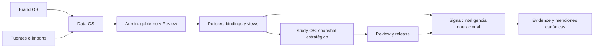

# 52 · Noisia Features Description V0.2

> **Versión:** 0.2
> **Checkpoint:** 2026-08-12T12:45:03-06:00 (`America/Mexico_City`)
> **Última actualización:** 2026-08-15T10:42:46-06:00 (`America/Mexico_City`)
> **Estado:** catálogo funcional y backlog de producto preparado para Linear
> **Rama de referencia:** `codex/noisia-data-os-cut-1-wip`
> **Producción:** sin cutover workspace-owned; este documento no declara release
> **Fuente autoritativa de visión:**
> [31_SIGNAL_PRODUCT_NORTH_STAR.md](./31_SIGNAL_PRODUCT_NORTH_STAR.md)
> **Cascada semántica y T&N:**
> [55_SIGNAL_ACQUISITION_SEMANTIC_CASCADE_AND_TOPIC_CONTRACTS.md](./55_SIGNAL_ACQUISITION_SEMANTIC_CASCADE_AND_TOPIC_CONTRACTS.md)
> y su secuencia ejecutable
> [56_SIGNAL_SEMANTIC_CASCADE_EXECUTION_PLAN.md](./56_SIGNAL_SEMANTIC_CASCADE_EXECUTION_PLAN.md).

## Propósito

Este documento describe qué puede hacer Noisia V0.2, qué está implementado, qué fue
verificado en `noisia-staging`, qué ve hoy un usuario y qué falta para cerrar el producto.
Su segunda función es servir como fuente para crear proyectos, epics e issues en Linear
sin volver a interpretar el rediseño desde conversaciones o handoffs.

No sustituye contratos de base de datos, APIs, runbooks ni ADRs. Tampoco convierte a
Laika en definición de producción. Cada feature debe conservar los límites de ownership,
AuthZ, data rights, costo y evidence establecidos por el canon.

## North Star De Producto

Noisia es un sistema de inteligencia viva orientado a un workspace permanente de marca:

- **Brand OS** define quién es la marca, sus identidades, contexto y competidores.
- **Data OS** conserva y gobierna fuentes, imports, menciones canónicas, provenance,
  semántica, calidad, poblaciones y evidence.
- **Admin** permite al operador escribir, revisar, corregir y gobernar ese estado.
- **Signal** permite al cliente consumir métricas, evidencia e inteligencia aprobadas.
- **Study OS** congela una población gobernada, ejecuta una metodología, pasa Review y
  publica una nueva revisión del reporte del workspace.

La marca/workspace es la identidad del producto. Corpus, output y study pueden seguir
existiendo como lineage o compatibilidad, pero no deben gobernar la navegación ni el
serving cliente.



## Cómo Leer El Estado

| Estado | Significado |
|---|---|
| `implemented_local` | El contrato o UI existe en el worktree y tiene validación local |
| `staging_verified` | Se probó contra `noisia-staging` con evidence; no implica producción |
| `visible_legacy` | La experiencia visible funciona, pero todavía lee el bridge V1/legacy |
| `canary_verified` | El reader governed fue visible temporalmente y el rollback fue probado |
| `operator_ready` | La acción está lista, pero requiere confirmación humana separada |
| `product_qa_pending` | La capacidad existe, pero falta polish o prueba integral en navegador |
| `production_pending` | No está migrada, activada ni probada en producción |
| `cleanup_pending` | El reemplazo existe, pero la compatibilidad anterior aún permanece |

Una feature puede tener más de un estado. `staging_verified` nunca debe traducirse como
“shipped” y `implemented_local` nunca debe traducirse como “disponible para clientes”.

## Estado Ejecutivo V0.2

| Área | Estado | Lectura corta |
|---|---|---|
| Data OS workspace-owned | `staging_verified` | Ownership, menciones canónicas, provenance y serving relacional existen |
| Gobierno semántico | `staging_verified` | Assertions current, Review append-only y reconciliación por raíz |
| Governed views | `staging_verified` + `canary_verified` | Cuatro views por tres módulos; visible restaurado a legacy |
| Admin | `implemented_local` + `product_qa_pending` | Flujo funcional; falta cierre visual y recorrido integral |
| Signal V2 | `implemented_local` + `visible_legacy` | UI avanzada; governed todavía no es el default |
| T&B workspace-native | `operator_ready` | Preflight listo; corrida, Review y release pendientes |
| Producción | `production_pending` | Sin auditoría/cutover workspace-owned |
| V1 | `cleanup_pending` | Bridge temporal aún activo |

## Ahora Admin Puede

- crear una marca junto con su Brand OS, Signal workspace y población inicial;
- consultar salud, cobertura, frescura, fuentes, población y estado de reportes;
- crear fuentes e importar CSV al workspace sin crear un estudio;
- editar identidad de marca, contexto, competidores y Knowledge Base;
- explorar y gobernar el reservoir de menciones canónicas;
- incluir, excluir o enviar menciones a Review conservando historia;
- revisar, aprobar, rechazar, corregir o crear assertions semánticas;
- ejecutar resolución asistida con presupuesto y seguimiento;
- comprobar el preflight T&B con población, rights, modelo y hard cap;
- lanzar, monitorizar o cancelar una corrida cuando el operador la autorice;
- entrar a Review de una corrida workspace-native y administrar el reporte permanente;
- consultar Settings, accesos y compatibilidad bajo permisos server-side.

## Ahora Signal Puede

- abrir una URL estable por workspace;
- navegar Brand Monitoring, Mentions, Topics & Narratives, Reports/T&B y Settings;
- aplicar periodo, comparación y filtros reales;
- mostrar métricas, series, breakdowns, listas y evidence relacionales;
- abrir menciones enriquecidas desde charts, listas, topics y findings;
- conservar selección entre lista, visualización, detalle y evidence;
- representar `partial`, `stale`, `empty`, `error` y `not_available`;
- consumir una release T&B current sin convertir cada corrida en una página distinta;
- funcionar en español e inglés sobre un shell compartido y responsive.

El reader visible permanece en `legacy`. Las capacidades governed ya pasaron shadow y
canary en staging, pero todavía falta activarlas como default y validarlas como una sola
experiencia.

## Catálogo De Features

### Admin Workspace

#### ADM-01 · Crear Marca Y Workspace

**Actor:** administrador interno.

**Valor:** una marca nace como una unidad operable de Noisia, no como consecuencia de un
estudio.

**Estado:** `implemented_local`, `product_qa_pending`, `production_pending`.

Disponible:

- creación transaccional de organización/marca;
- Brand OS y perfil inicial;
- Signal workspace con slug estable;
- población operacional inicial y pointer de compatibilidad;
- fuente manual inicial cuando corresponde;
- protección contra borrado permanente de una marca con workspace.

Pendiente:

- terminar el recorrido completo con Alexa como primer workspace no-Laika;
- reemplazar la pantalla legacy de creación por el sistema canónico de Admin, incluyendo
  ancho, cards, fields, validación, loading, errores y responsive;
- sustituir la zona horaria abierta por un selector de catálogo IANA gobernado, con
  búsqueda, validación server-side y sugerencias por país sin inferencia silenciosa;
- preservar “Investigar marca con Claude” y su revisión humana dentro del nuevo flujo;
- confirmar sincronización de cada edición Brand OS hacia proyecciones gobernadas;
- definir policies, retention y licensing reales por cliente;
- QA de errores parciales, retry e idempotencia desde UI.

**Criterio de salida:** una marca nueva puede ingerir y abrir Signal sin crear un estudio,
sin registros huérfanos y con rollback auditable.

#### ADM-02 · Overview Operacional De Marca

**Actor:** administrador e Insights Manager.

**Valor:** concentra salud y siguientes acciones del workspace.

**Estado:** `implemented_local`, `product_qa_pending`.

Disponible:

- menciones gobernadas y cobertura temporal;
- fuentes activas y problemas de frescura;
- calidad y población actual;
- estado del reporte T&B y revisiones pendientes;
- accesos directos a Signal, Data, Brand OS y Reports.

Pendiente:

- comprobar todos los estados `empty`, `partial`, `stale`, warning y error;
- validar que las cifras correspondan al serving governed después del cutover;
- cerrar responsive, i18n y navegación caliente/fría.

**Criterio de salida:** ninguna métrica de salud depende del conteo de corpora ni de un
payload publicado.

#### ADM-03 · Data, Sources E Imports

**Actor:** operador de Data OS.

**Valor:** mantiene vivo el workspace sin reconstruir estudios.

**Estado:** `implemented_local`, Acquisition Plan `browser_qa_local`, backend legacy
`staging_verified`.

Disponible:

- alta de source workspace-owned;
- múltiples imports manuales CSV secuenciales sobre una misma source;
- historial por source;
- conteos de records, incluidos, excluidos y duplicados;
- cobertura, frescura, status y último import;
- acceso directo a Mentions y Semantic Review;
- invalidación/materialización/outbox por cambios de data.
- plan de adquisición current/draft derivado de Brand OS;
- slots separados para marca primaria, categoría y cada competidor activo;
- un conector reutilizable con queries privadas y versionadas por slot;
- Query Composer workspace-owned `implemented_local`: un núcleo puro compartido
  recibe Brand OS + Acquisition Brief/Knowledge y produce drafts `engine-generated` para
  primary, category y cada competitor, con lineage, validation y fallback; Study OS es
  sólo un adapter legacy. Admin añade preflight con hard cap, generación server-owned,
  review/diff por slot, regeneración y override manual append-only. Cada versión requiere
  aprobación explícita antes de promover el plan;
- promoción atómica con evidence y blockers de governance;
- import sellado a plan/slot/query/periodo/timezone e historial filtrado por slot;
- include/exclude/revert explícito para referencias gobernadas;
- estados loading, empty, error, draft, ready, current y stale; responsive validado a
  390 px.

Pendiente:

- flujo real con una fuente nueva posterior al cutover;
- demostrar que el import actualiza métricas y charts sin reconstruir JSON;
- UI de cadencias y errores operativos más completa;
- explicar en el onboarding que tipo `CSV de listening` y conexión `Carga manual` son
  contratos del conector; scope y entidad pertenecen al slot del plan;
- agregar helpers canónicos a cada check y field de Preparación de datos, accesibles por
  hover, foco y tap, con definición, consecuencia, módulos afectados, ejemplo y estado
  `draft/active`; la información necesaria nunca puede vivir sólo en un tooltip;
- prellenar el primer draft con una plantilla visible `Piloto · seis meses`: Quality sin
  threshold/flags y disposición `evaluate`; Retention `allowed/until/review_required`;
  Licensing con los seis usos propuestos como `allowed`, siempre editables y sujetos a
  evidencia, creación de draft y activación humana explícita;
- calcular la vigencia de seis meses en meses calendario desde la fecha efectiva del
  operador; una nueva versión clona la versión current y nunca oculta las policies activas;
- mostrar Quality, Retention y Licensing en tres columnas compactas en desktop, `2 + 1`
  en tablet y una columna en móvil; Provenance permanece como tabla de bindings;
- corregir la escala visible de Quality a `0–10` y eliminar opciones de Retention que no
  coinciden con el contrato API/DB antes del siguiente workspace real;
- sustituir el selector de un solo archivo por una cola multiarchivo: preflight de schema,
  scope y entidad gobernada por batch, periodo/query pack, progreso, resultado y retry
  idempotente por archivo;
- mantener la source como identidad del conector y no crear una source por keyword o CSV;
  filename puede sugerir, pero nunca aprobar, `primary_brand`, `competitor`, `category` o
  `reference`;
- permitir que un binding source-level gobierne todos los imports normales actuales y
  futuros; reservar bindings import-specific para excepciones auditables de policy;
- mostrar por batch records, incluidos, excluidos, duplicados, entity intent, periodo y
  destino de Semantic Review, sin confundir intención de adquisición con assertion.

**Criterio de salida:** un import aparece una sola vez, actualiza la view afectada y deja
watermark, quality y provenance reproducibles.

**Cierre P0 2026-08-13:** 0081 está `staging_verified`. El mismo endpoint/service
workspace-owned ofrece retry-from-storage con AuthZ e idempotencia, conserva el intento
fallido y crea una supersession sin reupload. La clasificación set-based distingue
`inserted_this_attempt`, `resumed_before_attempt`, `existing_from_other_import` y
`duplicate_inside_file`; no existe fallback por fila. En el incidente Siri produjo
56,079 records, 40,647 included, 4,350 excluded y 11,082 duplicates, con 47,029
memberships aceptados, un watermark, un sync y cero raíces únicamente failed. Admin reserva
100% para `completed` y muestra `Archivo leído; falló la validación final` si el cierre
atómico falla. El total observado bajó de ~43 min a 293.158 s; el cierre relacional
(268.601 s) es ahora el tramo dominante y queda como foco de optimización, no como
inconsistencia ni dependencia de una marca.

#### ADM-04 · Admin Mentions

**Actor:** operador de datos y reviewer.

**Valor:** permite inspeccionar y gobernar el registro canónico completo.

**Estado:** backend `staging_verified`, frontend `implemented_local`,
`product_qa_pending`.

Disponible:

- reservoir canónico del workspace, independiente de la población operacional;
- periodo, búsqueda, sort, columnas y paginación;
- filtros de plataforma, scope, rol, formato, sentimiento y enrichment;
- filtros operator-facing de inclusión, Review, elegibilidad, calidad, governance y
  provenance;
- selección de página y selección persistente razonable;
- exportación de selección;
- include, exclude y send-to-review con idempotencia;
- drawer compartido con Signal más lineage, provenance, assertions, populations,
  tags/features, T&B e historial;
- alias resuelto hacia raíz canónica;
- ninguna exposición de `raw_metadata`, `text_raw` o perfiles crudos.

Pendiente:

- polish del drawer de filtros: jerarquía, densidad, espacios y breakpoints;
- validar todas las combinaciones de drawer, diálogo y selección;
- simplificar detalles técnicos detrás de disclosure sin perder auditabilidad;
- asegurar que la acción de reclasificación siempre pase por Review, nunca por update
  silencioso;
- browser QA completo con datos reales y sin doble drawer.

**Criterio de salida:** Admin muestra como mínimo el contexto cliente de Signal y agrega
capacidades operator-safe sin duplicar componentes.

#### ADM-05 · Revisión Semántica

**Actor:** reviewer interno.

**Valor:** separa intención de adquisición de verdad semántica aprobada.

**Estado:** `staging_verified`, `product_qa_pending`.

Disponible:

- colas candidate-pending, unresolved, needs-context, approved y rejected;
- filtros por scope, confianza, plataforma, source y periodo;
- resolución asistida por Claude con estimate, cap, progreso y costo;
- approve, reject, correct/supersede y creación manual;
- historia append-only y actor autenticado;
- preview simplificado de la mención dentro de Review;
- reconciliación de memberships posteriores a una decisión.

Pendiente:

- QA visual y de navegación de todos los estados;
- comprobar el viaje Mentions → Review → Mentions con filtros preservados;
- operar Review para cada workspace real antes de promoverlo;
- establecer SLAs y responsabilidad operatoria fuera de la fixture.

**Criterio de salida:** ninguna membership V2 client-safe nace de `source_intent`; sólo
una assertion current, approved y eligible puede sostenerla.

#### ADM-06 · Brand OS

**Actor:** administrador de marca y estratega.

**Valor:** ofrece identidad gobernada al resolver y contexto reusable a metodologías.

**Estado:** `implemented_local`, `product_qa_pending`.

Disponible:

- identidad, descripción, industria, subindustria, países y aliases;
- competidores con ID estable;
- Knowledge Base;
- perfiles y assets con lineage;
- compatibilidad temporal con corpora/estudios previos.

Pendiente:

- demostrar sincronización de altas/cambios/bajas hacia identities gobernadas;
- cerrar category/reference como identidades first-class donde aplique;
- retirar la centralidad visual de Corpora cuando termine la migración.

**Criterio de salida:** el resolver semántico usa identidades estables y nunca depende de
comparar texto libre como autoridad.

#### ADM-07 · Reports Y Lanzamiento T&B

**Actor:** operador responsable del presupuesto y reviewer estratégico.

**Valor:** convierte T&B en un reporte permanente con revisiones, no en estudios
aislados.

**Estado:** `operator_ready`, `product_qa_pending`, `production_pending`.

Disponible:

- registry permanente `triggers-barriers`;
- preflight read-only y gratuito;
- periodo, timezone, study size, pregunta de negocio y decisión;
- población, coverage, data rights, provider/model/pricing y hard cap;
- confirmación explícita y `Idempotency-Key`;
- progreso, cancelación y recovery;
- ruta workspace-native hacia Review;
- soporte de release actual e historial de revisiones.

Pendiente:

- ejecutar la primera corrida V2 real;
- Review humana de findings;
- publicar `r1` como current release;
- abrirla desde Signal y verificar evidence;
- demostrar que una corrida futura produce `r2` sin reescribir `r1`.
- separar visual y verbalmente `Reportes` workspace-native del wizard global legado de
  `Estudios`; ningún CTA de una marca V0.2 debe mandar al operador al flujo equivocado.

**Criterio de salida:** corrida → Review → release → Signal funciona con costo asentado,
snapshot congelado, evidence gobernada y revisión inmutable.

#### ADM-08 · Team, Access Y Settings

**Actor:** administrador con permisos.

**Valor:** mantiene acceso y configuración fuera del payload cliente.

**Estado:** `implemented_local`, `product_qa_pending`.

Disponible:

- administración global de equipo según rol;
- conteo de accesos activos del workspace;
- timezone, población, report registry, cadencias y perfiles;
- indicador visible del read mode;
- protección AuthZ server-side.

Pendiente:

- completar administración granular de acceso por workspace;
- probar roles internos y clientes autorizados/no autorizados;
- revisar archive y lifecycle completo de una marca.

**Criterio de salida:** ninguna ruta confía en IDs o permisos suministrados por el
navegador y los cambios de acceso son auditables.

### Signal Cliente

#### SIG-01 · Workspace Y Navegación Permanente

**Actor:** cliente y usuario interno.

**Valor:** ofrece una Signal home estable por marca.

**Estado:** `implemented_local`, `visible_legacy`, `product_qa_pending`.

Disponible:

- `/signal/{workspaceSlug}`;
- shell, topbar y navegación persistentes;
- módulos Monitoring, Mentions, Topics & Narratives, Reports y Settings;
- feedback inmediato y skeleton diferido;
- rutas protegidas sin prefetch;
- una sola identidad de reporte T&B.

Pendiente:

- retirar navegación cliente basada en UUID/output;
- eliminar `?study=` después de probar compatibilidad;
- QA de entrada fría, navegación caliente y retorno entre módulos.

**Criterio de salida:** el cliente consulta Signal e historial sin conocer corpus,
outputId o study IDs.

#### SIG-02 · Brand Monitoring

**Actor:** Brand Manager.

**Valor:** inteligencia operacional always-on sobre la view elegida.

**Estado:** UI `implemented_local`, governed `canary_verified`, default
`visible_legacy`.

Disponible:

- métricas, series, breakdowns y comparaciones SQL;
- filtros reales de fecha y dimensiones;
- monthly insights versionados;
- freshness y coverage;
- drill-down hacia Mentions/evidence;
- contenido previo durante revalidación.

Pendiente:

- activar binding governed como default en staging;
- reconciliar números visibles con SQL después del switch;
- exponer claramente el scope/view activo;
- probar un import nuevo actualizando el módulo.

**Criterio de salida:** toda métrica declara denominator, coverage, watermark y policy;
Claude no calcula ningún número mostrado.

#### SIG-03 · Mentions

**Actor:** cliente que investiga evidencia.

**Valor:** conecta cualquier señal agregada con registros verificables.

**Estado:** UI `implemented_local`, governed `canary_verified`, default
`visible_legacy`.

Disponible:

- tabla/lista densa;
- búsqueda, sort, columnas, filtros y paginación;
- query param estable para mención enfocada;
- drawer enriquecido y enlace al original cuando existe;
- desempeño, scope, Topics & Narratives, T&B y detalles client-safe;
- selection state y navegación desde evidence.

Pendiente:

- validar el reader governed sostenido;
- verificar facets, cursores y evidence en cada view;
- cerrar performance y responsive con la población final.

**Criterio de salida:** cualquier chart/finding puede abrir exactamente sus menciones
constituyentes sin exponer datos operator-only.

#### SIG-04 · Topics & Narratives

**Actor:** Brand Manager y estratega.

**Valor:** muestra patrones operativos sobre la misma data gobernada.

**Estado:** UI `implemented_local`, governed `canary_verified`, default
`visible_legacy`.

Disponible:

- lista inicial y Map alternativo;
- selección compartida entre lista, bubble chart, detail y evidence;
- presence, sentiment, top evidence y lineage;
- perfiles, assignments y serving relacional;
- insights versionados en WIP.

Pendiente:

- governed default y reconciliación final;
- cerrar refresh/costo de insights como feature operable;
- QA de evidence y scopes multi-view;
- evitar presentar enrichment no aprobado como verdad cliente.

**Criterio de salida:** T&N usa la misma view declarada que Monitoring cuando comparte
denominador y una view distinta sólo cuando el contrato lo explicita.

#### SIG-05 · Triggers & Barriers

**Actor:** cliente que consume una lectura estratégica revisada.

**Valor:** integra estrategia periódica con inteligencia operacional viva.

**Estado:** UI `implemented_local`, backend `operator_ready`, sin release V2 real.

Disponible:

- matrix layer × mobility;
- ranking y detail sincronizados;
- finding reading contextual;
- filtros de polarity, periodo publicado y data scope;
- evidence drawer compartido;
- serving relacional desde releases/snapshots;
- report identity única por workspace.

Pendiente:

- generar y publicar la primera release V2;
- verificar findings, evidencia, comparaciones y navegación;
- probar historial y una segunda revisión compatible;
- remover fallback al reporte legacy después del gate.

**Criterio de salida:** el cliente ve un current release revisado, puede consultar
historial y ninguna revisión modifica otra.

#### SIG-06 · Views Gobernadas Y Exploración De Alcance

**Actor:** cliente que necesita separar marca, competencia y categoría.

**Valor:** conserva contexto relevante sin contaminar el denominador principal.

**Estado:** backend `staging_verified`, `canary_verified`, UX final pendiente.

Disponible en backend:

- `brand`;
- `competition`;
- `category`;
- `all-governed`;
- binding independiente por módulo/view;
- deduplicación por raíz;
- isolation de cursores, ETags, policies, populations y evidence;
- autorización por capability de cada módulo.

Pendiente:

- selector/experiencia cliente clara para cambiar view;
- coverage y helper comprensibles por view;
- QA de cada módulo en cada scope permitido;
- thresholds reales por cliente y fuente.

**Criterio de salida:** una mención puede salir de métricas de marca y seguir visible en
otra view autorizada; ninguna unión existe sin owner, policy, version y denominator.

#### SIG-07 · Evidence, Loading, Responsive E i18n

**Actor:** cualquier usuario de Signal.

**Valor:** hace confiable y usable la inteligencia.

**Estado:** `implemented_local`, `product_qa_pending`.

Disponible:

- drawer de evidence compartido;
- selección accesible y alternativa de lista para charts;
- estados cold, stale, partial, empty y error;
- requests abortables y contenido previo durante revalidación;
- reduced motion;
- `es-MX` y `en-US`.

Pendiente:

- matriz completa desktop amplio, laptop y compacto;
- cero translation keys crudas;
- cero errores de consola;
- cero layout shift del shell;
- mediciones de navegación fría/caliente y p95 después del cutover.

**Criterio de salida:** el gate de frontend del documento 43 pasa completo contra
serving governed.

### Data OS Y Gobierno

#### DOS-01 · Mención Canónica Y Provenance

**Estado:** `staging_verified`, `production_pending`.

- una raíz canónica puede tener aliases y múltiples provenances sin duplicarse;
- imports y sources conservan lineage;
- Admin reservoir no equivale a población cliente;
- canonical retention no se confunde con inclusión en métricas;
- borrado o exclusión no destruye silenciosamente historia.

**Pendiente:** migrar y reconciliar cada workspace productivo seleccionado.

#### DOS-02 · Semántica, Calidad Y Elegibilidad

**Estado:** `staging_verified`, `production_pending`.

- assertions versionadas y current;
- Review append-only;
- quality, retention y licensing como autoridades separadas;
- `unreviewed`, `abstained`, `unattributed` y `excluded` conservan significados distintos;
- Unknown falla cerrado y nunca se convierte en permitido o cero.

**Pendiente:** policies reales por cliente y operación continua de Review.

#### DOS-03 · Policies, Bindings, Denominadores Y Materialización

**Estado:** `staging_verified`, `canary_verified`, `production_pending`.

- identidad `(workspace, module, view)`;
- bundle/version/hash y population derivada;
- promociones atómicas e idempotentes;
- rollback/withdraw-to-bridge auditable;
- coverage y denominator explícitos;
- invalidación temporal y por watermarks;
- cero population IDs o policy expressions aceptados desde el cliente.

**Pendiente:** governed default sostenido y cutover por workspace real.

#### DOS-04 · Freshness, Invalidation Y Recurrencia

**Estado:** `implemented_local`, foundation probada en staging.

- sources con cadence;
- imports y watermarks;
- materializaciones afectadas se invalidan sin reconstruir todo;
- interpretaciones compatibles pueden quedar stale sin sobrescribirse;
- outbox y recovery preservan operación asíncrona.

**Pendiente:** observabilidad operativa y prueba longitudinal con imports posteriores al
cutover.

### Study OS

#### STU-01 · Preflight Y Presupuesto Estratégico

**Estado:** `operator_ready`.

- GET gratuito/read-only;
- authority, population, provenance y data rights server-owned;
- periodo, denominator, coverage y digest reproducibles;
- provider, modelo y pricing pinneados;
- estimación exacta micro-USD y hard cap;
- `settlement <= reservation`;
- no launch sin confirmación y digest vigente.

**Pendiente inmediato:** ejecutar el POST autorizado por operador antes de que expiren
los rights actuales o volver a generar una authority válida.

#### STU-02 · Ejecución, Workers Y Recovery

**Estado:** foundation `staging_verified`, ejecución real pendiente.

- snapshot estratégico congelado al lanzar;
- corpus de ejecución server-owned;
- BullMQ Worker T&B;
- recovery drainers y estados terminales;
- cancelación e idempotencia;
- costo reservado y asentado.

**Pendiente:** primera corrida real completa y evidence de comportamiento ante retry,
recovery y terminal state.

#### STU-03 · Review, Release E Historial

**Estado:** `implemented_local`, prueba end-to-end pendiente.

- Review de findings y evidence;
- release inmutable por revisión;
- current release por `(workspace, report_key)`;
- historial y comparación temporal;
- enrichment reusable puede volver a la mención canónica;
- una nueva corrida actualiza el mismo reporte, no la navegación.

**Pendiente:** publicar `r1`, comprobar Signal y más adelante demostrar `r2`.

#### STU-04 · T&B Coding Workbench

**Actor:** operador de inteligencia que convierte una corrida T&B revisada en
conocimiento gobernado y extensible del workspace.

**Valor:** permite trabajar con una muestra estratégica sin perder las menciones no
procesadas y sin promover automáticamente toda inferencia del modelo a verdad del CDP.

**Estado:** foundation relacional `implemented_local`; read model, mutaciones masivas y
UI `product_definition_ready`.

Disponible en la foundation:

- una feature `tb_coding` por raíz realmente codificada;
- tags candidatos de trigger, barrier, layer y vocabulario emergente;
- findings, citations, artifacts, evidence y lineage por corrida/release;
- revisión reusable `approve`, `correct` o `reject`, con actor e idempotencia;
- Admin Mention detail capaz de leer codificaciones, tags, features y releases;
- quality gate que bloquea codificaciones sin feature o lineage gobernado.

Contrato de producto:

- aprobar un release acepta y congela el resultado analítico de la muestra;
- toda mención procesada termina con resultado explícito, incluso `irrelevant`,
  `ambiguous` o `insufficient_evidence`;
- sólo tags aprobados por humano o policy pasan a conocimiento reusable current;
- el operador puede revisar y cambiar tags de la muestra sin sobrescribir la inferencia
  original;
- el operador puede asignar tags, layer y findings del catálogo de la release a
  menciones no procesadas;
- toda corrección crea historia append-only y supersede la decisión anterior;
- nuevas asignaciones no reescriben muestra, denominador, evidencia ni release de
  origen;
- cualquier cambio cliente requiere invalidación y una materialización/release posterior
  explícita.

Superficie Admin requerida:

- resumen de población gobernada, procesada, aceptada, aprobada, revisable y no
  procesada;
- tabla paginada con estado de procesamiento, polarity, layer, finding, tags,
  confidence, source, release y review;
- filtros por procesamiento, review, ambiguity, finding, taxonomy, entidad, plataforma
  y fecha;
- drawer canónico con mención, resultado original, evidencia, historial y asignaciones
  current;
- acciones individuales y masivas para asignar, retirar, reemplazar, marcar ambigua,
  aprobar, corregir, rechazar y enviar a revisión;
- selector del catálogo de findings y términos de la release, con creación de candidatos
  separada de aprobación.

**Pendiente:** observar la primera corrida de Alexa, cerrar el contrato de coverage real,
implementar el workbench y probar que 1,000 menciones analizadas y 9,000 no analizadas
pueden operarse sin falsificar coverage ni reescribir `r1`.

**Criterio de salida:** cualquier raíz gobernada puede explicar si fue procesada, qué
resultado recibió, quién aprobó/corrigió su conocimiento current y a qué finding/release
pertenece; ninguna asignación manual cambia retroactivamente un reporte publicado.

### Migración Y Operación

#### MIG-01 · Cutover Governed

**Estado:** `canary_verified`, `production_pending`.

- shadow y canary fueron reconciliados en staging;
- rollback visible a legacy fue comprobado;
- los bindings current no requieren mover pointers V2 operacionales.

**Pendiente:** activar governed como default en staging, completar QA y después ejecutar
el proceso aislado para producción.

#### MIG-02 · Retiro De V1

**Estado:** `cleanup_pending`.

Pendiente después del cutover:

- retirar readers, flags y fallbacks legacy;
- retirar `outputId`, `?study=` y corpus como identidad cliente;
- dejar de leer `published_outputs.payload`;
- conservar canonical data, provenance, assertions, Review, snapshots, evidence y
  releases;
- cleanup sólo mediante cambios forward-only.

#### OPS-01 · Integración, Revisión Y Entrega

**Estado:** pendiente.

El worktree contiene una rama de gran tamaño con múltiples cambios sin commit o sin
seguimiento. Antes de producción se requiere:

- separar commits temáticos y revisables;
- ejecutar secret scan y `git diff --check`;
- validar typecheck, tests, lint, build y smoke de migraciones;
- code review de AuthZ, data rights, gasto, workers y migrations;
- preparar PR sin mezclar secrets ni evidence privado;
- conservar evidence manifests fuera del producto cliente.

## Snapshot De Acceptance Fixture

Laika es una fixture desechable de aceptación, no un cliente ni una fuente de thresholds:

| Conjunto | Raíces |
|---|---:|
| Reservoir canónico Admin | 4,587 |
| Estado semántico current | 729 |
| `brand` | 276 |
| `competition` | 184 |
| `category` | 51 |
| `all-governed` deduplicada | 483 |
| `unattributed` fuera del cliente por default | 246 |
| Authority estratégica T&B | 483 |

Los conteos demuestran separación de scopes, multi-membership sin duplicación y
denominadores distintos. No deben copiarse a producción.

## Roadmap De Cierre

### Gate D · Primera Corrida T&B V2

1. Repetir preflight justo antes de lanzar.
2. Confirmar 483 raíces, coverage `partial`, modelo, estimate USD 11.13 y hard cap USD 15.
3. Confirmar presupuesto y ejecutar POST con digest vigente.
4. Supervisar Worker, recovery, costo y terminal state.
5. Abrir Review, corregir/aprobar y publicar `r1`.
6. Abrir la release desde Signal.
7. Verificar finding → evidence → mención canónica.
8. Confirmar que enrichment reusable vuelve al registro canónico.

Los rights actuales expiran el 2026-08-19T16:57:26Z y cubren únicamente cuatro imports
contribuyentes actuales. Un import nuevo no los hereda.

### Gate E · Producto Final En Staging

1. Mantener governed serving como default de staging.
2. Completar la experiencia multi-view.
3. Pulir Admin Mentions y drawers operator-facing.
4. QA integral Admin: Overview → Data → Mentions → Review → Brand OS → Reports → Settings.
5. QA integral Signal: Monitoring → Mentions → T&N → T&B → Settings → regreso.
6. Probar filtros consecutivos, aborts, loading y evidence.
7. Probar desktop, laptop, compacto, ES/EN y reduced motion.
8. Reconciliar números con serving/SQL y validar p95.

### Gate F · Producción Y Cleanup

1. Auditar producción read-only.
2. Documentar schema/readers reales y seleccionar workspaces.
3. Crear restore point y rehearsal aislado.
4. Aplicar migraciones forward-only.
5. Cargar policies/rights reales; nunca copiar Laika.
6. Backfill y Semantic Review.
7. Shadow, canary y rollback.
8. Cutover con autorización explícita.
9. Monitorear y cerrar incidentes.
10. Retirar V1 de forma forward-only.

## Preparación Para Linear

### Jerarquía Recomendada

**Proyecto:** `Noisia V0.2 — Workspace-Owned Signal`

**Milestones:** `Gate D`, `Gate E`, `Gate F`, `V1 Retirement`

Iniciativas sugeridas:

1. `Admin Workspace & Governance`
2. `Signal Client Experience`
3. `Data OS Governed Serving`
4. `Study OS & T&B Releases`
5. `Production Cutover & Legacy Retirement`

Labels sugeridos:

- superficie: `admin`, `signal`, `data-os`, `study-os`, `platform`;
- gate: `gate-d`, `gate-e`, `gate-f`, `cleanup`;
- estado: `implemented-local`, `staging-verified`, `product-qa`, `production-pending`;
- riesgo: `authz`, `data-rights`, `money`, `migration`, `worker`, `frontend`;
- tipo: `feature`, `polish`, `qa`, `migration`, `release`, `tech-debt`.

### Backlog Inicial Listo Para Convertir En Issues

| ID | Título Linear sugerido | Iniciativa | Prioridad | Dependencia | Done cuando |
|---|---|---|---|---|---|
| N02-001 | Ejecutar primera corrida T&B workspace-native | Study OS | Urgent | Backend 07 | La corrida termina con costo y snapshot reconciliados |
| N02-002 | Revisar y publicar T&B r1 | Study OS | Urgent | N02-001 | Existe current release inmutable y visible en Signal |
| N02-003 | Validar finding → evidence → mención canónica | Study OS / Signal | High | N02-002 | Evidence abre la raíz correcta con AuthZ/client rights |
| N02-004 | Activar governed serving sostenido en staging | Data OS | High | N02-002 | Tres módulos leen bindings y rollback permanece disponible |
| N02-005 | Completar selector y UX multi-view | Signal | High | N02-004 | Brand/competition/category/all-governed son comprensibles y reconciliados |
| N02-006 | Cerrar polish de Admin Mentions | Admin | High | Ninguna | Filtros, tabla, drawer, selección y responsive pasan QA |
| N02-007 | Ejecutar QA integral del Admin workspace | Admin | High | N02-006 | Recorrido completo ES/EN sin errores ni componentes paralelos |
| N02-008 | Ejecutar QA integral de Signal V2 governed | Signal | High | N02-004, N02-005 | Todos los módulos, filtros, evidence y breakpoints pasan |
| N02-009 | Probar import nuevo actualizando Signal | Data OS / Signal | High | N02-004 | Métricas/charts cambian sin reconstruir payload |
| N02-010 | Auditar producción read-only | Production | High | Gate E | Schema/readers/targets documentados sin writes |
| N02-011 | Rehearsal y canary workspace-owned en producción | Production | High | N02-010 | Restore, migrations, backfill, shadow y rollback probados |
| N02-012 | Autorizar y ejecutar cutover de readers | Production | Urgent | N02-011 | Governed es default y evidence/metrics permanecen correctas |
| N02-013 | Retirar adapters y navegación V1 | Legacy retirement | Medium | N02-012 | No existen fallback cliente ni identidad por output/study |
| N02-014 | Organizar commits, revisión y PR de la rama | Platform | High | Gate E | Worktree revisable, gates verdes y sin secrets |
| N02-015 | Probar una segunda revisión T&B | Study OS | Medium | N02-002 | `r2` convive con `r1` sin reescribirla |
| N02-016 | Construir T&B Coding Workbench | Study OS / Admin / Data OS | High | N02-002, N02-003 | Muestra y no procesadas pueden revisarse, reasignarse y asociarse a findings con historia, lineage e invalidación, sin reescribir `r1` |
| N02-017 | Rediseñar creación de marca con Admin canónico | Admin | Urgent | Ninguna | El flujo reemplaza la UI legacy, conserva investigación Claude y pasa QA ES/EN responsive |
| N02-018 | Implementar catálogo gobernado de zonas horarias | Admin / Data OS | Urgent | N02-017 | Sólo claves IANA válidas pueden persistirse; país filtra sugerencias y el operador confirma una zona |
| N02-019 | Separar Estudios legacy del T&B workspace-native | Admin / Study OS | Urgent | N02-017 | Desde una marca, todos los CTA de T&B llegan a Reportes/authority/preflight y la compatibilidad legacy queda inequívoca |
| N02-020 | Hacer comprensible Preparación de datos | Admin / Data OS | Urgent | Ninguna | Helpers accesibles, plantilla editable de seis meses, policies horizontales en desktop, Quality 0–10 y enums Retention válidos |
| N02-021 | Productizar import multiarchivo y multiscope | Admin / Data OS | Urgent | N02-020 | Una source acepta una cola de CSV con scope/entidad gobernados por batch, progreso e idempotencia; Semantic Review recibe lineage sin convertir filename o source intent en aprobación |
| N02-022 | Unificar import workspace-owned con worker CSV y recovery | Data OS / Workers | Urgent | N02-021 | Archivos grandes responden 202, progresan fuera del request, nunca sirven batches incompletos y un retry auditable reconcilia cualquier raíz parcial con el batch completado |
| N02-023 | Corregir contadores de resume mixto, throughput y retry sin reupload (`staging_verified`) | Data OS / Workers | Urgent | N02-022 | Chunks con inserts, duplicados previos y resume cuentan cada fila una vez; un batch fallido reutiliza objetos durables y completa con records = included + excluded + duplicates; los duplicados esperados se resuelven set-based y un archivo real no cae a procesamiento fila-por-fila |
| N02-024 | Productizar Semantic Review para 100K+ (`staging_verified`) | Admin / Data OS / Workers | Urgent | N02-023 | 0082/0083 sirven 109,056 raíces de Alexa desde una proyección versionada: cinco queries, p95 warm 427.7 ms, cursor 287.9 ms y filtro 415.9 ms. El preflight read-only declara las 109,056 elegibles, tres child batches y estimate USD 327.233340; USD 40 exige confirmación sin truncar, encolar ni gastar. Recovery conserva leases y fallos terminales auditables; el POST pagado sigue pendiente de autorización explícita del operador. |
| N02-025 | Productizar plan de adquisición desde Brand OS | Admin / Data OS | Urgent | N02-021 | Una source acepta slots server-owned de marca primaria, categoría/industria y uno por competidor; cada import conserva query, periodo e identidad esperada sin convertir intent en approval |
| N02-034 | Productizar Query Composer workspace-owned y pulir first-use | Admin / Data OS / Workers | Urgent | N02-025 | 10A.5A/10A.5B `browser_qa_local`: núcleo puro compartido, Acquisition Brief sellado, transporte server-owned con preflight/hard cap, drafts SentiOne por slot y review/approval append-only. Desktop 1280/917 y móvil 390 × 844 verificados sin provider pagado. Ninguna propuesta o aprobación de query implica semantic approval; rehearsal remoto continúa separado y requiere autorización |
| N02-026 | Tipar observaciones de provider y cerrar ETL zero-provider | Data OS / Workers | Urgent | N02-034 | Campos útiles dejan de vivir sólo en raw metadata; normalización, calidad, dedup, provenance y señales observables procesan 100K+ set-based sin provider por raíz |
| N02-027 | Reemplazar full-pop Semantic Review por cascada con abstención | Data OS / Workers | Urgent | N02-026 | Deterministic identity, labeling functions y classifier local resuelven lo medible; `abstained` difiere de `rejected`; Claude sólo recibe una exception lane con preflight/hard cap |
| N02-028 | Crear gold set y policy de autoaccept medida | Admin / Data OS | Urgent | N02-027 | Ningún self-score autoaprueba; holdout, precision/recall por clase/slice, calibration, drift/expiry y hashes gobiernan autoaccept; fallo produce pending/abstained |
| N02-029 | Hacer append-only la clasificación T&N y retirar el worker provider full-pop (`implemented_local`) | Data OS / Workers | Urgent | N02-027 | 0087 separa method/disposition, conserva generations/supersession/abstention, deriva gold/slice metrics server-side, convierte resultados de provider en propuestas pending y proyecta sólo approved mediante un owner temporal. Producer, queue, worker, recovery, DB y env override de `signal.taxonomy-enrichment.v1` están cerrados. Falta 10D y reader cutover; no hubo provider calls |
| N02-030 | Benchmark local de discovery y clasificación multilingual (`technical_no_adoption`) | Data OS / Platform | High | N02-026 | Export read-only 109,056/109,056 y matriz pinneada E5/BGE × BERTopic/FASTopic cerrados sin provider. Ninguna pareja pasó gates: BERTopic falló topics efectivos/diversity y FASTopic excedió el lower bound full-pop de 8 h. Packet ciego de calibration disponible para revisar `none acceptable`; ningún artifact quedó recomendado o approved |
| N02-031 | Construir Topic & Narrative Contract control plane | Admin / Data OS | Urgent | N02-028, N02-030 | Operador crea/merge/split/test/promote/retire términos; DSL cerrado se compila server-side a FTS/pgvector con AuthZ, rights, limits, regression evidence y cero SQL generado ejecutable |
| N02-032 | Propagar contratos T&N y operar drift | Data OS / Workers / Admin | Urgent | N02-031 | Contract current clasifica corpus completo e imports futuros; cambios invalidan assignments; novelty, false positives/negatives y abstentions llegan a una cola revisable |
| N02-033 | Implementar prepublish Signal con cobertura parcial honesta | Signal / Admin / Data OS | Urgent | N02-029, N02-032 | Overview, Mentions y T&N comparten generation/watermark y declaran denominator, coverage, limitations; partial requiere confirmación y sample counts nunca se muestran como full-pop |

### Plantilla De Issue

```markdown
## Feature ID
N02-XXX / ADM-XX / SIG-XX / DOS-XX / STU-XX

## Problema y valor
Qué necesita el actor y por qué importa al North Star.

## Estado de partida
implemented_local / staging_verified / visible_legacy / product_qa_pending / etc.

## Alcance
- Cambio incluido.
- Contratos y componentes canónicos que se reutilizan.

## Fuera de alcance
- Lo que no autoriza este issue.

## Criterios de aceptación
- Resultado observable.
- Reconciliación de datos/evidence.
- Estados loading/empty/error/partial.
- AuthZ, data rights y costo cuando apliquen.
- ES/EN y responsive cuando sea UI.

## Validación
- Tests/typecheck/lint/build aplicables.
- Flujo real en navegador.
- Evidence pack o SQL reconciliation.

## Dependencias y riesgos
- IDs de issues previos.
- AuthZ, migration, money, workers, production o rollback.

## Rollback
Cómo se revierte sin borrar lineage o historia.
```

### Reglas Para Crear Los Tickets

- No convertir cada bullet de este documento en un issue independiente.
- Mantener el Feature ID en el título o descripción para conservar trazabilidad.
- Separar implementación, QA y activación cuando cambien autoridad o riesgo.
- Una migración de staging no se marca como shipped a producción.
- Todo ticket que pueda gastar dinero incluye estimate, hard cap y confirmación humana.
- Todo ticket de frontend reutiliza el sistema canónico; Shopify es referencia de
  comportamiento/densidad cuando no exista un patrón interno.
- Todo ticket de cutover incluye restore, shadow, canary y rollback.
- Ningún ticket puede debilitar AuthZ, data rights o fail-closed para “hacerlo pasar”.

### Referencias Canónicas

- [31_SIGNAL_PRODUCT_NORTH_STAR.md](./31_SIGNAL_PRODUCT_NORTH_STAR.md)
- [42_SIGNAL_WORKSPACE_DATA_OWNERSHIP.md](./42_SIGNAL_WORKSPACE_DATA_OWNERSHIP.md)
- [43_SIGNAL_V2_FRONTEND_SYSTEM.md](./43_SIGNAL_V2_FRONTEND_SYSTEM.md)
- [46_NOISIA_ADMIN_FRONTEND_AUDIT.md](./46_NOISIA_ADMIN_FRONTEND_AUDIT.md)
- [48_NOISIA_ADMIN_MENTIONS_FRONTEND_HANDOFF.md](./48_NOISIA_ADMIN_MENTIONS_FRONTEND_HANDOFF.md)
- [49_NOISIA_WORKSPACE_OS_BRANCH_CONTEXT_HANDOFF.md](./49_NOISIA_WORKSPACE_OS_BRANCH_CONTEXT_HANDOFF.md)
- [50_SIGNAL_GOVERNED_VIEWS_AND_POPULATION_POLICIES.md](./50_SIGNAL_GOVERNED_VIEWS_AND_POPULATION_POLICIES.md)
- [51_SIGNAL_GOVERNED_SERVING_ORCHESTRATION/EXECUTION_STATE.md](./51_SIGNAL_GOVERNED_SERVING_ORCHESTRATION/EXECUTION_STATE.md)
- [54_ALEXA_GREENFIELD_OPERATOR_QA.md](./54_ALEXA_GREENFIELD_OPERATOR_QA.md)

## Delta funcional Backend 09

Los ítems que la auditoría 53 clasificó como `missing_product_path` para greenfield ya
tienen superficie soportada:

- Data Preparation: decisions explícitas, effective dates, evidence, provenance e
  imports por source;
- Governed views: preflight y matriz module×view, reconcile, promote y withdraw;
- Strategic Reports: authority, flight card gratuita, launch con confirmación de cap,
  status/cancel, Review V2, draft release y promote versionado;
- Signal: selección cerrada de view y resolución íntegramente server-side.

El rehearsal staging no reemplaza Gate F de producción ni autoriza una corrida pagada.
La acción siguiente para producto es QA manual de Alexa; no requiere nuevas decisions por
default y debe solicitar quality, retention, licensing y provenance reales antes de su
primer serving o análisis.
