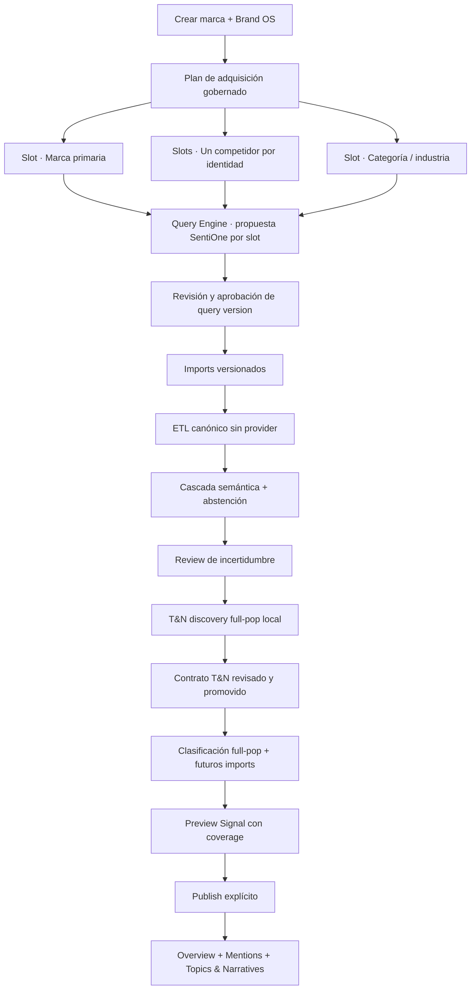

# 55 · Signal Acquisition, Semantic Cascade And Topic Contracts

> **Estado:** canon de producto y arquitectura objetivo; implementación pendiente.
> **Registrado:** 2026-08-15T10:24:00-06:00 (`America/Mexico_City`).
> **Aplica a:** onboarding greenfield, ingesta, Semantic Review, Topics & Narratives y
> primer publish de Signal V0.2.
> **No autoriza:** provider runs, migraciones, writes remotos, cutover de readers ni
> publicación cliente.

## Decisión

Signal V0.2 no pagará un LLM por cada mención para construir su capa operacional. El
producto adopta una **cascada semántica gobernada** y un sistema de **Topic & Narrative
Contracts**:

1. la adquisición ya separa marca primaria, cada competidor y categoría/industria;
2. ETL determinístico normaliza, deduplica, conserva provenance y resuelve lo seguro;
3. modelos locales y reglas que pueden abstenerse clasifican a escala;
4. el operador revisa incertidumbre, no las cien mil filas por defecto;
5. Claude sólo interviene en un carril acotado para excepciones, naming, síntesis y
   propuesta de contratos;
6. el servidor valida y compila esos contratos; Claude nunca escribe SQL ejecutable;
7. los contratos aprobados clasifican el corpus completo y las menciones futuras con
   assignments versionadas, evidence y coverage.

Esta arquitectura preserva la profundidad cualitativa de Noisia sin convertir Signal en
un estudio de cientos o miles de dólares. T&B sigue siendo la capa estratégica pagada y
bounded que puede analizar una muestra a mayor profundidad.

## Problema Que Corrige

El QA greenfield de Alexa llegó a 109,056 raíces canónicas aceptadas. El preflight actual
de Semantic Review estimó USD 327.233340 porque selecciona las 109,056 raíces sin resolver,
aunque 24,577 ya pertenecen a un estrato determinístico y 84,479 son ambiguas. El worker
actual de Topics & Narratives también usa Voyage y Claude por batches para drenar la
población incluida.

Ese comportamiento no es el modelo comercial ni técnico de Signal:

- el costo crece linealmente con el volumen antes de vender un estudio;
- la clasificación operacional depende del proveedor;
- una corrida completa vuelve a crear una licuadora semántica difícil de mantener;
- la inteligencia aprobada no se convierte todavía en un sistema económico que clasifica
  los siguientes imports;
- el usuario no gobierna de forma legible cómo se encontró un tópico.

El defecto no se resuelve recortando silenciosamente la población, elevando el hard cap o
aceptando el scope del query como verdad. Se resuelve separando descubrimiento,
clasificación, revisión, propagación y serving.

## Promesa De Producto Y Frontera De Costos

| Capa | Qué hace | Costo proveedor objetivo |
|---|---|---:|
| Adquisición + ETL | Importa, tipa, normaliza, deduplica, conserva lineage y calidad | USD 0 de LLM por mención |
| Cascada semántica | Reglas, identidades, embeddings y clasificador local con abstención | No lineal con el corpus; compute propio medido |
| Semantic Review | Revisa y corrige sólo incertidumbre priorizada | Opcional, preflight + hard cap |
| T&N discovery | Descubre estructura sobre toda la población y prepara evidence representativa | Local por default |
| Naming/contract proposal | Nombra, explica y propone ejemplos/exclusiones sobre un packet acotado | Opcional, bounded |
| T&N propagation | Aplica contratos aprobados al corpus completo y a imports futuros | Local/determinístico |
| T&B | Analiza profundamente una muestra estratégica congelada | Pagado y cotizable por estudio |

“Local” no significa costo computacional cero. Significa que el costo está gobernado por
infraestructura, no por una llamada LLM por registro. Todo preflight declara tamaño,
modelo/artifact, memoria, tiempo estimado y cualquier provider call adicional.

## Recorrido Greenfield Objetivo



### 1. Brand OS crea identidades, no archivos

Brand OS mantiene la identidad primaria, aliases, competidores y categoría/industria. El
plan de adquisición consume ese catálogo y crea slots operator-safe:

- `primary_brand` para la marca;
- `competitor` para cada competidor gobernado;
- `category` para industria/categoría;
- `reference` sólo cuando exista un uso explícito.

Un competidor eliminado o añadido crea una transición versionada del plan. No reetiqueta
historia silenciosamente.

### 1.1 Query Engine genera la adquisición externa

Los slots no comienzan con un campo vacío que el operador deba redactar. El Query Engine
existente se adapta al control plane workspace-owned para leer Brand OS, un brief de
adquisición/Study OS y Knowledge/RAG gobernado, y proponer:

- una query SentiOne para marca primaria;
- una query SentiOne separada para cada competidor activo;
- una query SentiOne para categoría/industria;
- exclusiones, términos y configuración de periodo/mercado trazables.

Estas expresiones sirven para salir a SentiOne y obtener el corpus. Son distintas de las
queries internas/contratos que posteriormente clasifican Topics & Narratives sobre las
menciones ya normalizadas. El LLM puede enriquecer lenguaje en una llamada bounded por
plan; la topología, identidades y validación pertenecen al servidor. El operador aprueba
la versión propuesta o crea una corrección explícita. Ninguna propuesta se autoactiva,
ninguna query ejecutada se actualiza in-place y una query no implica semantic approval.

La implementación conserva una sola copia del compositor, strategy brief, construcción
determinística, parser y reportes de validación. El núcleo recibe un input
provider-neutral; Study OS y Acquisition Plan son adapters separados. El adapter target
jamás fabrica `study_corpus_id` ni toca `query_iterations/query_packs`: escribe drafts
sólo mediante query versions workspace-owned. Un compilador provider-specific adicional
se incorpora únicamente si evidencia demuestra que la validación portable vigente no es
suficiente. Study OS aporta contexto y objetivo; no vuelve a ser identidad de la data ni
del plan.

**Estado local 10A.5A:** el contrato ya está implementado con un único núcleo puro en
`@noisia/query-engine`, un adapter legacy delgado y un adapter Acquisition Plan. El
Brief se sella al draft; 0085 permite `engine-generated` sólo con lineage reproducible;
primary/category/competitors se mapean por identidad server-owned y reference se excluye.
No existe transporte/provider real ni UI nueva en este gate: 10A.5B conserva review,
aprobación humana y ejecución explícita.

### 2. Source, slot, import y assertion siguen separados

- **Source:** conector estable, provider, connection, cadence y derechos.
- **Acquisition slot/query pack:** propósito de captura, entidad esperada, aliases,
  query/version, periodo y actor.
- **Import batch:** archivo concreto, hash, conteos, provenance y resultado durable.
- **Semantic assertion:** verdad current sobre la raíz; puede confirmar o corregir la
  intención de adquisición sin reescribir source/import.

No se crean sources falsas para cada CSV o competidor. Un mismo conector acepta muchos
slots e imports. El browser selecciona una identidad permitida; el servidor resuelve y
persiste owner, scope y entity IDs dentro del workspace autorizado.

### 3. ETL tipa el export antes de clasificar

Los campos útiles del provider se convierten en observaciones tipadas y versionadas:
texto, título, fecha, plataforma, autor seguro, URL, idioma, país, rol/thread, engagement,
query/tag/keyword de origen y contexto permitido. `raw_metadata` permanece lineage
privado; no es la API del producto ni el lugar donde vive la clasificación.

ETL realiza en forma set-based:

- validación de schema y encoding;
- normalización lingüística y de plataforma;
- calidad y dispositions;
- deduplicación intraarchivo, cross-import y canonical root;
- provenance y data rights;
- extracción determinística de señales observables;
- watermarks e invalidación.

## Cascada Semántica

La cascada asigna el método más barato que puede demostrar el resultado y siempre puede
abstenerse:

1. **Identidad exacta:** handles, dominios, aliases y entidades gobernadas.
2. **Labeling functions:** reglas versionadas de términos, exclusiones, thread, query pack,
   metadata tipada y contexto; cada regla vota o se abstiene.
3. **Clasificador local:** modelo multilingual/multi-label calibrado contra un gold set.
4. **Review humana:** muestra de errores probables, conflictos y baja confianza.
5. **Claude opcional:** exception lane acotado por incertidumbre/diversidad, nunca toda la
   población por default.
6. **Abstención explícita:** cuando no existe evidencia suficiente.

`rejected` significa decisión negativa gobernada. `abstained` significa que el sistema no
sabe. Ninguno equivale a `approved`, `eligible` o cero.

### Gold set y autoaceptación

Ningún score que el modelo declare sobre sí mismo autoriza autoaprobación. Una policy de
autoaccept necesita:

- ejemplos operator-approved y un holdout que no participó en entrenamiento;
- métrica por clase y por scope, no sólo accuracy agregada;
- mínimos explícitos de precision y recall, con prioridad a precision para serving;
- calibración de confidence y matriz de confusión;
- versión/hash del dataset, modelo, threshold y policy;
- slice tests para idioma, plataforma, entidad, periodo y clases raras;
- drift budget y fecha de expiración;
- fallback `pending` o `abstained` al fallar cualquier gate.

## Publicación Con Cobertura Parcial

Signal no bloqueará toda publicación sólo porque Semantic Review no llegó a precisión
perfecta. Tampoco fingirá que lo no revisado fue aprobado.

Cada módulo debe devolver un `publication_coverage` versionado con:

- población elegible total;
- población clasificada/aprobada;
- población pendiente, abstained y rechazada;
- denominator exacto de cada métrica;
- coverage y limitaciones;
- contract/profile/model/policy versions y watermark;
- estado `not_available`, `partial` o `ready`.

### Gate obligatorio por estado

| Estado | Qué puede hacer Signal |
|---|---|
| `not_available` | Mostrar el módulo vacío y explicar la causa; nunca mostrar 0 derivado |
| `partial` | Publicar sólo con confirmación de operador y cobertura visible en Admin; métricas usan su denominator real |
| `ready` | Publicar cuando todos los gates del módulo pasan; no implica cobertura 100% si la policy aprobada permite abstención |

Un reader que no puede declarar denominator y coverage falla cerrado. Las menciones
quality-accepted pero semánticamente no resueltas pueden permanecer visibles en Admin y
en una vista explícita `Sin clasificar`; no se suman a una categoría semántica por
intención del query.

El primer publish de Signal exige:

1. sources/imports aceptados y policies vigentes;
2. vistas gobernadas reconciliadas;
3. estado semántico declarado, aunque sea `partial`;
4. al menos un Topic & Narrative Contract current, evaluado y aplicado;
5. Overview, Mentions y T&N con denominadores/coverage consistentes;
6. confirmación explícita de cualquier limitación visible.

## Topics & Narratives: Discovery → Contract → Propagation

### Discovery sobre toda la población

La población de clustering es **toda la población elegible**, no una muestra de 10,000.
Embeddings y clustering local producen clusters, outliers, representative documents,
keywords y evolución temporal sin pedirle a Claude que etiquete cada raíz.

El packet de hasta 10,000 menciones es sólo evidence representativa para el operador o
Claude. El tamaño real se decide por cobertura/diversidad y preflight, no por una cifra
fija. Debe estratificar por:

- scope y entidad;
- cluster y outliers;
- plataforma, idioma, semana y engagement;
- incertidumbre y novelty;
- positive/counterexample candidates.

Un artefacto basado sólo en sample conserva su sample denominator y jamás alimenta un
conteo full-population.

### Claude propone; el operador gobierna

Claude puede:

- proponer nombre, definición y descripción de un cluster;
- sugerir merge/split;
- identificar positive/negative examples y exclusiones;
- proponer una estructura cerrada de matching;
- explicar diferencias entre versiones.

Claude no puede:

- calcular counts finales;
- autoaprobar su score;
- asignar la población completa;
- escribir SQL/regex ejecutable;
- promover un contrato;
- cambiar el denominator de un release.

### Topic & Narrative Rule Spec

El modelo y Admin producen una especificación cerrada; un compilador server-owned genera
planes parameterized. La identidad mínima es:

```text
(workspace_id, taxonomy_profile_id, term_id, contract_version)
→ rule_spec_hash
→ model_artifact_hash? + threshold_policy_version
→ compiled_plan_hash
→ assignment_generation + watermark
```

El spec soporta solamente:

- label, definition, positive examples y counterexamples;
- lexical `any`, `all`, `not` y frases/proximidad con límites;
- aliases y lemmas normalizados;
- filtros cerrados de idioma, plataforma, scope y entidad;
- prototipos embedding positivos/negativos y thresholds calibrados;
- un classifier artifact opcional;
- fechas efectivas, actor, evidence y regression examples.

No soporta SQL, JavaScript, expresiones de policy abiertas ni regex arbitrario. Si en una
etapa posterior se necesita regex, sólo se aceptará un engine de complejidad acotada tipo
RE2, con límites de longitud, compilación y ejecución.

El compilador siempre inyecta `workspace_id`, rights, eligibility y canonical-root
deduplication. Rechaza referencias cross-workspace, campos desconocidos, queries no
indexables y planes por encima del budget. Cada plan tiene timeout, explain/benchmark y
regression suite antes de promoverse.

### Matching híbrido

La primera implementación usa componentes que ya encajan con el data plane:

- PostgreSQL full-text search para términos, frases, negación y ranking;
- `pg_trgm` para variaciones controladas;
- pgvector para similitud semántica;
- Reciprocal Rank Fusion o reranking determinístico para combinar lexical y semantic;
- clasificador multi-label local cuando exista gold set suficiente.

Un tópico puede aceptar matching híbrido. Una narrativa representa una proposición o
marco discursivo más fuerte: no se infiere por coincidencia de keywords. Requiere
positive/counterexamples, clasificador semántico, threshold propio y evidence por raíz.

### Propagación y recurrencia

Cuando el operador promueve un contrato:

1. se aplica a todas las raíces elegibles current;
2. se escriben assignments append-only con method, score, confidence, evidence y versión;
3. un cambio crea una nueva generación y `supersedes`; no ejecuta `DO UPDATE` destructivo;
4. imports futuros pasan por el mismo contrato;
5. contract, model, embedding o threshold nuevos marcan assignments previas `stale`;
6. se recompila y reconcilia antes de servir la nueva generación;
7. novelty/outlier detection crea una cola de drift para el operador.

El catálogo configurable de Topics & Narratives en Admin es, por tanto, un control plane:
crear, probar, fusionar, dividir, activar, retirar y versionar tópicos/narrativas; explorar
true positives, false positives, false negatives y cobertura; nunca editar SQL.

## Tecnología A Evaluar

| Pieza | Decisión de benchmark | Motivo |
|---|---|---|
| Embeddings | Sentence Transformers multilingual, exportable a ONNX | Embedding/search local y reutilizable |
| Discovery baseline | BERTopic-style | Modular, guiado, semi-supervisado, dinámico y con representative docs |
| Discovery challenger | FASTopic | Modelo eficiente y transferible; necesita benchmark propio antes de adoptar |
| Reglas | Snorkel-style labeling functions | Combina heurísticas ruidosas y permite abstención |
| Few-shot | SetFit, segunda fase | Clasificación prompt-free eficiente cuando ya exista gold set |
| QA | Cleanlab, segunda fase | Prioriza label issues, ambigüedad, outliers y near duplicates |
| Matching | PostgreSQL FTS + pgvector | Evita otro data store y soporta búsqueda híbrida |
| Escala futura | Elasticsearch Percolator | Sólo si miles de contratos/throughput exceden budgets Postgres |
| Lenguaje cualitativo | Claude bounded | Naming, definición, merge/split e interpretación, no full-pop assignment |

No se construirá un topic model propio antes de medir estas bases. BERTopic, FASTopic,
SetFit y Snorkel son Python-first; el benchmark puede vivir en un harness aislado y
reproducible. El runtime actual permanece Node/TypeScript. Adoptar un servicio Python,
modelo externo o artifact nuevo requiere ADR explícito con licencia, supply chain,
operación y rollback. Cuando sea viable, la inferencia productiva usa un artifact
pinneado/exportado para runtime local.

Cada artifact de modelo conserva nombre, versión, upstream, licencia, hash, firma cuando
exista, dataset/eval digest y fecha de aprobación. Cambiarlo invalida sus assignments.

## Estado Del Código Y Blockers Obligatorios

Advisor Fable 5 auditó esta dirección el 2026-08-15. La visión preserva el North Star,
pero el código actual no puede avanzar como implementación de esta decisión:

| Severidad | Blocker actual | Cierre requerido |
|---|---|---|
| P0 | T&N autoaprueba con confidence=`high` y score ≥ 0.9 declarados por el modelo | Eliminarlo; gold-set policy medida o `pending/abstained` |
| P1 | `ON CONFLICT DO UPDATE` sobrescribe assignments no aprobadas | Store append-only, generaciones y supersession |
| P1 | Baja confianza/evidence vacía se persiste como `rejected` | Estado `abstained` explícito |
| P1 | Guardas del DSL aún son conceptuales | Límites, timeout, workspace injection, artifact/license pinning e invalidación |
| P1 | Worker full-pop Voyage/Claude sigue disponible | Hard-disable/retire; una sola autoridad de clasificación |
| P2 | Publicación parcial aún no es contrato de reader | Schema obligatorio de denominator/coverage/limitations |

El verdict fue `reject`, `can_advance=false`, porque encontró estos bypasses en la
implementación vigente; no porque rechazara la arquitectura objetivo. La evidencia
sanitizada vive en
`.data/signal-semantic-etl-redesign/topic-contract-advisor/advisor-review.sanitized.json`
y registró USD 0.27863, agregado USD 11.14369 de USD 20.

## Plan De Ejecución

### Gate 10A · Acquisition Plan

- productizar slots primary/category/competitor desde Brand OS;
- permitir cola multiarchivo por slot;
- persistir query pack, periodo e identidad expected server-side;
- tipar observaciones útiles del provider;
- probar multi-file, multi-competitor, cross-workspace y dedup.

### Gate 10B · Semantic Cascade Foundation

**Estado 2026-08-16T03:05:37-06:00:** `implemented_local` mediante 0087. Exact, labeling function,
model y human quedan separados de approved/pending/rejected/abstained; error técnico se
reconcilia fuera de resolved pero dentro del denominator. Gold sets, evaluations y
model lifecycle son append-only; item/slice metrics se recomputan desde authority sellada
y model evaluated no es model approved. Los resultados de provider sólo pueden quedar
pending hasta una autoridad humana o policy aprobada. `record_tags` es
un bridge proyectado sólo desde approved con retiro 2026-10-15. El full-pop provider job
está cerrado en producer/queue/worker/recovery/DB y no puede revivir por env.

Este estado no activa Topic Contracts ni conecta Signal readers. 10C se ejecutó después
como benchmark aislado y produjo `no_adoption`; 10D sigue bloqueado. 10A.4 permanece como
rehearsal remoto independiente y pendiente.

- crear `abstained` y assignments append-only;
- separar determinísticos de workload pagado;
- implementar labeling functions versionadas;
- crear gold-set/eval contracts y publication coverage;
- hard-disable el full-pop provider drain.

### Gate 10C · Local Modeling Benchmark

**Estado 2026-08-16:** benchmark técnico reproducible cerrado con `no_adoption`. El
export canónico read-only reconcilió 109,056/109,056 raíces. Se evaluaron E5-small y
BGE-M3 pinneados con BERTopic y FASTopic, además de TF-IDF+NMF como referencia. Ninguna
pareja de finalistas pasó gates: BERTopic falló topics efectivos/diversity y FASTopic
cruzó el lower bound full-pop de ocho horas durante calibration. No se ejecutó full-pop
sin finalistas, no se adoptó Python/service/model y no hubo writes/providers.

El packet ciego privado declara calibration-subset, `modeling_decision_allowed=false` y
permite al operador aceptar `none acceptable` o pedir un benchmark nuevo preregistrado;
no permite elegir ganador ni abrir 10D.

Gate 10C.0 corrigió el canon mediante
[ADR 016](../adr/016-signal-local-modeling-gate-sequence-and-contextual-naming.md). 10C.1
ejecutó un grid locale-aware nuevo sin reinterpretar el resultado histórico, separó
clustering/representation/naming y terminó en `no_adoption`: los dos finalistas BGE
fallaron los gates congelados de coverage/topics efectivos entre seeds sobre 109,056
raíces. El packet ciego es diagnóstico, no una vía para adoptar un candidato fallido.
10D permanece bloqueado y el corpus single-scope no demuestra generalidad multi-scope.

### Gate 10D · Local Semantic Cascade Shadow

- ejecutar exact identity y labeling functions locales con abstención;
- evaluar el artifact local adoptado sólo si 10C.1 y la decisión operator lo autorizan;
- reconciliar `assigned|multi_assigned|outlier|pending|abstained|technical_error` contra
  el denominator completo;
- medir slices/gold sin crear assertions ni conectar readers;
- conservar el exception lane pagado cerrado.

### Gate 10E · Topic Contract Control Plane Y Contextual Naming

- crear Rule Spec schema, validator y compiler;
- implementar Postgres hybrid plans, regression examples y timeouts;
- construir Admin para revisar/merge/split/test/promote/retire;
- persistir version, actor, hash y compilation evidence.
- resolver `Governed Analysis Context Snapshot`, `Sealed Representative Packet` y
  `Governed Context Envelope` server-owned;
- permitir proposal Claude bounded y opcional sólo con rights, cap y confirmación;
- conservar manual naming para que publicación no dependa del provider.

### Gate 10F · Propagation, Incremental Y Drift

- aplicar el contrato al corpus completo y futuros imports;
- reconciliar counts y assignments contra SQL;
- construir cola de abstention, false positives/negatives y novelty;
- implementar invalidación por contract/model/threshold/version;
- comprobar que no existe segunda verdad de clasificación.

### Gate 10G · Signal Prepublish

- resolver Overview, Mentions y T&N desde el mismo generation/watermark;
- exigir coverage/denominator/limitations en cada reader;
- ensayar publish `partial` y `ready`, preview y rollback;
- prohibir sample counts presentados como full-pop counts;
- ejecutar QA operator greenfield de punta a punta antes de producción.

### Gate 10H · Production Readiness Y Retiro De Bridges

- validar load/SLO, restore, seguridad, AuthZ, rights y observability;
- probar cutover/rollback de readers y retirar el bridge `record_tags` cuando 10G ya no
  dependa de él;
- entregar evidencia para revisión de producción sin desplegar automáticamente.

## Criterios De Salida

La transición termina sólo cuando:

- 100K+ raíces recorren ETL y discovery sin provider por raíz;
- source intent y semantic truth permanecen separados;
- deterministic/local/Claude/human/abstained son distinguibles por assignment;
- ningún score autocertifica su resultado;
- todo current assignment conserva una historia append-only;
- al menos un contract T&N se prueba, promueve y aplica al corpus completo;
- imports posteriores se clasifican sin repetir discovery completo;
- drift crea trabajo revisable, no cambios silenciosos;
- Signal declara denominator y coverage en cada módulo;
- un publish parcial no convierte unknown en approved o zero;
- el worker full-pop Voyage/Claude deja de ser una ruta operable;
- rollback restaura contract/generation/read state sin borrar lineage.

## Referencias Primarias

- [BERTopic documentation](https://bertopic.readthedocs.io/en/latest/)
- [BERTopic paper](https://arxiv.org/abs/2203.05794)
- [FASTopic repository](https://github.com/bobxwu/FASTopic)
- [FASTopic · NeurIPS 2024](https://papers.neurips.cc/paper_files/paper/2024/file/998f8d8ff2697da2eae5f87143668754-Paper-Conference.pdf)
- [Sentence Transformers · Semantic Search](https://www.sbert.net/examples/sentence_transformer/applications/semantic-search/README.html)
- [SetFit documentation](https://huggingface.co/docs/setfit/index)
- [Snorkel labeling functions](https://snorkelproject.org/get-started/)
- [PostgreSQL Full Text Search](https://www.postgresql.org/docs/current/functions-textsearch.html)
- [pgvector hybrid search](https://github.com/pgvector/pgvector)
- [Elasticsearch Percolator](https://www.elastic.co/docs/reference/query-languages/query-dsl/query-dsl-percolate-query)
- [Cleanlab data/label issue detection](https://docs.cleanlab.ai/)

## Relación Con El Canon Existente

- Amplía el North Star `31` con el flujo prepublish económico.
- Materializa la separación source/import/assertion de ADR 014 y del checkpoint Alexa.
- Conserva perfiles y términos versionados de ADR 012.
- Mantiene ADR 013 como contrato de interpretación cualitativa posterior; ese insight
  packet no clasifica ni crea counts.
- No cambia la inmovilidad de releases T&B ni el T&B Coding Workbench.
- Los tickets ejecutables se registran como N02-025–N02-033 en el catálogo V0.2.
- La secuencia de ingeniería, persistencia, worker topology, APIs, benchmark, QA y gates
  vive en
  [56_SIGNAL_SEMANTIC_CASCADE_EXECUTION_PLAN.md](./56_SIGNAL_SEMANTIC_CASCADE_EXECUTION_PLAN.md).

## Query Evidence V2

La query de adquisición es evidencia graduada, no verdad semántica. El import conserva
por separado hechos observados del archivo, decisiones declaradas por el operador y una
eventual prueba server-side del proveedor. **Query lineage is attested evidence unless a
provider adapter proves execution.**

Los tres estados son `provider_verified`, `operator_attested` y `unavailable`. El último
conserva lineage de archivo, slot, source, actor y periodo aunque la query sea desconocida;
no significa “sin lineage”. Sólo `provider_verified` requiere una referencia de ejecución
producida por adapter y nunca está disponible como selección del browser.

Source intent continúa derivado del slot sellado y queda `pending/not_eligible`. La clase
de evidencia no decide inclusión, no reduce denominator, no concede approval y no cambia
quality. Un query playbook incompleto es una limitación de reproducibilidad futura, no un
bloqueo absoluto para un CSV manual con governance vigente.
