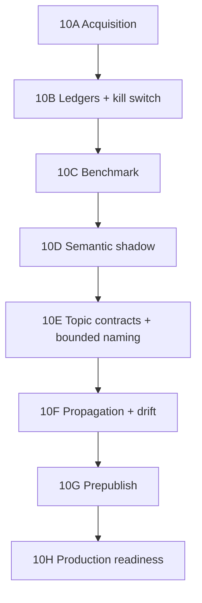

# 56 · Signal Semantic Cascade Execution Plan

> **Estado:** plan ejecutable de ingeniería; Gates 10A.3, 10A.5A, 10A.5B y 10B están
> implementados y validados localmente. 10C cerró técnicamente con `no_adoption` y no
> habilita 10D. 10A.4 permanece como rehearsal remoto independiente.
> **Registrado:** 2026-08-15T10:42:46-06:00 (`America/Mexico_City`).
> **Canon de producto:**
> [55_SIGNAL_ACQUISITION_SEMANTIC_CASCADE_AND_TOPIC_CONTRACTS.md](./55_SIGNAL_ACQUISITION_SEMANTIC_CASCADE_AND_TOPIC_CONTRACTS.md).
> **Arquitectura:**
> [ADR 015](../adr/015-signal-semantic-cascade-and-topic-contracts.md).
> **Contrato cerrado de 10A.1:**
> [57_SIGNAL_ACQUISITION_PLAN_SCHEMA_CONTRACT_AUDIT.md](./57_SIGNAL_ACQUISITION_PLAN_SCHEMA_CONTRACT_AUDIT.md).
> **Aplica a:** Data & Sources, ingesta, Semantic Review, Topics & Narratives, serving
> gobernado y primer publish de Signal V0.2.
> **No autoriza:** migraciones remotas, provider calls, compra de infraestructura,
> promoción de bindings/readers, publicación cliente, commit o push.

## 0. Política De Desarrollo Preproducción Y Criterio Greenfield

**Registrada:** 2026-08-15T16:18:23-06:00 (`America/Mexico_City`).

Este programa se desarrolla íntegramente en preproducción. Laika, Alexa y los demás
workspaces existentes son fixtures desechables de aprendizaje; no son clientes, no son
datos que deban rescatarse y no constituyen el criterio de aceptación del producto.

Desde Backend 10A.2, la aceptación funcional se hace creando un workspace nuevo desde
la UI vigente y recorriendo el camino soportado de punta a punta. La compatibilidad
histórica se limita a no corromper el repo, no cruzar workspaces y representar lo
ambiguo como `legacy-unplanned/unknown`. No se invertirá un gate en backfills, scripts
especiales o excepciones destinados únicamente a hacer funcionar Laika, Alexa u otro
fixture anterior.

Esto no elimina la disciplina de schema: las migraciones forward-only siguen siendo el
mecanismo para construir y reproducir el producto. La diferencia es que una migración
debe crear una capacidad general del producto, no rescatar un workspace de prueba. No se
aplicarán migraciones remotas ni se ensayará compatibilidad histórica antes de que el
flujo greenfield local —marca, plan, slots, imports, ETL, revisión, T&N y preview— sea
usable desde la interfaz.

Antes de incorporar el primer cliente real se abrirá un gate separado de production
readiness para datos que sí deban conservarse. Ese gate no condiciona el desarrollo
greenfield actual ni autoriza borrar estado remoto existente.

## 1. Resultado Que Debe Producir Este Programa

El resultado no es “instalar BERTopic”. El resultado es un camino greenfield soportado
en el que un operador pueda:

1. crear una marca y obtener slots de adquisición para marca primaria, categoría y cada
   competidor de Brand OS;
2. generar desde Brand OS + brief/Study OS una query SentiOne por slot, revisarla y
   después importar muchos CSV sin perder query, periodo, entidad, rights o lineage;
3. procesar 100K+ raíces con ETL y clasificación operacional sin un LLM por mención;
4. revisar incertidumbre, no todo el corpus;
5. descubrir tópicos sobre la población completa con compute local;
6. convertir findings revisados en contratos versionados y seguros;
7. aplicar esos contratos al corpus completo y a imports futuros;
8. publicar Signal con denominator, coverage, limitaciones y rollback verificables;
9. reservar Claude para excepciones, naming y síntesis acotadas con preflight y hard cap;
10. mantener T&B como estudio estratégico separado, pagado y sample-bounded.

La salida comercial es un Signal económico de operar y un T&B profundo que sí se puede
cotizar. La salida técnica es una sola autoridad de clasificación, no una segunda
licuadora paralela.

## 2. Estado Inicial Real

### 2.1 Capacidades que se conservan

| Capacidad existente | Decisión |
|---|---|
| `data_sources`, imports asíncronos, storage multipart y recovery | Reutilizar como conector, archivo y transporte durable |
| `mentions` + canonical roots/aliases | Reutilizar como identidad de registro |
| provenance, quality, retention y licensing | Reutilizar como eligibility y rights; no replicar |
| `signal_mention_attributions` + review events | Reutilizar como autoridad de verdad semántica |
| Semantic Review projection/resolution 100K | Reutilizar para cola humana y carril Claude acotado |
| governed views, policy bundles, compilations y bindings | Reutilizar para población/serving por módulo y view |
| `signal_taxonomy_profiles`, taxonomies, terms, rule sets y model versions | Reutilizar como identidad del catálogo T&N |
| BullMQ, outbox, leases, heartbeats, recovery y budget ledger | Reutilizar como patrón operativo |
| readers y componentes Signal V2 | Migrar por compatibilidad y canary; no reescribir desde cero |

### 2.2 Deuda que no puede convertirse en canon

| Deuda actual | Riesgo | Regla de transición |
|---|---|---|
| Admin crea sólo una source `primary_brand` | No expresa category o competidores | Source será conector; slot será intención de adquisición |
| `query_packs` exige `study_corpus_id` | Reintroduce ownership study-first | No usar como autoridad de slots workspace-owned |
| Campos útiles del provider viven en `raw_metadata` | APIs y reglas dependen de JSON opaco | Proyectar observaciones tipadas, conservando raw sólo como lineage privado |
| Semantic Review pagado selecciona todo lo no resuelto | Costo lineal por registro | La cascada local resuelve/abstiene antes de construir exception lane |
| T&N usa Voyage + Claude sobre la población incluida | Costo y lock-in lineales | Retirar enqueue full-pop antes de activar la nueva autoridad |
| `record_tags` se muta con `ON CONFLICT DO UPDATE` | Borra historia efectiva | Nueva ledger append-only; `record_tags` queda proyección temporal |
| `confidence=high` + score ≥0.9 autoaprueba | El modelo se autocertifica | Autoaccept sólo con policy medida contra holdout aprobado |
| Baja confianza se vuelve `rejected` | Confunde no saber con decisión negativa | `abstained` es un resultado explícito |
| T&N depende de `study_corpus_id`/operational corpus | Rompe workspace-first | Generaciones se anclan a workspace, governed view y watermark |
| Readers no exigen coverage uniforme | Partial puede parecer full | Publication coverage es parte obligatoria del contrato |

`signal_observations` tampoco se reutiliza para observaciones del provider. Esa tabla
representa métricas analíticas de señales y está anclada a `study_corpus_id`; usarla para
la ingesta repetiría el acoplamiento que Data OS eliminó.

### 2.3 Execution state de Gate 10A

`0084_signal_acquisition_plan_control_plane.sql` implementa localmente un plan current
por workspace, draft CAS, slots por versión, reference decisions append-only, queries
privadas versionadas, source connector keys, competitor lifecycle, sello de imports y
typed provider observations. El target conserva `mentions` y
`signal_mention_attributions` como stores únicos de record y verdad semántica.

El browser usa únicamente workspace ya autorizado, `source_key`, `slot_key` y query
version operator-safe. Plan/slot/query/entity UUIDs, owner IDs, policies, SQL y
`raw_metadata` no forman parte del input público. Los imports target producen sólo
`source_intent`, `pending`, `not_eligible`; una source connector no aporta aprobación.
Recovery copia el sello original, no reinterpreta el plan current.

Estado: `10A2_local_green_ready_for_frontend_10A3`. No se aplicó 0084 remotamente, no
se conectaron readers, no se movieron pointers/bindings y no se ejecutaron provider
jobs. Advisor final: `approve_with_p2_p3`, P0/P1=0, `can_advance=true`; checksum 0084
`d959f17e1af5378d798bc1ca089bc6802bf6c3e8455a6054a98aeec3359fd26b`.

## 3. Arquitectura Objetivo

```mermaid
flowchart LR
  BrandOS["Brand OS identities"] --> Acquisition["Acquisition plan + slots"]
  StudyOS["Acquisition brief / Study OS"] --> QueryEngine["Bounded Query Engine"]
  Acquisition --> QueryEngine
  QueryEngine --> QueryVersions["Reviewed provider query versions"]
  QueryVersions --> Import["Durable imports"]
  Import --> ETL["Typed ETL + canonical roots"]
  ETL --> Cascade["Semantic cascade generation"]
  Cascade --> Assertions["Current semantic assertions"]
  Cascade --> Exceptions["Human / bounded Claude exceptions"]
  Assertions --> Views["Governed views"]
  Views --> Discovery["Full-pop local topic discovery"]
  Discovery --> Contracts["Reviewed T&N contracts"]
  Contracts --> Propagation["Full-pop + incremental propagation"]
  Propagation --> Assignments["Append-only assignment generation"]
  Assertions --> Coverage["Publication coverage"]
  Assignments --> Coverage
  Coverage --> Preview["Signal preview"]
  Preview --> Publish["Atomic publish / rollback"]
```

### 3.1 Una autoridad por concepto

| Concepto | Autoridad target |
|---|---|
| Conector y rights de origen | `data_sources` + governance/provenance vigente |
| Intención de adquisición | Plan/slot/query version workspace-owned |
| Archivo concreto | `import_batches` + storage manifest |
| Identidad de mención | Canonical root en `mentions` |
| Verdad de scope/entidad | `signal_mention_attributions` current |
| Evaluación de la cascada | Generation/evaluation append-only |
| Catálogo T&N | Taxonomy profile + term contract current |
| Clasificación T&N | Assignment assertion current dentro de una generation |
| Población servida | Governed view binding + compilation |
| Conteo publicado | SQL sobre generation/población/watermark declarados |

Los nuevos objetos no duplican `mentions`, assertions, taxonomies ni populations. Añaden
las decisiones que hoy faltan entre ellas.

## 4. Rol Exacto De Cada Tecnología

No se incorporarán nueve frameworks al runtime. Cada tecnología pasa primero por un
benchmark y sólo una combinación gana el derecho de producción.

| Tecnología | Rol | Dónde corre | ¿Es autoridad? | Condición de adopción |
|---|---|---|---|---|
| Sentence Transformers | Embeddings multilingual para discovery, prototypes y búsqueda semántica | Harness de benchmark; después artifact local pinneado | No, produce features | Licencia, hash, dimensión, latencia, memoria y eval aprobados |
| BERTopic | Baseline modular de discovery | Harness Python aislado | No, produce clusters candidatos | Gana o documenta baseline reproducible |
| FASTopic | Challenger de discovery | Harness Python aislado | No | Supera baseline en utilidad/estabilidad/costo, no sólo velocidad |
| Snorkel-style labeling functions | Diseño de reglas que votan o se abstienen; opcionalmente estima conflictos | Entrenamiento/benchmark; ejecución productiva en plan compilado | No por sí sola | Reglas versionadas y trazables; outputs calibrados |
| SetFit | Clasificador local few-shot multi-label cuando exista gold set | Entrenamiento aislado; inferencia artifact pinneado | No | Holdout/slices/calibración pasan policy |
| Cleanlab | Priorizar label issues, ambigüedad, outliers y ejemplos para review | QA offline/worker local | No | Demuestra mejor recall de errores sin cambiar labels solo |
| PostgreSQL FTS | Matching lexical, frases, negación y ranking | Data plane | Sí, como plan compilado del contrato | Plan parameterized, indexable y con timeout |
| `pg_trgm` | Variaciones ortográficas/aliases acotados | Data plane | Parte del plan compilado | Umbral y regresiones por contrato |
| pgvector | Prototype matching y recuperación semántica | Data plane | Parte del plan compilado | Dimensión/artifact fijo y load test |
| RRF/reranking determinístico | Combinar lexical, semantic y classifier | Query Engine/SQL | Parte de una version policy | Fórmula, thresholds y pruebas pinneadas |
| Claude | Naming, definición, merge/split, counterexamples y excepciones difíciles | Provider lane bounded | Nunca promueve ni calcula counts | Packet acotado, preflight, cap e intervención explícita |
| Elasticsearch Percolator | Opción futura para muchísimos contratos | No se instala en esta fase | No | Sólo si Postgres falla un SLO medido y un ADR aprueba otro store |

### 4.1 Frontera Python/TypeScript

El monorepo y los workers productivos permanecen Node 20/TypeScript. El benchmark puede
crear `tools/signal-semantic-lab/` con:

- Python 3.12 pinneado y lockfile reproducible (`uv.lock` o equivalente);
- Dockerfile/runner sin credenciales de producción;
- entrada Parquet/JSONL operator-safe exportada por un script server-owned read-only;
- salidas en un manifest con hashes, seeds, versiones, licencia, hardware, tiempo y RAM;
- denominator/row counts y exclusiones por motivo, scope, idioma y periodo;
- cero writes directos a tablas serving;
- cero provider calls implícitas.

Adoptar un servicio Python persistente no es consecuencia automática del benchmark.
Requiere ADR separado. La preferencia de producción es exportar el modelo a ONNX y
ejecutarlo desde Node cuando exista paridad demostrada. Si ONNX pierde calidad o no
soporta el modelo elegido, el ADR debe comparar un batch sidecar Python, su operación y
su rollback antes de introducirlo.

### 4.2 Registro de artifacts

Todo embedding/classifier/discovery artifact adoptado registra:

- `artifact_key`, version y tipo;
- upstream repository/model revision inmutable;
- licencia y evidencia de revisión;
- SHA-256, firma si existe y storage URI privado;
- dimensión, quantization y runtime requerido;
- training/gold/eval digests;
- métricas globales y por slice;
- threshold/calibration policy;
- actor que lo aprobó, fechas efectivas y estado;
- compatibilidad e invalidation scope.

Un nombre de modelo flotante no puede ser current.

## 5. Cambios De Backend Y Persistencia

Los ordinales de migración de esta sección son provisionales. Cada misión debe reservar
el siguiente ordinal después de releer el ledger real; nunca renumerar migraciones ya
aplicadas.

### 5.1 Acquisition control plane

Objetos nuevos propuestos:

#### `signal_acquisition_plans`

- identidad `(workspace_id, version)` y un solo plan current;
- Brand OS revision/digest que originó el plan;
- estado `draft`, `active`, `retired`;
- effective dating, actor, idempotency key y events append-only.

#### `signal_acquisition_slots`

- `plan_id`, `slot_key`, `scope` cerrado;
- `entity_type`/`entity_id` exactos y validados dentro del workspace;
- label operator-safe, status y posición;
- tipos iniciales: `primary_brand`, `competitor`, `category`, `reference`;
- un slot por competidor current, no un source falso por competidor.

#### `signal_acquisition_query_versions`

- slot, provider syntax/version y query text privado;
- aliases/terms estructurados, query hash y actor;
- periodo/cadence esperados y effective dating;
- nunca se actualiza una query ejecutada; una corrección crea versión.

#### Extensiones de `import_batches`

- `acquisition_slot_id` y `acquisition_query_version_id`;
- `capture_period_start/end` y timezone;
- plan/slot/query digests sellados en aceptación;
- source/import rights siguen siendo los existentes;
- `query_pack_id` queda compatibilidad legacy, no autoridad workspace-owned.

#### Observaciones tipadas del provider

Crear una proyección relacional/versionada por canonical root + import/source para los
campos útiles: provider query/tag, plataforma, tipo/rol/thread, idioma/país, timestamps,
engagement y referencias públicas seguras. La tabla exacta se decide tras inventariar el
parser real, pero debe cumplir:

- columnas cerradas para campos consultables;
- `schema_version` y `observation_hash`;
- relación a import/source/root;
- `raw_metadata` sólo lineage privado;
- no copiar texto crudo innecesariamente;
- no usar `signal_observations` ni crear otro store de mentions.

### 5.2 Semantic cascade control plane

Objetos nuevos propuestos:

#### `signal_semantic_cascade_generations`

Identidad de una evaluación reproducible: workspace, population/view, input watermark,
plan, labeling-function set, model artifact, threshold policy, counts y estado.

#### `signal_semantic_labeling_function_versions`

Especificación cerrada de cada regla, prioridad, clases que puede votar, abstención,
scope, regression examples, compiler/hash y effective dating. Browser/Claude no guardan
SQL ni regex ejecutable.

#### `signal_semantic_gold_sets` y `signal_semantic_gold_items`

Snapshots operator-approved, balance/slices declarados y separación explícita entre
train, calibration y holdout. Cambiar un label crea nueva revisión/evento; no reescribe
la evidencia histórica de una evaluación pasada.

#### `signal_model_artifacts` y `signal_model_evaluations`

Registro común de artifacts, métricas, slice results, calibración, licencias y decisión
de promoción. Puede servir después a T&N, sin mezclar sus assignment ledgers.

#### `signal_semantic_cascade_evaluations`

Una fila por canonical root + generation con:

- outcome `exact`, `rule`, `model`, `human`, `provider`, `abstained`, `error`;
- proposed scope/entity, score calibrado y evidence refs;
- decision policy/version;
- current evaluation dentro de la generation, sin convertirla todavía en assertion.

Cuando una policy medida permite autoaccept, el servicio usa el writer existente de
`signal_mention_attributions` para crear una nueva assertion `mention_semantic`. No hace
updates directos. Si el check de `attribution_basis` o approval metadata no puede expresar
`policy`, se amplía de forma forward-only; no se inventa un segundo assertion store.

### 5.3 Topic & Narrative contract control plane

Se conservan profiles/taxonomies/terms actuales. Se agregan:

#### `signal_taxonomy_term_contracts`

- profile/term/version, kind y Rule Spec cerrado;
- definition, positive examples y counterexamples;
- artifact/threshold references opcionales;
- effective dating, actor, evidence y estado `draft`, `tested`, `active`, `retired`;
- un current por profile/term; promoción transaccional.

#### `signal_taxonomy_contract_compilations`

- canonical AST y `rule_spec_hash`;
- compiler version y `compiled_plan_hash`;
- mandatory predicates digest;
- EXPLAIN/load-test evidence, timeout/resource budget;
- regression suite digest;
- estado `ready`, `stale`, `blocked`.

#### `signal_taxonomy_assignment_generations`

- workspace, module/view, policy binding, population, profile y watermark;
- contract/artifact/threshold digests;
- eligible, assigned, abstained, pending, rejected y error counts;
- coverage/status y supersession.

#### `signal_taxonomy_mention_evaluations`

Una evaluación exhaustiva por root/profile/generation: `assigned`, `abstained`, `error`
con method, scores y evidence. Es lo que permite demostrar que 100K raíces se procesaron
aunque sólo una parte tenga tags.

#### `signal_taxonomy_assignment_assertions` y events

Ledger append-only por root/term/generation con review state, actor/policy, evidence y
`supersedes`. Sólo assignments current aprobadas alimentan serving.

`record_tags` se mantiene inicialmente como **proyección de compatibilidad** de las
assertions current para readers legacy. Se reconstruye idempotentemente desde la ledger;
deja de ser la autoridad y ninguna nueva ruta ejecuta `ON CONFLICT DO UPDATE` sobre una
decisión semántica.

Durante el bridge, un único projector server-owned escribe las filas nuevas de
`record_tags`. El worker legacy queda deshabilitado antes de activar ese projector. Cada
fila proyectada conserva `assignment_assertion_id` y `assignment_generation_id` mediante
columnas forward-only o un vínculo relacional 1:1; el diseño 10B elegirá una sola opción.
El projector sólo reconcilia filas que él mismo posee, es idempotente por generation y
nunca modifica tags legacy/manuales. El bridge expira en Gate 10H y, como máximo, el
2026-10-15; extenderlo exige ADR, motivo y aprobación del operador. Su criterio de retiro
es: readers ledger-native, dos generations staging completas —full + delta—, un canary
greenfield y cero imports/runtime references al writer legacy.

### 5.4 Topic discovery artifacts

Objetos propuestos:

- `signal_topic_discovery_runs`: population, watermark, embedding/discovery artifacts,
  params, seed, hardware, runtime/RAM y estado;
- `signal_topic_discovery_clusters`: cluster key, keywords, centroid, size, stability,
  representative refs y temporal/scope distributions;
- `signal_topic_discovery_memberships`: root/cluster/run, distance/probability y outlier;
- `signal_topic_discovery_proposals`: candidate term/merge/split/naming packet, origin y
  review state.

Discovery no crea taxonomy terms current. El operador promueve una propuesta a contract;
esa decisión conserva la relación con cluster/evidence.

### 5.5 Embeddings

Después de elegir artifact y dimensión se crea un store workspace-safe de embeddings por
canonical root + artifact hash. Requisitos:

- vector de dimensión fija por tabla/columna adoptada;
- una sola fila current por root/artifact, contenido hash y watermark;
- rights/retention respected antes de materializar;
- HNSW/IVFFlat sólo después de un benchmark real;
- invalidación por text/content hash y artifact version;
- no mezclar vectores de modelos distintos en el mismo índice lógico;
- texto crudo nunca sale en una API de vectores.

No se decide ahora entre BGE-M3, multilingual-e5 u otro modelo. Ese nombre es salida del
benchmark 10C, no una preferencia escrita en schema.

### 5.6 Publication coverage

Crear un snapshot/read model versionado por workspace/module/view/release candidate con:

- eligible total;
- exact/rule/model/human/provider resolved;
- assigned/classified;
- pending, abstained, rejected y error;
- denominator por métrica;
- coverage state y limitations;
- policy/profile/contract/model/generation/watermark digests.

Puede materializarse dentro de la infraestructura de governed-view compilations si ésta
puede preservar esa identidad completa. Si no, se añade una tabla de publication
coverage; no se esconde en JSON del frontend.

## 6. Rule Spec Y Compiler

### 6.1 Superficie permitida

El Rule Spec versionado acepta únicamente:

- lexical `any`, `all`, `not`, phrases y proximity con límites;
- aliases/lemmas normalizados;
- filtros cerrados: idioma, plataforma, scope y entidad;
- positive/negative embedding prototypes;
- classifier artifact y calibrated threshold opcionales;
- combinación/pesos dentro de una enum/formula versionada;
- definition, examples, counterexamples y regression cases.

Rechaza SQL, JavaScript, nombres de tabla/columna, joins, subqueries, regex libre,
population IDs aportados por el browser y artifacts no aprobados.

### 6.2 Guardas obligatorias del compilador

Todo plan inyecta server-side:

1. `workspace_id` autorizado;
2. canonical root deduplication;
3. governed population/view binding;
4. quality, retention y licensing vigentes;
5. semantic eligibility requerida por el módulo;
6. effective dating y watermark;
7. statement timeout y row/complexity budget.

La compilación falla cerrada si falta un índice, un artifact, una policy, una relación
cross-workspace, una columna soportada o una regresión. La UI sólo recibe errores
operator-safe.

### 6.3 Tópico versus narrativa

- **Tópico:** puede resolverse por señales lexicales/semánticas sobre el asunto.
- **Narrativa:** expresa una proposición, framing o relación. Requiere classifier o
  evidence semántica, counterexamples y thresholds más estrictos. Keywords solas no
  certifican una narrativa.

Ambos pueden abstenerse. Ninguno puede autocertificarse con confidence declarada por el
modelo generador.

## 7. Worker Topology Y Operación

### 7.1 Jobs nuevos

Los nombres finales se versionan en Query Engine; la topología prevista es:

| Job | Responsabilidad | Provider permitido |
|---|---|---|
| `signal.semantic-cascade.v1` | Exact/rules/local classifier y evaluations | No |
| `signal.semantic-exception.v1` | Sólo selection sellada unresolved | Claude opcional con cap |
| `signal.embedding-materialization.v1` | Embeddings locales pinneados | No API por registro |
| `signal.topic-discovery.v1` | Full-pop clusters/outliers/representatives | No |
| `signal.taxonomy-contract-compile.v1` | Validate/compile/regression/load test | No |
| `signal.taxonomy-propagation.v1` | Evaluate all roots and future delta | No |
| `signal.taxonomy-drift.v1` | Novelty, distribution shift y review queue | No |
| `signal.publication-reconcile.v1` | Coverage/read-model reconciliation | No |

Cada job usa outbox durable, parent/child shards, leases, heartbeat, recovery, idempotency,
progress real, cancellation y evidence final. Los jobs de compute declaran CPU/RAM/time
budget aunque no tengan costo de provider.

### 7.2 Retiro del worker actual

Antes de activar la nueva autoridad:

1. bloquear nuevos enqueues de `signal.taxonomy-enrichment.v1` con una gate server-owned;
2. inventariar queued/active/failed y preservar historial;
3. dejar completar o cancelar en forma auditable según estado;
4. impedir que el dispatcher reconozca el job en el modo nuevo;
5. comprobar que ninguna API, script o retry puede volver a crearlo;
6. mantener lectura de resultados legacy sólo durante la proyección/cutover;
7. eliminar la ruta cuando rollback ya no dependa de ella.

No habrá dual-write permanente entre provider enrichment y contract propagation.

### 7.3 Sharding y recurrencia

- Full build: shards determinísticos por canonical root ID y generation.
- Incremental: sólo roots cuyo content hash/watermark es posterior al último success.
- Cambio de contract/model/threshold: nueva generation; no update in place.
- Error parcial: generation no es `ready`; completed shards pueden reutilizarse sólo si
  input/plan digest coincide exactamente.
- Backpressure: límite por workspace y cola; fairness para que un corpus grande no bloquee
  todos los clientes.

## 8. APIs Internas

Todas las rutas son server-owned, AuthZ por workspace y usan `Idempotency-Key` en writes.
Los payloads browser nunca incluyen organization IDs, population IDs, compiled SQL o
storage URIs con autoridad.

### 8.1 Acquisition

- `GET /acquisition-plan`: plan current, slots, readiness y drift contra Brand OS.
- `POST /acquisition-plan/reconcile`: crea draft; no activa ni reetiqueta historia.
- `POST /acquisition-plan/promote`: promoción explícita con digest sellado.
- `POST /acquisition-slots/{slot}/queries`: nueva query version.
- import create-upload exige `slot_id`, `query_version_id`, periodo y timezone; el servidor
  valida source, entity y plan current.

### 8.2 Semantic cascade

- `GET /semantic-cascade/preflight`: stage counts, compute plan, eval artifact y cero
  escrituras/provider calls.
- `POST /semantic-cascade/runs`: inicia local generation con digest y budget de compute.
- `GET /semantic-cascade/runs/{id}`: progress/counts/errors/coverage.
- `POST /semantic-cascade/runs/{id}/cancel|resume`: recuperación auditable.
- `GET /semantic-review/resolve`: conserva read-only; ahora calcula sólo exception lane.
- paid POST conserva preflight/hard cap y nunca expande selection silenciosamente.

### 8.3 Discovery y contracts

- discovery preflight/run/status/cancel;
- cluster explorer, evidence y proposal endpoints read-only;
- term contract create/test/promote/retire;
- compiler explain operator-safe y regression results;
- propagation preflight/run/status;
- assignment review individual y bulk con append-only events;
- drift queue y resolution actions.

### 8.4 Prepublish

- `GET /publication-readiness`: read-only, devuelve digests, denominadores, coverage,
  limitations y blockers por módulo/view.
- `POST /publication-candidates`: crea snapshot candidate sellado.
- `POST /publication-candidates/{id}/promote`: confirmación explícita, atómica e
  idempotente.
- rollback crea una nueva transición auditable; no borra el release defectuoso.

## 9. Frontend Que Desbloquea El Backend

Este plan no autoriza inventar componentes standalone. Admin reutiliza shell, cards,
tables, drawers, filter/date primitives y estados de Signal/Shopify ya canonizados.

### 9.1 Data & Sources

- Source aparece como conector.
- Slots aparecen como secciones: marca primaria, categoría y uno por competidor Brand OS.
- Cada slot muestra query current, imports, periodo, freshness, rights y estado.
- Multi-file queue conserva archivo→slot; no obliga a crear otra source.
- Reconciliar Brand OS presenta diff y requiere promoción explícita.

### 9.2 Semantic Review

- Facets por outcome: exact, rule, model, human, provider, abstained y error.
- Coverage y stage counts visibles antes de pagar.
- “Resolver con Claude” sólo sobre selection exception lane con estimación/cap.
- Gold-set workbench permite label, correction, conflict y holdout sin exponer qué items
  son holdout durante revisión ordinaria.

### 9.3 Topics & Narratives setup

- Cluster explorer full-pop con representative/counterexamples y distributions.
- Acciones merge/split/name/ignore/create contract.
- Contract editor de campos cerrados, no SQL.
- Test panel con true/false positives, false negatives, abstentions, coverage y latency.
- Promote/retire explícitos y generation status.

### 9.4 Prepublish

- Checklist por Overview, Mentions y T&N.
- Denominator, classified/pending/abstained/rejected y limitations.
- `partial` exige confirmación; `not_available` no puede publicarse como cero.
- Preview usa exactamente candidate digests que se promoverán.

## 10. Benchmark Reproducible

### 10.1 Corpus

Alexa es el fixture de staging inicial porque ya tiene 109,056 roots, múltiples imports y
scopes imperfectos. No se convierte en excepción de runtime ni en requisito de producto.

El export de benchmark debe:

- usar roots canonical y rights vigentes;
- eliminar identificadores innecesarios;
- conservar scope/entity, idioma, plataforma, periodo y señales seguras para slices;
- sellar population/watermark/content digest;
- registrar exclusiones y denominator;
- ser read-only respecto a staging.

### 10.2 Split y gold set

- Separar train/calibration/holdout por tiempo y canonical family, evitando leakage de
  duplicados/aliases.
- Estratificar por scope/entity, idioma, plataforma, periodo y clases raras.
- Dimensionar el gold set por intervalos de confianza y error esperado; no fijar una cifra
  cosmética igual para toda clase.
- Congelar holdout antes de ajustar thresholds.
- Registrar desacuerdo entre operadores cuando exista; no forzar certeza falsa.

### 10.3 Discovery metrics

- topic coherence (`c_npmi` u otra pinneada);
- topic diversity y redundancy;
- estabilidad entre seeds/bootstrap y periodos;
- outlier/abstention rate;
- coverage por scope/entity/language;
- tiempo, peak RAM, artifact size e incremental cost;
- blinded operator usefulness: coherencia, accionabilidad, merge/split burden y evidencia.

### 10.4 Classification metrics

- precision, recall, F1 y PR-AUC por clase;
- micro/macro aggregates sólo como complemento;
- calibration ECE/Brier y reliability curves;
- risk/coverage curve bajo abstención;
- confusion matrix y slices;
- false-positive budget más estricto para autoaccept;
- drift sensitivity y latency/throughput.

### 10.5 Selección

No gana un modelo por una sola métrica. La decisión pondera:

1. utilidad operator-reviewed;
2. precisión/calibración en holdout;
3. estabilidad y coverage;
4. operación incremental;
5. licencia/supply chain;
6. memoria, latencia y costo.

Si ningún challenger pasa, el sistema puede lanzar con exact + labeling functions +
abstención, sin inventar un clasificador aprobado.

## 11. Secuencia De Ejecución

### Gate 10A · Acquisition Plan y typed ETL

**Estado:** backend 10A.2 y frontend 10A.3 locales verdes. El rehearsal remoto 10A.4
permanece separado y no condiciona el siguiente bloque de construcción greenfield.

**Objetivo:** expresar desde origen primary/category/competitors y dejar cada import
sellado contra un slot/query versionado.

**Trabajo:**

1. inventario y migration design;
   - marcar `study_corpus_id`, `query_pack_id`, `mention_type` y scope/entity legacy de
     source/import como compatibilidad únicamente;
   - demostrar que ningún slot/query nuevo deriva semantic approval de esas columnas;
2. plan/slot/query writers y events;
3. reconcile draft desde Brand OS;
4. import contract y typed observation projection;
5. UI Data & Sources por slot;
6. compatibilidad de imports existentes sin inferir entities;
7. local PostgreSQL + browser QA;
8. shadow staging sólo con autorización separada.

**Salida:** un workspace nuevo y uno existente cargan primary, category y dos competidores;
cross-workspace falla, historical query permanece y source no se duplica.

**Stop conditions:** implicar scope semántico aprobado a partir del slot, reescribir
imports históricos o necesitar `raw_metadata` en APIs visibles.

### Gate 10A.5A · Workspace-owned Query Composer backend

**Estado:** `implemented_local_ready_for_10A5B`. El QA de 10A.3 confirmó que plan, slots
y query versions funcionan; 10A.5A añadió el núcleo compartido, Brief sellado y drafts
workspace-owned sin provider real ni superficie frontend.

**Objetivo:** promover el Query Composer puro existente como núcleo compartido y añadir
un adapter workspace-owned mínimo que produzca drafts de queries externas por slot. No
se conecta Acquisition Plan al runtime ni a las tablas study-first.

**Trabajo:**

1. introducir un input provider-neutral para el núcleo puro, conservando construction
   plan, strategy brief, RAG, parser, repair, fallback y validación existentes;
2. mantener el worker Study OS como adapter de compatibilidad y crear un adapter nuevo
   que jamás fabrica ni consulta `study_corpus_id/query_iterations/query_packs`;
3. sellar dentro del plan un Acquisition Brief workspace-owned; Study OS puede aportar
   contexto read-only, pero nunca ownership;
4. extender de forma aditiva query versions con `engine-generated` y lineage mínimo:
   modelo, pipeline, prompt/context digests, validation digest y fallback;
5. emitir primary, category y una query por competitor slot; reference nunca se genera
   sin decisión explícita;
6. persistir drafts exclusivamente mediante el writer 0084, con preflight, hard cap,
   idempotencia y validación actual; no crear todavía otro dialect compiler, parent-run
   asíncrono, budget ledger paralelo ni una familia extensa de endpoints;
7. PostgreSQL local + Worker/API contract tests; cero imports, SentiOne o writes remotos.

**Salida:** un servicio bounded puede generar cuatro drafts válidos para primary,
category y dos competidores, con lineage y ownership correctos; regenerar crea
supersession auditable y no toca una query ya importada.

**Stop conditions:** copiar el worker study-first completo, hacer que `study_corpus_id`
gobierne el plan, aceptar texto no validado, mezclar competidores, autoactivar propuestas,
escribir SentiOne/SQL desde Claude o ejecutar una query externa durante este gate local.

**Evidencia local:** smoke `0000–0085`, reaplicación 0085, fixture PostgreSQL greenfield,
Query Engine, Studio y Worker adapter verdes. Se generan exactamente cuatro drafts para
primary/category/dos competitors, reference queda fuera, regeneration crea supersession
y no aparecen Study corpora, query packs, imports ni promotion.

### Gate 10A.5B · Query review y first-use frontend

**Estado:** `browser_qa_local` (2026-08-16,
`America/Mexico_City`).

**Objetivo:** sustituir el textarea vacío como camino principal por generación, revisión
y aprobación canónicas, sin ocultar la edición avanzada ni mezclarla con import.

**Trabajo:** acción `Generar queries`, estado bounded de la operación, review/diff por
slot, fallback visible, regeneración, edición avanzada append-only y aprobación explícita.
En este slice se pulen first-use, empty/loading/error states, jerarquía, helpers,
responsive y copy usando componentes canónicos de Admin/Signal y Shopify como referencia.

**Salida:** desde una marca greenfield el operador genera, inspecciona, corrige y aprueba
las cuatro query versions requeridas sin comenzar desde campos vacíos; el plan permanece
bloqueado mientras una propuesta no esté aprobada.

**Stop conditions:** UI standalone, aprobación implícita, esconder fallback/error,
sobrescribir una versión ejecutada o hacer provider calls desde el browser.

**Implementación:** Admin reutiliza el drawer, status, feedback y flight card canónicos.
El preflight gratuito declara connector, slots, modelo/pricing, máximo de dos llamadas,
estimate y hard cap. La generación exige confirmación explícita y corre exclusivamente
server-side. Cada resultado aparece por slot como propuesta privada `pending`, con
fallback visible, comparación contra current, edición avanzada append-only y decisión
`approved/rejected` con evidence. 0086 conserva esas decisiones en ledger append-only;
pending/rejected bloquean promotion y una regeneración no hereda approval.

**QA browser local:** el flujo pasó en desktop (1280 px y 917 px) y móvil (390 × 844).
Se verificaron el plan y sus slots, preflight gratuito, blocked state, flight card,
drawer full-width móvil y review de una query existente. El preflight observó cuatro
queries, dos llamadas máximas, estimate USD 0.27, hard cap USD 1.00, modelo y pricing
pinneados; no se ejecutó el POST pagado. Durante QA se corrigieron el espaciado de
identidad/scope, la composición responsive de controles y la visibilidad de errores de
operación fuera de drawers.

### Gate 10B · Ledger semántica, abstención y kill switch

**Estado:** `implemented_local` el 2026-08-16T03:05:37-06:00. La salida local quedó
probada con PostgreSQL real: denominator 7 = approved 3 + pending 1 + rejected 1 +
abstained 1 + error 1; resolved 6; projector 3. Concurrent replay converge, rebuild
conserva digest, gold splits no mezclan train/test, top-level y slice metrics se
recomputan server-side, evaluated no implica approved y score 1.0 no concede autoridad.
Los resultados del resolver de provider permanecen pending/no elegibles y el DB rechaza
que `claude_semantic_resolution` cree una nueva aprobación. Smoke limpio aplicó
0000–0087.

Digests del cierre local: migración 0087
`sha256:fd62b7dd637e62475dcce0eedbbdfc021906b2a1d72a742f74a28e5851ab48d3`,
rebuild de la proyección fixture
`sha256:5e08e7ff32432a81afb0c2bae2d8f97cdb49defbf1d1a5d4f9ed4b0934f8ed93`.
Manifest sanitizado:
`sha256:eca7d55c03db782e85b5c242c512c5bfa35ebf05f86dcd8fcc5ddd48b50f32d5`.
El pack privado está bajo `.data/signal-semantic-cascade/backend-10b/` con archivos
`0600`; no contiene texto, metadata, UUIDs remotos ni payloads de provider.

Kill-switch cerrado:

| Boundary | Estado 10B |
|---|---|
| producer `signal-refresh` | no crea ni encola enrichment; sólo bloquea una vez history residual |
| queue consumer | rechaza el job name antes de dispatch |
| worker legacy | tombstone sin SDK/import/provider/tag writer; reason estable |
| recovery/drainer | no reencola y no vuelve a mutar rows ya blocked |
| env/API keys | retorno constante disabled; builder de options siempre lanza retired |
| PostgreSQL | trigger prohíbe queued/running/partial nuevos o reactivados |

`record_tags` continúa como bridge, no autoridad: sólo el projector security-definer
puede escribir filas con Signal taxonomy profile y sólo desde assignments approved.
La operación queda autenticada en la transacción; el trigger también protege DELETE.
Retiro: 2026-10-15 en Gate 10H, después de reader cutover de 10G y evidencia de que no
queda consumidor sin generation/watermark.

10A.4 sigue pendiente e independiente. 10C se ejecutó después como harness aislado y
produjo `no_adoption`; 10D no fue ejecutado. No se adoptó Python/modelo, no se activó
Topic Contract Control Plane y no se movió ningún reader, pointer o binding.

**Objetivo:** preparar una sola autoridad segura antes de ejecutar modelos.

**Trabajo:**

1. generations/evaluations/labeling functions/gold/model registry;
2. `abstained` end-to-end;
3. autoapproval por self-score eliminado;
4. append-only T&N assignment ledger y proyección legacy;
   - un único projector owner, ownership por assertion/generation y rebuild idempotente;
   - expiry 2026-10-15/Gate 10H y criterios de retiro verificados;
5. kill switch de `signal.taxonomy-enrichment.v1`;
6. counts/coverage base y integration tests.

**Salida:** fixtures prueban exact/rule/model/pending/abstained/rejected por separado;
legacy history se lee, pero ningún nuevo full-pop provider job puede encolarse.

**Stop conditions:** dual-write permanente, direct update de assertion/tag, o pérdida de
lineage/rollback.

### Gate 10C · Benchmark local de embeddings/discovery

**Estado 2026-08-16:** `technical_no_adoption`, documentado en
[58_SIGNAL_LOCAL_MODELING_BENCHMARK.md](./58_SIGNAL_LOCAL_MODELING_BENCHMARK.md). Export
read-only 109,056/109,056; ningún candidate pair pasó calibration. BERTopic falló gates
semánticos y FASTopic excedió el lower bound de ocho horas. No hubo full-pop sin
finalistas, provider calls ni writes. El packet ciego no permite decisión de modelado.

**Corrección 10C.0/10C.1:** [ADR 016](../adr/016-signal-local-modeling-gate-sequence-and-contextual-naming.md)
limita ese veredicto a la matriz original y congeló un benchmark correctivo locale-aware.
10C.1 separó clustering, representación y naming; eliminó silent clamps y confidence
fabricada; diseñó sin provider el contexto/packet/envelope de naming futuro; y ejecutó
full-pop BGE balanced/detail con tres seeds. Ninguno pasó los gates full-seed, por lo que
el resultado correctivo es también `no_adoption`. 10D continúa bloqueado; el packet ciego
es sólo diagnóstico y no puede convertir un candidate fallido en artifact adoptado.

**Objetivo:** elegir tecnología con evidencia, no gusto.

**Trabajo:**

1. harness reproducible y private export;
2. dos embeddings multilingual como mínimo;
3. BERTopic baseline y FASTopic challenger;
4. métricas técnicas + review ciego;
5. license/supply-chain review;
6. decisión de artifact/runtime vía ADR de adopción.

**Salida:** evidence pack reproduce resultados desde hashes; un ganador o una decisión
explícita de no adopción. Cero writes a serving.

**Stop conditions:** dependencia con revisión legal incompatible, modelo flotante,
hardware no operable o evaluación contaminada.

### Gate 10D · Cascada local shadow

**Objetivo:** reducir la cola pagada sin reducir el denominator.

**Trabajo:**

1. exact identity stage;
2. labeling-function compiler/executor;
3. SetFit/challenger sólo si 10C/gold lo permite;
4. calibration/autoaccept policy;
5. Cleanlab-style review prioritization;
6. exception lane y paid preflight recalculado;
7. full 100K shadow contra assertions current.

**Salida:** el reporte distingue resolved/abstained/exceptions y reconcilia al denominator
exacto; no crea assertions hasta el rehearsal autorizado.

**Stop conditions:** unexplained roots, leakage, slice regression o exception lane que
vuelve a ser prácticamente full-pop sin decisión visible.

### Gate 10E · Topic discovery y contract control plane

**Objetivo:** convertir clusters en conocimiento gobernable.

**Trabajo:**

1. embeddings/materialization e incremental invalidation;
2. discovery run/memberships/proposals;
3. Rule Spec + validator/compiler;
4. FTS/trgm/pgvector hybrid plans;
5. contract CRUD/test/promote/retire;
6. Admin cluster/contract workbench;
7. bounded Claude naming proposal opcional.

**Salida:** operador convierte un cluster en topic contract, ve regresiones/coverage y lo
promueve sin SQL. Narratives no pasan con keywords-only.

**Stop conditions:** browser/Claude emite SQL, plan no inyecta rights/workspace, o sample
count aparece como population count.

### Gate 10F · Propagation, incremental y drift

**Objetivo:** aplicar conocimiento aprobado a todo el corpus y lo nuevo.

**Trabajo:**

1. assignment generations + shards/recovery;
2. full-pop propagation y exact reconciliation;
3. delta de nuevo import;
4. invalidación contract/model/threshold;
5. novelty/outlier/distribution drift;
6. manual/bulk assignment review;
7. rebuild de `record_tags` projection.

**Salida:** un contract procesa 100K+, un import posterior sólo procesa el delta y una
corrección crea supersession auditable.

**Stop conditions:** `ON CONFLICT DO UPDATE` semántico, counts sin generation o drift que
modifica catálogo silenciosamente.

### Gate 10G · Signal prepublish y canary

**Objetivo:** servir el mismo conocimiento con cobertura honesta.

**Trabajo:**

1. publication coverage contract/read model;
2. readers Overview, Mentions y T&N por generation/watermark;
3. Admin checklist, preview y partial confirmation;
4. shadow legacy vs new explicado;
5. canary staging + rollback visible;
6. E2E browser greenfield.

**Salida:** preview=promoted digest; partial/ready/not_available funcionan; rollback
restaura el binding anterior sin borrar generations.

**Stop conditions:** denominator inconsistente entre módulos, unknown=0, o cualquier
reader sigue `record_tags` sin declarar projection generation.

### Gate 10H · Production readiness y retiro legacy

**Objetivo:** preparar revisión de producción, no desplegar automáticamente.

**Trabajo:**

1. load/SLO, backup/restore y disaster rehearsal;
2. security/AuthZ/data-rights review;
3. observability, alerts, cost y capacity runbook;
4. migration/backfill plan para workspaces existentes;
5. deprecation y borrado posterior del worker/provider path;
6. release evidence y PR review.

**Salida:** `READY_FOR_PRODUCTION_REVIEW=true` con evidencia; el operador/PR decide el
cutover. Este gate no autoriza tocar producción por sí mismo.

## 12. Dependencias Y Camino Crítico

El scaffolding read-only del export/harness de 10C puede prepararse después de que 10A
congele el contrato de observaciones, pero el gate 10C no cierra antes de 10B ni abre
10D/10E en paralelo. No se conecta ningún reader antes de 10F. No se ejecuta Claude
full-pop en ningún gate.

## 13. Observabilidad, SLO Y Costos

Cada run expone:

- queue/lease/heartbeat y último progreso;
- roots total/processed/succeeded/abstained/error;
- generation/input/plan/artifact digests;
- rows/s, tokens/s locales si aplica, peak RAM y DB time;
- stage timings: export, embed, rules, classifier, persist, reconcile;
- provider planned/actual calls, tokens, micro-USD reserved/settled cuando exista;
- retry/recovery/supersession state;
- coverage antes/después e invalidations emitidas.

Los SLO finales se fijan tras 10C/10D; antes sólo se registran baselines. No se prometen
“USD 20” ni “cinco minutos” sin medir hardware y provider packet real. Sí son invariantes:

- provider calls por full-pop ETL/cascade/propagation = 0;
- provider spend sin preflight/cap/confirmación = 0;
- roots unexplained al cerrar una generation = 0;
- cross-workspace rows = 0;
- current assignments sin generation/evidence = 0.

## 14. Pruebas Obligatorias

### Unit/contract

- canonical serialization/hash parity TS/PostgreSQL/Python;
- Rule Spec schema, hostile inputs y complexity limits;
- rechazo explícito de `population_id`, binding/policy IDs o policy expressions enviados
  por browser en Rule Spec o APIs; la respuesta es operator-safe y no compila nada;
- calibrated policy y abstention;
- split/leakage and metric calculations;
- coverage arithmetic y unknown/null handling.

### PostgreSQL real

- forward-only migration + idempotency;
- current uniqueness, supersession y append-only triggers;
- cross-workspace, rights, retention y provenance;
- exact/root/alias dedup;
- concurrent promotion/retry/rollback;
- compiler mandatory predicates y statement timeout;
- generation reconciliation y projection rebuild.

### Workers

- shard retry, partial failure, stale lease y drainer;
- content/artifact digest mismatch;
- delta import and invalidation;
- kill switch: legacy job cannot enqueue/dispatch;
- zero-provider assertions for local jobs;
- budget reservation/settlement para exception lane.

### Browser E2E

- greenfield primary/category/multi-competitor import;
- Brand OS reconciliation;
- Semantic Review coverage y bounded resolve;
- cluster→contract→test→promote;
- assignment correction/bulk action/drift;
- partial preview/publish/rollback;
- skeleton/error/slow-state y mobile drawer exclusivity.

## 15. Evidence Pack Por Gate

Cada gate entrega en `.data/` privado y sanitizado:

- target fingerprint y preflight;
- migration checksums/ledger/sentinels cuando aplique;
- protected state before/after;
- commands/tests y tiempos;
- counts/digests/reconciliation;
- provider_calls/jobs/costs;
- browser QA screenshots/steps;
- Advisor review cuando el gate cambie autoridad;
- manifest SHA-256 y permisos `0600`.

Los documentos públicos registran hashes y veredictos, no secretos, raw text, IDs de
cliente ni datasets.

## 16. Autoridad Y Stop Rules

- Local code/tests no autorizan staging.
- Staging_verified no autoriza readers ni producción.
- Benchmark no autoriza un artifact de producción sin ADR/licencia.
- Un draft no autoriza promotion.
- Un preflight no autoriza provider calls.
- Un sample no autoriza full-pop counts.
- Una slot/query no autoriza semantic approval.
- Un cluster no autoriza taxonomy contract.
- Un score no autoriza autoaccept.
- Un gate bloqueado conserva estado; no se “parchea” relajando checks.

## 17. Estado De Ejecución Inicial

| Gate | Estado al registrar este plan | Siguiente decisión |
|---|---|---|
| 10A | `10A5B_browser_qa_local` | Mantener 10A.4 remoto separado y continuar 10B |
| 10A.5A | `implemented_local_ready_for_10A5B` | Núcleo compartido + Brief/lineage + adapter workspace-owned; cero runtime legacy nuevo |
| 10A.5B | `browser_qa_local` | Provider real sigue requiriendo confirmación/cap; no es requisito para comenzar 10B local |
| 10B | `implemented_local_0087` | Autoridad append-only, abstention, gold/model registry, projector temporal y kill switch legacy cerrados; sin staging |
| 10C | `10C1_no_adoption_operator_review_ready` | Operador revisa diagnóstico `none acceptable` o autoriza un nuevo benchmark preregistrado |
| 10D | `blocked_by_10C_no_adoption` | Ninguna corrida; no existe artifact/model decision aprobado |
| 10E | `blocked_by_10C_no_adoption` | Ningún contract nuevo |
| 10F | `blocked_by_10E` | Ninguna propagation |
| 10G | `blocked_by_10D_10F` | Readers permanecen como están |
| 10H | `blocked_by_10G` | Producción permanece intacta |

## 18. Orden Recomendado De Las Próximas Misiones

1. **Backend 10A.1 · Schema/contract audit:** diseñar acquisition plan/slots/import
   metadata y typed projection sin migrar ni escribir remoto. **Completado localmente**
   en [doc 57](./57_SIGNAL_ACQUISITION_PLAN_SCHEMA_CONTRACT_AUDIT.md).
2. **Backend 10A.2 · Local foundation:** migración, writers, API contracts e integración
   PostgreSQL local. **Completado** con 0084; no se aplicó remotamente.
3. **Frontend 10A.3 · Operator flow:** **completado localmente**. Data & Sources opera
   plan, slots, un conector reutilizable, queries versionadas, referencias, activación,
   import sellado, historial y recovery con componentes canónicos; QA browser greenfield
   pasó en desktop y 390 px.
4. **Backend 10A.5A · Workspace-owned Query Composer:** **completado localmente**. Un
   núcleo puro compartido, Brief sellado, adapter nuevo y drafts `engine-generated` con
   lineage; sin conectar ni clonar el runtime legacy.
5. **Frontend 10A.5B · Query review y first-use:** **completado con QA browser local**.
   Generación server-owned con flight card, review/approval por slot,
   fallback/diff visible y override avanzado append-only.
6. **Backend 10A.4 · Staging rehearsal:** aplicar sólo con autorización, backfill
   no-inferential únicamente si protege un contrato general; no rescatar Laika/Alexa.
7. **Backend 10B · Classification authority:** **completado localmente**. Abstention,
   ledgers, gold/model registry, projector temporal y kill switch legacy cerrado.
8. **Platform 10C · Benchmark:** el primer run cerró con `no_adoption` para su matriz.
   Gate 10C.0 corrigió el canon y 10C.1 ejecutó el benchmark locale-aware full-pop; sus
   dos finalistas fallaron gates full-seed y el resultado es `no_adoption`. El packet
   diagnóstico no puede autorizar 10D.

El siguiente paso de modelado permitido es únicamente revisión humana del resultado
10C.1. **10D · Local Semantic Cascade Shadow** permanece bloqueado sin artifact/model
decision; **10E** conserva Topic Contracts y contextual naming. El rehearsal 10A.4 en staging
se conserva como gate independiente y requiere autorización; no se usará para adaptar
Laika/Alexa.

Este corte evita otra misión gigante de varias horas que mezcle schema, modelos, UI y
reader cutover. Cada misión entrega un estado consumible por la siguiente y conserva el
North Star completo.

## 19. Advisor Review

Claude Fable 5 auditó el plan completo y rangos del código vigente el 2026-08-15.

- Verdict: `approve_with_p2_p3`.
- `can_advance=true` significa únicamente que puede iniciar Backend 10A.1 local,
  read-only/no-spend.
- P0/P1 del plan: `0`.
- Uso: 37,683 input / 2,917 output tokens.
- Costo de esta revisión: USD 0.52268.
- Agregado del ledger Advisor: USD 11.66637 / USD 20.
- Artefacto sanitizado:
  `.data/signal-semantic-etl-redesign/execution-plan-advisor/advisor-review.sanitized.json`.
- SHA-256 del artefacto sanitizado:
  `sha256:30cf137ff5178e4d200b5f4974d3fb9cc70b3ccb9a1de83313de8df7a92635f8`.

Advisor confirmó que el plan conserva las autoridades del North Star y que no propone
otro store de mentions, assertions, populations o taxonomies. Los defects de código
vigente —self-score autoaccept, `record_tags` mutable, rejected/abstained y worker
full-pop dispatchable— quedan como criterios de salida de 10B, no como razones para
paralizar 10A.1.

Sus deltas P2/P3 ya están incorporados en este documento:

- test nombrado contra browser-supplied population/binding/policy IDs;
- ownership, vínculo a generation y expiry del bridge `record_tags`;
- inventario/deprecation explícita de columnas study-first en 10A.1;
- denominator y exclusion counts dentro del manifest del laboratorio Python.

## 20. Advisor Review · ubicación del Query Composer

Claude Fable 5 auditó esta decisión el 2026-08-15 antes de ejecutar el prompt 10A.5.

- Verdict del prompt original: `reject`; `can_advance=false`; P1=2.
- La generación automática sí estaba implícita en la salida de producto de 10A.
- Opción aprobable: núcleo puro único en `@noisia/query-engine` y dos adapters delgados;
  Study OS es compatibilidad temporal, Acquisition Plan es el adapter target.
- Rechazado: conectar el plan al worker/tablas legacy o clonar un motor V2 divergente.
- P1 corregido: la misión mezclaba backend, dialect compiler, async orchestration, API
  family y todo el polish frontend.
- P1 de schema al momento de la revisión: 0084 sólo aceptaba
  `operator|legacy-query-pack`. Quedó resuelto localmente por 0085, que añade
  `engine-generated` con lineage obligatorio antes de persistir una propuesta.
- Uso: 28,406 input / 3,139 output tokens; costo USD 0.44101.
- Agregado Advisor: USD 15.05994 / USD 20.
- Evidence sanitizado:
  `.data/signal-semantic-etl-redesign/query-engine-placement-advisor/review/advisor-review.sanitized.json`.
- SHA-256: `sha256:3a66d1190fcc1d01c1823b0f92a5421e1c83194a928544d8849a6f9409779a1a`.

El prompt original no debe ejecutarse. La autorización siguiente aplica únicamente al
slice reducido 10A.5A; 10A.5B y 10B conservan gates separados.

## 21. Cutover staging 0084–0087 para QA greenfield

**Registrado:** 2026-08-17T09:53:26-06:00 (`America/Mexico_City`)

El gap de schema que impedía el alta transaccional de una marca con lifecycle de
competidores quedó cerrado en `noisia-staging` sin parches condicionales en la ruta.
0084–0087 se aplicaron byte-for-byte, cada una en su propia transacción bajo advisory
lock, y el ledger registra exactamente una fila por ordinal con estos checksums:

| Migración | Estado staging | SHA-256 |
|---|---|---|
| 0084 Acquisition Plan | `staging_verified` | `d959f17e1af5378d798bc1ca089bc6802bf6c3e8455a6054a98aeec3359fd26b` |
| 0085 Workspace Query Composer | `staging_verified` | `f36a32c1562147c0c94e7e00927d04902f4c4c3df446a5b28ea8ea3ff7b419d4` |
| 0086 Acquisition Query Review | `staging_verified` | `8fda9ce4e45c8464be9cad10ab2a2df0859a6e3d7d03a731d977a3d088dac2b1` |
| 0087 Classification Authority | `staging_verified` | `fd62b7dd637e62475dcce0eedbbdfc021906b2a1d72a742f74a28e5851ab48d3` |

Preflight y verify identificaron el mismo proyecto mediante fingerprints sanitizados:
direct `sha256:594e5c421bfb5300626b76ff71137c4fc3a5e7462a6e525f445c6f344abe2a19`,
pooler `sha256:0630a1bc2a84b4aa0864bb67312bf20238e778c03a566eae9bdd808661901815`
y project ref
`sha256:030c5a33e3b28881c4d77983a6049bbfa16c995da232454081cbccfcfa78aa32`.
El restore point consistente de `public` fue verificado mediante una restauración local;
su SHA-256 es
`9dc20fe442c4f7eeb0dff0cb8d83586abaf2a804d7869c218e1d427e6f8cf54b`.

El verify independiente reconcilió 254/254 sentinels. El snapshot protegido conservó
antes y después el digest
`sha256:5886fac9bd852e8dfeaa8fb9d95916e9f386f08f63a5253e6a5e6fcdd1d9a336`;
las autoridades nuevas quedaron en cero filas y V1, pointers, governed bindings,
mentions y canonical roots permanecieron intactos. La integración local probó apply
limpio 0000–0087, rollback completo ante un fallo inyectado y alta transaccional de una
marca sintética con competitor `current`, seguida por rollback a cero filas.

Studio y Workers cargan el mismo proyecto staging verificado. Studio responde HTTP 200
en `http://localhost:3001/studio/brands`; los heartbeats Query Engine/T&B tienen TTL y
el drainer workspace-import está activo con cero trabajo reclamable. Amazon Alexa no fue
creada ni quedó parcialmente persistida. No hubo generación de queries, imports,
clustering, providers, jobs pagados, gasto ni acceso a producción. El siguiente paso es
exclusivamente el QA manual del operador descrito en el handoff; 10C.2 y 10D permanecen
fuera de este cutover.

### Backend 10A.6 · Query Evidence V2 (2026-08-17)

0088 introduce `signal-acquisition-import-v2` sin modificar 0084–0087. El plan separa
`ready_for_import` y `query_playbook_complete`; cero queries deja un warning pero no impide
promoción ni una importación manual autorizada. El request público admite únicamente
`operator_attested` o `unavailable`; la prueba `provider_verified` queda reservada al
adapter server-side.

El import sella clase/reason/query nullable/actor y recovery conserva exactamente el
sello. Completion proyecta source intent pendiente/no elegible, nunca approval semántico.
La proyección observed usa sólo typed observations de batches completed y emite warnings
operator-safe ante diferencias normales de periodo o mercado.

Estado al implementar: PostgreSQL desechable 0000–0088, contratos HTTP, AuthZ y UI
canónica verificados localmente; el apply y QA de browser staging se documentan sólo tras
evidencia real y no se infieren de este checkpoint.

#### Staging verify y QA de navegador (2026-08-17T22:46:20-06:00)

La migración 0088, SHA-256
`11f28c563f64f8f17d5961d9bd0b9779d48663a4529b4b2025a4f53235f9dfb4`, quedó
`staging_verified` con ledger único, 21/21 sentinels y digest protegido estable
`sha256:dda58a5454b6dac41697ace4938d030721f4d27c5f4524af128abc8d64bc7f2f`.
El restore point previo, restaurado y verificado localmente, pesa 333,919,833 bytes y
tiene SHA-256
`7d7b099c3556ee84c52432b911b800345480b5c3c20d9a14c565cb85713bab52`.

El plan greenfield real quedó current con ocho slots, cero query versions y cero imports.
El warning de playbook incompleto no impidió la promoción. El browser comprobó el drawer
V2 en primary brand, category y competitor: query registrada, registro append-only de la
query ejecutada y query no disponible con motivo cerrado. La ausencia legítima de
governance mantiene el upload fail-closed sin ocultar la preparación de lineage. Las cinco
colas auditadas permanecieron en cero, ambos heartbeats estaban vigentes y ningún outbox
era reclamable. Provider calls, imports, paid jobs y gasto permanecieron en cero.

## 22. Preview/UAT y gate previo a 10C.2

**Registrado:** 2026-08-19T00:52:00-06:00 (`America/Mexico_City`)

El plan 10A–10H no salta de Query Evidence V2 a otro benchmark sólo porque la aplicación
ya está hospedada. Antes de volver a modelar, Preview/UAT debe demostrar el recorrido
greenfield con la topología de producción pero recursos aislados de UAT.

Estado confirmado:

- Preview HTTPS y deep health están verdes;
- Kinde ya completa login sobre el origen canónico Preview;
- Studio y un Worker UAT están en línea;
- database y Redis pasan sus fingerprints fail-closed;
- las colas son exclusivas `-uat`;
- el read mode visible sigue `legacy` deliberadamente;
- 10C.1 permanece `no_adoption` y 10D permanece bloqueado.

Gate operativo pendiente, en orden:

1. logout y segundo login desde sesión limpia;
2. Brand list y workspace bajo AuthZ real;
3. Acquisition Plan, Brief y Query Evidence V2 en línea;
4. import pequeño por slot con transporte asíncrono y cierre atómico;
5. Mentions y Semantic Review consumiendo sólo provenance aceptada;
6. rollback de aplicación Railway hacia el commit autenticado conocido como bueno.

Después se crea un corpus **Amazon Alexa** nuevo y multi-scope. Primary brand, category
y cada competitor se importan en slots distintos. El corpus Alexa anterior, marcado de
forma homogénea como `primary_brand`, conserva valor histórico de diagnóstico pero no es
evidence para 10C.2.

La apertura de 10C.2 requiere, como mínimo:

- primary, category y dos competitors reconciliados;
- typed observations sin roots inexplicadas;
- query evidence honesta por import;
- provenance aceptada y denominadores congelados;
- preregistro nuevo con criterios locale-aware y multi-scope;
- cero cambio a readers, pointers o 10D.

El runbook operativo, custodia de secretos, defect protocol y prompt ejecutable viven en
[doc 61](./61_NOISIA_PREVIEW_UAT_OPERATOR_HANDOFF.md). La misión UAT no autoriza provider
spend ni clustering. El resultado válido puede ser un checklist incompleto con defectos
P0/P1 bien diagnosticados; no puede ser un flujo marcado verde mediante fixture logic,
SQL directo o relajación de gates.

| Gate | Estado 2026-08-19 | Próxima autoridad |
|---|---|---|
| Preview/UAT | `operator_qa_in_progress` | Completar doc 61 y registrar evidence |
| Amazon Alexa acquisition | `not_started_clean` | Sólo después del auth/infra smoke |
| 10C.2 | `blocked_by_clean_multiscope_corpus` | Preregistro separado |
| 10D | `blocked_by_no_adoption` | Artifact adoptado + decisión operativa separada |
| Reader cutover | `not_authorized` | Canary gobernado posterior |
