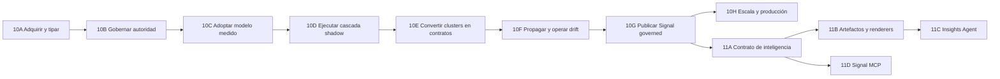
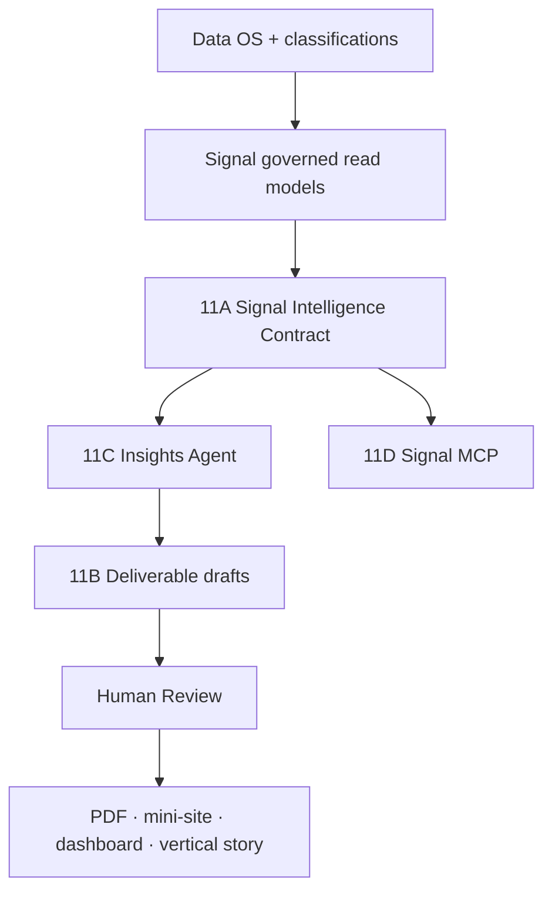

# 63 · Noisia V0.2 Canonical Product Program And Delivery Layer

> **Ampliación de programa, 2026-09-07:** el operador adopta el
> [Compass self-service](./PROMPT_LOOPING/COMPASS_SELF_SERVICE_2026-09-07.md) y el
> [plan de monitorización](./PROMPT_LOOPING/PLAN_SELF_SERVICE_MONITORING_2026-09-07.md).
> Linear mantiene proyectos/IDs y recibe actualización aditiva, ligada al programa
> **NOI-73**; el [mapa actual](./PROMPT_LOOPING/LINEAR_SELF_SERVICE_MAP_2026-09-07.md)
> registra responsables, prioridades y pendientes. Primero flujo completo e incremental
> sobre corpus nuevo; después reportes/agentes/MCP. Las tablas de agosto permanecen como
> historia: no repetir gates ni negar entregas posteriores comprobadas por su estado viejo.

> **Registrado:** 2026-08-21 (`America/Mexico_City`)
> **Estado:** canon de programa y modelo operativo para Linear
> **North Star funcional:**
> [31_SIGNAL_PRODUCT_NORTH_STAR.md](./31_SIGNAL_PRODUCT_NORTH_STAR.md)
> **Catálogo de capacidades:**
> [52_NOISIA_FEATURES_DESCRIPTION_V02.md](./52_NOISIA_FEATURES_DESCRIPTION_V02.md)
> **Secuencia semántica:**
> [56_SIGNAL_SEMANTIC_CASCADE_EXECUTION_PLAN.md](./56_SIGNAL_SEMANTIC_CASCADE_EXECUTION_PLAN.md)
> **Privacidad:** este documento sólo conserva arquitectura y estado no sensible. Briefs
> comerciales, prospectos y estrategia de verticales viven en Linear privado.

## Decisión

Noisia V0.2 se administra como un solo programa de producto con proyectos por resultado.
Los documentos de ingeniería conservan la historia y la evidencia, pero Linear es la
superficie operativa para responsables, prioridades, decisiones y trabajo pendiente.

La nomenclatura canónica queda separada por propósito:

- `10A–10H` es la secuencia de adquisición, autoridad semántica, Topics & Narratives,
  prepublish y readiness de Signal;
- `11A–11D` es la capa posterior a Signal que convierte inteligencia gobernada en
  entregables y acceso para agentes;
- los nombres `Gate D`, `Gate E` y `Gate F` permanecen únicamente como aliases históricos;
- proyectos, milestones e issues de Linear usan nombres de resultado y conservan el ID
  técnico en su descripción;
- `10A.4` deja de ser trabajo pendiente: sus objetivos de rehearsal quedaron superseded
  por el cutover 0084–0089, Preview/UAT autenticado y el recorrido greenfield multi-scope.

## Una Sola Línea Canónica

`10H` y `11A–11D` pueden desarrollarse parcialmente en paralelo después de que `10G`
congele el read contract, pero ninguno puede crear otra autoridad de datos.

## Estado Real Del Programa

| Proyecto | Estado | Veredicto honesto |
|---|---|---|
| Data OS | foundation y UAT verificadas | El modelo canonical/provenance/policies existe; governed todavía no es el default de producción |
| Acquisition Plan | greenfield multi-scope UAT listo | Slots, query evidence, imports asíncronos y typed observations funcionan; falta producto final y operación recurrente |
| Admin operativo | funcional, QA/polish pendiente | Puede operar el workspace, pero creación, policies, Mentions y helpers aún no alcanzan calidad final |
| Motor semántico | autoridad lista; modelado no adoptado | `10B` cerró; `10C.2` tiene preflight real listo, pero no está ejecutado ni existe artifact aprobado |
| Topics & Narratives | contrato objetivo definido | `10D–10F` siguen pendientes; la UI actual no demuestra el nuevo engine |
| Signal V2 | UI y canary existentes | Sigue leyendo legacy por default; `10G` permanece pendiente |
| Triggers & Barriers | foundation operator-ready | Falta corrida V2 real, Review, release `r1` y Coding Workbench |
| Delivery Layer | definición inicial | Insights Agent, modelo de entregables y MCP no están implementados |
| Plataforma y escala | Preview/UAT online | Falta `10H`, capacidad 2M, producción, SLO y retiro de bridges |

## Qué Puede Hacer Hoy Cada Superficie

### Admin

Admin puede crear y configurar workspaces, adquirir e importar data multi-scope, gobernar
policies y provenance, inspeccionar menciones canónicas, operar Semantic Review y preparar
estudios estratégicos. Aún no es una experiencia terminada: debe reducir lenguaje técnico,
usar componentes canónicos, cerrar responsive/performance y ofrecer defaults explicados sin
convertir decisiones humanas en inferencias silenciosas.

### Signal

Signal puede navegar Monitoring, Mentions, Topics & Narratives y T&B dentro de un shell
estable, con filtros, evidence y estados parciales. La UI no equivale a producto final:
el reader visible continúa en legacy hasta que `10G` reconcilie generation, watermark,
denominator, coverage y rollback para los tres módulos.

### Cadena De Inteligencia

Noisia debe poder explicar cada transición:

1. **adquirir:** un plan declara por qué se buscó un registro;
2. **tipar:** ETL normaliza, deduplica y conserva provenance;
3. **resolver:** reglas, modelos o humanos producen assignments con abstención explícita;
4. **descubrir:** compute local propone clusters y novedad sin convertirlos en verdad;
5. **nombrar:** Claude recibe contexto gobernado y evidencia representativa acotada;
6. **gobernar:** el operador mergea, divide, corrige, aprueba o retira;
7. **contratar:** un Topic/Narrative Rule Spec versionado define el significado operativo;
8. **propagar:** el contrato clasifica full-pop e imports futuros con drift y Review;
9. **servir:** Signal publica métricas y evidencia con denominator y coverage;
10. **entregar:** artefactos revisables convierten Signal en outputs client-safe.

## Rol De BERT Y Modelos Locales

`BERT` no es una feature ni una autoridad. La familia de modelos transformer puede asumir
tres trabajos medidos:

1. producir embeddings multilingual para similitud, discovery y novelty;
2. clasificar contratos ya gobernados sobre grandes poblaciones;
3. priorizar ambigüedad y ejemplos para Review.

No debe nombrar por sí sola un tópico, aprobar conocimiento, calcular métricas publicadas
ni reemplazar al operador. `10C.2` decide si una combinación concreta merece adopción.
Un resultado `no_adoption` obliga a mejorar el benchmark o cambiar candidatos; no autoriza
pasar un modelo mediocre a `10D`.

Para poblaciones de hasta dos millones de menciones, la promesa se separa en dos capas:

- **full-pop económico:** parsing, dedup, scopes, FTS/reglas, embeddings locales,
  clasificación de contratos e incrementalidad;
- **análisis profundo acotado:** samples, excepciones, naming y síntesis con Claude bajo
  preflight, hard cap y evidencia.

Antes de prometer dos millones se requiere un capacity gate que mida throughput, RAM/VRAM,
storage, costo por millón, incrementalidad, recuperación y calidad por idioma/scope. El
conteo de filas procesadas no sustituye utilidad semántica.

## 11A · Signal Intelligence Contract

Insights Agent y Signal MCP comparten un único contrato server-owned. No consultan tablas
legacy ni inventan otra capa semántica.

El contrato expone:

- workspace, module, governed view, generation y watermark;
- denominator, coverage, limitations y freshness;
- métricas, series, breakdowns y Topic/T&B findings aprobados;
- referencias de evidence y query lineage;
- filtros cerrados y compilados server-side;
- AuthZ y data rights aplicados antes de devolver resultados.

El modelo nunca ejecuta SQL libre. Emite un query spec validado y el servidor devuelve un
`query_id` reproducible. Las afirmaciones cualitativas conservan evidence refs.

## 11B · Deliverable Artifact Model

Un entregable es un objeto gobernado e independiente de su renderer. Debe contener:

- workspace y Signal release/generation de origen;
- secciones, charts, tablas, narrativa y citas;
- query IDs, evidence refs y limitaciones;
- estado `draft → review → approved → published → superseded`;
- actor, revisión, timestamp y digest;
- brand/design profile versionado;
- uno o más renderers: PDF, mini-site, dashboard/landing mobile-first o historia vertical.

No se revive `published_outputs.payload` como store de verdad. Compatibilidad puede leer un
payload histórico, pero un output nuevo referencia artefactos, queries, evidence y releases
relacionales.

## 11C · Insights Agent

El Insights Agent es una herramienta interna para Insights Managers. Copia de PostHog Max
el modelo mental `plan → ejecutar tools → crear objetos reales`, no su data model.

Toolset inicial:

- `read_signal_catalog`;
- `query_signal_metrics`;
- `search_signal_evidence` bajo rights y límites;
- `read_evidence`;
- `create_chart_draft`;
- `create_deliverable_draft`;
- `render_deliverable_preview`.

El agente consume Signal + Brand OS + Knowledge/Methodology context mediante RAG gobernado.
No recalcula Signal, no accede full-pop a raw mentions por default y nunca publica sin
Review humana. El loop async debe reutilizar Workers, leases, recovery, budgets y audit logs
existentes antes de adoptar un orquestador adicional.

## 11D · Signal MCP

Signal MCP es un adapter protocolar sobre `11A`, no otro backend. Su primera versión es
read-only y está dirigida a analistas internos autorizados que usan Claude, Codex u otro
cliente MCP.

Expone inteligencia ya resumida y gobernada; no un dump de menciones. El acceso a evidence
se concede por herramienta, scope y rights. Crear o publicar entregables requiere una API
de producto separada y permisos adicionales; no se habilita como efecto colateral del MCP.

## Relación Entre Agent Y MCP

Agent y MCP comparten schemas, AuthZ, query compiler, citations y observabilidad. Sus
diferencias son cliente, permisos de escritura y UX.

## Definición De Producto Terminado

Noisia V0.2 puede declararse terminado cuando:

1. un workspace greenfield recorre creación, adquisición, imports y gobierno sin scripts
   especiales;
2. existe una decisión `10C` aprobada y una cascada `10D` reproducible con abstención;
3. Topics & Narratives convierte discovery en contratos y los propaga full-pop/incremental;
4. Monitoring, Mentions y T&N comparten generation/watermark y served coverage;
5. T&B produce `r1`, pasa Review y conserva evidencia y costo;
6. Admin y Signal pasan QA integral, performance, ES/EN y responsive;
7. el producto demuestra un deliverable client-safe desde Signal mediante `11A–11C`;
8. MCP ofrece el mismo contrato read-only sin exponer otra verdad;
9. scale/SLO/restore/AuthZ/rights/cost y rollback pasan `10H`;
10. governed es default y los bridges legacy se retiran de forma forward-only.

## Modelo Operativo En Linear

### Initiative

`Noisia V0.2 — Product Completion`

### Projects

1. `Data OS — Canonical Data & Governance`
2. `Acquisition Plan — Source to Workspace`
3. `Admin — Operator Workspace`
4. `Semantic Engine — Classification Authority`
5. `Topics & Narratives — Discovery, Contracts & Propagation`
6. `Signal V2 — Governed Intelligence`
7. `Triggers & Barriers — Strategic Study & Coding Workbench`
8. `Delivery Layer — Insights Agent & Client Outputs`
9. `Signal MCP — Governed Intelligence for Agents`
10. `Platform — UAT, Scale & Production Cutover`

Una vertical futura, como inteligencia política, se registra como proyecto de discovery
separado. No altera las prioridades ni los criterios de salida del programa base hasta que
una decisión comercial explícita la promueva.

### Reglas

- project description = propósito, estado actual, alcance, no-alcance y exit criteria;
- project document = canon funcional y decisiones durables;
- milestone = resultado verificable, no nombre de un chat;
- issue = una unidad de trabajo asignable con acceptance, evidencia y rollback;
- cada issue conserva Feature ID (`ADM`, `SIG`, `DOS`, `STU`, `10X`, `11X`);
- los handoffs y evidence packs se enlazan; no se copian secrets ni raw datasets;
- Linear no sustituye schema, ADR, OpenAPI ni runbooks del repo.

## Alias Históricos Retirados Del Roadmap Activo

| Alias | Tratamiento canónico |
|---|---|
| `Gate D` | historia del primer T&B V2; el trabajo vivo pertenece al proyecto T&B |
| `Gate E` | descompuesto entre Admin QA, `10G` y UAT |
| `Gate F` | reemplazado por `10H` y retiro de bridges |
| `10A.4` | superseded por cutover 0084–0089 y QA Preview/UAT greenfield |
| `Backend NN` | nombre de handoff/evidencia, nunca de roadmap de producto |

## Siguiente Decisión

El camino crítico inmediato sigue siendo `10C.2 execution authorization → smoke →
calibration → full → review`. Si no existe candidato aceptable, el resultado válido es
`no_adoption` y se abre un benchmark nuevo; no se avanza a `10D` por calendario.

En paralelo sin bloquear modelado se puede especificar `11A` y el artifact model `11B`,
porque ambos dependen de contratos gobernados existentes y no requieren elegir todavía el
framework final del agente.
