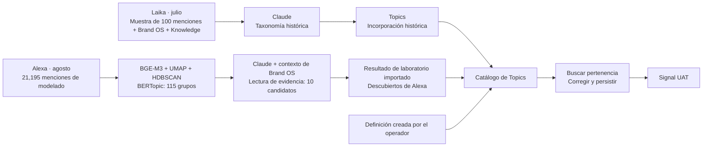
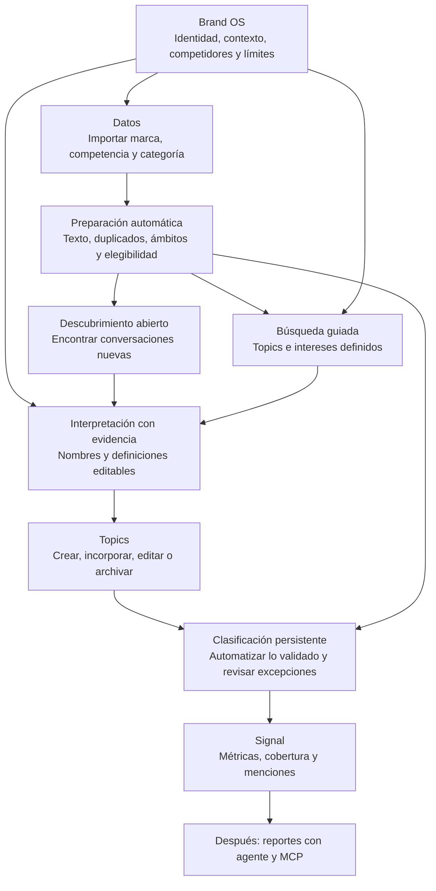

# Auditoría de Admin y descubrimiento de Topics

Fecha: 7 de septiembre de 2026. Estado: auditoría terminada; recomendaciones sin implementar.

**Noisia conserva el laboratorio de descubrimiento, el contexto de Brand OS y el trabajo con Claude. La entrega de Topics agregó gestión, clasificación persistente y resultados en Signal, pero todavía no cerró el descubrimiento repetible desde Admin para otro corpus.** Además, una etiqueta incorrecta y varios estados contradictorios hicieron parecer mayor el alcance de la entrega.

El siguiente resultado recomendado es que un operador pueda importar un corpus nuevo, ejecutar su descubrimiento desde Topics y ver sus resultados en Signal. No hace falta reiniciar Noisia ni construir otro sistema de gestión.

## Alcance y evidencia

- Código focal auditado: `/Users/brandhon_o/Downloads/noisia-topic-uat-cut-2026-09-06`, HEAD `907d485a9cde309c98fe2c157b539f11a4c0d995`. Sus tres archivos locales de pruebas/reglas ajenos a este corte siguen sin commit.
- UAT autenticado: recorrido de todas las entradas globales de Admin y páginas de marca en Laika/Alexa, con capturas y lectura del DOM. Se abrió una propuesta de Discovery; no se guardaron formularios, ejecutaron análisis, aprobaron datos ni modificaron accesos.
- PostgreSQL: consultas `READ ONLY` de perfiles, procedencia, corridas V2, paquetes históricos y resultados del clasificador. Los conteos nuevos se guardaron con la auditoría.
- Historia: exportaciones redactadas de Frontend, notas de lectura completa hasta `0005.md`, y contraste directo de los mensajes sobre algoritmos, Brand OS, rúbricas y gestión de tópicos. No se leyeron JSONL de Codex ni secretos históricos.
- Consulta: Claude Sonnet 5 con **Fable 5.1 como asesor**, una llamada verificada. Costo USD 0.451370. El dictamen final incorpora correcciones a varias imprecisiones del ejecutor; consultar el [contraste](</Users/brandhon_o/Downloads/noisia-website/.data/admin-product-audit-2026-09-07/CLAUDE_RECONCILIATION.md>).
- No se repitieron gates de A/B/PG, builds ni experimentos para recuperar contexto. Esta es una auditoría de comportamiento, conexiones y rumbo, no una certificación exhaustiva de seguridad, accesibilidad o rendimiento. Las mutaciones no ejercidas hoy se distinguen del código y de los recibos anteriores.

## 1. Corrección del cierre anterior

La prueba UAT comprobó dos entradas al catálogo y su efecto real:

| Tópico de Laika | Origen comprobado | Resultado servido |
|---|---|---:|
| Fricciones posteriores a la compra | Creado manualmente | 9 asignaciones |
| Entrega y logística de pedidos | Incorporado desde la taxonomía histórica de Laika, generada por Claude con muestra de menciones | 4 asignaciones |

**El segundo no procede de una nueva corrida de BERTopic.** Su origen en PostgreSQL es `taxonomy-profile:fba0a874-d32d-4666-804a-bf5aba37396a`, término `entrega_y_logistica`. Ese perfil v1 registra proveedor Anthropic, 100 referencias `mention_sample`, Brand OS y Knowledge; fue aprobado en julio. El código de esa ruta limita la muestra a 100 menciones, con texto acotado por registro.

La pestaña Descubiertos usa una sola frase para dos fuentes: “Propuestas de BERTopic interpretadas con evidencia”. En Alexa describe la cadena histórica de clusters interpretados; en Laika describe mal una taxonomía anterior. El backend conserva la referencia original, pero escribe `origin: discovered` para ambas. Hay que representar el origen real en el producto y en la aceptación.

**El logro no se pierde:** crear/adoptar, editar, buscar, corregir pertenencia, persistir, publicar en Signal y archivar/restaurar tienen evidencia. Lo que no quedó demostrado es descubrir un corpus nuevo con BERTopic y Brand OS desde el producto, ni la calidad de clasificación automática a escala.

El cierre anterior del plan y su recibo se conservan como historia de esa entrega. Esta auditoría limita expresamente cualquier afirmación de “BERTopic comprobado de extremo a extremo” o “descubrimiento repetible terminado”.

## 2. De dónde vienen los descubrimientos

Hay tres caminos que no se deben confundir:

La flecha desde candidatos de Alexa al catálogo está implementada como incorporación. La aceptación hasta Signal se realizó con Laika, no con un candidato V2 nuevo de Alexa. No interpretar el dibujo como prueba de todos los caminos completos.

El experimento de 115 propuestas procesó la población de modelado, pero **no agrupó todas las menciones en tópicos útiles**: 11,186 quedaron en clusters y 10,009 como outliers. Un outlier es una mención que el agrupamiento no asignó; no significa que se borrara ni que no pueda contener una señal útil.

Claude V2 pudo consultar la evidencia de esa población mediante herramientas: representantes, fronteras, estratos y outliers. La corrida importada conserva 12 turnos, 11 recuperaciones, 10 candidatos y 30 citas. “Evidencia completa” aludía a la capacidad de consultar los miembros reales y su procedencia; **no significa que Claude leyó una por una las 21,195 menciones ni que las reclasificó todas**.

## 3. Algoritmos: lo probado, lo conservado y lo propuesto

| Pieza | Papel | Estado encontrado |
|---|---|---|
| E5 multilingual / BGE-M3 | Convertir textos en vectores semánticos para el laboratorio | Implementados y usados en benchmarks. El run de 115 usa BGE-M3. |
| UMAP + HDBSCAN dentro de BERTopic | Reducir dimensiones y encontrar grupos por densidad | Implementados y ejecutados. No constituyen por sí solos el catálogo editorial final. |
| Representación de BERTopic / c-TF-IDF | Describir grupos mediante palabras y expresiones | Existente; el primer benchmark tuvo problemas de stopwords/representación. Hubo correcciones posteriores. |
| TF-IDF + NMF | Referencia léxica de modelado | Implementada y medida como comparación; no adoptada como clasificador del producto. |
| FASTopic | Alternativa de descubrimiento evaluada | Integrada al laboratorio; el benchmark documentó problemas de tiempo estimado en hardware local. No es runtime de Topics. |
| Mutual-kNN + Leiden | Alternativa de agrupamiento mediante grafo | Propuesta en el plan posterior. No encontré prueba de adopción o ejecución en este recorrido. |
| MiniBatchKMeans sobre vectores normalizados | Alternativa de cobertura/escalabilidad | Propuesta; la presencia de scikit-learn no demuestra que se haya probado ese candidato. |
| SetFit / Cleanlab | Posible clasificación supervisada / priorización de errores | Ideas para una fase posterior, no capacidades actuales de esta entrega. |
| Claude | Interpretar evidencia y contexto, proponer nombres/definiciones/reglas | Corridas históricas reales. La entrega nueva de Laika no hizo una llamada Claude. |
| Voyage + similitud, señales léxicas y contraste negativo | Buscar menciones para Topics definidos | Worker actual de Topics; diferente del descubrimiento por clustering. |

No procede concluir que BERTopic “no sirve” por el primer benchmark. La historia documenta por qué aquel rechazo no era una evaluación general válida. Tampoco procede decir que la nueva sección Topics sustituyó esos algoritmos: agregó el objeto que usa el operador y su salida a Signal, mientras el laboratorio quedó separado.

## 4. Qué aporta realmente Brand OS

**Vocabulario y límites es contexto estructurado en texto, no una colección de vectores numéricos ya aplicada a BERTopic.** Contiene identidad, aliases, productos, beneficios, necesidades, fricciones, competidores, categorías, ocasiones, exclusiones, homónimos y ejemplos positivos/negativos/de frontera, entre otros tipos.

Su generación y edición son funciones reales. Ese contexto puede alimentar:

- La interpretación de candidatos por Claude y las sugerencias de reglas.
- Las definiciones semánticas que el clasificador de Topics transforma en embeddings.
- La identidad, el ámbito y la interpretación de la marca que usan otras partes del producto.

Pero en el laboratorio actual `encode_records` recibe textos de menciones; BERTopic llama `fit_transform(texts, embeddings)` sin semillas o etiquetas de Brand OS. El contrato Python de contexto existe, pero no conecta por sí mismo ese contexto al agrupamiento. **No encontré evidencia de la nueva corrida contextual de BERTopic que el usuario esperaba después de completar Brand OS.**

La integración reciente de contexto con el clasificador tampoco demuestra una mejora de calidad: concatena contexto de marca/Knowledge y elementos por ámbito, acotándolo a 4,000 caracteres. Hay riesgo de omitir anclas colocadas al final o hacer que el contexto común domine la búsqueda. No se midió que sea la causa de los falsos positivos; debe validarse con ejemplos de pertenencia y no pertenencia.

En UI actual, Alexa carga 69 elementos listos, cero excepciones, generación v6 en borrador. Laika muestra un error de carga. Por tanto, ni “Brand OS ya no funciona” ni “todo funciona en todas las marcas” son conclusiones correctas.

## 5. ¿Puedo repetirlo con otro corpus?

**Como laboratorio operado por ingeniería, existe una base reutilizable. Como recorrido autónomo de Admin, todavía no.**

El laboratorio tiene CLI, exportador, configuración, versiones fijadas, caché de embeddings y artefactos de resultados. Puede prepararse un experimento para otro corpus; eso no garantiza encontrar los mismos temas ni obtener calidad suficiente.

Hay dos interrupciones concretas en la cadena del producto:

1. El importador de evidencia V2 de este corte valida un `SOURCE_RUN_KEY`, rutas, hashes y conteos fijos del experimento de Alexa: 115 propuestas y 21,195 miembros. Rechaza otro run. Es un adaptador de una entrega histórica, no la interfaz general de corridas de descubrimiento.
2. Topics tiene crear/adoptar/buscar/corregir/archivar/seguir. **No tiene una acción de “Descubrir tópicos de este corpus” que ejecute el laboratorio, llame a Claude y deposite candidatos nuevos.**

En una marca sin historia se puede crear un Topic manual; Descubiertos puede quedar vacío. La pestaña no descubre por existir. Reproducibilidad significa poder repetir el procedimiento, conocer qué datos/modelo/contexto utilizó y comparar cambios; no prometer resultados idénticos entre distintos corpora.

## 6. Qué compone Admin hoy

“Conservar” significa mantener su responsabilidad, no certificar cada mutación sin ejecutarla. “Simplificar” significa reducir la tarea del operador y aclarar efectos; no retirar validación de acceso o identidad en el servidor.

### Entradas globales

| Sección | Qué tiene y hace | Qué falta / decisión |
|---|---|---|
| Dashboard | Conteos de marcas, menciones gobernadas, problemas de fuentes, cola y prioridades; enlaces a workspaces. | Conservar. Debe reflejar preparación de datos y Topics, y dejar de dar sensación de “todo listo” con checks parciales. |
| Marcas | Lista, búsqueda por marca/organización/estado, cobertura, acceso al detalle y alta. | Conservar. Conectar alta con un recorrido visible hacia importación y Topics. Los conteos se refieren a poblaciones gobernadas, no a todos los archivos. |
| Crear marca | Identidad, organización, industria, mercados, zona horaria, aliases, competidores, descripción, Knowledge; investigación/refinamiento asistidos. | Conservar. Explicar qué se crea y cuál es la siguiente acción. No se ejecutó un alta ni una investigación pagada en esta auditoría. |
| Datos | Supervisión global de fuentes, imports, frescura y salud; entrada a cada marca. | Corregir clasificación de estados: “Saludable” se deriva de no tener alerta y puede incluir workspaces sin configurar. |
| Reportes | Registro de releases T&B y revisiones por marca. UAT muestra 12 workspaces y cero releases publicados en este registro. | Conservar el registro. No equivale al futuro sistema de varios reportes producidos por un agente. |
| Equipo | Usuarios, invitaciones, cuatro roles, organizaciones y accesos. | Conservar. No genera Topics ni determina pertenencia semántica. No se enviaron invitaciones ni se modificaron permisos. |
| Configuración | Idioma, rol y resumen técnico de serving. Muestra Legacy y primary_brand; exploración competitor/category aplazada. | Simplificar. Es información técnica, no el lugar para configurar competidores. El estado global no expresa la ruta particular ya gobernada de Topics. |
| Estudios — avanzado | Wizard de seis pasos, sujeto de estudio, fuentes, objetivo, análisis y Engine. Conserva flujo ligado a corpus/estudio. | Mantener fuera del recorrido normal de monitorización. No exigirlo para usar el catálogo de Topics. Los 16 lentes siguen pausados. |
| Themes — avanzado | Estudios temáticos sin marca; catálogo y detalle del sujeto de investigación. | Aclarar que Theme no es Topic ni categoría de adquisición. No crear un segundo catálogo de tópicos con este nombre. |

### Detalle de marca

| Sección | Qué tiene y hace | Qué falta / decisión |
|---|---|---|
| Overview | Cobertura, fuentes, salud, acceso a Signal y reportes; resumen de recursos. | Corregir estados: Laika dice “Sin bloqueos”, mientras Datos bloquea identidad/licencia y falla el plan. Topics falta como recurso y como entrada lateral. |
| Brand OS: identidad | Nombre, aliases, mercados, industria, descripción y zona horaria. Es contexto/identidad reutilizable. | Conservar aquí. Distinguir lo editado de lo efectivamente utilizado por una corrida. |
| Brand OS: competidores | Relaciones editables, `competitors`, `brand_seeds` y eventos/proyección de ciclo de vida. | Conservar como fuente única del conjunto competitivo; conectar su uso visible con adquisición y atribución. |
| Brand OS: Knowledge | Bloques editables y documentos procesados, contexto y recuperación. | Conservar. Separar contexto documental de archivos que aportan menciones; una fuente KB no prueba ingesta de menciones. |
| Brand OS: vocabulario y límites | Elementos estructurados, generación, revisiones y ejemplos/contexto. Alexa sí carga; Laika falla. | Arreglar carga/estado en otra marca y conectar la utilización del contexto con cada análisis. Reducir filtros y copy técnico, como “este gate local”. |
| Brand OS: Topics | Ahora sólo tiene un enlace a la página propia. | Movimiento correcto. El menú debe acompañarlo y el resumen no debe contar perfiles Topic/Narrative como si fueran Brand OS. |
| Brand OS: Studies/Engine | Lista de corpora heredados y entrada a Nuevo estudio. | Retirar del flujo cotidiano o llevar a avanzado. La compatibilidad antigua no es un requisito del próximo producto. |
| Datos y fuentes | Plan de adquisición, slots de marca/competidor/categoría, queries/conectores/imports; preparación de identidad/policies/provenance; enlaces a recursos. | Arreglar error de Laika y simplificar estado/acción siguiente. Un source registrado no es un import aceptado: 14 de sus 15 fuentes mostradas tienen cero imports asociados. |
| Menciones | Registro canónico, buscador, columnas, filtros, detalle, origen, estado semántico y elegibilidad; exportación. Laika lista 4,451. | Conservar. Conectar la explicación de elegibilidad y correcciones al Topic o población concretos; aclarar cada denominador. |
| Revisión semántica | Revisión/atribución de entidad y ámbito por mención. Assertions aprobadas alimentan compilación de poblaciones e invalidación. | Conservar como excepciones de atribución. Aclarar “de quién habla” y distinguirla de pertenencia a un Topic. No es entrenamiento automático de BERTopic. |
| Revisión de descubrimiento | Diagnóstico de 115 propuestas congeladas, outliers, evidencia, filtros y rúbrica. | Sacar del camino cotidiano y conservar en historial/diagnóstico. Guardar merge/split no ejecuta la operación ni genera un Topic. Completar sus 115 rúbricas no es requisito de Topics. |
| Topics | Lista, manual/incorporación, edición, búsqueda, corrección, archivo/restauración y publicación en Signal. | Conservar como centro del trabajo. Agregar entrada lateral; origen veraz; nueva corrida; herencia de ámbito; calidad comprobable y actualización incremental. |
| Governed views | Compila/promueve/retira poblaciones y bindings por módulo. Alexa muestra cero vistas current. | Conservar mecanismo técnico. El operador necesita una acción comprensible sobre qué datos verá, no una segunda consola obligatoria de infraestructura. |
| Reportes de marca | Registro T&B, población estratégica, preparación de authority, ejecución y releases. Laika tiene población 483, release vacío y ejecución bloqueada. | Conservar piezas útiles. Unificar preflight: los cinco checks verdes omiten el bloqueo estratégico que deshabilita Ejecutar. Agente/múltiples formatos quedan por desarrollar. |
| Acceso y configuración | Estado, zona horaria, población, cadencia, perfiles, accesos y retirada de marca. Gran parte es resumen con enlaces. | Conservar. Hacer distinguibles acceso explícito y acceso por rol; cero personas asignadas no significa que el administrador no pueda entrar. |

No encontré una ruta Admin MCP en este inventario. Existen APIs públicas de reportes v1/v2 y trabajo de acceso a evidencia, que son activos reutilizables; no equivalen al MCP futuro ni a un agente de reportes listo.

## 7. Qué pasó con los paneles grandes de Brand OS

La página actual ya no monta **Evidencia completa para tópicos** ni **Candidatos con evidencia completa**. Eso resuelve su ubicación visible, pero abre una tarea de integración:

- El componente anterior de evaluación, el editor de candidatos, las sugerencias Claude, las reglas y las cohortes siguen en código/API.
- `BrandTopicEvaluationPanels` no tiene un montaje desde las páginas actuales de Studio.
- Topics nuevo reutiliza lectura de evidencia del candidato y adopción. No monta todo el recorrido anterior de sugerir regla/refinar/editar candidato/probar cohorte.

Por tanto, parte de lo construido quedó **sin entrada normal de producto**, aunque sus APIs y recibos existan. Debe decidirse qué acción útil se incorpora dentro del nuevo Topic y qué recorrido experimental se retira. Reponer los paneles completos en Brand OS volvería a crear el problema original. Borrar módulos a ciegas tampoco es necesario.

## 8. Competencia y categoría: las piezas que faltaba relacionar

| Concepto | Ejemplo | Qué cambia |
|---|---|---|
| Industria descriptiva de la marca | Pet Care | Contexto del negocio. No asigna menciones. |
| Competidor configurado | Petco | Relación de negocio e identidad reutilizable. |
| Slot/query de adquisición | Buscar conversaciones de Petco | Explica de dónde se obtuvieron menciones. No prueba que todas hablen de Petco. |
| Identidad/categoría gobernada | Mercado de productos para mascotas | Define una entidad/ámbito para atribución y población. |
| Atribución semántica de una mención | Habla de Laika y compara con Petco | Puede afectar una o varias poblaciones pertinentes. |
| Topic | Retrasos de entrega | Explica de qué habla; puede existir dentro de marca, competencia o categoría. |

El nuevo editor ofrece tres ámbitos, pero al incorporar un candidato fija inicialmente `primary_brand`, incluso para los candidatos visibles de Apple o Google. Después puede editarse, pero no hay herencia correcta del origen. Además, la presencia de un Topic no-primary sin archivar bloquea el seguimiento del catálogo mediante `hasUnsupportedSignalScope`.

**El backend de competencia/categoría existe por partes; su publicación en el recorrido nuevo de Signal no está completa.** Es deuda de integración y de herencia de ámbito. No se arregla renombrando “competitor” ni añadiendo otro formulario de categorías.

En Alexa, la pantalla actual de adquisición muestra ocho slots, cero queries configuradas y cinco imports históricos. Los botones de importar están deshabilitados por estado del plan. Esto es otra muestra de que los datos de un experimento y la operación repetible no son el mismo estado.

## 9. Qué significa la cobertura de Signal ahora

La ejecución de Topics auditada trabaja sobre 192 raíces, no sobre las 4,451 del registro completo de Laika.

| Estado excluyente por raíz en esa ejecución | Cantidad |
|---|---:|
| Tiene al menos un Topic aprobado | 12 |
| No tiene aprobado, pero conserva alguna duda | 58 |
| No tiene aprobado ni candidato dudoso (`none`) | 122 |
| Total | 192 |

Las 12 raíces producen 13 asignaciones porque una pertenece a ambos Topics. Las 13 fueron confirmadas por personas; no hubo aprobación automática. El clasificador conserva 95 pares tópico-mención dudosos; no deben confundirse con 95 menciones distintas. El estado `none` tampoco es una verdad negativa evaluada por humanos sobre todo el corpus.

Signal comunica 6% de cobertura y cero pendientes. El primero coincide con 12/192; el segundo no representa las dudas del clasificador. Hay que distinguir **trabajos pendientes, dudas de pertenencia y menciones sin Topic**.

Las validaciones actuales no alcanzan para habilitar automatización en ninguno de los dos Topics. La función exige mínimos de dos positivos y dos negativos en calibración, y otros dos y dos en validación, más métricas umbral. Ese mínimo evita algunos casos triviales; **no constituye evidencia estadística suficiente para garantizar precisión/recall en un corpus grande**. La evaluación futura debe usar una muestra independiente y adecuada al uso, incluyendo negativos difíciles, distintos ámbitos/idiomas y casos no encontrados por la búsqueda.

Laika también muestra 729 aprobadas en la vista de revisión semántica y 483 en la población estratégica T&B. Son universos con condiciones distintas. No forman una cadena lineal 729 → 192 → 483 ni prueban pérdida de datos. El producto debe explicar la selección de cada población. Las 14 narrativas visibles pertenecen al perfil histórico de narrativas; no fueron generadas ni validadas por este corte de dos Topics.

## 10. Recorrido recomendado

Este es el diseño propuesto, no una declaración de implementación completa.

La preparación puede conservar decisiones de calidad y derechos en backend, con valores claros del proyecto; no requiere obligar al operador a repetirlos por propuesta. La revisión humana se concentra en decisiones útiles y excepciones, no en puntuar 115 formularios.

**Recomiendo mantener una vía abierta además de la guiada.** Si Brand OS obliga a todos los grupos a parecerse a lo ya conocido, se pierde descubrimiento emergente. BERTopic soporta modelado guiado con semillas y una variante zero-shot que combina temas definidos con grupos nuevos; su existencia no prueba cuál funciona mejor para Noisia. Se debe probar una variante contextual acotada frente a la base abierta y medir novedad, relevancia y redundancia. [Documentación de modelado guiado](https://maartengr.github.io/BERTopic/getting_started/guided/guided.html), [variante zero-shot](https://maartengr.github.io/BERTopic/getting_started/zeroshot/zeroshot.html).

No hace falta ejecutar todas las alternativas del benchmark antes de entregar el recorrido. Reutilizar BGE/BERTopic y el acceso a evidencia permite probarlo; un challenger se justifica por una falla concreta y medida. Procesar un millón de menciones requerirá ejecución por lotes/particiones y medición de recursos, no necesariamente cargarlo todo a memoria ni enviarlo todo a Claude.

## 11. Deuda ordenada por resultado visible

| Prioridad | Deuda / resultado esperado | Evidencia de cierre requerida |
|---|---|---|
| 1 | Corregir procedencia y alcance del cierre: manual, taxonomía por muestra y descubrimiento de corpus se distinguen. | Cada candidato permite saber corrida/corpus/contexto; no llama BERTopic al fallback histórico. |
| 1 | Restaurar una operación coherente para una marca nueva: contexto, adquisición y estados. | Alta/importación/contexto utilizables; “listo” concuerda con la acción habilitada y los bloqueos reales. |
| 1 | Convertir laboratorio en descubrimiento operable desde Topics. | Un corpus distinto de Laika/Alexa produce una corrida nueva, candidatos trazables y evidencia accesible, sin insertar resultados manualmente ni adaptar constantes por cliente. |
| 1 | Completar calidad y efecto: candidato nuevo → Topic → clasificación → Signal. | Ejemplos relevantes y negativos difíciles, evaluación independiente, denominador y asignaciones reconciliados; incertidumbre visible. |
| 1 | Heredar/conservar el ámbito al incorporar candidatos. | Un candidato de competencia no pasa silenciosamente a marca principal; un borrador fuera del ámbito no bloquea sin explicación los demás. |
| 2 | Unificar navegación y decisiones: Topics en el menú; diagnóstico histórico fuera del recorrido normal. | Operador recorre creación/descubrimiento/resultados sin buscar paneles en Brand OS ni llenar rúbricas. |
| 2 | Integrar o retirar el recorrido de reglas/refinamiento/cohortes que quedó sin montaje. | Una decisión por capacidad: consumidor real y acceso útil, o retirada focal documentada. Evitar dos objetos editables compitiendo por autoridad. |
| 2 | Explicar conteos, dudas, cobertura y vigencia por módulo. | Los números de Admin y Signal se reconcilian con sus poblaciones; pendiente no confunde empleo de cola con incertidumbre semántica. |
| Siguiente entrega | Segundo import y actualización incremental. | Nuevas menciones se incorporan sin duplicar etiquetas; cambios de definición/contexto regeneran lo afectado y conservan el último resultado válido mientras se procesa. |
| Siguiente entrega | Publicación y comparación multiámbito. | Marca, competencia y categoría tienen poblaciones explícitas, resultados trazables y denominadores comparables. |
| Horizonte cercano | Reportes con agente, componentes Noisia y MCP. | Un agente consume datos/evidencia estables y genera reportes útiles con citas; el MCP expone esas operaciones sin depender de navegar la UI. |
| Antes de producción del producto nuevo | Operación, volumen y recuperación del flujo completo. | Prueba de tamaño objetivo, costo/tiempo, reintento/cancelación/recuperación y acceso. Sin proyecto de compatibilidad de datos antiguos. |

Las prioridades 1 y la navegación mínima forman un solo corte funcional: **descubrimiento repetible desde Topics sobre un corpus nuevo**. No se propone una reescritura completa de Admin como condición para hacerlo. El corpus nuevo puede ser un fixture representativo independiente; no hace falta esperar a la venta de un prospecto para empezar, aunque el piloto posterior debería usar uno real.

## 12. Lo que se conserva y lo que deja de ser requisito

Se conservan el laboratorio, embeddings, Brand OS/Knowledge, evidencia/citas de Claude, catálogo editable, correcciones, Worker/cola, clasificación persistente, materializaciones de Signal y mecanismos de identidad/acceso.

Dejan de ser tareas del operador ordinario la rúbrica completa de cada cluster, navegar consolas de generaciones/digests para usar Topics y decidir varias veces la misma pertenencia. No se reabren gates cerrados. Tampoco se exige conservar datos de producción antigua o Alexa para diseñar la nueva operación.

No se hizo ningún cambio de producto en esta auditoría. El loop sigue pausado. La respuesta a “¿perdimos todo lo anterior?” es **no**; la deuda consiste en terminar las conexiones y retirar la carga de operación que quedó alrededor de ellas.

## Referencias verificables

### Código del producto actual

- [Procedencia histórica y adopción](/Users/brandhon_o/Downloads/noisia-topic-uat-cut-2026-09-06/infrastructure/db/signal-topic-catalog.ts:379).
- [Selección de candidatos V2 o históricos](/Users/brandhon_o/Downloads/noisia-topic-uat-cut-2026-09-06/apps/studio/src/lib/data-os/signal-topics-management.ts:28).
- [Importador fijado al experimento de Alexa](/Users/brandhon_o/Downloads/noisia-topic-uat-cut-2026-09-06/infrastructure/db/signal-topic-evaluation-v2-import.ts:18).
- [Muestra histórica de 100 menciones](/Users/brandhon_o/Downloads/noisia-topic-uat-cut-2026-09-06/infrastructure/db/signal-taxonomy-profile.ts:171).
- [Navegación de marca sin Topics](/Users/brandhon_o/Downloads/noisia-topic-uat-cut-2026-09-06/apps/studio/src/lib/navigation/admin-navigation.ts:64).
- [Adopción fija como marca primaria](/Users/brandhon_o/Downloads/noisia-topic-uat-cut-2026-09-06/apps/studio/src/components/brands/TopicsManager.tsx:141).
- [Clasificador y publicación](/Users/brandhon_o/Downloads/noisia-topic-uat-cut-2026-09-06/services/workers/src/workers/signal-topic-classification.ts:93).
- [Calibración/validación](/Users/brandhon_o/Downloads/noisia-topic-uat-cut-2026-09-06/packages/query-engine/src/signal-topic-catalog-v1.ts:117).
- [Contexto heredado para embeddings](/Users/brandhon_o/Downloads/noisia-topic-uat-cut-2026-09-06/infrastructure/db/signal-topic-catalog.ts:246).
- [Serving particular de Topics](/Users/brandhon_o/Downloads/noisia-topic-uat-cut-2026-09-06/apps/studio/src/lib/data-os/signal-module-serving-scope.ts:239).
- [Rúbrica: persistencia y finalización diagnóstica](/Users/brandhon_o/Downloads/noisia-topic-uat-cut-2026-09-06/apps/studio/src/lib/data-os/signal-topic-discovery-review.ts:793).
- [Revisión semántica: assertions](/Users/brandhon_o/Downloads/noisia-topic-uat-cut-2026-09-06/infrastructure/db/signal-semantic-review.ts:876).
- [Embeddings del laboratorio](/Users/brandhon_o/Downloads/noisia-topic-uat-cut-2026-09-06/tools/signal-semantic-lab/src/signal_semantic_lab/embeddings.py:15), [agrupamiento](/Users/brandhon_o/Downloads/noisia-topic-uat-cut-2026-09-06/tools/signal-semantic-lab/src/signal_semantic_lab/discovery.py:172), [challengers propuestos](/Users/brandhon_o/Downloads/noisia-topic-uat-cut-2026-09-06/tools/signal-semantic-lab/config/benchmark-plan-10c3b-proposed.json:1).

### Historia y recibos

- [Feedback sobre Brand OS y clustering, 22 de agosto](/Users/brandhon_o/Downloads/noisia-website/.data/handoffs/2026-09-06-new-chat/frontend/dialogue/0003.md:791).
- [Feedback sobre rúbricas y gestión de Topics, 27 de agosto](/Users/brandhon_o/Downloads/noisia-website/.data/handoffs/2026-09-06-new-chat/frontend/dialogue/0004.md:4049).
- [Revisión del primer benchmark](/Users/brandhon_o/Downloads/noisia-website/.data/handoffs/2026-09-06-new-chat/frontend/dialogue/0002.md:4420).
- [Recibo anterior de Topics → Signal](/Users/brandhon_o/Downloads/noisia-website/.data/topics-to-signal-uat-2026-09-07/acceptance.json).
- [Procedencia consultada en DB](/Users/brandhon_o/Downloads/noisia-website/.data/admin-product-audit-2026-09-07/db-lineage.json).
- [Corridas y paquetes actuales](/Users/brandhon_o/Downloads/noisia-website/.data/admin-product-audit-2026-09-07/db-discovery-counts.json).
- [Reconciliación de clasificación](/Users/brandhon_o/Downloads/noisia-website/.data/admin-product-audit-2026-09-07/db-classification-counts.json).
- [Consulta Claude y correcciones](/Users/brandhon_o/Downloads/noisia-website/.data/admin-product-audit-2026-09-07/CLAUDE_RECONCILIATION.md).

### Capturas de esta auditoría

**Topics:** página propia sin entrada lateral correspondiente.

**Datos:** el error y los bloqueos de Laika contradicen el resumen de “Sin bloqueos”.

**Discovery:** la rúbrica histórica continúa visible; guardar no ejecuta merge/split.

**Alexa:** diez candidatos interpretados del experimento histórico, distintos del origen Laika.

