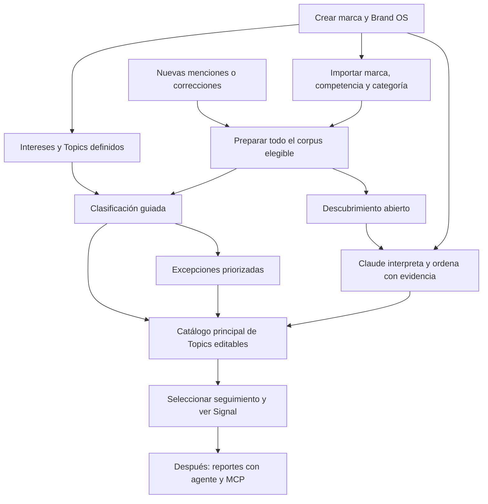

# Noisia Compass — producto de autoservicio de extremo a extremo

Fecha: 7 de septiembre de 2026. Dirección aprobada por el operador tras la auditoría de Admin y descubrimiento. Este documento amplía el contexto original; no reemplaza el handoff, los diálogos, las decisiones ni los recibos de entrega.

## Resultado que gobierna el trabajo

Una persona autorizada crea una marca nueva, prepara su contexto y sus intereses, importa conversaciones de marca/competencia/categoría y obtiene Topics editables y resultados confiables en Signal. Nuevas cargas semanales o mensuales se procesan automáticamente: se clasifican en temas existentes y se detectan conversaciones emergentes. Todo ocurre desde el producto, sin SQL, scripts, importadores con constantes por cliente ni intervención ordinaria de ingeniería.

La implementación se diseña para producción. UAT es el lugar de comprobación, no un sustituto de calidad de producto. El lanzamiento exige el recorrido inicial y el incremental, operación recuperable, aislamiento de marcas, calidad semántica y capacidad medida. Este turno prepara documentación, Linear y coordinación; no inicia implementación ni despliegue de producción.

## Intención del operador conservada

- Conservar y aprovechar Brand OS, embeddings, BERTopic y otros algoritmos útiles, Claude con evidencia, catálogo y Signal. No reiniciar Noisia.
- Priorizar el recorrido completo sobre arreglar todas las pantallas de Admin en paralelo.
- Topics es una sección principal de la marca, visible en navegación, con definición y pertenencia editables. No vive dentro de Brand OS.
- Los intereses definidos antes de importar y los Topics emergentes convergen en el mismo catálogo; su origen sigue siendo explícito.
- El cómputo incluye todo el corpus elegible. Una muestra no sustituye el procesamiento o etiquetado del universo cargado.
- La incrementalidad y la aparición de temas nuevos son obligatorias para monitorización; no son una mejora opcional posterior al lanzamiento.
- Claude debe resolver controles rutinarios, nombrar, ordenar y proponer correcciones con evidencia. El usuario decide lo que sigue en Signal y atiende excepciones útiles; no llena una rúbrica por cluster.
- Diseñar para miles de Topics y corpora de hasta dos millones de menciones; esos números son objetivos de capacidad, no una promesa medida hoy ni una cuota de Topics a inventar.
- No hay clientes ni obligación de compatibilidad con la producción antigua o de conservación de datos de Amazon como requisito del producto nuevo. Esto no autoriza limpieza destructiva ni elimina la trazabilidad necesaria del monitoreo futuro.
- Reportes mediante un agente de Claude, componentes propios de Noisia y MCP permanecen en el horizonte cercano, después del núcleo de monitorización.

## Significado técnico, sin imponer una solución por metáfora

Un interés definido es una definición semántica versionada: intención, ámbito, idioma/contexto pertinente, ejemplos positivos y negativos cuando existan. Puede compilarse en embeddings/prototipos, señales léxicas y un clasificador medido. No se decide crear un agente o servicio por Topic. Los lotes reutilizan Worker/cola, embeddings y contratos existentes.

El sistema mantiene dos vías complementarias: búsqueda/clasificación guiada por intereses y descubrimiento abierto. La influencia de Brand OS en cada vía debe quedar implementada y comprobada. El contexto no debe obligar a toda conversación nueva a encajar en la taxonomía previa.

Procesar todo no significa forzar pertenencia. Cada registro cargado tiene un estado explicable; cada mención elegible tiene resultado de cómputo de la versión vigente: asignada, dudosa, sin tema/emergente, o error visible y recuperable. Los no elegibles conservan motivo; deduplicación y agregación conservan relación con originales. Cero pérdidas silenciosas. Cobertura de procesamiento y cobertura temática son métricas diferentes.

Claude interpreta evidencia recuperable de todo el corpus mediante herramientas paginadas, representantes, casos frontera y agregados calculados sobre el universo. No es necesario enviar dos millones de textos en un prompt. La selección de evidencia para interpretación y la muestra independiente para medir calidad nunca se presentan como etiquetado masivo ni como prevalencia calculada por el LLM.

## Invariantes de producto

1. Una sola definición vigente por Topic y una sola autoridad de asignaciones; ningún catálogo experimental paralelo se convierte en requisito.
2. Seleccionar seguimiento en Signal es una decisión del usuario. Dentro de ese seguimiento, las nuevas menciones se actualizan automáticamente bajo la configuración elegida; no requieren publicar de nuevo cada lote. Topics emergentes nuevos se proponen para selección, sin activación silenciosa.
3. Cada incorporación conserva procedencia real: manual, taxonomía histórica o descubrimiento de una corrida de corpus. Nunca llamar BERTopic a una taxonomía generada por muestra.
4. Una consulta de adquisición no demuestra atribución de entidad; ámbito de captura, identidad mencionada y Topic se conservan distintos.
5. Reintentos no duplican imports, asignaciones ni gasto. La última generación completa sigue disponible mientras se prepara otra; se muestra su vigencia.
6. Cambios de contexto/definición, menciones tardías, correcciones, retirada de contenido y cambios de ámbito invalidan exactamente lo afectado y actualizan resultados por un camino recuperable.
7. Estabilidad longitudinal: IDs de Topics independientes de IDs volátiles de clusters; merges/splits tienen efecto real, linaje y fechas efectivas. No reescribir silenciosamente series históricas al renombrar o reentrenar.
8. Los modelos pueden proponer y resolver revisiones semánticas ordinarias mediante herramientas acotadas. No pueden saltar autorización, derechos, aislamiento de workspace, evidencia o límites de costo, ni aprobar su propia calidad usando sólo sus respuestas como verdad.
9. Las excepciones tienen impacto, evidencia y siguiente acción. No bloquear todo Signal por una duda localizada o por no puntuar todos los clusters.
10. Una función está terminada cuando un operador puede usarla, recuperar un fallo y verificar su efecto. Una API, una tabla, un screenshot o una suite verde aislados no cierran el recorrido.

## Arquitectura de experiencia

## Prioridad y límites

Primero, el recorrido inicial y una segunda carga con temas existentes y nuevos. La escala, recuperación, calidad y acceso son condiciones del lanzamiento. Durante ese trabajo sólo se arreglan otras secciones si bloquean el recorrido, mienten sobre su estado o violan un invariante.

Se aplazan el rediseño global de Admin, la expansión de Themes/Engine/T&B, un catálogo de frameworks nuevos y los challengers sin una falla medida que los justifique. Cada pendiente de auditoría debe tener un ticket o una decisión explícita de conservación/aplazamiento; aplazar no es olvidar.

## Contexto acumulado y precedencia

Instrucciones vigentes del operador → este compass → plan y contratos acordados → STATE/CURRENT/NEXT actualizados → auditoría contrastada y recibos → planes/tablas históricos. Esta precedencia ordena decisiones; no borra historia ni reabre gates cerrados.

- Handoff original: [HANDOFF_2026-09-06_NEW_CHAT.md](./HANDOFF_2026-09-06_NEW_CHAT.md).
- Historia exportada: `.data/handoffs/2026-09-06-new-chat/INDEX.md`; Frontend leído hasta `0005.md`, conservar punto de lectura.
- Evidencia de situación: [AUDIT_ADMIN_AND_DISCOVERY_2026-09-07.md](./AUDIT_ADMIN_AND_DISCOVERY_2026-09-07.md).
- Ejecución propuesta: [PLAN_SELF_SERVICE_MONITORING_2026-09-07.md](./PLAN_SELF_SERVICE_MONITORING_2026-09-07.md).
- Coordinación: [ORCHESTRATION_SELF_SERVICE_2026-09-07.md](./ORCHESTRATION_SELF_SERVICE_2026-09-07.md).
- La evidencia UAT válida de Topics → Signal se conserva. Laika prueba catálogo/publicación con manual e histórico, no descubrimiento BERTopic nuevo ni clasificación automática validada.

No leer JSONL originales ni recuperar secretos históricos. Saldo mínimo de producto al inicio: USD 11.362961; auditoría separada: USD 1.343826 restantes de USD 3. Esta planificación no solicita llamadas pagadas. Toda ejecución futura debe tener costo/cap propios; la autonomía no es gasto ilimitado.

## Continuidad 8 septiembre — preparación de intereses entregada

Studio/Worker UATae3e36c y SQL0135 verificados; [recibo](./DELIVERY_WORKSPACE_TOPIC_PROTOTYPES_2026-09-08.md). Topics prepara intereses/Brand OS con el ledger, caché, costos y recuperación existentes, antes o después de importar. PG/BullMQ y UI local probaron deduplicación, fallos/recibos y reutilización por menciones. Proveedorfalse, cero gasto. National conserva sus datos y catálogo vacío; sin fixtures UAT. Siguiente: clasificación persistente/versionada e incremental con motores existentes, descubrimiento abierto, Claude y Signal del Compass, primero local sin proveedores. Top32 sigue sin ser clasificación final; NOI-31/78 abiertos. NOI-81 conciliación completa/presupuesto, NOI-19 cliente y NOI-80 retención siguen abiertos. No repetir gates ni SQL0131–0135. Root entregó; agentes finalizados y loop en este chat. Historia inferior conservada.

