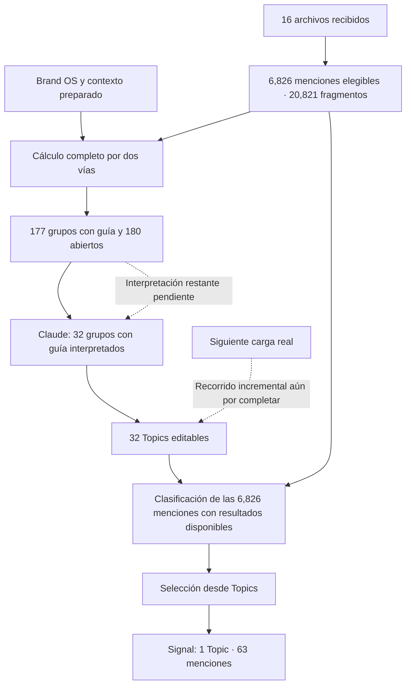

# Avance de producto Noisia — 9 septiembre de 2026

Recorrido verificado en UAT durante la ventana autónoma de ocho horas. Ventana concluida; loop PAUSED por app y cierre documentado a 2026-09-09 14:47:50 UTC. Leer [parada segura](SAFE_PAUSE_OVERNIGHT_2026-09-09.md). Continúa el Compass: producto self-service para cualquier marca, con National como caso descartable.

## Lo que ya puedes usar

| Parte | Resultado comprobado |
|---|---|
| Marcas, Overview y Dashboard | National muestra 7,396 menciones únicas recibidas, 16 archivos y 9,131 filas de origen. Dejó de aparecer el cero de la población antigua. |
| Fuentes | Overview distingue los archivos aceptados: 2 de marca principal, 13 de competencia y 1 de categoría. No necesita que todos los ámbitos estén completos para mostrar lo presente. |
| Topics | Hay 32 Topics editables, con definición, archivo y selección para Signal. El catálogo muestra por separado su disponibilidad y la interpretación parcial de 32 de 357 grupos. |
| Signal | Un Topic seleccionado desde la UI, «Quejas de servicio al cliente en renta de autos», muestra 63 menciones asociadas, evidencia original y enlaces. Resumen y Topics usan el mismo denominador: 6,826 menciones del período. |
| Continuidad | Se conservan resultados y ediciones ante interrupciones. El producto permite continuar la interpretación con un permiso de gasto explícito y recuperar entregas incrementales sin volver a importar ni recalcular los embeddings existentes. La nueva autorización no se activó. |

Los cambios fueron generales del producto. No hubo lógica especial para National, reinicio del análisis ni datos ficticios cargados en UAT.

## Qué se calculó y qué sigue parcial

El cómputo del corpus terminó; la interpretación no. El recibo UAT de las 14:12 UTC confirma que los 32 Topics actuales vienen de la vía con guía; los 180 grupos abiertos todavía esperan interpretación. El proceso recorre identificadores estables, no un ranking de relevancia para la marca. Mostrar el avance guardado permitió llegar a Signal sin esperar a todos los grupos. No equivale a interpretar los 357, obtener una taxonomía depurada o demostrar precisión semántica.

## Lo desarrollado localmente para la siguiente carga

El motor numérico incremental y su conexión con clasificación/Signal están en UAT. Su aceptación con una segunda carga real sigue pendiente. Para interpretar conversaciones nuevas se cerraron localmente la preparación de evidencia, el consumidor recuperable sobre la cola existente y la procedencia que preserva el origen numérico y las ediciones del Topic. Estos últimos cambios siguen sin desplegar: falta conectarlos a la intención de usuario y a la materialización de resultados.

El siguiente resultado visible debe ser: importar datos nuevos → ver qué cambió → continuar el análisis → recibir Topics nuevos y actualización de los conocidos → elegir qué seguir → Signal actualizado. La preparación y compra de embeddings de una revisión nueva todavía no completan ese recorrido automáticamente. No se fabricó una segunda carga para aparentar su cierre.

## Lo que falta para llamarlo producto listo para lanzar

1. Completar también la navegación nativa de Menciones en Signal: la última pasada encontró que ese enlace todavía intenta usar el recorrido anterior y conserva el resumen con un error. La evidencia individual por Topic sí funciona; no es un problema resuelto ni una lista de cero menciones. Unirla a la misma generación, fechas y derechos está pendiente.
2. Conectar evidencia y confirmación de interpretación de temas nuevos desde Topics, y entregar sus resultados al catálogo y a la nueva generación de Signal. Reutilizar los componentes ya cerrados.
3. Probar el recorrido como administrador cliente de su marca. La aceptación actual usa Admin Noisia; el shell de Studio, Brand OS y capacidades de ejecución/selección aún tienen restricciones internas documentadas desde el 7 septiembre.
4. Mejorar utilidad editorial: pertinencia explicada para la marca, nombres en el idioma elegido, propuestas de consolidación y atención a excepciones. Hay temas útiles junto con ruido, grupos insuficientes y temas cercanos. No trasladar ese trabajo al usuario mediante una rúbrica por grupo.
5. Verificar otra importación genuina por UI, continuidad de identidades, novedad, conteos, selección, costos y recuperación. Después continúan reportes con agente y MCP según el Compass.

El detalle de ejecución está en [el plan de continuidad](PLAN_COMPLETE_INCREMENTAL_MONITORING_2026-09-09.md). La revisión de utilidad está en [aceptación de Topics](TOPICS_PRODUCT_ACCEPTANCE_2026-09-09.md). Linear conserva los pendientes: NOI-19/20 (cliente y aceptación E2E), NOI-34 (Menciones y generación común), NOI-75 (calidad y excepciones), NOI-78 (incremental) y NOI-81 (costos).

## Evidencia y límites

Cada corte integrado tiene typecheck, lint, pruebas de los paquetes afectados y revisión; los cambios de DB/colas tienen pruebas PostgreSQL y los de UI comprobaciones de componente, ES/EN y tamaños móvil/escritorio. Los recibos detallan qué fue real, qué usó transporte simulado y qué quedó local. No se repitieron los gates antiguos ni se certificó escala de dos millones de menciones.

UAT Studio/Worker: `c8f05b9`, SQL0147. Worktree editorial local: `070c94e`, con SQL0148/0149 sin aplicar. Este último parte de0a80532: sus cortes deben componerse sobre el UAT vigente, nunca reemplazarlo y perder entregas de interfaz. Los tres drafts ajenos permanecen intactos.

Gasto nuevo de proveedores durante esta ventana: **USD 0**. Claude conserva USD 1.918865 confirmado y USD 1.6818 de reserva terminal histórica; Voyage, USD 0.594449. El permiso Claude anterior venció y la petición nueva sigue pendiente; no se renovó mediante el loop. Sonnet 4.6 permanece seleccionado; no Opus. Producción no fue modificada.

Punto compacto para retomar: [estado operativo](OPERATING_SNAPSHOT_2026-09-09.md). El contexto original, Compass e historia permanecen conservados.
