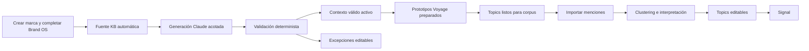

# Brand Context → Topics E2E · 10 septiembre 2026

> **Corte local cerrado el 11 de septiembre de 2026.** La implementación genérica pasó
> el ensayo PostgreSQL compuesto 16, suites globales, build, QA ES/EN y revisión
> independiente con 0 P0/P1/P2. El ensayo creó una marca y dos corpus sintéticos, usó
> Claude/Voyage simulados y revirtió físicamente todo; no hubo proveedor ni remoto real.
> La entrega focal UAT y el experimento con una nueva marca real son los siguientes pasos.

## Resultado de producto

Una persona crea una marca desde Studio una sola vez. Ese envío deja una fuente de
conocimiento automática y dispara, sin una segunda aprobación editorial, el contexto
semántico que Brand OS aporta a Topics. Los elementos válidos quedan activos; las
excepciones quedan visibles para editar o borrar sin bloquear el resto. Al cambiar Brand OS
o agregar otra fuente se crea un sucesor idempotente y sólo se vuelven a preparar los
prototipos que cambiaron.

La siguiente prueba real se hará con una marca nueva creada e importada por la UI. National
es una referencia de datos, no una dependencia ni una implementación especial.

## Recorrido objetivo

## Decisiones

- El formulario inicial es la autorización editorial ordinaria. No hay una cola de cien
  aprobaciones ni una publicación manual adicional para el contexto válido.
- El mismo envío muestra y registra el tope monetario de preparación. Si no existe una
  admisión vigente, queda `awaiting_authorization` y continúa desde ahí cuando se autorice;
  nunca llama un proveedor a escondidas.
- Claude propone lenguaje y relaciones; reglas deterministas validan estructura, linaje,
  cobertura y colisiones. Una excepción no bloquea los elementos válidos.
- Voyage convierte prototipos positivos y negativos en vectores. No decide el significado
  de la marca y no sustituye a Brand OS.
- Cada generación conserva snapshot, versión, costo, modelo y procedencia. Editar o borrar
  crea autoridad nueva; no reescribe historia.
- La zona horaria se elige de un catálogo IANA buscable y sigue validándose en el servidor.
- La KB automática siempre queda visible y el usuario puede agregar más fuentes. La
  ausencia de una fuente adicional no bloquea el recorrido.
- La KB automática se refresca con cambios de marca o competidores mientras conserve su
  procedencia automática. Si una persona la edita, pasa a ser contenido manual y deja de
  sobrescribirse; si la elimina, no se recrea a escondidas.
- Cada fuente adicional se conserva completa hasta el límite publicado de 200.000 caracteres.
  El servidor la divide en fragmentos acotados para Claude y rechaza el exceso; nunca corta
  silenciosamente la cola del contenido.
- La sugerencia de IA anterior al primer guardado queda deshabilitada. La generación pagada
  sucede después de guardar, donde ya existen workspace, autoridad, idempotencia, ledger y
  un tope emitido por el servidor.
- No se liga la creación de contexto a un `acquisition_brief` oculto. Brand OS, workspace,
  mercados, idiomas inferibles y zona horaria forman la autoridad mínima.

## Cortes de implementación

### C1 · Entrada sin callejón sin salida

- Selector IANA en todos los formularios que crean o modifican la zona horaria.
- Fuente automática creada aunque las notas opcionales estén vacías, a partir del snapshot
  estructurado del formulario.
- Acción de agregar otra KB visible y comprensible.
- Derivar autoridad semántica mínima desde Brand OS cuando aún no existe plan de adquisición.

### C2 · Orquestación automática

- Encolar una generación al crear la marca o cambiar el digest gobernado.
- Usar el outbox, ledger, presupuesto y proveedor ya existentes.
- Aplicar la política automática, activar los elementos válidos y aislar excepciones.
- Reintentos con la misma clave no duplican generación, llamadas ni costos.
- El estado más reciente usa orden de aceptación determinista aun cuando varias operaciones
  nazcan dentro de una sola transacción.

### C3 · Contexto activo a Topics

- Construir el almacén heredado sólo desde la generación activa.
- Preparar automáticamente los prototipos que falten o cuyo digest cambió.
- No ejecutar clustering si faltan prototipos; explicar el estado en Topics.
- Una actualización de KB crea sucesor y reutiliza prototipos sin cambios.

### C4 · Prueba de producto

- Prueba PostgreSQL/local con Claude y Voyage simulados: marca nueva, KB automática y
  adicional, un elemento excepcional, activación parcial válida, prototipos y reintento.
- Checks focales de DB, Studio y Worker; typecheck, lint y build de lo tocado.
- QA ES/EN y responsive en creación, Brand OS y Topics.
- Entrega focal UAT. Después, el usuario elige una marca nueva y carga menciones por UI para
  probar importación, corpus completo, descubrimiento, edición y Signal.

## Fuera de este corte

- Reparar resultados históricos de National, Laika o Alexa.
- Repetir imports, fit, Voyage o SQL ya cerrados.
- Producción, main, publicación automática de Signal o reportes con agentes.
- Medir precisión semántica con coincidencia léxica. La calibración requiere el corpus real
  de la siguiente marca y una rúbrica de evidencia.

## Criterios de aceptación

1. Crear marca no admite una zona horaria arbitraria.
2. Guardar el primer Brand OS basta para iniciar el recorrido sin configurar otra pantalla.
   Si requiere proveedor, el tope aparece antes del envío y la misma acción registra la
   autorización; sin ella el estado recuperable es visible.
3. El usuario ve la KB automática y puede agregar, editar o borrar fuentes adicionales.
4. Una generación simulada válida termina activa sin aprobar propuestas una por una.
5. Las excepciones permanecen editables y no bloquean los elementos válidos.
6. Los prototipos simulados quedan completos e idempotentes para todos los elementos activos.
7. Cambiar una KB crea sucesor y no duplica llamadas ni vectores sin cambios.
8. Topics explica si está preparando contexto, listo para importar o bloqueado por una
   excepción técnica recuperable.
9. Ninguna ruta pierde scoping por workspace ni debilita roles.
10. La prueba real posterior puede comenzar con una marca nueva y cero preparación manual
    fuera de la UI.
